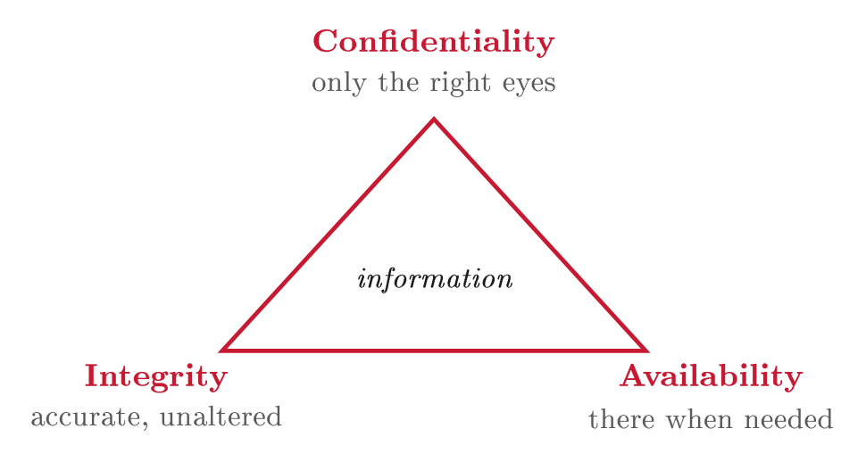
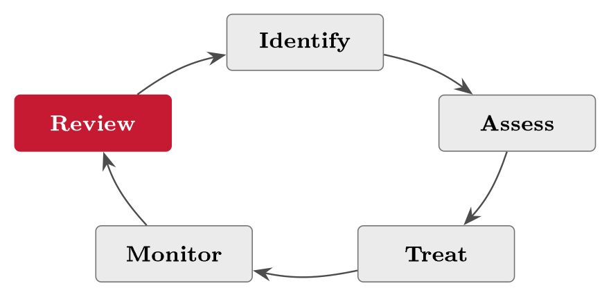
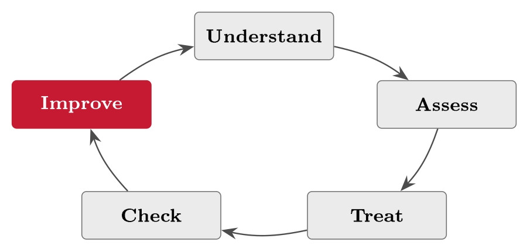

# GRC, and what governing security means {#sec-01-grc-and-governing-security}

The first lecture of this course does two things at once: It sets out how the
course will run --- the team, the plan, the running case, the books --- and it
lays the conceptual foundations that everything else builds on. This chapter
does the same, in prose and at reading pace. By the end of it you should be able
to say what GRC actually is (and why the term exists at all), what we mean when
we call something secure, and how the words *asset*, *threat*, *vulnerability*,
*risk* and *control* relate to one another. Everything in the remaining
twenty-one lectures --- management systems, regulation, risk assessment,
preparedness, audits --- is an application of the vocabulary introduced here. If
this chapter feels almost too easy, good: Read it carefully anyway, because the
assessment does not test whether you can recite definitions, but whether you can
reason in exactly these terms.

## Why governance, risk and compliance --- and why now {#sec-01-why-governance-risk-and-compliance-and}

Begin with a sober observation: Most organisations today are digital businesses,
whether they think of themselves that way or not. A twenty-five-person webshop
runs on a rented cloud platform, takes payment through a third-party provider,
and keeps everything it knows about its customers in one database. None of that
is exotic; all of it can fail, be attacked, or break the law. And when it does,
the damage lands on the business --- on revenue, on trust, on the owner's name
--- not on the IT department alone. GRC1100 is about how organisations protect
what they value in this world in a structured and defensible way. It is less
about hacking tools than about the discipline of governing security, managing
risk, and meeting the rules.

It is tempting to think that handling a security disaster well is chiefly a
technical achievement --- better firewalls, faster patching. The opening example
of the course shows that the decisive part often is not.

::: {.callout-note}
## Real-world case: Norsk Hydro, 2019

In the night of 18--19 March 2019 the Norwegian aluminium producer Norsk Hydro
--- some 35,000 employees, operations in around forty countries --- was hit by
the LockerGoga ransomware. Machines were encrypted across the company; several
plants switched to manual operation, in places falling back on printed order
lists and procedures. Hydro refused to pay the ransom, rebuilt from backups, and
--- unusually for the time --- communicated openly from the first morning: A
stock-exchange notice before the market opened, then daily briefings and
webcasts. The total impact was estimated at around NOK 800 million; part of the
loss was later recovered through cyber-insurance. The handling was widely
praised and is studied to this day --- not for any clever technical trick, but
for the decisions.
:::

Notice what the praise was actually for. Three lessons follow, and they carry
through the whole course:

1.  *The incident was technical for a night and a management problem for
    months.* Which plants to run manually, what to tell customers, whether to
    pay --- these were decided by leadership, not by an intrusion-detection
    system. That is **governance**.

2.  *The good handling was prepared, not improvised.* Backups existed and
    worked; a cyber-insurance policy had been bought; manual fallbacks were
    possible. Every one of those was a decision about risk, taken --- and paid
    for --- long before the attack. That is **risk management**.

3.  *The first hours were shaped by obligations.* A listed company must inform
    the market; authorities expect notification; personal data carries duties of
    its own. Meeting such obligations under pressure is only possible if you
    knew them in advance. That is **compliance**.

Security, then, is not first of all a toolbox. It is a way of running an
organisation: Deciding what to protect and who is answerable (governance),
judging what could go wrong and doing something proportionate about it (risk),
and meeting the rules that apply whether you like them or not (compliance). The
pressure to do all three well keeps rising --- the GDPR since 2018, NIS2 and
Norway's Digital Security Act, DORA in the financial sector, and now AI on the
agenda --- so that in one generation security has moved from the server room to
the boardroom. The shift is visible in Norway specifically: The National
Security Authority's annual risk assessments are now written for boards and
ministries, not server rooms, and the question directors ask has changed from
"are we protected?" to "how do we know?" --- an assurance question, and Block
V's subject. Why the field looks the way it does is best seen through its
history, which is where we go after pinning down the term itself.

## What GRC actually is {#sec-01-what-grc-actually-is}

"GRC" is a relatively new name for a way of working that brings together three
activities organisations used to run in separate silos. The point of the term is
not any single activity but their coordination.

::: {#def-grc}
## GRC

GRC --- governance, risk and compliance --- is the discipline of running three
activities as one coordinated whole: *Governance* sets direction and
accountability for security; *risk management* identifies, assesses and treats
what could go wrong; *compliance* meets the laws, regulations and standards that
apply. The value of the term lies in the integration: Run separately, the three
leave gaps and duplicate effort; run together, they reinforce one another.
:::

The best way to see why the integration is the point is to remove one pillar at
a time and watch what fails. Governance without risk management is direction
blind to the threats: Leadership sets priorities with no idea what could
actually go wrong, so effort lands where attention happens to fall. Risk
management without compliance can be quietly illegal: A well-reasoned decision
to skip a control may still breach a duty the law does not let you waive. And
compliance without governance degenerates into box-ticking: Requirements met on
paper, owned by nobody, protecting nothing. Each pillar covers a weakness in the
others, and a gap in any of them undermines the whole (@fig-grcvenn).
The industry body OCEG, which did much to popularise the term, compresses the
same thought into a purpose: An organisation should "reliably achieve
objectives, address uncertainty and act with integrity" --- objectives are the
business of governance, uncertainty of risk management, integrity of compliance.

{#fig-grcvenn}

## Where the term --- and the field --- came from {#sec-01-where-the-term-and-the-field}

Even the word for what GRC governs has a history, and it is worth a paragraph
because each term reflects what people were trying to protect at the time.
*Computer security* belongs to the mainframe era: Individual machines behind
locked doors, protected by controlling who could reach them. *Information
security* widened the object to the data itself, wherever it lives --- on disks,
on paper, in people's heads. *Cybersecurity* is the vocabulary of the connected
world: Protecting networked systems whose whole point is to be reachable. The
vocabulary grew outward as computing moved from isolated machines to an
interconnected world; in this course the last two overlap heavily, and we treat
information security and cybersecurity as close cousins.

The field's history runs on two strands that eventually meet, and
@fig-timeline lays them side by side. The first strand is technical. In
1988 a graduate student's self-replicating program --- the Morris Worm ---
disabled several thousand machines, roughly a tenth of the internet of the day.
It was the first incident felt everywhere at once, and it produced the first
computer emergency response team. Through the 1990s the web and e-commerce
turned attacks from a curiosity into a mass phenomenon, because crime follows
money.

The second strand is corporate, and it starts earlier than most people expect.
In 1992 --- years before most boards had heard of a firewall --- the UK's
Cadbury Report defined corporate governance and the American COSO commission
published its internal-control framework: The vocabulary of directing and
controlling companies was standardised while the internet was still an academic
network. The strand turned dramatic a decade later. The collapse of Enron (2001)
and WorldCom (2002) --- accounting frauds that destroyed two of America's most
admired companies and took their auditor down with them --- shattered trust in
corporate oversight. The legislative answer was the US Sarbanes--Oxley Act of
July 2002: Executives now certify their reports personally, and companies must
demonstrate effective internal control over financial reporting. Because
financial reporting runs on IT, that requirement quietly created a whole
profession --- auditors have tested IT general controls (access, change
management, operations) ever since, a thread we pick up in Block V.

The two strands meet in the mid-2000s. On the technical side, security became
governable: The British standard BS 7799 (1995) matured into ISO/IEC 27001
(2005), which made security a certifiable management system --- Lecture 3's
subject. On the corporate side, organisations drowning in post-SOX control work
realised that governing, managing risk and proving compliance in isolation was
both wasteful and unsafe. The analyst Michael Rasmussen coined the name for the
joined-up alternative --- GRC --- at Forrester in 2002, and the industry body
OCEG, founded the same year, codified it in its GRC Capability Model (2007).
From there the pattern repeats in ever shorter waves. The mega-breaches and
ransomware of the 2010s --- WannaCry and NotPetya in 2017 above all --- pushed
security to the top table; the GDPR (applicable from 2018) made the security of
personal data a legal duty with real sanctions; Norsk Hydro (2019) showed Norway
what a mature response looks like; and NIS2 and DORA (both adopted 2022)
extended binding duties across critical sectors and finance, with DORA applying
from January 2025 and Norway's own Digital Security Act in force since 1 October
2025 --- Lecture 5 takes that story in detail.

{#fig-timeline}

Read the line as a whole and the pattern is unmistakable: Each wave of incidents
produced a wave of rules, and each wave of rules pushed security further up the
organisation. GRC is the name the discipline acquired somewhere in the middle of
that story --- and knowing the history explains why integration, not any single
activity, is its heart.

## The three pillars, one at a time {#sec-01-the-three-pillars-one-at-a}

Governance, risk and compliance each play a distinct role, and each is
incomplete without the others, so we take them one at a time --- always with the
same small company in view. (The company itself is introduced properly in
@sec-01-the-running-case-the-books-and; for now it is enough to know
that FastGoods is a small Norwegian webshop with a customer database, a
checkout, and no multi-factor authentication on its logins.)

### Governance {#governance .unnumbered}

The oldest definition is still the clearest. The Cadbury Report (1992) called
corporate governance "the system by which companies are directed and
controlled", and everything since has been elaboration.

::: {#def-gov}
## Governance

Governance is the system by which an organisation is directed and controlled:
Leadership sets the objectives and the risk appetite; roles, policies and
oversight turn intent into routine practice; and accountability sits at the top
even when the work is delegated. *Security governance* applies that system to
information security.
:::

Two points deserve emphasis. First, governance is about deliberateness: Without
it, security becomes whatever individual technicians happen to do, which may be
excellent and may be nothing, and nobody can say which. Second, governance is
not reserved for listed giants. For FastGoods, governance is the owner deciding
that protecting customer data is a priority --- and being answerable for it. The
scale changes; the structure does not.

### Risk management {#risk-management .unnumbered}

::: {#def-risk}
## Risk and risk management

Risk is the effect of uncertainty on objectives (ISO 31000); operationally, the
risk of an unwanted event is its *likelihood* times its *impact*. Risk
management is the repeating cycle of identifying what could go wrong, assessing
each risk by likelihood and impact, deciding on a treatment --- reduce, accept,
transfer or avoid --- and monitoring as the business and the threats change.
:::

ISO 31000's definition is deliberately broad --- uncertainty can help as well as
harm --- but in this course we work with its security reading: What could go
wrong, how likely, how bad. The discipline exists because you cannot protect
against everything; risk management is about spending limited effort where it
counts most. For FastGoods that means treating a breach of the customer database
far more seriously than a typo on the website --- and it is why, in the Hydro
case, the insurance policy (a transfer of risk) and the manual fallback (a
reduction of impact) were risk-management decisions in exactly this sense, taken
years before anyone had heard of LockerGoga.

### Compliance {#compliance .unnumbered}

::: {#def-comp}
## Compliance

Compliance is demonstrable adherence to the norms that apply to the
organisation: *Binding* norms --- laws and regulations such as the GDPR and, for
sectors in scope, NIS2 through Norway's Digital Security Act --- and *adopted*
norms it has committed itself to, such as the ISO/IEC 27001 standard, its
contracts, and its own internal policies.
:::

Compliance sets a floor of expected behaviour, defined for everyone in your
situation rather than tailored to you. In Norway the National Security Authority
(NSM) adds national guidance --- its *grunnprinsipper* for ICT security are the
reference point many organisations measure themselves against --- and the
Digital Security Act (Lecture 5) brings the EU's
network-and-information-security rules into Norwegian law. Two features of
compliance surprise people, and both show up in the running case.

::: {#exm-compliance}
## Compliance arrives uninvited

FastGoods never chose the GDPR: The moment it held customers' personal data, the
regulation applied, with its duties on security, on breach notification, and on
what may be done with the data. And by taking card payments, FastGoods signed up
--- through its payment agreement --- to PCI DSS, the card industry's security
standard, whether anyone in the company ever read it or not. Contracts create
compliance duties just as laws do; the difference is who enforces them --- a
supervisory authority with fines, or a payment provider that can switch the
checkout off.
:::

The second surprise is the more dangerous one: Compliance is not the same as
security. A floor is not a ceiling, and it is entirely feasible to be compliant
and insecure --- every checkbox ticked, and a backup that has never once been
restored. The two usually pull in the same direction, and laws increasingly
expect exactly the kind of systematic security a standard like ISO 27001
provides; but the distinction between *meeting the rules* and *being safe* runs
through the whole course, and we return to it squarely in the final lecture.

## What we protect: The CIA triad {#sec-01-what-we-protect-the-cia-triad}

To reason precisely about security we need to say what "secure" protects. Almost
all of information security comes down to three properties of information, known
by their initials. Readers of *Digital Security* have met the triad before; from
here on it is this course's standard test.

::: {#def-cia}
## The CIA triad

Information security protects three properties of information and the services
that carry it: *Confidentiality* --- information is disclosed only to the
authorised; *integrity* --- information is accurate and is not altered without
authorisation, or at least not without detection; *availability* --- information
and services are there when they are needed.
:::

{#fig-cia}

::: {#exm-cia}
## One shop, three properties

Take FastGoods and its three running risks. *Confidentiality:* The customer
database holds what customers have entrusted to the shop; the database breach
(R3) is an attack on confidentiality --- the data leaves. *Integrity:* Orders,
prices and delivery addresses must be right; an attacker who silently alters
them harms FastGoods without reading a single record. *Availability:* The
checkout earns the revenue; the denial-of-service attack (R2) never touches any
data and still hurts the business, because every hour offline is sales lost.
Three different attacks, three different defences, one shop.
:::

The classic three are sometimes extended, because not every security goal fits
them neatly, and two additions come up often enough to be worth naming now.
*Authenticity* asks whether you are who you claim to be --- the basis of login
and identity, and exactly where FastGoods' account-takeover risk (R1) lives:
Without authenticity, an attacker can simply pretend to be a customer.
*Accountability* asks whether actions can be traced to someone --- the basis of
logging and audit, and a property Block V depends on completely. Keep all five
in mind, but reach for the triad first: When in doubt anywhere in this course,
ask which of confidentiality, integrity and availability is at stake.

## The core vocabulary: From threat to control {#sec-01-the-core-vocabulary-from-threat-to}

A handful of terms appear in nearly every lecture, and using them precisely is
half of thinking clearly about security. Colloquially, "threat" and "risk" are
near-synonyms; in this course they are not.

::: {#def-vocab}
## Asset, threat, vulnerability, risk, control

An *asset* is something of value to protect. A *threat* is something that could
cause harm to it. A *vulnerability* is a weakness the threat can exploit. *Risk*
is the weight of the combination: The likelihood of the harm times its impact. A
*control* is a measure that reduces the risk --- by making the harm less likely,
its impact smaller, or both.
:::

Read in order, the five terms form a sentence: *A threat exploits a
vulnerability in an asset, creating a risk, which a control reduces.*
@tbl-vocab pins each term to the running case, and @fig-chain
shows the chain the sentence describes. Getting these five words right makes the
rest of the course much easier --- and getting them wrong is the most common
source of muddled security arguments, in exams and in practice alike.

One more thing before the terms are used in anger, because it is where beginners
struggle most: *Where do risks come from?* The honest answer is reassuring ---
you never have to invent one. A risk is simply whatever can go wrong, and there
are four concrete places to look for it.

::: {.callout-tip}
## Finding the risk: The four sources

A risk is **whatever can go wrong** --- and risks are *found*, not invented.
Look in four places:

1.  **A business process** --- walk the steps and ask at each one: What can go
    wrong here?

2.  **A system or IT process** --- the same question at the technical layer:
    Access, change, operations.

3.  **An existing control** --- every control exists against a risk; read it
    backwards to name that risk. Then test it: An *effective* control reduces
    the risk; an *ineffective* one *is* a risk.

4.  **An audit finding** --- a risk somebody has already found and written down
    for you.

Whatever you find, *mitigation* --- doing something about it --- comes after,
never instead (Lecture 10). This box returns throughout the course wherever a
risk needs finding.
:::

FastGoods' three running risks all came from these sources: R1 and R2 fell out
of walking the order process (the log-in and payment steps), and R3 out of
reading one asset --- the customer database --- and asking what its loss would
mean. None was invented, and none needed to be.

::: {#exm-examrisk}
## The exam, in the same vocabulary

The vocabulary is not reserved for companies; it fits the nearest risk in the
room. The *asset* is passing this course --- the credits and what they unlock.
The *threat* is a demanding exam; the *vulnerability* is not having studied; the
*risk* is failing --- likelihood high if unprepared, consequence a resit and a
delayed semester. The *controls* sort themselves by the three jobs of
@tbl-controls: Reading before each lecture is preventive --- it lowers
the likelihood week by week, which is the break-even slide's whole argument; the
self-checks at each chapter's end are detective --- they find the gaps before
the exam does; and the resit is corrective --- it limits the damage, at real
cost, like every corrective control. *Mitigation* is simply studying, and the
*residual risk* --- exam nerves on the day --- is accepted, as some risk always
is. If you can run this example, you can run FastGoods'.
:::

::: {#tbl-vocab}
  **Term**        **Plain meaning**                    **FastGoods example**
  --------------- ------------------------------------ -----------------------
  Asset           Something of value to protect        The customer database
  Threat          Something that could cause harm      A hacker, or malware
  Vulnerability   A weakness that can be exploited     No multi-factor login
  Risk            Likelihood $\times$ impact of harm   Account takeover (R1)
  Control         A measure that reduces risk          Requiring MFA

  : The core vocabulary, anchored in the running case. The five terms form a
  chain of reasoning, not a list of synonyms.
:::

{#fig-chain}

::: {#exm-chain}
## R1, laid out in the vocabulary

The *asset* is the set of customer accounts, and everything reachable through
them --- stored personal data, order history, saved payment arrangements. The
*threat* is an attacker armed with lists of leaked passwords:
Credential-stuffing runs constantly and automatically against any login page on
the internet, so the threat needs no interest in FastGoods specifically. The
*vulnerability* is that logins are protected by a password alone. The *risk* ---
account takeover --- therefore combines a high likelihood (the attempts arrive
regardless) with a substantial impact (fraud against customers, exposure of
their data, and duties under the GDPR the moment personal data is affected). The
proportionate *control* is to require multi-factor authentication, which
converts a stolen password from a key into half a key. Notice how naturally the
exam-style question forms itself: Which CIA property was at stake, which link of
the chain was weakest, and which single control changes the risk most for the
least effort?
:::

One more distinction completes the vocabulary. Controls fall into three
complementary kinds, and a sound defence uses all three, because each does
something the others cannot (@tbl-controls). Prevention alone is never
enough --- some attacks will get through --- so the working pattern of the whole
field is: Prevent what you can, detect what you cannot, and recover from what
lands. You will meet the pattern again in control selection (Lecture 10) and in
preparedness (Block IV).

::: {#tbl-controls}
  **Kind**     **What it does**                **FastGoods example**
  ------------ ------------------------------- -----------------------
  Preventive   Stops an incident happening     MFA on logins
  Detective    Spots an incident in progress   Login-anomaly alerts
  Corrective   Limits and repairs the damage   Restore from backup

  : The three jobs of controls. Prevent what you can, detect what you cannot,
  recover from what lands --- a pattern that recurs from here to the final
  lecture.
:::

## Governance in operation: A first look {#sec-01-governance-in-operation-a-first-look}

The last stretch of the lecture previews how governance and risk actually
operate day to day --- the material of Blocks II and III, compressed to its
shape. Information security governance is where management takes ownership of
security as a business concern rather than a technical afterthought: Leadership
owns the security objectives and accepts the *residual risk* --- the risk that
remains after the controls you chose; policies, roles and reporting turn intent
into routine practice; and oversight checks that the intent is actually being
carried out. Governance, in other words, connects a board's intentions to what
happens on the ground. We make this concrete in Block II with the management
system, and again in Block IV with roles and the three lines of defence.

The main tool for governing security is an *information security management
system* (ISMS): A framework of policies, processes and controls, run as a system
rather than as a pile of one-off measures. ISO/IEC 27001 is the international
standard that defines one, and Lecture 3 studies it in depth. For now, one idea
is enough to carry forward: An ISMS runs on a plan--do--check--act loop and is
never "finished" --- security is managed continuously, not bought once.
FastGoods will build a small ISMS of its own as the course progresses.

Risk management has the same circular shape (@fig-risklifecycle): You
identify and assess risks, decide how to treat them, monitor as things change
--- and then go round again, because the business and the threats never stand
still. Last year's assessment is never the final word. This lifecycle is the
backbone of Block III, where we work through each step on the running case.

{#fig-risklifecycle}

Put governance, risk and compliance together in motion and you get one
continuous operating loop, which is also the shape of the whole course
(@fig-grcloop): Understand and govern, assess, treat and prepare, check
and report, improve --- and round again. Blocks I and II are the understanding
and the governing; Block III is the assessing; Block IV the treating and
preparing; Block V the checking and reporting; and Block VI the improving, with
a look outward to suppliers and AI. We return to this picture in the final
session; keep it in mind, and no single lecture will feel disconnected from the
rest.

{#fig-grcloop}

## The running case, the books, and how to work {#sec-01-the-running-case-the-books-and}

This course is built so that theory and application never separate: One
fictional company runs through all twenty-two lectures, so that every abstract
idea has somewhere concrete to land.

::: {.callout-important}
## The running case: FastGoods.com

**FastGoods** is a fictional Norwegian webshop with about twenty-five employees:
A website, a checkout, a customer database, a small warehouse, and a leadership
that has so far thought about security the way most small companies do ---
occasionally. It rents its infrastructure from a cloud host, takes payment
through a payment provider, and ships through couriers. Three risks follow the
company through the whole course:

-   **R1** --- Account takeover, because logins have no multi-factor
    authentication

-   **R2** --- A denial-of-service attack taking the checkout offline

-   **R3** --- A breach of the customer database

These three reappear in almost every lecture as we govern, assess, treat, audit
and report on them; by the end you will have seen one company taken through the
whole GRC cycle. The case is deliberately small, because the same discipline
scales from a shop to a bank.
:::

To make the case tangible, @fig-bmc shows FastGoods on a single Business
Model Canvas --- the standard one-page picture of how a company works, after
Osterwalder (2010). The canvas repays a careful look, because it shows at a
glance what the business depends on, which is exactly what we will protect: The
webshop and the checkout earn the revenue (where R2 strikes), and the customer
database holds the data customers have entrusted to the company (where R1 and R3
strike). Lecture 2 builds on precisely this picture, because you cannot assess a
company's risks until you understand what the company is.

{#fig-bmc}

The course itself runs as six blocks across twenty-two lectures, and it is worth
seeing the whole arc now so that each later lecture has a place to sit: Block I,
Foundations & Context (Lectures 1--3, from this introduction through
understanding the business to the ISMS and ISO 27001); Block II, Assets, Law &
Frameworks (4--7: Cyber risk and information assets, the Digital Security Act
and NIS2, frameworks and the Statement of Applicability, the GDPR); Block III,
Risk Assessment, Controls & Roles (8--11); Block IV, Preparedness, People &
Documentation (12--15); Block V, Audit, Evaluation & Third-Party Risk (16--19);
and Block VI, Advanced Topics & Wrap-up (20--22, from qualitative and
quantitative risk through AI governance to the closing cases). The twenty-two
lectures are not a list of separate topics but one continuous argument:
Understand the organisation, govern its security, assess and treat the risk,
prepare, then check, report and improve --- and if you ever feel lost in a
detail, step back to that arc and ask which question we are answering.

The course is taught by two equal lecturers, Timo Amling and Dr. Roksana Moore,
who share the teaching and the assessment between them; the shared address
`timo.amling@kristiania.no` reaches both, and Roksana can also be approached
directly on her part of the course. Questions are welcome in the session or by
email --- the concepts build on each other, so it pays to clear up confusion
early. Each week pairs concepts with worked examples on the running case and
assumes the assigned reading has been done beforehand. The assessment rewards
applying the course's way of thinking --- identify a risk, treat it, and justify
the choice in the correct vocabulary --- rather than memorising facts; a strong
submission reads like a short, honest piece of analysis tied to a specific
scenario, not a glossary of terms. We return to exactly what good work looks
like in the final session.

Two textbooks carry the course, each with its own role. Jøsang's *Cybersecurity:
Technology and Governance* (Springer, 2025) provides the technology in depth ---
how the systems we govern actually work, and what can go wrong with them.
Edwards & Weaver's *The Cybersecurity Guide to Governance, Risk, and Compliance*
(Wiley, 2024) is the practitioner's view --- how GRC is actually run in
organisations. The lectures draw on both, and each lecture names its chapters.
You do not need to memorise the books; you need to recognise the ideas and be
able to apply them.

Read before the lecture, not after. The arithmetic of this habit is laid out on
a slide you will see at the start of every single lecture, and it is worth
restating in prose: Skipping the chapter is cheaper this week and more expensive
every week after, because each lecture builds on terms the reading introduced.
Readers cross the break-even point after a few weeks, after which lectures
become confirmation and questions --- and the curriculum has been read once
before the exam without any heroic final sprint. (The slide also features a
monster that grows on skipped chapters. Do not grow the monster.)

Reading effectively is a skill of its own. A chapter read once, passively, is
not studied; the course recommends the classic SQ3R method --- *Survey* the
headings and figures to build a mental map, *Question* what you expect the
chapter to answer, *Read* with those questions in mind, *Recite* the answers in
your own words, and *Review* after a few days. It sounds mechanical; it works.

##### Reading for this chapter.

Jøsang, Chapter 1 (Basic Concepts, pp. 1 ff.) and Chapter 18 (governance,
pp. 377 ff.); Edwards & Weaver, Chapter 1 (governance, risk and compliance,
pp. 1 ff.). Both books are available in the library and on the Canvas course
page.

## Summary {#sec-01-summary}

GRC --- governance, risk and compliance --- is the discipline of running three
activities as one coordinated whole (@def-grc): Governance directs and
holds to account (@def-gov), risk management identifies, weighs and
treats what could go wrong (@def-risk), and compliance meets the binding
and adopted norms that apply (@def-comp). The term is young --- born of
the Enron-era scandals, SOX, and the mid-2000s insight that silos are both
wasteful and unsafe --- but the ideas behind it run from the Cadbury Report and
COSO to NIS2 and DORA, and the pressure behind them still rises. What all of it
protects is captured by the CIA triad (@def-cia), occasionally extended
by authenticity and accountability; and how we reason about protecting it is
captured by the five-term chain (@def-vocab): A threat exploits a
vulnerability in an asset, creating a risk, which a control --- preventive,
detective or corrective --- reduces. Governance in operation means an ISMS run
on a plan--do--check--act loop, a risk lifecycle that never finishes, and the
GRC operating loop that is also the map of this course. The Norsk Hydro case
shows what all of this looks like when it works; FastGoods is where you will
practise it, week by week.

That is the vocabulary; the rest of the course is its application. From here we
descend from the discipline to the thing it protects --- the organisation
itself, its business model and its value chain --- because you cannot assess a
company's risks until you understand what the company is. That is where Lecture
2 begins.

## Self-check {#sec-01-self-check}

Try these before the next lecture.

::: {#exr-01-the-three-pillars-in-one-sentence}
## The three pillars, in one sentence each

Define governance, risk management and compliance in one sentence each, and give
one FastGoods illustration for each.
:::

::: {#exr-01-norsk-hydro-in-grc-terms}
## Norsk Hydro in GRC terms

In the Norsk Hydro case: Name one element of the praised handling that belongs
to governance, one that belongs to risk management, and one that belongs to
compliance --- and say why none of the three is a technical control.
:::

::: {#exr-01-the-vocabulary-chain-for-r3}
## The vocabulary chain for R3

Lay out FastGoods' risk R3 --- the breach of the customer database --- strictly
in the vocabulary of @def-vocab: One sentence each for asset, threat,
vulnerability, risk and a proportionate control.
:::

::: {#exr-01-binding-or-adopted}
## Binding or adopted?

Classify each of the following as a binding norm or an adopted norm for
FastGoods, with one sentence of justification: The GDPR; an ISO/IEC 27001
certification; PCI DSS; the company's own password policy. Then explain, in two
sentences, why full compliance would still not guarantee that FastGoods is
secure.
:::

::: {#exr-01-three-jobs-of-controls-for-r2}
## Three jobs of controls for R2

For the denial-of-service risk on the checkout (R2), propose one preventive, one
detective and one corrective control, and state which CIA property all three
defend.
:::
