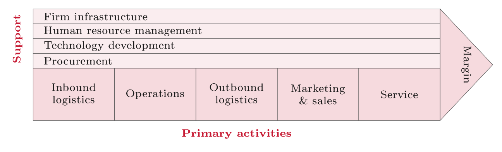
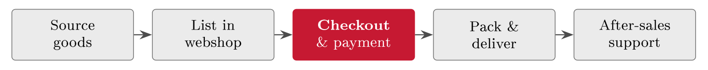
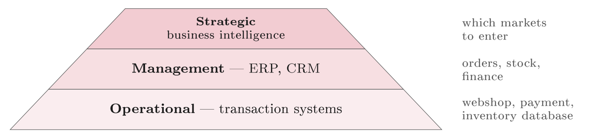
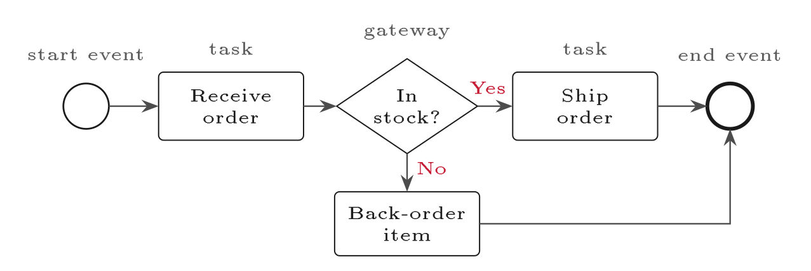
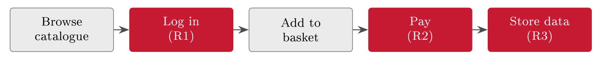

# Understanding the business {#sec-02-understanding-the-business}

Chapter 1 gave you the vocabulary; this chapter takes the first real step, and
it is deliberately not a technical one. Before any threat, any control and any
standard, we study the organisation we are trying to protect --- its business
model, its value chain, and its processes --- because you cannot assess risk
sensibly without understanding the business. This may feel like a detour through
business studies before we reach security. It is not a detour: Every later risk
decision in this course depends on knowing what the organisation does, what it
depends on, and what it cannot afford to lose. By the end of the chapter you
should be able to look at any organisation --- FastGoods included --- through
three lenses of increasing detail, and to hand the result over to security as a
grounded list of what to protect first.

## Security serves the business {#sec-02-security-serves-the-business}

Begin with the principle that justifies the whole chapter. Security is never an
end in itself; it exists to keep the organisation able to do what it set out to
do. Security protects the organisation's ability to operate and to create value,
and it follows that a control with no business purpose is just cost and
friction. It also follows --- and this is the part technicians sometimes resist
--- that the business decides what is worth protecting, and how much. If you do
not know what the business values, you cannot say which risks are serious or
which controls are worth their cost.

Security did not always start from the business, and the shift is worth a
paragraph of history. For a long time security was treated as a purely technical
concern, handled in the server room and isolated from business strategy. Costly
failures taught the lesson the hard way: A security failure is a business
problem, not just an IT one, and it lands on revenue, customers and reputation.
Frameworks began to draw the connection explicitly --- COBIT, first published in
1996, tied IT and its controls to business goals --- and over time it became
accepted that decisions about security are really decisions about business risk,
and belong with the business. This course teaches that modern, business-aligned
view from the very first principle.

One useful way to see what an organisation must protect is to ask who depends on
it. An organisation sits in a web of stakeholders, each expecting something from
it, and the expectations map with surprising directness onto security
obligations (@tbl-stakeholders). For FastGoods, customers expect their
personal data protected and the shop online --- expectations that point straight
at risks R3 and R2 --- while regulators expect the GDPR met whether or not
anyone at FastGoods has read it. Stakeholders are, in effect, a first list of
what the organisation must not let down.

::: {#tbl-stakeholders}
  **Stakeholder**        **What they expect**
  ---------------------- ---------------------------------------------
  Customers              Their data kept safe, the service available
  Owners & board         Value protected, risks managed responsibly
  Employees              Systems that work, a viable business
  Regulators             Compliance with the law (GDPR, NIS2)
  Suppliers & partners   Reliable, trustworthy dealings

  : The organisation and its stakeholders. Each expectation maps onto something
  security must deliver --- for FastGoods, the customers' row alone points at R2
  and R3.
:::

The central claim of the lecture deserves to be stated plainly: You cannot
protect what you do not understand. Not knowing the critical assets means
protecting the wrong things; not knowing the processes means missing where harm
would land; not knowing the dependencies means being blindsided when one of them
fails. The result is effort spent in the wrong places, at real cost --- a risk
assessment built on a shaky understanding of the business is confident about the
wrong things. Understanding first is what makes everything that follows
trustworthy.

Nor is this only a security principle. Professional auditors are required to do
exactly the same thing before they test anything: The auditing standard ISA 315
obliges an auditor to understand the entity and its environment before assessing
where the risks of the engagement lie. An IT auditor walking into FastGoods
would first map the business and its key processes, exactly as we are about to,
and only then judge any control. Much of this course mirrors how auditors
actually work --- a parallel we lean on again in Block V, when the auditors
arrive at FastGoods themselves.

## The first lens: The business model {#sec-02-the-first-lens-the-business-model}

::: {#def-bm}
## Business model

A business model is the account of how an organisation creates, delivers and
captures value: What value it offers and to whom (creates), how that value
reaches the customer (delivers), and how the organisation earns from it
(captures).
:::

You do not need an MBA to describe a business model; you need a clear account of
what the organisation does and how it survives. That account is the foundation
everything else in this chapter builds on, and there is a widely used tool for
writing it down on one page: The Business Model Canvas, introduced by
Osterwalder in 2010, whose nine building blocks --- customers, value
proposition, channels, relationships, activities, resources, partners, costs and
revenue --- force you to think about the whole business, not just the product.
We met FastGoods on a canvas in Chapter 1 (@fig-bmc); here the point is
the tool itself. It captures the whole business on a single page, it names the
key dependencies explicitly, and it is therefore a fast way to find assets: The
blocks that name key resources and activities are usually where the assets worth
protecting are hiding. Reduced to its essentials, the FastGoods model is easy to
state (@tbl-fgmodel) --- and that simplicity is exactly why it is a good
teaching case, because each line points to something the business depends on.

::: {#tbl-fgmodel}
  **Building block**   **FastGoods**
  -------------------- ---------------------------------------------
  Value proposition    Convenient online shopping, fast delivery
  Customers            Online consumers buying everyday goods
  Channels             The webshop (browser and app)
  Key resources        The website, the customer database, payment
  Revenue              Sales through the checkout

  : The FastGoods business model, reduced to its essentials. Already the model
  points at what the business depends on: A working webshop, a trusted customer
  database, and a functioning checkout.
:::

::: {#exm-canvas}
## Reading the canvas with a security eye

Read with a security eye, a business model becomes a first map of what could
hurt the organisation. Each key resource is an asset that needs protecting; each
channel is a route that could be attacked or go down; each revenue stream is
something an incident could interrupt. For FastGoods the model already flags the
customer database (an asset), the webshop (a channel) and the checkout (revenue)
as things to protect --- together they describe the organisation's real
exposure. The business model, read carefully, is the first draft of a risk
picture.
:::

## The second lens: The value chain {#sec-02-the-second-lens-the-value-chain}

::: {#def-vc}
## Value chain

The value chain, introduced by Michael Porter in 1985, breaks a business into
the activities that create value: *Primary* activities that directly make and
deliver the product --- inbound logistics, operations, outbound logistics,
marketing and sales, service --- and *support* activities --- firm
infrastructure, human resource management, technology development, procurement
--- that enable them all. The model reads left to right as value is added,
ending in the margin the activities together earn.
:::

{#fig-porter}

The usefulness of the value chain for security is that it shows where value
piles up --- and value is exactly what attackers and accidents threaten.
Protecting everything equally is wasteful, so the discipline is to map the chain
and then concentrate effort where value concentrates: The activities that carry
the most value are the ones worth protecting most, because a break there does
the most damage. A jeweller guards the vault, not the stationery cupboard, for
precisely this reason; the value chain is how you find the equivalent of the
vault in any organisation. Applied to FastGoods (@fig-fgchain), the
chain runs from sourcing goods to after-sales support, and it immediately
highlights the activity that carries the most risk: The checkout is where the
value is captured, so it is where a denial-of-service attack would hurt most ---
this is risk R2, located by nothing more sophisticated than drawing the chain.

{#fig-fgchain}

It is tempting to focus only on the primary activities, but the support
activities underneath them are often where security actually lives, because a
failure in support can disable every primary activity at once. Three deserve
naming now. *Technology development* covers the IT and systems everything runs
on --- for FastGoods, the cloud hosting that supports the whole chain, whose
failure stops everything. *Procurement* covers the suppliers and services
brought in, which is where supplier and third-party risk enters (Lecture 19).
And *human resource management* covers the people, and the access they hold
(Lecture 14). Much of what we protect lives in this supporting layer, not only
in the visible primary activities.

One more structural view completes the lens. A business runs on layered
information systems, and the layers map onto the classic levels of management
(@fig-pyramid). At the operational level, transaction systems handle the
day-to-day events --- for FastGoods, the webshop, payment processing and the
inventory database. At the management level, ERP and CRM systems run planning,
finance and customer relationships --- order and stock management. At the
strategic level, business-intelligence dashboards support long-range decisions,
such as which markets to enter. The point for this course is that every layer
holds data and processes that GRC must govern: Access rights, change management,
and the evidence an auditor will later ask to see --- the IT general controls
(ITGC) that return in Block V. One order, traced through the stack, makes it
concrete: A customer's click is a transaction in the webshop (operational),
becomes a line in order and stock management (management), and ends as a data
point in the quarter's sales dashboard (strategic) --- three appearances of one
fact, each needing its own integrity, which is why "the numbers are right" is an
ITGC question long before it is a finance question.

{#fig-pyramid}

## The third lens: Processes and modelling {#sec-02-the-third-lens-processes-and-modelling}

::: {#def-proc}
## Business process

A business process is an ordered set of steps that produces an outcome. It
crosses people, systems and sometimes whole organisations --- and security
incidents happen inside processes, at specific steps.
:::

Where the value chain is a high-level map, a process is the step-by-step route a
single task follows. "Place an order" is a process: Browse, add to basket, log
in, pay, confirm. Seeing those individual steps is what lets us pinpoint exactly
where a risk such as account takeover sits --- not "somewhere in the webshop",
but at one nameable step.

To analyse a process we draw it, and there is a recognised notation for doing
so: BPMN, short for Business Process Model and Notation, standardised by the
Object Management Group. Its strength is a small, standard set of symbols, so
that any reader follows the flow the same way (@fig-bpmn): A circle is
an event (a start or an end), a rounded box is a task, and a diamond is a
gateway where the flow branches on a decision. With just these, a complex
process becomes a picture anyone in the room can read and check.

{#fig-bpmn}

::: {#exm-orderproc}
## The order process, and where the risks sit

Drawing the FastGoods order process step by step turns the abstract idea of risk
into something you can point at (@fig-orderproc). The three running
risks now sit on specific steps: Account takeover at log in (R1),
denial-of-service at payment (R2), and a data breach where customer data is
stored (R3). Each step is a place where a specific thing can go wrong, and the
process diagram is what lets us place each risk exactly where it belongs.
:::

{#fig-orderproc}

Modelling is not bureaucracy for its own sake; done well it surfaces security
questions that prose would hide. Each step raises the question *what could go
wrong here?*; the hand-offs between systems and people are common weak points;
the model shows dependencies that text descriptions tend to hide; and it gives
the whole team a shared picture to reason about. Drawing the FastGoods checkout
immediately raises the question of what protects the payment step --- which is
exactly the security conversation we want. A good model does not answer the
questions, but it makes sure the right ones get asked.

::: {.callout-tip}
## Finding the risk: On the order process

Apply the first source from Chapter 1's box to @fig-orderproc, step by
step. *Browse*: What can go wrong here? Little of consequence. *Log in*: Someone
who is not the customer logs in --- that sentence *is* R1, found, not invented.
*Pay*: The step stops working --- R2. *Store data*: The stored data gets out ---
R3. The process did the work: Each risk fell out of one honest question asked at
one concrete step. When a risk feels impossible to formulate, the cure is always
the same --- go back to a step and ask the question there.
:::

## From business understanding to security priorities {#sec-02-from-business-understanding-to-security-priorities}

We can now close the loop by turning the business understanding into the raw
material of security. The three lenses each hand us a list: The business model
names the key resources and the revenue; the value chain shows where value, and
so risk, concentrates; the processes show the specific steps where harm can
occur. Put together, they give a grounded list of the organisation's assets and
weak points --- precisely the starting point for the next chapter, where assets
and risk are studied in depth.

Not every asset on that list deserves equal attention, so the next move is to
rank: Order the assets by how badly the business would suffer without them, and
give the most business-critical --- sometimes called the crown jewels --- the
strongest protection. Done formally, this ranking is a Business Impact Analysis
(BIA), a method we return to properly with the preparedness planning of Lecture
12; done informally, it is simply the judgement that FastGoods' customer
database and checkout rank far above the public product images, because the
business depends on them far more. Business understanding is what makes that
ranking defensible rather than arbitrary, and it is the ranking that drives the
risk assessment of Block III. One number often decides the ranking before any
formal method: What downtime costs per unit of time. A first, rough cut for
FastGoods (@tbl-downtime) already orders the dependencies --- and it
previews the Business Impact Analysis this rough cut later grows into (Lecture
12).

::: {#tbl-downtime}
  **Dependency**      **One hour**         **One day**                    **One week**
  ------------------- -------------------- ------------------------------ ------------------------
  Checkout (R2)       Peak sales lost      Day's revenue + support load   Customers migrate
  Customer database   Orders mis-shipped   Operations halt                Trust damage compounds
  Marketing site      Nothing measurable   Minor                          Minor

  : Downtime, roughly costed per dependency. Even a qualitative cut orders the
  priorities --- and grows into the Business Impact Analysis of Lecture 12.
:::

Everything in this chapter comes together in the three running risks, each of
which can now be traced back to a business dependency (@tbl-dep2risk).
Each of the three risks we carry through the whole course is rooted in a clear
business dependency, not plucked from a generic checklist --- and that is what
makes them the *right* risks for FastGoods to worry about. This is the payoff of
starting with the business rather than the technology.

::: {#tbl-dep2risk}
  **Business dependency**   **If it fails**    **Risk**
  ------------------------- ------------------ ----------
  Customer accounts         Account takeover   R1
  The checkout (revenue)    Sales stop         R2
  The customer database     Data breach        R3

  : From business dependency to running risk. The three risks of the course are
  rooted in what the business depends on, which is what makes them the right
  risks to carry forward.
:::

##### Reading for this chapter.

Edwards & Weaver, Chapter 2 (the landscape of cybersecurity, pp. 19 ff.);
Jøsang, Chapter 18 (governance, pp. 377 ff.). Both books are available in the
library and on the Canvas course page.

## Summary {#sec-02-summary}

Security serves the business: It protects the organisation's ability to operate
and create value, a control with no business purpose is cost and friction, and
the business decides what is worth protecting --- a view the field reached the
hard way, through costly failures and frameworks such as COBIT (1996) that tied
IT to business goals. The central claim follows: You cannot protect what you do
not understand, and auditors, obliged by ISA 315 to understand the entity before
testing it, start exactly the same way. Three lenses of increasing detail
deliver that understanding: The business model (@def-bm), captured on
Osterwalder's canvas, names the resources, channels and revenue --- the first
draft of a risk picture; the value chain (@def-vc), after Porter, shows
where value concentrates and so where a break hurts most, with the support
activities and the layered enterprise systems underneath; and the business
process (@def-proc), drawn in BPMN, places harm at specific steps ---
for FastGoods, R1 at log in, R2 at payment, R3 at storage. Ranked by business
impact, the result is a defensible list of priorities, and the three running
risks stand revealed as rooted in real dependencies rather than a checklist.

From here we turn to how an organisation governs its security at all --- the
management system that ties assets, risks and controls into one governed,
repeating whole, and the standard that defines it. That is where Lecture 3, and
the ISMS, begin.

## Self-check {#sec-02-self-check}

Try these before the next lecture.

::: {#exr-02-why-the-business-comes-first}
## Why the business comes first

State the central claim of this chapter in one sentence, and give two concrete
failure modes of skipping the business understanding and going straight to
controls.
:::

::: {#exr-02-three-lenses-on-one-organisation}
## Three lenses on one organisation

Pick an organisation you know. In one sentence per lens, say what its business
model, its value chain and one of its processes each reveal about what security
should protect.
:::

::: {#exr-02-the-jeweller-s-vault}
## The jeweller's vault

Where does value concentrate in FastGoods' value chain, which running risk
follows directly from that concentration, and why is the analogy of the
jeweller's vault apt?
:::

::: {#exr-02-the-auditor-s-parallel}
## The auditor's parallel

Why does ISA 315 oblige an auditor to understand the entity before testing
anything, and what does that requirement share with the way this course
approaches risk assessment?
:::

::: {#exr-02-from-canvas-to-assets}
## From canvas to assets

From the FastGoods Business Model Canvas, name one key resource, one channel and
one revenue stream, and state which running risk each one maps onto.
:::
