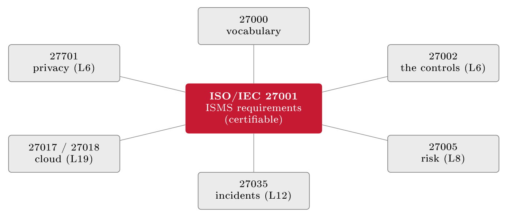
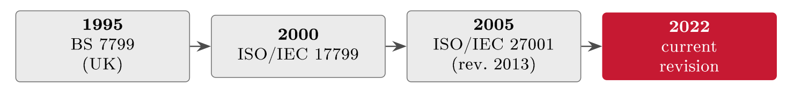
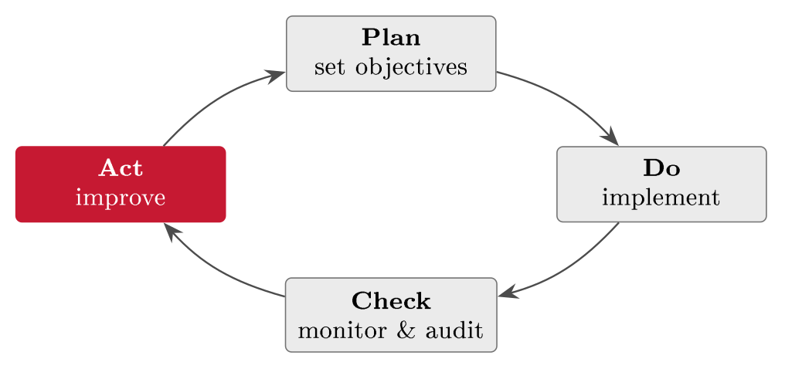
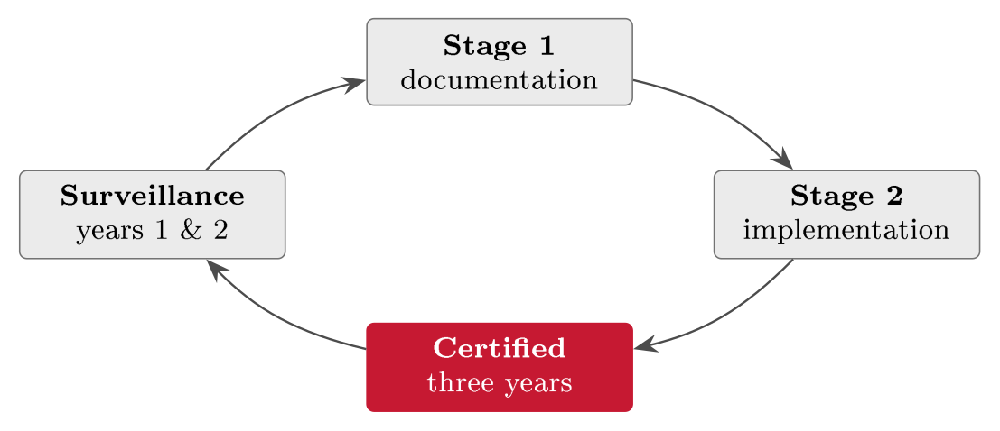

# The ISMS and ISO/IEC 27001 {#sec-03-isms-and-iso-27001}

Chapters 1 and 2 gave you the vocabulary of risk and a business understood; this
chapter closes the foundations with how an organisation actually governs its
security, and it does so with the central instrument of the whole field: The
information security management system, and ISO/IEC 27001, the standard that
defines it. By the end of this chapter you should be able to say what an ISMS is
and why ad-hoc security fails without one, walk the plan--do--check--act loop it
runs on, find your way around the standard's clauses and its Annex A controls,
and read the two short documents - the scope statement and the Statement of
Applicability - that make the whole system concrete enough to audit.

## From ad-hoc security to a managed system {#sec-03-from-ad-hoc-security-to-a}

Buying tools and reacting to incidents is not the same as managing security, and
the difference is where this chapter starts. Ad-hoc security has three recurring
failures: Tools without a system leave gaps that nobody owns; security depends
on a few people remembering a few things; and nothing connects risk, controls
and improvement over time. This is the gap ISO/IEC 27001 was written to close
- before it, every organisation improvised, and there was no common way to
show that security was actually under control.

::: {#exm-adhoc}
## The ad-hoc audit finding

FastGoods, like most small companies, did what felt sensible: It bought a
firewall and antivirus. An auditor walking in today would find that nobody owns
patching, that an administrator account has no multi-factor authentication, and
that there is no record of what was decided about security or why. None of these
is a missing product; each is a gap a managed system would have caught - an
unowned process, an unenforced control, an undocumented decision. The finding is
not "buy more tools" but "there is no system here".
:::

::: {#def-isms}
## Information security management system

An information security management system (ISMS) is the governance structure
that organises an organisation's security work as one managed whole: A framework
of policies, processes and controls - not a product - that plans security
around risk and regulatory requirements, arranges the preventive, detective and
corrective controls in a rational way, and covers people, process and technology
end to end (Jøsang, §18.5, pp. 392 ff.).
:::

The word to stress is *risk-based*: An ISMS bases security decisions on risk,
consistently and repeatably. Decide what to protect, assess the risk, choose
proportionate controls (Block III); do it the same way every time, and write it
down (Lecture 15); then review and improve, because security is never
"finished". For FastGoods this means spending on the customer-database breach
(R3) before low-impact issues - and being able to justify that choice to an
auditor. An ISMS turns security from a series of one-off decisions into a
repeatable, risk-driven process, which is the same logic that runs through this
whole course.

ISO/IEC 27001 does not stand alone; it is the certifiable centre of a family of
standards (@tbl-family), and the division of labour between them is
worth fixing early: 27001 says *what* you must do, 27002 explains *how* the
controls work (Lecture 6), and 27005 supports the risk work (Lecture 8). Only
27001 carries certification (Jøsang, §18.5.5, p. 399).

The family is larger than the working four, and a map of it pays off later in
the course (@fig-family27k). Around the certifiable core sit topic
extensions that plug into the same system: ISO/IEC 27017 and 27018 add
cloud-specific and cloud-privacy guidance (Lecture 19); ISO/IEC 27035 covers
incident management (Lecture 12); and ISO/IEC 27701 extends the ISMS into a
privacy information management system - much of Chapter 7 run as a management
system. The numbering discipline is the point: Everything in the 27000 range
shares the vocabulary of 27000 and the skeleton of 27001, so an organisation can
grow its system outward without rebuilding it.

{#fig-family27k}

That skeleton is itself standardised. Since 2012, all ISO management-system
standards share one harmonised high-level structure - long known as Annex SL
- with identical clause numbering from context (4) to improvement (10). This
is why ISO 9001 for quality, ISO 14001 for environment and ISO 27001 for
security look like siblings: They are built on the same frame and differ in the
discipline-specific content. Management-system thinking itself is older than
information security - ISO 9001's first edition dates to 1987 - and the
harmonisation has a practical payoff: An organisation already running ISO 9001
can attach security to structures it has, one integrated management system
instead of three parallel bureaucracies. For a company of FastGoods' size that
is the difference between feasible and not.

::: {#tbl-family}
  **Standard**    **What it provides**
  --------------- --------------------------------------------------
  ISO/IEC 27000   Overview and vocabulary
  ISO/IEC 27001   ISMS requirements - the certifiable standard
  ISO/IEC 27002   Guidance on the controls (Lecture 6)
  ISO/IEC 27005   Information security risk management (Lecture 8)

  : The ISO/IEC 27000 family. One standard names the requirements and carries
  certification; the others explain the controls and support the risk work.
:::

The standard also has a history worth a paragraph, because it explains why a
British Standard number keeps appearing in an international story
(@fig-lineage). The model goes back to a UK industry code of practice of
the early 1990s, developed with the Department of Trade and Industry and drawing
on the internal practices of large companies; it was published as BS 7799 in
1995, internationalised as ISO/IEC 17799 in 2000, and became the certifiable
ISO/IEC 27001 in 2005, with major revisions in 2013 and 2022 (Jøsang, §18.5.1,
p. 392). The reason a recognised standard helps follows from that lineage: It is
a tested, complete blueprint - accumulated good practice, so you do not start
from a blank page - it gives a common language with auditors, partners and
regulators, and certification is independent proof that your security is
managed. ISO 27001 is recognised in well over a hundred countries and is the
most widely held information-security certification, which is exactly why
partners and regulators accept it as evidence.

{#fig-lineage}

## The PDCA cycle {#sec-03-the-pdca-cycle}

How does a written management system stay alive rather than gather dust? The
standard's answer is a loop borrowed from manufacturing, and it is worth meeting
before the clauses, because the clauses are arranged around it.

::: {#def-pdca}
## Plan--do--check--act

Plan--do--check--act (PDCA) is the repeating improvement loop an ISMS runs on:
*Plan* what to do, *do* it, *check* whether it works, *act* to improve - then
go round again. Each loop leaves the system a little better than before.
:::

The loop is older than information security: It is the improvement cycle Walter
Shewhart set out in 1939 and W. Edwards Deming popularised after 1950, and ISO
management standards borrow it directly, which is why an ISMS keeps adapting
instead of freezing (Jøsang, §18.5.3, p. 397). Its four phases carry
recognisable work (@fig-pdcacycle). *Plan* is where scope, policy and
objectives are set, risk is assessed and controls are chosen - the material of
Block III - together with a decision on how success will be measured. *Do* is
where the chosen controls become real: Implementation, training, and the
day-to-day operation of security (Lectures 10 and 14). *Check* is monitoring and
measurement, internal audit (Lecture 16), and the management review. *Act*
closes the loop: Fix nonconformities, take corrective action, and feed the
improvements into the next Plan.

{#fig-pdcacycle}

::: {#exm-pdcaloop}
## One PDCA loop on risk R1

Follow one risk through a full cycle to see why the loop earns its keep
(@tbl-pdcar1). FastGoods plans MFA for every login, rolls it out and
trains staff - and the internal audit in the Check phase finds three
administrator accounts still without MFA, the exact accounts an attacker would
want most. The Act phase enforces MFA on all admin accounts and adds an MFA
check to the onboarding routine, so the gap cannot silently reopen. One loop did
not just "install MFA": It found the gap the rollout missed and closed it, and
closed the door on its recurrence. That is the difference between a project and
a managed system.
:::

::: {#tbl-pdcar1}
  **Phase**   **What FastGoods does about risk R1 (account takeover, no MFA)**
  ----------- ---------------------------------------------------------------------
  Plan        Assess R1; decide every customer and staff login must use MFA
  Do          Roll out MFA across the shop and back office; train staff to use it
  Check       The internal audit finds three admin accounts still without MFA
  Act         Enforce MFA on all admin accounts; add an MFA check to onboarding

  : Risk R1 through one PDCA loop. The Check phase catches what the rollout
  missed; the Act phase closes it for good.
:::

Why does the loop never stop? Because nothing it manages stands still: New
threats, technologies and rules appear constantly, and the business itself
changes - new systems, markets, suppliers. So the ISMS is reviewed and
improved on a rhythm, not once. An ISMS is a living system, not a certificate on
the wall; the day you stop improving it is the day it starts falling behind.

## Inside the standard: Clauses 4 to 10 {#sec-03-inside-the-standard-clauses-4-to}

ISO 27001's management-system requirements sit in seven clauses, numbered 4 to
10, and they map neatly onto PDCA (@tbl-clauses); clauses 1--3 are
scope, references and terms. The clause structure is shared with every ISO
management standard - learn it once, reuse it everywhere (ISO/IEC 27001:2022;
Jøsang, §18.5.2, pp. 394--397).

::: {#tbl-clauses}
  **Cl.**   **Requirement**                                  **PDCA**
  --------- ------------------------------------------------ ----------
  4         Context of the organisation                      Plan
  5         Leadership                                       Plan
  6         Planning (risk assessment & treatment)           Plan
  7         Support (resources, competence, documentation)   Do
  8         Operation                                        Do
  9         Performance evaluation                           Check
  10        Improvement                                      Act

  : The seven clauses of ISO/IEC 27001:2022, mapped onto PDCA. The same clause
  skeleton recurs across all ISO management standards.
:::

The system starts by understanding the organisation and securing real commitment
from the top. Clause 4 (context) asks for the internal and external issues, the
legal and regulatory requirements (Lectures 5 and 7), the interested parties and
the scope; for FastGoods, "interested parties" include customers, the bank, the
cloud provider and the regulator, and the scope is the webshop and the customer
data. Clause 5 (leadership) demands top-management commitment, the security
policy, and assigned roles (Lecture 11) - without genuine commitment, an ISMS
is just paper. Clause 6 is the heart of the standard: A systematic risk
assessment (Block III), a documented treatment decision for each risk, and
measurable security objectives; for FastGoods it forces a documented decision on
each of R1--R3 - treat, accept, transfer or avoid - which then becomes the
Statement of Applicability. Clauses 7 and 8 supply the fuel and the engine:
Resources, competence, awareness and documented information (Lectures 14 and
15), and the disciplined day-to-day operation of the planned processes. Clauses
9 and 10 close the loop with monitoring, internal audit and management review,
and with the handling of nonconformities and continual improvement.

That is the map; now the walk, clause by clause, because each clause demands a
concrete artefact an auditor can ask for - and FastGoods will produce every
one of them across this course.

*Clause 4 (context)* asks four questions in order: Which internal and external
issues affect the ISMS - for FastGoods, a small team, one product, everything
on one cloud; which legal, regulatory and contractual requirements apply - the
harvest of Lectures 5 and 7, plus PCI DSS from Chapter 1; who the interested
parties are and what they require (@tbl-parties); and, from all of that,
what the scope is. The interested-parties analysis looks bureaucratic and is
not: It is Chapter 2's stakeholder thinking with an evidence trail, and every
later dispute about "why is this control here" resolves back to one of its rows.

::: {#tbl-parties}
  **Interested party**       **Expectation**                    **Becomes a requirement via**
  -------------------------- ---------------------------------- --------------------------------------
  Customers                  Data safe, shop online             GDPR Art. 32; availability objective
  Payment provider / bank    Card data handled properly         PCI DSS (contract)
  Cloud provider             Shared responsibilities met        Contract terms (Lecture 19)
  Regulator (Datatilsynet)   Lawful processing, breach notice   GDPR (Lecture 7)
  Owner                      Risk managed, spend justified      Risk criteria (Clause 6)

  : FastGoods' interested parties under Clause 4. Each expectation maps to a
  requirement the ISMS must satisfy - Chapter 2's stakeholder table, now with
  an auditor's evidence trail.
:::

*Clause 5 (leadership)* is the standard's answer to the oldest failure mode:
Security delegated to enthusiasm. Top management must demonstrably commit -
approve the policy (Section 4.4), ensure the ISMS is resourced, assign roles and
authorities (Lecture 11's material), and integrate security into business
processes rather than beside them. "Demonstrably" is the operative word:
Minutes, signatures and management-review attendance are what an auditor
accepts; enthusiasm is not.

*Clause 6 (planning)* is the heart, with three limbs. Clause 6.1.2 requires a
defined, repeatable risk-assessment process with criteria fixed in advance -
exactly Block III's discipline, referenced by the ISMS rather than reinvented.
Clause 6.1.3 requires a risk-treatment process whose outputs are the risk
treatment plan and the Statement of Applicability, justifying every Annex A
control in or out - Chapter 6 builds FastGoods' version. And Clause 6.2
requires measurable security objectives with plans behind them: Who does what by
when, and how the result will be evaluated. For FastGoods, Clause 6 is where a
documented decision on each of R1--R3 - treat, accept, transfer or avoid -
becomes a system requirement rather than good intentions; Lecture 10's work
lands here.

*Clause 7 (support)* supplies the fuel under five headings, each more concrete
than it sounds: Resources (budget and people); competence (the right skills,
evidenced - training records, not assurances); awareness (everyone knows the
policy and their own part in it, Lecture 14); communication (who tells what to
whom, when); and documented information (7.5) - the paperwork discipline under
which documents are identified, reviewed, approved, version-controlled and
protected, so the auditor's perennial question "is this the current version, and
who approved it?" always has an answer. Lecture 15 devotes itself to that
hierarchy.

*Clause 8 (operation)* is the shortest clause and the largest amount of work:
Run what you planned. The risk assessment is actually performed at planned
intervals and on significant change; the treatment plan is actually implemented;
and - easy to miss - outsourced processes are controlled, which for a
company whose whole platform is rented makes supplier management (Lecture 19) an
ISMS duty, not an option.

*Clause 9 (performance evaluation)* closes the measurement loop with three
instruments: Monitoring and measurement - deciding what to measure and how;
the internal audit programme (9.2) - planned, impartial, competent, Lecture
16; and the management review (9.3), which is not a status meeting but a defined
ritual with prescribed inputs - audit results, nonconformities, monitoring
results, the state of the risk assessment, feedback, improvement opportunities
- and prescribed outputs: Recorded decisions on improvement and on changing
the ISMS. A management review without recorded decisions is, to an auditor, a
review that did not happen.

*Clause 10 (improvement)* handles what Check finds: Nonconformities corrected at
the root - the three-step shape of the example below - and continual
improvement as a standing duty. It is the Act of PDCA, written into the system
as an obligation rather than an aspiration.

::: {#exm-nonconf}
## A nonconformity, corrected

The Check-and-Act half of the standard is best seen on one small finding. An
internal audit (Clause 9) discovers that leavers' accounts are not disabled
promptly - former staff can still log in for weeks. That is a nonconformity:
The ISMS says one thing, reality does another. The corrective action (Clause 10)
is not merely to disable the accounts found, but to remove the cause: Automate
de-provisioning in the leaver process, and re-check in ninety days that the
automation actually runs. Symptom fixed, cause removed, verification scheduled
- that three-step shape is what "corrective action" means throughout the audit
world.
:::

::: {.callout-tip}
## Finding the risk: In controls and findings

Two of Chapter 1's four sources live inside the ISMS itself. Read a control
backwards: A.8.5 exists so that *the wrong person cannot log in* - turn it
around and R1 stands named, no invention required. Then test it: If MFA is on
for customers but not for the three administrator accounts, the control is
*ineffective* exactly where it counts, and the risk it was meant to reduce is
still there - with a false sense of safety on top. The audit finding above
works the same way from the other direction: "Leavers' accounts stay active" is
not paperwork; it is a risk, already found and written down, waiting only for
its treatment.
:::

## Scope, policy and the Annex A controls {#sec-03-scope-policy-and-the-annex-a}

Three things make an ISMS concrete: Its scope, its policy, and the controls
selected from Annex A. The scope is the first practical decision - which parts
of the organisation, sites, systems and data are in - and it is a deliberate
boundary, not a formality: Too narrow leaves real risk outside; too broad is
unmanageable; and the scope statement is the boundary an auditor will hold you
to (Lecture 16).

::: {#exm-scope}
## A scope statement for FastGoods

A scope statement says the boundary in one paragraph: "The ISMS covers the
FastGoods webshop platform, the customer database and the cloud infrastructure
it runs on, operated from the Oslo office. The separate corporate marketing site
is out of scope." Two sentences, and everyone - management, staff, auditor -
knows exactly what is in and what is out. The exclusion is as informative as the
inclusion, and it must be defensible: A marketing site holding no customer data
can reasonably sit outside; the payment flow could not.
:::

Above the controls sits the information security policy: Short, high-level and
board-approved (Clause 5.2), the apex of the document hierarchy (Lecture 15)
from which standards and procedures flow. It contains the commitment to protect
confidentiality, integrity and availability, the security objectives, the roles,
the commitment to legal compliance, and a review rhythm. Objectives should be
measurable rather than aspirational - "we will have no customer-data breaches
and keep the checkout available 99.9 % of the time" can be checked; "we take
security seriously" cannot. What such a policy looks like is best shown as a
skeleton - FastGoods' version fits on one page:

-   **Purpose & commitment** - Protect the confidentiality, integrity and
    availability of customer and business information

-   **Scope** - The ISMS scope of @exm-scope, by reference

-   **Objectives** - No customer-data breaches; checkout available 99.9 %; all
    staff trained annually

-   **Roles** - The owner accountable; the IT lead operates; every employee
    responsible (Lecture 11)

-   **Risk approach** - Risks assessed and treated on the criteria of Clause 6

-   **Compliance** - The GDPR, contracts including PCI DSS, and the Digital
    Security Act where in scope

-   **Review** - Annually and on significant change; approved and dated by the
    owner

Seven headings, one signature, one date - and every later document in Lecture
15's hierarchy hangs off this page.

The controls themselves come from Annex A, ISO 27001's reference catalogue,
reorganised in the 2022 revision into 93 controls under four themes -
organisational (37), people (8), physical (14) and technological (34); the older
2013 version had 114 controls in 14 domains (ISO/IEC 27001:2022, Annex A;
Jøsang, §18.5.4, p. 398). Annex A is a checklist of options, not a mandate: You
select what your risk requires. The themes are concrete, named controls, not
abstractions (@tbl-annexa) - and those reference numbers are a shared
language: "A.8.5" means the same thing to every auditor in the world.

::: {#tbl-annexa}
  **Theme**        **Example control**           **What it means**
  ---------------- ----------------------------- -------------------------------------
  Organisational   A.5.15 Access control         Rules on who gets access to what
  Organisational   A.5.7 Threat intelligence     Track threats relevant to you
  People           A.6.3 Awareness & training    Staff are trained on security
  Physical         A.7.4 Physical monitoring     Watch sensitive physical areas
  Technological    A.8.5 Secure authentication   Strong login, e.g. MFA
  Technological    A.8.24 Cryptography           Encrypt data at rest and in transit

  : Annex A made concrete: Real reference numbers from the 2022 catalogue, one
  or two per theme. Lectures 7 and 10 work through selecting and tailoring them.
:::

The four themes are unequal by design (@fig-themes): Organisational
controls dominate, and technological controls only come second, because most of
security is decisions, processes and responsibilities rather than machinery -
a proportion worth remembering whenever "security" is mistaken for "technology".

{#fig-themes}

The step from the risk assessment to the controls actually applied is the
Statement of Applicability (Clause 6.1.3): It lists every Annex A control and
whether it applies, justifies each inclusion and each exclusion, and links each
applicable control back to the risk it treats. It pairs with the risk treatment
plan (how the controls will be implemented), and it is the document an auditor
reaches for first - where risk meets controls on one page. A first taste for
FastGoods: A.8.5 applies because logins need MFA (R1); A.8.24 applies because
customer data must be encrypted (R3); A.5.7 applies to watch for attacks (R2);
A.7.4 does not apply, because FastGoods runs no data centre of its own. Every
row ties a control to a real risk or justifies leaving it out - the single
table that turns "we do security" into "here is exactly what we do, and why".
Chapter 6 devotes a full section to the SoA and builds FastGoods' version
properly.

## Certification, the law, and practice {#sec-03-certification-the-law-and-practice}

Certification is a third party formally confirming that your ISMS meets the
standard. It is optional but valuable for three reasons: Independent assurance
for customers, partners and regulators; a commercial requirement, increasingly,
to win contracts or satisfy due diligence (Lecture 19); and discipline -
certification forces the ISMS to actually work, not just exist, provided the
certificate comes from an *accredited* certification body. Nor is it a one-off
exam: The certificate is issued after a two-stage audit - Stage 1 reviews the
documentation, Stage 2 tests whether the ISMS really runs - and is valid for
three years, with annual surveillance audits in years one and two and a full
recertification audit in year three restarting the loop
(@fig-certcycle). The rhythm is the point: It signals an ongoing system
rather than a one-off check.

{#fig-certcycle}

Two pieces of machinery behind the certificate decide what it is worth. First,
the accreditation chain: A national accreditation body - in Norway, Norsk
akkreditering - accredits the certification bodies, who in turn audit the
organisations. "Accredited certificate" is therefore the phrase that carries the
value; a certificate from an unaccredited issuer proves little, however handsome
the logo. Second, the auditors' finding scale, which every audit report is
written in: A *major nonconformity* - a required element missing or
systematically failing - blocks or suspends certification until corrected; a
*minor nonconformity* must be corrected on an agreed plan; an *observation* (or
opportunity for improvement) obliges nothing but often previews next year's
minor. Reading an audit report means reading this scale, and Lecture 16 returns
to it from the auditor's side of the table.

An ISMS is also the practical way many organisations meet their legal duties and
pass external audits, and in practice the same control evidence does triple
duty: NIS2 (Article 21) and the GDPR (Article 32) demand exactly the systematic,
risk-based security an ISMS provides (Lectures 5 and 7); certification gives
auditors and assurance reports such as ISAE 3402 a strong baseline (Lecture 16);
and the controls map onto the IT general controls (ITGC) a financial auditor
tests. The law sets the floor; ISO 27001 is how you clear it and prove it -
the connective tissue between governance, risk, controls and audit.

A closing dose of realism, because most ISMS failures are not technical but
managerial, and auditors see the same three patterns repeatedly. *Scope gaming*:
Drawing the boundary to dodge the real risk. *Shelf-ware*: A policy nobody
reads, controls that exist only on paper. *Badge-hunting*: Chasing the
certificate, then freezing the ISMS. Each is a way of holding the certificate
while quietly defeating its purpose - which is exactly why surveillance audits
look for them specifically. The field mark is familiar to anyone who has
audited: A beautiful binder, but leavers still have access and the "annual"
review last happened two years ago. A certificate is only as honest as the
system behind it. For FastGoods the practical path is modest and sound: Scope
the webshop, the customer data and the cloud they run on; assess R1--R3, select
Annex A controls and write the SoA; then run PDCA - implement, audit
internally, improve - and certify when ready. Certification is not needed on
day one, but adopting the ISMS discipline early means security grows with the
business instead of lagging behind it.

##### Reading for this chapter.

Jøsang, §18.5 (the ISO/IEC 27000 series: History, ISMS requirements, process
cycle and controls, pp. 392--399); Edwards & Weaver, Chapter 12 (cybersecurity
frameworks, pp. 209 ff.). Both books are available in the library and on the
Canvas course page.

## Summary {#sec-03-summary}

Ad-hoc security - tools without a system, knowledge in a few heads, nothing
connecting risk to controls over time - fails in ways an auditor can name, and
the answer is the ISMS (@def-isms): A risk-based governance structure,
not a product, descended from BS 7799 (1995) through ISO/IEC 17799 (2000) to
ISO/IEC 27001 (2005, revised 2022). It runs on the PDCA loop (@def-pdca)
- Shewhart's and Deming's improvement cycle - and one turn on FastGoods'
risk R1 showed the loop's value: The Check phase caught the admin accounts the
rollout missed. The standard's requirements sit in clauses 4--10, mapped onto
PDCA, from context and leadership through the risk work of Clause 6 to
evaluation and improvement; the system becomes concrete through a one-paragraph
scope statement, a short board-approved policy with measurable objectives, and
the controls selected from Annex A's 93 (four themes, real reference numbers),
recorded and justified in the Statement of Applicability. Certification - two
stages, three years, annual surveillance - turns the system into independent
proof, and the same evidence serves NIS2, the GDPR, ISAE 3402 and the auditor's
IT general controls at once; the recurring failures are managerial (scope
gaming, shelf-ware, badge-hunting), not technical.

The standard is voluntary; you choose it - and, as Lecture 5 will show, the
law increasingly demands the same discipline whether you choose it or not.
First, though, the system needs its subject matter in full: The assets it
protects, and the threats and weaknesses it manages. That is where Lecture 4
begins.

## Self-check {#sec-03-self-check}

Try these before the next lecture.

::: {#exr-03-ad-hoc-security-diagnosed}
## Ad-hoc security, diagnosed

Name the three recurring failures of ad-hoc security, and match each to one
concrete finding from @exm-adhoc.
:::

::: {#exr-03-pdca-on-a-different-risk}
## PDCA on a different risk

Run FastGoods' risk R3 (customer-database breach) through one PDCA loop in the
style of @tbl-pdcar1: One sentence per phase, including a plausible
Check finding and the Act that closes it.
:::

::: {#exr-03-clauses-to-pdca}
## Clauses to PDCA

Place clauses 6, 8, 9 and 10 of ISO/IEC 27001 on the PDCA loop, and give one
concrete activity for each clause.
:::

::: {#exr-03-scope-judgement}
## Scope judgement

FastGoods proposes to exclude the payment flow from its ISMS scope "because the
payment provider handles it". Assess the proposal: Is the exclusion defensible,
and what would an auditor say?
:::

::: {#exr-03-soa-reasoning}
## SoA reasoning

Write two Statement-of-Applicability rows for FastGoods - one control that
applies (with its risk) and one that is excluded (with its justification) -
using real Annex A reference numbers from @tbl-annexa.
:::

::: {#exr-03-pdca-interactive}
## The PDCA cycle, interactive

Put the four phases of the management cycle in order.

```{=html}
<div class="grc-ex" data-type="order">
<script type="application/json">
{
 "steps": [
  "Plan",
  "Do",
  "Check",
  "Act"
 ]
}
</script>
</div>
```
:::

::: {#exr-03-pdca-artefacts-interactive}
## ISMS artefacts on the cycle, interactive

Drag each ISMS activity onto the PDCA phase where it belongs.

```{=html}
<div class="grc-ex" data-type="sort">
<script type="application/json">
{
 "buckets": [
  {
   "id": "plan",
   "label": "Plan"
  },
  {
   "id": "do",
   "label": "Do"
  },
  {
   "id": "check",
   "label": "Check"
  },
  {
   "id": "act",
   "label": "Act"
  }
 ],
 "chips": [
  {
   "t": "Risk assessment and treatment plan",
   "b": "plan"
  },
  {
   "t": "Rolling out MFA and training staff",
   "b": "do"
  },
  {
   "t": "The internal audit",
   "b": "check"
  },
  {
   "t": "Corrective action after a finding",
   "b": "act"
  },
  {
   "t": "Setting scope and policy",
   "b": "plan"
  },
  {
   "t": "Management review of measurements",
   "b": "check"
  }
 ]
}
</script>
</div>
```
:::

::: {#exr-03-themes-interactive}
## Annex A themes, interactive

Select the four control themes of ISO/IEC 27002:2022 - and nothing else.

```{=html}
<div class="grc-ex" data-type="pick">
<script type="application/json">
{
 "options": [
  {
   "t": "Organisational",
   "ok": true
  },
  {
   "t": "People",
   "ok": true
  },
  {
   "t": "Physical",
   "ok": true
  },
  {
   "t": "Technological",
   "ok": true
  },
  {
   "t": "Financial",
   "ok": false
  },
  {
   "t": "Contractual",
   "ok": false
  },
  {
   "t": "Legal",
   "ok": false
  }
 ]
}
</script>
</div>
```
:::

::: {#exr-03-clauses-interactive}
## Clauses 4 to 10, interactive

Match each ISMS activity to the clause it lives in.

```{=html}
<div class="grc-ex" data-type="sort">
<script type="application/json">
{
 "buckets": [
  {
   "id": "c4",
   "label": "Clause 4 - Context"
  },
  {
   "id": "c5",
   "label": "Clause 5 - Leadership"
  },
  {
   "id": "c6",
   "label": "Clause 6 - Planning"
  },
  {
   "id": "c9",
   "label": "Clause 9 - Evaluation"
  },
  {
   "id": "c10",
   "label": "Clause 10 - Improvement"
  }
 ],
 "chips": [
  {
   "t": "Defining what is inside and outside the scope",
   "b": "c4"
  },
  {
   "t": "Top management signs the policy",
   "b": "c5"
  },
  {
   "t": "The risk assessment and the treatment plan",
   "b": "c6"
  },
  {
   "t": "The internal audit and the management review",
   "b": "c9"
  },
  {
   "t": "Correcting a nonconformity at its root cause",
   "b": "c10"
  }
 ]
}
</script>
</div>
```
:::

::: {#exr-03-cert-interactive}
## What the certificate attests, interactive

Select what an ISO/IEC 27001 certificate actually says.

```{=html}
<div class="grc-ex" data-type="pick">
<script type="application/json">
{
 "options": [
  {
   "t": "The ISMS conforms to the standard",
   "ok": true
  },
  {
   "t": "An accredited body audited it",
   "ok": true
  },
  {
   "t": "It holds for the stated scope only",
   "ok": true
  },
  {
   "t": "The company cannot be breached",
   "ok": false
  },
  {
   "t": "Every Annex A control is implemented",
   "ok": false
  },
  {
   "t": "Security is guaranteed until the next audit",
   "ok": false
  }
 ]
}
</script>
</div>
```
:::
