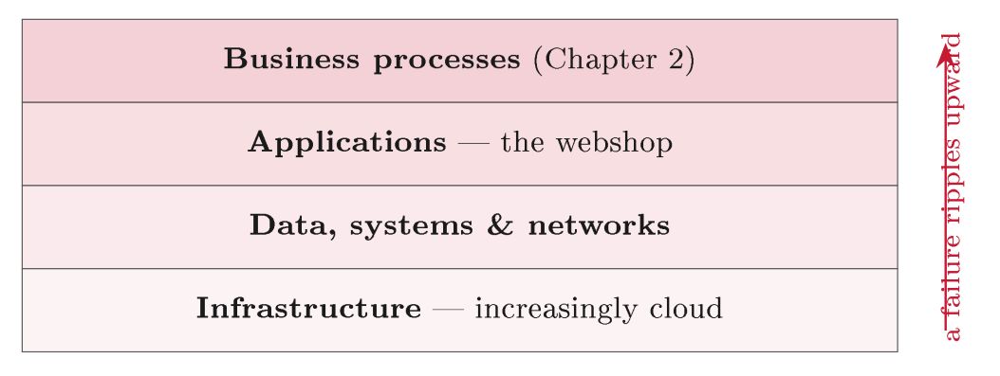
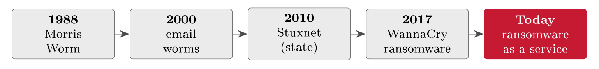
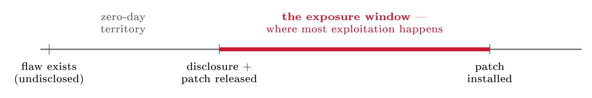
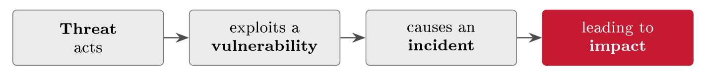

# Cyber risk and information assets {#sec-04-cyber-risk-and-information-assets}

The management system of Chapter 3 runs on knowing what it protects. Block II
opens by supplying exactly that: This chapter zooms in on the specific things
the business depends on. Everything in security ultimately protects an asset,
and in our world the most valuable assets are made of information; so we begin
with what an information asset actually is, deepen the CIA triad from Chapter 1
into a working instrument, and then turn to the other side --- the threat
actors, the routes they take, the malware they use, and the weaknesses they
exploit. From there we follow the chain from a threat all the way to its
business impact, and close with classification: The discipline that turns a flat
inventory of assets into a set of protection priorities. By the end of the
chapter you hold the complete raw material of risk, ready for the legal duties
of the coming chapters and the assessment methods of Block III.

## Information assets {#sec-04-information-assets}

::: {#def-asset}
## Information asset

An information asset is anything involving information that has value to the
organisation and therefore needs protecting: The data itself, and the systems,
services and people that handle it. Its value is measured by what its loss,
corruption or exposure would cost the business.
:::

The key shift in this definition is to see the information itself as the asset,
not merely the computer it sits on. A stolen laptop is a few hundred kroner of
hardware; the customer data on it can be a catastrophe. Security did not always
think this way --- early security guarded the machines and the rooms they sat
in, because the machines were the expensive part --- but as data became the real
value, the focus moved to the information, and "information security" names
exactly that shift in what we protect. The move is more consequential than it
sounds: Once information is the asset, you can value it, classify it, and decide
how hard to protect each piece, which is what the rest of this chapter does.

Information assets come in several forms, and a good inventory captures all of
them, not just the obvious databases (@tbl-assettypes). Notice that
people and the services FastGoods depends on are assets too: An inventory that
lists only databases will miss the payment provider the shop cannot sell
without, and the single member of staff who knows how it all runs.

::: {#tbl-assettypes}
  **Type**                    **FastGoods example**
  --------------------------- --------------------------------------
  Data                        The customer database; order records
  Software                    The webshop application
  Hardware & infrastructure   Servers, the cloud environment
  Services                    The payment and email services
  People & knowledge          Staff who know how it all runs

  : Types of information asset. Missing a category is how critical things go
  unprotected --- people and depended-on services are assets just as much as
  data and machines.
:::

Information assets do not float free; they sit on layers of technology that the
business depends on, and understanding the layering shows how a failure low down
ripples all the way up (@fig-ictstack). The business processes of
Chapter 2 run on applications; the applications run on data, systems and
networks; and all of it sits on infrastructure, increasingly in the cloud
(Lecture 19). These are the platforms your *Cloud Security* course took apart
layer by layer, and its shared-responsibility model returns here as a supplier
question. When FastGoods' cloud infrastructure fails, the application fails, the
order process stops, and the business loses sales --- one failure cascading
upward. Seeing these layers is how you trace a technical fault to its business
impact, and it is the connection that makes "an IT problem" and "a business
problem" the same problem seen from two ends.

{#fig-ictstack}

::: {#def-owner}
## Asset inventory and asset owner

An asset inventory records each asset, what it is, and how critical it is. Every
asset is given an *owner*: The person accountable for its protection. Ownership
is a question of answerability, not of custody --- the owner may not be the
person who happens to operate the asset day to day.
:::

You cannot protect assets you have not written down, so the inventory is the
practical starting point --- built, naturally, from the value chain and
processes of Chapter 2, which is where the assets were surfaced. The owner of
FastGoods' customer database is whoever is accountable for protecting it, which
may not be the IT person who runs it; and that named accountability is the hook
the whole management system later hangs controls on (Lectures 4 and 13). An
asset without an owner is an asset nobody answers for, and it shows.

## The CIA triad, in depth {#sec-04-the-cia-triad-in-depth}

We met the triad in Chapter 1 (@def-cia); now we take it apart properly,
starting with where it came from. The three properties were not invented in a
single moment; they came together over decades as the agreed heart of
information security, and each has roots in a different older concern.
Confidentiality grew from the world of military and government secrecy;
integrity from data processing and accounting, where a wrong figure is as bad as
a missing one; availability from the reliability engineering of computer
systems. Together they became the standard way to describe --- and to test ---
whether information is secure.

*Confidentiality* means that information is available only to those authorised
to see it. It is the property most people first associate with security, it is
protected by access control, encryption and the need-to-know principle, and its
breach is disclosure to the wrong people. For FastGoods, confidentiality is what
risk R3 threatens: A breach of the customer database exposes personal data to
people who should never see it --- and it is the property the GDPR (Lecture 7)
is most concerned with.

*Integrity* means that information is accurate, complete and unaltered except by
authorised means, and it deserves a definition of its own because it splits
usefully in two.

::: {#def-integrity}
## Data and system integrity

*Data integrity* is the property that the data itself is correct --- not altered
or corrupted. *System integrity* is the property that the system behaves as
intended --- not tampered with. Both are needed: Correct data in a manipulated
system is no safer than corrupted data in a sound one.
:::

Integrity is often overlooked, yet corrupted data can be more dangerous than
data that is merely stolen, because integrity failures are quiet. If an attacker
silently changed prices or order quantities in FastGoods' database, nothing
would look "stolen" --- and the business would be making wrong decisions on bad
data for as long as nobody noticed. For an online shop the related properties
from Chapter 1 return here with force: Authenticity and non-repudiation are what
let FastGoods prove that a customer really placed an order, which is integrity
applied to transactions rather than tables.

*Availability* means that information and systems are there when they are
needed. It is threatened by outages, overload and denial-of-service attacks, and
protected by redundancy, capacity and resilience (Lecture 12). For many
organisations it is the property whose failure is felt first and most directly,
and FastGoods is one of them: Risk R2 --- a denial-of-service attack on the
checkout --- stops customers buying, and revenue stops with it. An hour of
downtime here is an hour of lost sales, felt immediately. The same three-way
reading works on the nearest asset a student owns: A thesis file has modest
confidentiality, high integrity --- a silently corrupted file is worse than a
lost one, because you keep working on it --- and an availability that turns
critical the night before the deadline. One file, three properties: Chapter 1's
exercise, personalised.

One honest complication closes the tour: The three properties pull against each
other, so you cannot simply maximise all of them at once. Tighter
confidentiality --- more checks, more approvals --- can reduce availability;
strong availability --- many copies, in many places --- can widen the
confidentiality risk. The right balance depends on the asset and the business:
For a public product page, availability counts for far more than
confidentiality; for the customer database, the priority is the reverse. Naming
which property dominates for each asset is a key part of categorising it, which
is exactly where this chapter ends (@sec-04-categorising-the-assets).

::: {.callout-tip}
## Finding the risk: On one asset

The asset itself is a source of risks, read backwards. Take one line of
FastGoods' picture --- the customer database, confidentiality high. If
confidentiality is what this asset most needs, then *loss of confidentiality* is
what can go wrong here: The data gets out. That one sentence, dressed later in
the full pattern of Chapter 8, is R3. An asset's CIA priorities are its
candidate risks, pre-sorted; you only have to turn each priority around and ask
what its loss looks like.
:::

## Threats and vulnerabilities {#sec-04-threats-and-vulnerabilities}

A risk needs both a threat and a vulnerability, and the distinction from Chapter
1 (@def-vocab) now earns its keep. A threat is something that could
cause harm --- an actor or an event; a vulnerability is a weakness the threat
could exploit; and a risk is the chance and impact of the threat exploiting the
vulnerability. The two only become a risk when they meet: A hacker is only a
risk to FastGoods because logins lack multi-factor authentication --- fix the
weakness and the same threat counts for far less, even though the hacker is
still out there. Risk lives in the meeting of the two, which is why we manage
both sides.

Behind most deliberate threats is a person or group with a motive, and they are
not all the same (@tbl-actors). Knowing who you are defending against
shapes which threats are realistic: For a shop like FastGoods, the realistic
threat is mostly profit-driven cyber-criminals and the occasional careless
insider, not nation-states. Matching the actor to the organisation keeps a risk
assessment honest rather than alarmist --- a small webshop that plans its
defences around foreign intelligence services has misread its own threat
picture, and will spend accordingly badly.

::: {#tbl-actors}
  **Actor**         **Motivation**          **Typical aim**
  ----------------- ----------------------- ----------------------
  Cyber-criminals   Money                   Ransomware, fraud
  Insiders          Grievance, mistakes     Leaks, sabotage
  Nation-states     Espionage, disruption   Stealth, persistence
  Hacktivists       A cause                 Disruption, exposure

  : Threat actors and what drives them. Matching the actor to the organisation
  is what keeps a risk assessment honest --- FastGoods' realistic adversary is
  the profit-driven criminal, not the intelligence service.
:::

The threat side also has a history, and it explains why the adversary today is
organised crime rather than lone pranksters (@fig-evolution). The 1988
Morris Worm was experimental, written with no profit motive at all. Around 2000,
mass email worms such as ILOVEYOU showed how fast malicious code could spread
through an ordinary inbox. In 2010, Stuxnet demonstrated something new again: A
nation-state building malware to sabotage specific industrial systems. By 2017
the WannaCry epidemic had made ransomware a household word --- and today the
model is ransomware-as-a-service, a professional criminal market with
developers, affiliates and support desks. The trend across four decades is
unmistakable: Cybercrime has become an organised, profitable industry, and
defence has to assume professional opponents.

{#fig-evolution}

::: {#def-vector}
## Attack vector

An attack vector is the route by which a threat actually reaches an asset.
:::

Most real breaches come through a small number of well-worn routes rather than
exotic techniques: Phishing, which tricks a person into opening the door
(Lecture 14); the exploitation of unpatched software vulnerabilities; stolen
credentials, which let the attacker simply log in as a real user; and the supply
chain, coming in through a trusted supplier (Lecture 19). For FastGoods the most
likely vector is phishing or stolen credentials leading to account takeover (R1)
--- not a sophisticated zero-day, the industry's name for a flaw with no patch
yet. Knowing the common vectors tells you where to put your first and strongest
defences.

::: {#def-malware}
## Malware

Malware is malicious software. Its families are distinguished by how they spread
and what they do: A *virus* attaches to a file and spreads when it is run; a
*worm* spreads by itself across networks; a *trojan* hides inside something that
looks legitimate; *ransomware* encrypts data and demands payment; *spyware*
secretly gathers information.
:::

The names are worth keeping apart because each family calls for a different
defence --- a worm is stopped by patching and network hygiene, a trojan by
scepticism about what is installed, ransomware by backups above all. Ransomware
is the family most likely to threaten a business like FastGoods today,
encrypting the data the business runs on; and with the double extortion now
standard --- steal the data first, then encrypt it --- it attacks availability
and confidentiality at once.

::: {.callout-note}
## Real-world case: WannaCry, 2017

In May 2017 the WannaCry ransomware spread as a worm across the world, hitting
hundreds of thousands of machines in some 150 countries within days. In the UK
it disrupted the National Health Service: Hospitals cancelled appointments and
diverted patients while systems were down. Two facts give the case its lasting
lesson. First, WannaCry spread through a Windows vulnerability for which a patch
had been available for around two months --- the machines that fell were the
unpatched ones, so the failure was as much process (patching discipline) as
technology. Second, the harm was chiefly to availability: Little data was
stolen, yet operations stopped, which is precisely the kind of impact a shop
like FastGoods would feel first. An epidemic-scale incident, traced back to a
single well-known weakness left open.
:::

WannaCry also illustrates a structural clock that runs on every technical
vulnerability (@fig-vulnwindow). From the moment a flaw is disclosed and
a patch released, two races start: Defenders race to install the patch,
attackers race to weaponise the now-public flaw --- and the window between patch
availability and patch installation is where most real-world exploitation
happens. Zero-days --- flaws exploited before any patch exists --- get the
headlines; the unpatched-but-patchable window gets the victims. That is why
patch discipline is a process control as much as a technical one, and why "a
patch existed" is the sentence that opens so many incident reports.

{#fig-vulnwindow}

Which brings us to the weaknesses themselves. Vulnerabilities are not only flaws
in software; they live in three places, and a complete view has to cover all of
them. *Technical* vulnerabilities are the familiar kind: Unpatched software,
weak configuration, missing encryption --- the known ones are catalogued
publicly as CVEs and scored for severity by CVSS, the practitioner's standard
references. *Process* vulnerabilities are gaps in how the organisation works: No
joiner/leaver routine, no backups, no review of who has access. *Human*
vulnerabilities are the oldest of all: Weak and re-used passwords, falling for
phishing, honest mistakes. FastGoods' risk R1 is a mix --- a technical gap (no
multi-factor login) and a human one (re-used passwords) --- and that is typical:
Most real incidents combine weaknesses across all three categories, so a defence
that covers only one of them is a defence with two open flanks (Lectures 13 and
14 take the process and human sides in depth).

## From threat to impact {#sec-04-from-threat-to-impact}

A threat is only a problem because of the harm it can ultimately cause the
business, so the last analytical step is to follow the chain all the way
(@fig-incidentchain): A threat acts, exploits a vulnerability, causes an
incident, and the incident leads to impact. The chain is worth drawing because
every link is a chance to intervene --- prevent the threat, close the
vulnerability, detect the incident early, or limit the impact afterwards ---
which is exactly why preventive, detective and corrective controls are used
together (@tbl-controls of Chapter 1). An incident is rarely a single
event; it is a chain, and a chain can be broken at several points, not just the
first.

{#fig-incidentchain}

Once the incident can be described, the risk can be sized, and the formula is
the one from Chapter 1: Likelihood times impact. The two factors must be kept
apart, because rare-but-catastrophic and frequent-but-minor are different risks
demanding different treatment. A customer-data breach (R3) at FastGoods is
perhaps not the most likely incident on the list, but its impact is so high that
it still ranks as a serious risk --- Block III turns this judgement into a full
method, with the risk matrix of Lecture 8 and the quantitative refinements of
Lecture 20.

Impact itself takes more forms than the word suggests. When people hear "impact"
they think of money, but the harm from an incident arrives in four currencies
(@tbl-impact), and a full risk picture weighs all of them. A breach at
FastGoods is not just the cost of fixing it: It is lost trust, possible fines,
and a duty to notify --- and the reputational and legal impacts often outlast
and outweigh the immediate financial loss (Lecture 7 returns to the legal side
in depth).

::: {#tbl-impact}
  **Type of impact**   **FastGoods example**
  -------------------- -------------------------------------
  Financial            Lost sales, recovery costs, fines
  Operational          The business cannot run
  Reputational         Customers lose trust and leave
  Legal & regulatory   GDPR penalties, breach notification

  : Types of impact. The reputational and legal harm from an incident often
  outlasts and outweighs the immediate financial loss.
:::

::: {#exm-ransomware}
## Ransomware at FastGoods, end to end

To see the whole chapter working at once, follow one realistic incident from
start to finish. A staff member opens a phishing attachment --- the vector. The
attachment installs ransomware, which encrypts the order and customer data ---
the malware family. Availability is lost at once: The checkout is down, which is
risk R2 in action; and if the data was copied out before it was encrypted,
confidentiality has gone too, which is R3. The impact then arrives in all four
currencies: Lost sales while the shop is dark, recovery costs, a possible fine
and a duty to notify under the GDPR, and customers quietly deciding whether to
come back. One email links the vector, the malware family, the CIA properties
and the impact types of this whole chapter --- and, scaled up by three orders of
magnitude, it is the Norsk Hydro story of Chapter 1.
:::

## Categorising the assets {#sec-04-categorising-the-assets}

With assets, properties and threats understood, the final step is to decide
which assets come first --- because not every asset deserves the same level of
protection, and pretending otherwise wastes money at one end and under-protects
at the other. Spending the same effort on the public product catalogue and the
customer database would do exactly that.

::: {#def-classify}
## Asset classification

Asset classification grades each asset into a level according to how sensitive
and critical it is --- how much its loss or disclosure would hurt --- so that
higher levels receive stronger, costlier protection. Classification is the
discipline of matching protection to value.
:::

The idea has a long pedigree: Governments and militaries have stamped documents
"Confidential", "Secret" and "Top Secret" for generations, and the familiar
commercial ladder --- *public* (no harm if disclosed), *internal* (for staff;
minor harm if leaked), *confidential* (real harm if disclosed), *restricted*
(serious harm; the tightest controls) --- is a civilian descendant of that
practice. The labels differ between organisations; the principle is constant:
Harder protection for more sensitive information. Applying the ladder to
FastGoods turns the whole chapter into a single, usable table
(@tbl-fgclass), and read down, FastGoods now knows exactly where to
concentrate its strongest controls: The customer database and the payment
credentials, not the public catalogue.

::: {#tbl-fgclass}
  **Asset**                **Classification**   **Why**
  ------------------------ -------------------- ---------------------
  Product catalogue        Public               Meant to be seen
  Internal pricing rules   Internal             Staff only
  Customer database        Confidential         Personal data (R3)
  Payment credentials      Restricted           Highest sensitivity

  : FastGoods' assets, classified. The table is the step from understanding
  assets to protecting them: The strongest controls go to the bottom rows, not
  the top.
:::

Pulled together, the owner and CIA columns of the template and the class column
of this section produce the artefact this chapter has been building toward: A
first asset register (@tbl-assetregister) --- five rows that the risk
assessment of Chapter 8 will pick up unchanged, which is the point of building
it now.

::: {#tbl-assetregister}
  **Asset**             **Owner**   **CIA priority**   **Class**
  --------------------- ----------- ------------------ --------------------
  Customer database     IT lead     C, I high          Confidential
  Order records         Ops         I high             Internal
  Webshop / checkout    Ops         A high             Internal (service)
  Payment credentials   Finance     C highest          Restricted
  Product catalogue     Marketing   A relevant         Public

  : FastGoods' first asset register: Owner, CIA priority and class in one table
  --- the artefact Chapters 8 and 13 pick up unchanged.
:::

A classification is only useful if it changes how an asset is actually handled,
so each level comes with handling rules: Who may access it, whether it is
encrypted, how long it is retained, how it is disposed of. Higher levels get
stronger controls and tighter access --- because FastGoods' customer database is
"confidential", it warrants encryption, strict access and careful disposal; the
label dictates the handling. And that is the direct hand-off into the rest of
the course: The classification drives the controls chosen and tailored in
Lectures 6 and 10, where these labels turn into concrete measures.

::: {#exm-newasset}
## A new asset arrives

Classification is a routine, not a one-off: When FastGoods adds a
customer-service chat to the webshop, the chat logs are a new information asset,
and the discipline of this chapter runs once more. The logs contain names, order
details and occasionally complaints about payments --- personal data, whose
disclosure would cause real harm --- so they are classified *confidential*. The
label dictates the handling: Access limited to the support team, a short
retention period, encrypted storage --- and an entry in the records the coming
lectures build, from the Statement of Applicability of Lecture 6 to the
processing record of Lecture 7. An asset that arrives without being classified
is an asset that gets protected by accident, if at all.
:::

##### Reading for this chapter.

Jøsang, Chapter 1 (basic concepts, pp. 1 ff.) and Chapter 2 (attack vectors and
malware, pp. 25 ff.); Edwards & Weaver, Chapter 2 (the landscape of
cybersecurity, pp. 19 ff.). Both books are available in the library and on the
Canvas course page.

## Summary {#sec-04-summary}

This chapter turned the business understanding of Chapter 2 into the raw
material of risk. What we protect are information assets (@def-asset)
--- the information and everything that handles it, valued by what its loss
would cost, recorded in an inventory with a named, accountable owner
(@def-owner). What "secure" means for each asset is the CIA triad taken
apart properly: Confidentiality rooted in secrecy, integrity in accuracy ---
split into data and system integrity (@def-integrity), and dangerous
precisely because its failures are quiet --- and availability in reliability,
the three pulling against each other so that each asset has a dominant property.
What threatens the assets is a cast of actors matched honestly to the
organisation, arriving along a few well-worn vectors (@def-vector),
often carrying malware (@def-malware) --- above all ransomware --- and
exploiting weaknesses that are technical, process and human at once, as WannaCry
demonstrated at epidemic scale. Harm arrives along the chain from threat to
impact, breakable at every link, sized as likelihood times impact, and felt in
four currencies of which the reputational and legal often cost most. And
classification (@def-classify) closes the loop: Grade the assets, let
the label dictate the handling, and the flat inventory becomes a set of
protection priorities.

The raw material of risk is on the table, and the management system of Chapter 3
has somewhere to point. What the law says an organisation *must* do with all of
this --- duties, reporting, and the Norwegian transposition of Europe's rules
--- is where Lecture 5, and the Digital Security Act, begin.

## Self-check {#sec-04-self-check}

Try these before the next lecture.

::: {#exr-04-the-stolen-laptop}
## The stolen laptop

Explain why the information, not the hardware, is the asset in the stolen-laptop
example, and what that changes about how the loss should be valued.
:::

::: {#exr-04-the-dominant-property}
## The dominant property

For FastGoods' product catalogue, its order records, and its checkout, name the
CIA property that dominates for each, and one control that protects it.
:::

::: {#exr-04-threat-vulnerability-risk-kept-apart}
## Threat, vulnerability, risk --- kept apart

Using FastGoods' risk R1, explain what happens to the risk when the
vulnerability is fixed, why the threat itself is unchanged, and why this
distinction justifies managing both sides.
:::

::: {#exr-04-the-incident-chain-interrupted}
## The incident chain, interrupted

Lay out the phishing-to-ransomware incident of @exm-ransomware as the
four-link chain of @fig-incidentchain, and name one intervention at each
link.
:::

::: {#exr-04-classify-and-handle}
## Classify and handle

Classify FastGoods' supplier price lists and its customer database on the
four-level ladder, justify each level in one sentence, and give one handling
rule that follows from each label.
:::
