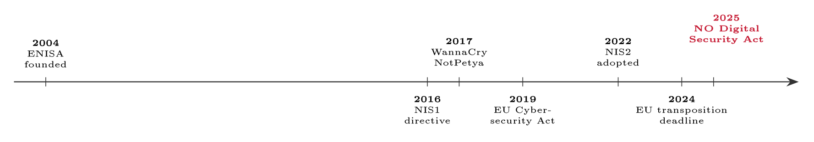

# The Digital Security Act and NIS2 {#sec-05-digital-security-act-and-nis2}

Lecture 3 gave you the management system an organisation may choose; this
chapter is about the law that increasingly removes the choice. Cybersecurity has
become a matter of binding regulation for critical services across Europe, and
the chapter answers four questions in turn: Why states regulate security at all;
what the EU's central directive, NIS2, actually demands; what is in force in
Norway today - which, importantly, is *not* NIS2 - and how the overlapping
regimes fit together for one organisation. By the end you should be able to
determine whether a law applies to a given organisation, read the NIS2 reporting
clock, and explain Norway's position precisely, which is a nuance many
practitioners get wrong.

## From good practice to legal duty {#sec-05-from-good-practice-to-legal-duty}

Start with the distinction that frames the whole chapter. A standard such as ISO
27001 is voluntary: You choose to adopt it, certification is a market signal,
and it represents best practice, not a duty. A law is mandatory if it applies to
you, non-compliance brings sanctions, and it sets a minimum enforced by the
state. The two reinforce each other - laws increasingly expect exactly the
kind of systematic security a standard provides, so the standard becomes the way
you meet the law - but they must never be confused: One is how, the other is
whether.

Why does the state step in at all? Because when one company's weak security can
harm everyone, voluntary good intentions stop being enough. The logic is the
same as for food safety or aviation: Where a private failure creates public
risk, the state regulates. Three arguments recur. Society now depends on digital
services - power, payments, health, transport. One organisation's breach can
cascade into others: Systemic risk. And firms under-invest in security when they
bear only part of the cost of failure - a market failure in the economist's
plain sense. Left to the market alone, security is often "good enough for me"
but not for society; regulation raises the floor for everyone who relies on
critical services.

The argument was not won in seminar rooms but by incidents. WannaCry (2017)
crippled hospitals and firms worldwide (Chapter 4's case box); Colonial Pipeline
(2021) showed one ransomware attack shutting down major fuel supply; Norsk Hydro
(2019) gave Norway its own exhibit (Chapter 1). And one incident above all made
the case for *cross-border* rules:

::: {.callout-note}
## Real-world case: NotPetya, 2017

In June 2017 a destructive malware later called NotPetya spread from a poisoned
update of a Ukrainian accounting package - a supply-chain entry point - and
tore across the world within hours. It looked like ransomware but was built to
destroy; among many victims, the shipping giant Maersk lost tens of thousands of
machines in minutes, halted operations at ports worldwide, and put the damage at
roughly \$300 million, while total global damages were estimated around ten
billion dollars. Two lessons drove the lawmaking that followed. First, digital
incidents ignore borders and sectors: A Ukrainian tax-software update stopped
ships in Rotterdam and factories in Tasmania, so patchy national rules cannot
contain them. Second, the entry point was a *trusted supplier* - which is why
supply-chain security appears by name in NIS2's Article 21.
:::

## The EU machinery: Institutions, and how a law reaches you {#sec-05-the-eu-machinery-institutions-and-how}

European cyber regulation built up over two decades, institutions first and laws
after, tightening with each wave of incidents (@fig-euline). The EU's
cybersecurity agency ENISA was founded in 2004 (as the European Network and
Information Security Agency) but long lacked permanent status; the EU
Cybersecurity Act of 2019 - an EU regulation which, as Jøsang remarks, might
more honestly have been called "the ENISA Act" - gave the agency a permanent
mandate, tasked it with assisting member states in cross-border incident
management and capacity building, and established an EU-wide framework for
voluntary certification of ICT products and services (Jøsang, §17.4.3, p. 365).
Alongside sits EU-CyCLONe, the network that coordinates response to large,
cross-border cyber crises. The first binding security law, the NIS Directive,
arrived in 2016; NIS2 was adopted in December 2022 and entered into force in
January 2023, with member states required to transpose it by October 2024; and
Norway's own Digital Security Act took effect on 1 October 2025 - of which
more below.

{#fig-euline}

How an EU law reaches an organisation depends on its legal form, and the
distinction decides much of this chapter.

::: {#def-regdir}
## Regulation and directive

An EU *regulation* is directly binding across the Union and applies as-is, with
no national law needed - the GDPR and DORA are regulations. An EU *directive*
sets a goal each member state must achieve, and every state writes its own
national law to implement it - NIS2 is a directive (Jøsang, §17.4.1, p. 363).
:::

::: {#exm-regdirNO}
## Why the GDPR needed no Norwegian twin - and NIS2 does

The distinction is visible from Norway. The GDPR, a regulation, applies in
substance as one uniform text - Norway's Personal Data Act essentially gives
it effect rather than rewriting it. NIS2, a directive, is not a law anyone can
be fined under directly: It must first be turned into national law, state by
state - which is why the EU set a transposition deadline (October 2024), why
several member states were late and some were referred to the EU court, and why
Norway's own story runs through a separate national act. When you read that an
organisation "must comply with NIS2", the precise statement is that it must
comply with the national law implementing NIS2 - and in Norway, as
@sec-05-norway-the-digital-security-act shows, that national law does
not exist yet.
:::

The reason NIS2 exists at all is that the first attempt fell short. NIS1 (2016)
was, in Jøsang's blunt phrase, "quite limited in scope", so the EU revised it
(Jøsang, §17.4.2, p. 364) - and the revision is dramatic
(@tbl-nis1nis2): From about seven sectors to eighteen, from roughly ten
thousand entities in scope to around one hundred and sixty thousand, from
loosely defined reporting to a strict staged clock, and from near-silence on
management to personal accountability.

::: {#tbl-nis1nis2}
                      **NIS1 (2016)**                 **NIS2 (2022)**
  ------------------- ------------------------------- --------------------------------
  Sectors             About 7                         18
  Entities in scope   ≈                      10 000   ≈                      160 000
  Reporting           Loosely defined                 Strict 24--72--one-month clock
  Management          Little said                     Personally accountable

  : From NIS1 to NIS2. The first directive was "quite limited in scope"
  (Jøsang); the second widens the sectors, tightens reporting, and makes
  management personally accountable.
:::

## NIS2: Scope and duties {#sec-05-nis2-scope-and-duties}

::: {#def-entities}
## Essential and important entities

NIS2 sorts covered organisations into two tiers with largely the same duties but
different oversight: *Essential entities*, in the most critical sectors, face
proactive supervision and the higher fines; *important entities* face reactive
supervision and lower fines. A general size rule brings in medium and large
organisations - roughly fifty or more staff or EUR 10 million or more in
turnover (Directive (EU) 2022/2555, Art. 3).
:::

The sector expansion is what makes NIS2 land on ordinary businesses rather than
only power plants: Essential sectors include energy, transport, banking, health,
drinking and waste water, digital infrastructure and ICT services, public
administration and space; important sectors include postal and courier services,
waste management, manufacturing (including medical and tech), food, chemicals
and research. Eighteen sectors is why NIS2 reaches roughly sixteen times as many
organisations as NIS1 - many of them companies that have never thought of
themselves as critical infrastructure.

Strip the directive to its essentials and four duties remain: *Govern* -
management approves and oversees security (Article 20); *protect* - implement
the baseline risk measures (Article 21); *report* - notify significant
incidents on the clock (Article 23); and *submit to oversight* - supervision,
audits and sanctions. Everything else in the directive elaborates these four.

Article 21 requires an "all-hazards" set of baseline measures - protection
against cyber, physical, environmental and human threats alike - and reads
like this course's table of contents made legally binding (@tbl-art21):
Risk analysis and security policies, incident handling, business continuity and
backup, supply-chain security, cyber hygiene and training, cryptography, access
control and multi-factor authentication. Every row is a topic we cover; NIS2
makes them required.

::: {#tbl-art21}
  **Measure (Article 21)**            **Covered in this course**
  ----------------------------------- ----------------------------
  Risk analysis & security policies   Lectures 8--11, 15
  Incident handling                   Lecture 12
  Business continuity & backup        Lecture 12
  Supply-chain security               Lecture 19
  Cyber hygiene & training            Lecture 14
  Cryptography; access control; MFA   Lectures 10, 17

  : NIS2's Article 21 baseline, mapped onto the course. "All hazards" means
  cyber, physical, environmental and human threats alike.
:::

Read the table backwards and it becomes something else again: A list of risks
the legislator has already found for you. "Business continuity and backup" names
the risk of not being able to recover; "supply-chain security" names NotPetya's
entry route; "access control and MFA" names R1. Every requirement in this
chapter is a risk in reverse - the fourth source of Chapter 1's box, writ
large: Risks already found and written down, here by the legislator rather than
an auditor.

Article 23 sets the reporting clock, and it is strict and staged
(@fig-clock): An early warning within 24 hours of becoming aware of a
significant incident, a fuller notification within 72 hours, and a final report
within one month, all to the national CSIRT or competent authority. Late
reporting is itself a breach - an early warning at hour 30 is non-compliant,
however good the eventual report.

{#fig-clock}

What counts as *significant* is defined, not felt: An incident is significant
when it has caused, or can cause, substantial operational disruption or
financial loss to the entity, or has affected, or can affect, other natural or
legal persons by causing considerable damage (Art. 23(3)). The definition does
two jobs at once: It filters the noise - not every blocked scan is reportable
- and it removes the temptation to argue an obvious incident under the bar.
The judgement is made under pressure, which is one more thing the preparedness
plan of Lecture 12 settles in advance.

Two further provisions give the directive its teeth. Article 20 makes security a
named duty of senior management, not just IT: The management body must approve
and oversee the risk measures, must itself take security training - ignorance
is no defence - and can be held personally liable, with regulators even able
to suspend managers in serious cases. This is the legal force behind the board's
role and the three lines of defence (Lecture 11): Accountability for
cybersecurity placed squarely, and personally, at the top. And the sanctions are
GDPR-scale: For essential entities up to EUR 10 million or 2 % of global
turnover, whichever is higher; for important entities up to EUR 7 million or
1.4 % - with proactive supervision for the first tier and reactive for the
second. Finally, Article 21 makes you responsible for your suppliers' security,
not only your own walls - a direct response to incidents such as SolarWinds
(2020) and Log4Shell (2021), where attackers reached thousands of victims
through a single trusted vendor or component, and the theme Lecture 19 takes in
depth.

## Norway: The Digital Security Act {#sec-05-norway-the-digital-security-act}

Now the nuance this chapter exists to teach, because it is the part
practitioners most often get wrong: Norway is not in the EU, and what is in
force in Norway today is *not* NIS2.

Norway takes part in the internal market through the EEA agreement, and EU
digital law reaches it by incorporation: A directive applies only once it has
been judged EEA-relevant and taken into the agreement, and the three EEA states
- Iceland, Liechtenstein and Norway - decide together whether an EU act
shall apply, all or none (Jøsang, §17.4.1, pp. 363--364). The practical
consequence is timing: Norway usually implements EU cyber law later than the EU
states themselves, on the EEA's timetable rather than Brussels'.

What Norway has enacted is the Digital Security Act (*digitalsikkerhetsloven*):
Adopted in 2023, in force since **1 October 2025** with an accompanying
regulation - and it implements NIS1, the *first* directive, not NIS2. Its
structure follows NIS1 exactly: It covers *operators of essential services* -
energy, transport, health, water, banking and financial markets, digital
infrastructure - and *digital service providers* - online marketplaces,
search engines and cloud services - rather than NIS2's
essential-versus-important tiers, so its scope is narrower than NIS2's. The
duties mirror NIS1: Put in place appropriate, risk-based security measures and
document them; notify significant incidents to the authorities and the national
response team; and submit to supervision by the Norwegian National Security
Authority (NSM) and the sector authorities. In practice the Norwegian chain has
three stations: The entity reports to its sector authority and to the national
CSIRT function - NorCERT, within NSM - the sector authority supervises
within its domain, and NSM coordinates across sectors. The structure is
inherited from how Norwegian supervision is organised generally: Sector first,
national coordination above. The approach is function- and risk-based -
document your own risk assessment - which is exactly why an ISO 27001 ISMS
(Lecture 3) maps onto the Act almost directly.

And NIS2 itself? It has not yet been incorporated into the EEA agreement, so it
is not yet Norwegian law and the timeline is not fixed - though Norway has
woven some NIS2-style elements into its current rules, and NIS2 can be expected
to follow, likely alongside the related CER directive on physical resilience.
The direction of travel is clear, so the sound advice is to prepare now rather
than wait for the formal date: Build to NIS1 obligations, plan for NIS2. It also
helps to keep Norway's three digital-security laws apart, because they are easy
to confuse (@tbl-nolaw): The Digital Security Act protects services, the
Security Act (*sikkerhetsloven*) protects the nation, and the Personal Data Act
protects people's data - an organisation may sit under all three at once.

::: {#tbl-nolaw}
  **Law**                            **Purpose**                     **Applies to**
  ---------------------------------- ------------------------------- ---------------------------------
  Digital Security Act               Resilience of services (NIS1)   Essential & digital services
  Security Act (*sikkerhetsloven*)   National security               Entities critical to the nation
  Personal Data Act                  Privacy (GDPR)                  Anyone handling personal data

  : Three Norwegian laws, three purposes: Services, the nation, and people's
  data. One organisation can be under all three.
:::

::: {#exm-scopecheck}
## Is FastGoods in scope?

The first GRC task with any law is always the same: Determine whether it applies
(scope), then run a gap analysis against its requirements (Lecture 13). For
FastGoods the scope question is genuinely close. As an online shop it could be
argued to be an *online marketplace*, and thus a digital service provider under
the Act; but scope also turns on size thresholds, and a twenty-five-person
company sits near the small end of them. Suppose the analysis concludes
FastGoods is out of scope today. The work was still not wasted, for three
reasons: The conclusion must be documented and revisited as the company grows;
larger customers increasingly impose the same duties by contract regardless of
the law (compliance arriving through the supply chain, as in Chapter 1's PCI DSS
example); and NIS2, when it reaches Norway, will widen the net - so the shop
that prepared to NIS1 discipline crosses that line ready. Scope determination is
never "does the law excite us" but a documented legal judgement, refreshed as
the facts change.
:::

## One incident, several regimes {#sec-05-one-incident-several-regimes}

NIS2 and the Digital Security Act sit among overlapping regimes, and the map is
worth one table (@tbl-threeregimes): NIS2 protects the security of
essential services and is a directive with broad sectoral reach; DORA protects
the operational resilience of the financial sector specifically and is a
regulation, applying since January 2025 (Lecture 15); the GDPR protects personal
data and privacy and is a regulation that applies to nearly everyone (Lecture
7). For a bank, DORA's specific rules take precedence over NIS2; the GDPR runs
alongside both - and one incident can trigger several reporting duties at
once, which is exactly why the preparedness plan of Lecture 12 must know all the
clocks in advance.

::: {#tbl-threeregimes}
  **Regime**   **Protects**                               **Type & reach**
  ------------ ------------------------------------------ -----------------------------
  NIS2         Security of essential services             Directive, broad sectors
  DORA         Financial-sector resilience (Lecture 15)   Regulation, finance only
  GDPR         Personal data & privacy (Lecture 7)        Regulation, nearly everyone

  : Three regimes, three focuses - complementary, not interchangeable. One
  incident can fall under several at once.
:::

Two neighbours of NIS2 deserve their own paragraphs before the map closes. DORA,
the financial sector's regulation, applying since January 2025, stands on five
pillars: ICT risk management; ICT incident reporting; digital operational
resilience testing - up to threat-led penetration testing for the largest
players; management of ICT third-party risk, including direct oversight of
critical providers; and arrangements for information sharing. The family
resemblance is the thing to notice: The same govern--protect--report--test
skeleton as NIS2, specialised and sharpened for finance - which is why Lecture
15 can treat DORA as NIS2's stricter sibling rather than a new world. And CER,
the Critical Entities Resilience directive adopted alongside NIS2, covers the
physical side of the same coin - the resilience of critical entities against
non-cyber threats, from sabotage to natural hazards - so a future Norwegian
implementation round should be expected as a pair: NIS2 for the digital, CER for
the physical.

::: {#exm-ddosclock}
## A FastGoods DDoS on the clock

Assume, for the exercise, that FastGoods is in scope of a NIS-style reporting
duty when risk R2 strikes. Hour 0: The checkout goes down and the team confirms
a denial-of-service attack - the clock starts the moment the company becomes
aware. Within 24 hours: An early warning goes to the authority and the response
team - short, honest, "we are under attack, availability is impaired". Within
72 hours: The notification proper - severity, impact, what is known so far.
Within one month: The final report - root cause, and the lessons feeding the
preparedness plan (Lecture 12). Notice what makes this achievable at all:
Nothing in those four rows can be invented during the incident. The contact
points, the templates, the decision of who signs - all of it exists in advance
or the clock is missed. Reporting duties are met in the preparation, not in the
panic.
:::

One closing principle, easily said and constantly violated: Compliance is a
baseline, not a target. The law sets a floor defined for everyone in your
situation; real threats do not stop at the legal minimum, and a real risk
assessment usually pushes well above it. A standard like ISO 27001 is how many
organisations meet *and* exceed the floor - aim to be secure, and compliance
follows; organisations that chase only compliance are usually the least secure.
It is the same warning as Chapter 1's "compliant but insecure", now with fines
attached.

##### Reading for this chapter.

Jøsang, Chapter 17, especially §17.4 (Europe: EU regulation, the NIS2 directive
and the Cybersecurity Act, pp. 362--366), with Chapter 19 (cyber risk
management, pp. 405 ff.) as background; Edwards & Weaver, Chapter 17
(international cybersecurity laws and regulations, pp. 299 ff.). Both books are
available in the library and on the Canvas course page.

## Summary {#sec-05-summary}

A standard is chosen; a law applies - and cybersecurity became law because
private failures create public risk: Systemic dependence, cascading incidents,
and under-investment where firms bear only part of the cost, with NotPetya
(2017) as the exhibit that made the cross-border case. The EU built machinery
over two decades - ENISA (2004, made permanent by the 2019 Cybersecurity Act),
EU-CyCLONe, NIS1 in 2016 - and how a law reaches you turns on the
regulation/directive distinction (@def-regdir). NIS2, adopted 2022,
replaced a NIS1 that was "quite limited in scope": Eighteen sectors, two tiers
of entities (@def-entities), the all-hazards baseline of Article 21, the
24--72--one-month clock of Article 23, personal management accountability under
Article 20, and fines up to EUR 10 million or 2 % of turnover. The Norwegian
nuance is the chapter's heart: The Digital Security Act, in force 1 October
2025, implements NIS1 - operators of essential services and digital service
providers, supervised by NSM - while NIS2 awaits the EEA process; and three
Norwegian laws with three purposes must be kept apart. Overlaid on it all run
DORA and the GDPR, so one incident can start several clocks - met in the
preparation, never in the panic - and compliance remains a floor, not a
target.

The duties of this chapter say *that* FastGoods must secure itself, risk-based
and demonstrably. What the concrete options are - the control catalogues, and
the Statement of Applicability that records the choices - is where Lecture 6
begins; the law protecting the people behind the customer accounts, the GDPR,
follows in Lecture 7.

## Self-check {#sec-05-self-check}

Try these before the next lecture.

::: {#exr-05-why-regulate-at-all}
## Why regulate at all

Give the three standard arguments for regulating cybersecurity, and illustrate
each with one of the incidents named in this chapter.
:::

::: {#exr-05-regulation-or-directive}
## Regulation or directive

Classify the GDPR, DORA and NIS2 as regulations or directives, and explain what
the classification means for how each reaches a Norwegian organisation.
:::

::: {#exr-05-the-norwegian-nuance}
## The Norwegian nuance

A consultant tells FastGoods: "NIS2 has applied in Norway since October 2025."
Correct the statement precisely - what *is* in force, what it implements, and
where NIS2 actually stands.
:::

::: {#exr-05-the-clock-applied}
## The clock, applied

An in-scope company detects a significant ransomware incident on Tuesday at
09:00. State the three Article 23 deadlines as concrete times/dates, and name
two things that must exist *before* the incident for the deadlines to be met.
:::

::: {#exr-05-floor-versus-target}
## Floor versus target

Explain, in three sentences, why "we are fully compliant" is not the same as "we
are secure" - and how an ISO 27001 ISMS relates to both claims.
:::

::: {#exr-05-sectors-interactive}
## In scope or not? Interactive

Select the sectors NIS2 covers as essential or important.

```{=html}
<div class="grc-ex" data-type="pick">
<script type="application/json">
{
 "options": [
  {
   "t": "Energy",
   "ok": true
  },
  {
   "t": "Transport",
   "ok": true
  },
  {
   "t": "Health",
   "ok": true
  },
  {
   "t": "Digital infrastructure",
   "ok": true
  },
  {
   "t": "Cloud providers",
   "ok": true
  },
  {
   "t": "A ten-person bakery",
   "ok": false
  },
  {
   "t": "A neighbourhood gym",
   "ok": false
  }
 ],
 "explain": "NIS2 reaches essential and important entities in listed sectors - energy to health to digital infrastructure - not every small business.",
 "ref": "sec-05-nis2-scope-and-duties",
 "reflabel": "NIS2: Scope and duties"
}
</script>
</div>
```
:::

::: {#exr-05-clock-interactive}
## The reporting clock, interactive

Order the notification duties an incident triggers under NIS2 and the Digital Security Act.

```{=html}
<div class="grc-ex" data-type="order">
<script type="application/json">
{
 "steps": [
  "Significant incident detected",
  "Early warning within 24 hours",
  "Incident notification within 72 hours",
  "Final report within one month"
 ],
 "explain": "The clock runs in three beats: Early warning in 24 hours, notification in 72, the final report within a month.",
 "ref": "sec-05-nis2-scope-and-duties",
 "reflabel": "NIS2: Scope and duties"
}
</script>
</div>
```
:::

::: {#exr-05-instrument-interactive}
## Regulation or directive? Interactive

Sort the EU instruments by how they reach you.

```{=html}
<div class="grc-ex" data-type="sort">
<script type="application/json">
{
 "buckets": [
  {
   "id": "reg",
   "label": "Regulation",
   "desc": "applies directly in every member state"
  },
  {
   "id": "dir",
   "label": "Directive",
   "desc": "transposed into national law first"
  }
 ],
 "chips": [
  {
   "t": "The GDPR",
   "b": "reg"
  },
  {
   "t": "DORA",
   "b": "reg"
  },
  {
   "t": "The AI Act",
   "b": "reg"
  },
  {
   "t": "NIS2",
   "b": "dir"
  },
  {
   "t": "The CER Directive",
   "b": "dir"
  }
 ],
 "explain": "A regulation applies directly in every member state; a directive must first be transposed - which is why Norway has the Digital Security Act.",
 "ref": "sec-05-the-eu-machinery-institutions-and-how",
 "reflabel": "The EU machinery"
}
</script>
</div>
```
:::

::: {#exr-05-regimes-interactive}
## One incident, several regimes - interactive

Match each event to the regime (and supervisor) it triggers.

```{=html}
<div class="grc-ex" data-type="sort">
<script type="application/json">
{
 "buckets": [
  {
   "id": "gdpr",
   "label": "GDPR - Datatilsynet"
  },
  {
   "id": "dsa",
   "label": "Digital Security Act - NSM / sector CSIRT"
  },
  {
   "id": "dora",
   "label": "DORA - Finanstilsynet"
  }
 ],
 "chips": [
  {
   "t": "Personal data of customers is breached",
   "b": "gdpr"
  },
  {
   "t": "An essential service's operations are disrupted",
   "b": "dsa"
  },
  {
   "t": "A bank's ICT systems suffer a major incident",
   "b": "dora"
  }
 ],
 "explain": "One incident can trigger several regimes at once, each with its own supervisor and its own clock.",
 "ref": "sec-05-one-incident-several-regimes",
 "reflabel": "One incident, several regimes"
}
</script>
</div>
```
:::

::: {#exr-05-duties-interactive}
## NIS2 duties, interactive

Select what NIS2 actually requires of entities in scope.

```{=html}
<div class="grc-ex" data-type="pick">
<script type="application/json">
{
 "options": [
  {
   "t": "Risk-management measures (Art. 21)",
   "ok": true
  },
  {
   "t": "Incident reporting on the 24 h / 72 h clock",
   "ok": true
  },
  {
   "t": "Management accountability for cyber risk",
   "ok": true
  },
  {
   "t": "Supply-chain security",
   "ok": true
  },
  {
   "t": "A mandatory ISO/IEC 27001 certificate",
   "ok": false
  },
  {
   "t": "A legal ban on paying ransoms",
   "ok": false
  }
 ],
 "explain": "NIS2 demands risk-management measures, reporting, supply-chain security and management accountability - it names no certificate and bans no ransom.",
 "ref": "sec-05-nis2-scope-and-duties",
 "reflabel": "NIS2: Scope and duties"
}
</script>
</div>
```
:::
