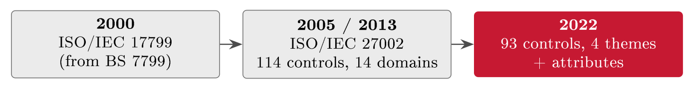
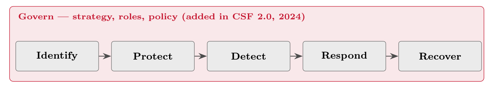

# Frameworks and the Statement of Applicability {#sec-06-frameworks-and-the-soa}

The management system (Lecture 3) and the first legal duties (Lecture 5) are in
place; this chapter supplies the toolkit that connects them to concrete
measures. Laws and risk assessments tell you *that* you must protect something;
control frameworks are the catalogues that tell you *what* the options are; and
the Statement of Applicability is the single document that records what you
chose and why. By the end you should be able to navigate ISO/IEC 27002's four
themes, place NIST, CIS and the Norwegian guidance beside them, select and
tailor controls from a risk rather than from a checklist, and read - and write
- an SoA row.

## From requirement to control {#sec-06-from-requirement-to-control}

Start with the gap this chapter fills.

::: {#exm-gap}
## The gap, on one requirement

NIS2's Article 21 requires "access control"; the GDPR's Article 32 requires
"appropriate" security. Neither says what to actually do on Monday: Neither
mentions MFA, password managers, reviews of leavers' accounts, or how strong is
strong enough. The distance between "you must control access" and a configured,
evidenced control is exactly the space frameworks occupy - a catalogue row
such as A.8.5 *Secure authentication* turns the abstract duty into a named,
checkable measure. Requirements say that; frameworks say what; you still decide
how much.
:::

Recall from Chapter 1 that controls come in three kinds by *when* they act -
preventive, detective, corrective (@tbl-controls). They also come in
three kinds by *what* they are made of, and a sound defence mixes both
dimensions (@tbl-ctrltypes): Technical controls in systems, process
controls in how work is done, and people controls in what humans know and do.
MFA blocks the stolen password; the access review catches the forgotten account;
training stops the phish being clicked at all.

::: {#tbl-ctrltypes}
  **Type**    **What it is**               **FastGoods example**
  ----------- ---------------------------- ----------------------------------
  Technical   Built into systems           MFA, encryption, backups
  Process     Built into ways of working   Access reviews, change control
  People      Built into behaviour         Training, screening (Lecture 14)

  : Controls by substance. Crossed with the preventive--detective-- corrective
  dimension of Chapter 1, this is the space a catalogue organises.
:::

::: {#def-catalogue}
## Control framework

A control framework is a curated catalogue of security controls - accumulated
good practice, organised and numbered so that it can be selected from,
referenced and audited. It is a menu, not a mandate: The risk assessment decides
which entries apply.
:::

Why use somebody else's catalogue at all? For the same reason builders use
building codes rather than deriving structural engineering from first
principles: Completeness - a good catalogue covers areas you would forget,
from supplier contracts to secure disposal; a common language - "we implement
A.8.5" means the same to every auditor, customer and regulator; and reuse -
decades of hard-won lessons, already organised. Four catalogues cover most of
practice (@tbl-fwoverview), and the rest of the chapter walks through
them.

::: {#tbl-fwoverview}
  **Framework**             **Origin**            **Character**
  ------------------------- --------------------- --------------------------
  ISO/IEC 27002 / Annex A   International (ISO)   93 controls, four themes
  NIST CSF                  US (NIST)             Five functions + Govern
  CIS Controls v8           Community (CIS)       18 prioritised controls
  NSM grunnprinsipper       Norway (NSM)          National baseline

  : The four catalogues of this chapter. Different audiences and shapes; heavily
  overlapping substance.
:::

## ISO/IEC 27002 and Annex A {#sec-06-iso-iec-27002-and-annex-a}

ISO/IEC 27002 is Annex A's other half: The same 93 controls that Annex A lists
in one line each, 27002 explains in depth - purpose, implementation guidance,
attributes (Jøsang, §18.5.4, p. 398). You select from Annex A (Lecture 3); you
implement with 27002 open beside you. The catalogue also carries its own
history, and the 2022 revision is the biggest reshaping it has had
(@fig-evo27002): The 2013 edition's 114 controls in 14 domains were
merged, modernised and reorganised into 93 controls under four themes, new
controls were added for the world as it now is - cloud security, threat
intelligence - and every control was tagged with attributes. The renumbering
is a practical trap: Older documents cite 2013 numbers, so mappings between the
editions are part of the auditor's toolkit.

{#fig-evo27002}

The four themes are the ones Chapter 3 introduced, with their counts:
Organisational (37), people (8), physical (14) and technological (34) - and
reading one control closely shows what the catalogue actually gives you
(@tbl-anatomy). Attributes are the 2022 edition's quiet innovation:
Every control carries tags - control type (preventive/detective/corrective),
the CIA properties it serves, cybersecurity concepts aligned with NIST's
functions, operational capability, and security domain - so the catalogue can
be sliced by question: "All detective controls", "everything protecting
availability". The tags also make cross-framework mapping nearly automatic,
which @sec-06-the-other-maps-nist-cis-nsm exploits. Concretely, every
control carries five attribute dimensions, and reading one control's tags shows
the mechanism (@tbl-attrs) - the hash notation is the standard's own.

::: {#tbl-attrs}
  **Attribute dimension**           **A.8.5 Secure authentication**
  --------------------------------- ---------------------------------
  Control type                      #Preventive
  Information security properties   #Confidentiality, #Integrity
  Cybersecurity concepts            #Protect
  Operational capabilities          #Identity_and_access_management
  Security domains                  #Protection

  : The five attribute dimensions of ISO 27002:2022, read on one control. The
  concepts row maps straight onto the NIST CSF functions - the hook the
  cross-framework mapping hangs on.
:::

::: {#tbl-anatomy}
  ------------ ------------------------------------------------------------
  **A.8.5 Secure authentication (ISO/IEC 27002:2022)**

  Control      Secure authentication technologies and procedures shall be
               implemented, based on access restrictions and the
               access-control policy

  Purpose      Ensure a user or system is who it claims to be before access
               is granted

  Guidance     Choose authentication strength by sensitivity; MFA for
               sensitive access; protect the log-in process itself

  Attributes   Preventive; protects confidentiality & integrity; maps to
               the Protect function
  ------------ ------------------------------------------------------------

  : Anatomy of one control. Annex A gives the one-line requirement; 27002
  adds purpose, guidance and attributes - enough to implement and to audit
  against.
:::

## The other maps: NIST, CIS, NSM - and the governance frameworks {#sec-06-the-other-maps-nist-cis-nsm}

Different audiences built different maps of the same territory, and a
practitioner should be able to read all of them. The NIST Cybersecurity
Framework - created in 2014 for US critical infrastructure and now used
worldwide - organises security not as a control list but as five *functions*
forming a lifecycle, with version 2.0 (2024) adding *Govern* as a function
wrapping the rest: Strategy, roles and policy as the surrounding frame
(@fig-csf; Jøsang, §18.2, pp. 383--388; Edwards & Weaver, Ch. 11,
pp. 191 ff.). Its language of functions has become the field's lingua franca -
which is exactly why the 27002 attributes map onto it.

{#fig-csf}

Beside it sit two more control catalogues. NIST's SP 800-53 is the deep,
exhaustive control catalogue behind US federal practice - encyclopaedic where
27002 is compact (Edwards & Weaver, Ch. 13, pp. 231 ff.). The CIS Controls v8,
maintained by the Center for Internet Security, take the opposite approach:
Eighteen prioritised controls, ordered by effectiveness against common attacks
and staged in implementation groups so that a small organisation starts with
IG1's basics - a pragmatic on-ramp many small companies use before ever
opening an ISO standard (Jøsang, §18.4, p. 390). The implementation groups are
the CIS set's sizing mechanism (@tbl-igs): Same catalogue, three depths
- tailoring built into the framework itself, and a useful sanity check for any
small organisation wondering where to start.

::: {#tbl-igs}
  **Group**   **Who it fits**                                     **Character**
  ----------- --------------------------------------------------- -------------------------------------------------------
  IG1         Small organisations, limited expertise              Essential cyber hygiene - FastGoods' starting point
  IG2         Dedicated IT/security staff, moderate sensitivity   IG1 plus operational depth
  IG3         Sophisticated adversaries, highly sensitive data    The full set, expert-run

  : The CIS implementation groups: One catalogue, three depths. Proportionality,
  built into the framework.
:::

And in Norway, NSM's *grunnprinsipper* for ICT security - version 2.1, updated
in 2024 and mapped to CSF 2.0 - give a free national baseline in four
categories (identify, protect, detect, respond/recover) that Norwegian
organisations and auditors treat as the reference point.

One family remains, easily confused with control catalogues: The *governance and
risk* frameworks, which organise decision-making rather than list safeguards.
COBIT (ISACA) governs enterprise IT - objectives, processes and maturity
levels, strong for audit and steering (Chapter 2 met its 1996 origin); COSO
frames internal control enterprise-wide, the audit world's backbone from SOX
onwards (Chapter 1); ISO 31000 structures risk management in general, feeding
Block III (Edwards & Weaver, Ch. 12, pp. 209 ff.). The division of labour:
Governance frameworks decide and steer; control catalogues protect; both are
needed, and they are not substitutes.

Because the catalogues cover one territory, any concrete safeguard can be named
in all of them at once (@tbl-mapping) - and that redundancy is useful,
not wasteful.

::: {#tbl-mapping}
  **Safeguard**        **ISO 27002**   **NIST CSF**   **CIS v8**   **NSM**
  -------------------- --------------- -------------- ------------ ----------
  Strong login (MFA)   A.8.5           Protect        Control 6    Protect
  Know your assets     A.5.9           Identify       Control 1    Identify

  : One safeguard, four labels. The frameworks are maps of the same territory,
  which is what makes evidence reusable across regimes.
:::

::: {#exm-onecontrol}
## One control, three regimes

Follow FastGoods' MFA rollout through the paperwork it satisfies. As A.8.5, it
is an applicable control in the SoA, treating risk R1. As an Article 21 measure,
it evidences the access-control and MFA row of a NIS-style baseline (Lecture 5).
As a GDPR Article 32 measure, it is "appropriate technical security" for the
personal data behind the logins (Lecture 7) - and when the external auditor
arrives in Block V, the same configuration screenshots and access logs serve all
three at once. One control, implemented once, evidenced once, answering three
regimes: This is why mappings are a practitioner's friend, and why auditors keep
a mapping table within reach.
:::

## Choosing and tailoring {#sec-06-choosing-and-tailoring}

With the catalogues on the table, discipline decides how they are used - and
the discipline has one rule above all: *Risk drives selection.* You do not read
a catalogue cover to cover and implement everything; you start from the assessed
risks (Block III) and pull the controls that treat them, recording each choice.
Catalogue-first security produces cost without protection - the checkbox trap
of Chapter 1 in a new costume.

::: {#exm-r1select}
## From R1 to a named control

The selection chain for one risk, in four moves. *Risk:* R1, account takeover
- likelihood high, impact substantial (Chapter 4's analysis). *Need:* Stronger
authentication than a password alone. *Catalogue:* A.8.5 Secure authentication,
whose guidance points to MFA for sensitive access (@tbl-anatomy).
*Record:* An SoA row - applicable, justified by R1, status implemented. Four
moves from a risk to a named, recorded, auditable control; every selected
control should be able to show this chain, and an auditor will ask for it.
:::

Selection is followed by tailoring, because a control from a catalogue is a
pattern, not a prescription: The same A.8.5 means hardware tokens and
just-in-time privileged access in a bank, and an authenticator app on two phones
in a two-person shop. Proportionality is the principle - strong enough for the
risk, light enough for the business.

::: {#exm-tailor}
## Tailoring "monitoring" to FastGoods

Take a monitoring control (Annex A's logging and monitoring family). A bank
tailors it into a 24/7 security operations centre with a SIEM and named
analysts. FastGoods tailors the *same* control into: Cloud-provider alerting
switched on, login-anomaly notifications to the two technical staff, and a
fifteen-minute weekly review of the dashboards. Both implementations satisfy the
control's purpose - detect the incident in time to act - at costs
proportionate to each organisation. Tailoring is not weakening; it is fitting.
What would *fail* the purpose is the third variant auditors actually find:
Alerts configured, sent to a mailbox nobody reads.
:::

Layering completes the craft: Defence in depth means independent controls in
series - MFA to prevent, anomaly alerts to detect, backups to correct, on the
same risk R1 - so no single failure is fatal; the art is layers without
bureaucratic over-controlling, since every control also costs attention. And the
recurring mistakes are worth naming because Block V will look for them:
Catalogue-first selection (controls without risks), tool-worship (buying
products instead of building process and behaviour), and set-and-forget
(controls implemented in 2023 and never revisited - the stale SoA below). Each
has a familiar audit signature; each is avoidable by keeping the chain
risk →     control →     record alive.

## The Statement of Applicability {#sec-06-the-statement-of-applicability}

::: {#def-soa}
## Statement of Applicability

The Statement of Applicability (SoA) is the ISMS document (ISO/IEC 27001, Clause
6.1.3) that goes through every Annex A control and records, for each: Whether it
applies; the justification - the risk it treats, or why it is excluded; and
its implementation status. It is the one-page meeting point of risk and
controls, and the first document an auditor opens.
:::

An SoA row carries five columns - control, applicable?, justification, status,
evidence - and FastGoods' version now writes itself from everything the
preceding chapters have built (@tbl-fgsoa). Read the table twice: Once
down the justification column, where every entry is a risk from Chapter 4 or a
stated reason, never a blank; and once down the status column, which is honest
- "planned" is an acceptable status, *pretending* is not. The justification
column is also Chapter 1's rule turned into paperwork: Every control must name
the risk it addresses, and every treated risk its control - a control whose
risk you cannot name is a cost, and a risk whose control you cannot name is a
decision still waiting to be taken.

::: {#tbl-fgsoa}
  **Control**                   **Applies**   **Justification**                                  **Status**    **Evidence**
  ----------------------------- ------------- -------------------------------------------------- ------------- ----------------
  A.8.5 Secure authentication   Yes           Treats R1 (takeover)                               Implemented   MFA config
  A.8.24 Cryptography           Yes           Treats R3 (breach)                                 Implemented   Encr. settings
  A.5.7 Threat intelligence     Yes           Watch for R2 attacks                               Planned       -
  A.6.3 Awareness training      Yes           Human vector (Ch. 4)                               In progress   Training log
  A.7.4 Physical monitoring     No            No own data centre; provider covers (Lecture 19)   -           -

  : FastGoods' Statement of Applicability, first edition. Every inclusion cites
  a risk; the one exclusion is justified; the status column is honest - which
  is exactly what an auditor checks first.
:::

The SoA is a living document, on the same PDCA rhythm as the ISMS around it: New
risks add rows, completed work updates statuses, changed circumstances reopen
exclusions - if FastGoods ever racks its own server, A.7.4 flips to "yes" the
same week. A stale SoA is one of the most common audit findings precisely
because it is so diagnostic: A document dated three years ago says, in one line,
that risk and controls stopped talking to each other. Keep the date current and
the chain alive, and the SoA does the opposite - it proves, on one page, that
the machinery built so far actually runs.

The toolkit is chosen and the record started. One binding law remains - the
one that protects not services but the people in the data. That is where Lecture
7, and the GDPR, begin.

##### Reading for this chapter.

Edwards & Weaver, Chapter 11 (the NIST Cybersecurity Framework, pp. 191 ff.),
Chapter 12 (cybersecurity frameworks, pp. 209 ff.) and Chapter 13 (NIST SP
800-53, pp. 231 ff.); Jøsang, §18.2 (NIST CSF, pp. 383--388), §18.4 (CIS
Controls, p. 390) and §18.5.4 (the ISO 27002 controls, p. 398). Both books are
available in the library and on the Canvas course page.

## Summary {#sec-06-summary}

Laws and risk assessments say *that*; catalogues say *what*; you decide *how
much*. Controls come in three substances - technical, process, people -
crossed with the preventive--detective--corrective timing of Chapter 1, and a
control framework (@def-catalogue) organises that space as a menu:
Complete, commonly referenced, accumulated practice. ISO/IEC 27002 explains
Annex A's 93 controls in depth - reshaped in 2022 from 114 controls in 14
domains into four themes with attributes that make the catalogue sliceable and
mappable. Beside it: NIST's CSF with its five functions and, since 2.0 (2024),
Govern as the wrapping frame; SP 800-53 as the encyclopaedia; CIS v8 as the
prioritised on-ramp; NSM's grunnprinsipper as the Norwegian baseline; and, in a
different family altogether, COBIT, COSO and ISO 31000 governing decisions
rather than listing safeguards. Selection is risk-driven -
R1 →     need →     A.8.5 →     SoA row - tailoring is proportionality,
layering is defence in depth, and one implemented control can evidence three
regimes at once. The Statement of Applicability (@def-soa) records it
all: Every control, applicable or not, justified, statused, evidenced - alive
on the PDCA rhythm, and the first page an auditor turns to.

Engine, requirements, toolkit, record - one law still missing. The GDPR closes
Block II next.

## Self-check {#sec-06-self-check}

Try these before the next lecture.

::: {#exr-06-that-what-how-much}
## That, what, how much

Using @exm-gap, explain the division of labour between a legal
requirement, a control catalogue, and the organisation's own judgement - one
sentence each.
:::

::: {#exr-06-two-dimensions-of-one-defence}
## Two dimensions of one defence

For risk R3 (customer-database breach), name one technical, one process and one
people control - and classify each as preventive, detective or corrective.
:::

::: {#exr-06-reading-the-maps}
## Reading the maps

A partner asks whether FastGoods "covers NIST CSF Protect". Using
@tbl-mapping, answer with the ISO 27002 controls FastGoods already runs,
and explain why the mapping makes the evidence reusable.
:::

::: {#exr-06-tailoring-defended}
## Tailoring defended

An auditor challenges FastGoods' lightweight monitoring (@exm-tailor) as
"not what a bank would do". Defend the tailoring in three sentences - and name
the one variant that would rightly fail.
:::

::: {#exr-06-write-the-row}
## Write the row

FastGoods introduces daily encrypted backups of the customer database. Write the
complete SoA row (five columns) - choosing a plausible Annex A reference from
this chapter and Chapter 3 - and state which running risk it treats.
:::

::: {#exr-06-frameworks-interactive}
## Four catalogues, interactive

Match each framework to its shape.

```{=html}
<div class="grc-ex" data-type="sort">
<script type="application/json">
{
 "buckets": [
  {
   "id": "iso",
   "label": "ISO/IEC 27002 / Annex A"
  },
  {
   "id": "nist",
   "label": "NIST CSF"
  },
  {
   "id": "cis",
   "label": "CIS Controls v8"
  },
  {
   "id": "nsm",
   "label": "NSM grunnprinsipper"
  }
 ],
 "chips": [
  {
   "t": "93 controls under four themes",
   "b": "iso"
  },
  {
   "t": "Five functions plus Govern",
   "b": "nist"
  },
  {
   "t": "18 prioritised controls in implementation groups",
   "b": "cis"
  },
  {
   "t": "The Norwegian national baseline",
   "b": "nsm"
  }
 ],
 "explain": "Different audiences built different maps of the same territory; a practitioner reads all four.",
 "ref": "sec-06-the-other-maps-nist-cis-nsm",
 "reflabel": "The other maps"
}
</script>
</div>
```
:::

::: {#exr-06-soa-interactive}
## From risk to SoA row, interactive

Order the path a control travels into the Statement of Applicability.

```{=html}
<div class="grc-ex" data-type="order">
<script type="application/json">
{
 "steps": [
  "Risk rated in the register",
  "Control need identified",
  "Annex A control selected",
  "Control tailored to the organisation",
  "SoA row recorded with justification"
 ],
 "explain": "The SoA is the end of a traceable path: Risk, need, control, tailoring, recorded decision.",
 "ref": "sec-06-the-statement-of-applicability",
 "reflabel": "The Statement of Applicability"
}
</script>
</div>
```
:::

::: {#exr-06-soarow-interactive}
## What belongs in an SoA row? Interactive

Select everything a defensible SoA row carries.

```{=html}
<div class="grc-ex" data-type="pick">
<script type="application/json">
{
 "options": [
  {
   "t": "Control number and name",
   "ok": true
  },
  {
   "t": "Applicable - yes or no",
   "ok": true
  },
  {
   "t": "Justification for the decision",
   "ok": true
  },
  {
   "t": "Implementation status",
   "ok": true
  },
  {
   "t": "The asset's replacement price",
   "ok": false
  },
  {
   "t": "The attacker's name",
   "ok": false
  }
 ],
 "explain": "An SoA row records the control, whether it applies, why, and its status - enough to implement from and to audit against.",
 "ref": "sec-06-the-statement-of-applicability",
 "reflabel": "The Statement of Applicability"
}
</script>
</div>
```
:::

::: {#exr-06-attrs-interactive}
## Reading the attribute tags, interactive

Assign each tag of A.8.5 to its attribute dimension.

```{=html}
<div class="grc-ex" data-type="sort">
<script type="application/json">
{
 "buckets": [
  {
   "id": "type",
   "label": "Control type"
  },
  {
   "id": "props",
   "label": "Information security properties"
  },
  {
   "id": "conc",
   "label": "Cybersecurity concepts"
  },
  {
   "id": "cap",
   "label": "Operational capabilities"
  },
  {
   "id": "dom",
   "label": "Security domains"
  }
 ],
 "chips": [
  {
   "t": "#Preventive",
   "b": "type"
  },
  {
   "t": "#Confidentiality",
   "b": "props"
  },
  {
   "t": "#Protect",
   "b": "conc"
  },
  {
   "t": "#Identity_and_access_management",
   "b": "cap"
  },
  {
   "t": "#Protection",
   "b": "dom"
  }
 ],
 "explain": "Every 27002:2022 control carries five attribute dimensions; the tags let the catalogue be sliced by question.",
 "ref": "sec-06-iso-iec-27002-and-annex-a",
 "reflabel": "ISO/IEC 27002 and Annex A"
}
</script>
</div>
```
:::

::: {#exr-06-csf-interactive}
## The CSF functions, interactive

Match each activity to the NIST CSF function it belongs to.

```{=html}
<div class="grc-ex" data-type="sort">
<script type="application/json">
{
 "buckets": [
  {
   "id": "gov",
   "label": "Govern"
  },
  {
   "id": "id",
   "label": "Identify"
  },
  {
   "id": "prot",
   "label": "Protect"
  },
  {
   "id": "det",
   "label": "Detect"
  },
  {
   "id": "resp",
   "label": "Respond"
  },
  {
   "id": "rec",
   "label": "Recover"
  }
 ],
 "chips": [
  {
   "t": "Policy, roles and risk appetite",
   "b": "gov"
  },
  {
   "t": "The asset inventory",
   "b": "id"
  },
  {
   "t": "MFA on the admin accounts",
   "b": "prot"
  },
  {
   "t": "The IDS raising an alert",
   "b": "det"
  },
  {
   "t": "Handling the incident",
   "b": "resp"
  },
  {
   "t": "Restoring the service from backup",
   "b": "rec"
  }
 ],
 "explain": "The CSF's functions are a lifecycle - govern wraps identify, protect, detect, respond, recover - and they map straight onto the 27002 attributes.",
 "ref": "sec-06-the-other-maps-nist-cis-nsm",
 "reflabel": "The other maps"
}
</script>
</div>
```
:::
