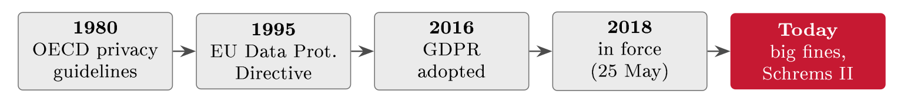
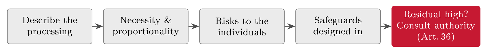

# GDPR and privacy {#sec-07-gdpr-and-privacy}

The laws of Chapter 5 protect services; this one protects people. Personal data
is a special kind of information asset, because it belongs to someone - and
the General Data Protection Regulation turns that belonging into enforceable
duties. The chapter builds the GDPR from the ground up: Why privacy sits
squarely inside GRC, what counts as personal data, the seven principles and six
lawful bases every processing must satisfy, the roles and records the regulation
assigns, the impact assessment it demands for risky processing, and finally the
point where privacy and security meet - Article 32, and the 72-hour breach
clock that FastGoods would face after an R3 breach. By the end you should be
able to place any handling of personal data on a lawful basis, name the roles
involved, and run the breach clock.

## Personal data as a special asset {#sec-07-personal-data-as-a-special-asset}

Chapter 4 taught you to treat information as an asset; personal data is that
idea with a person attached. It has value to the business *and* meaning to the
individual; its misuse harms a real person, not just the balance sheet; and so
it carries duties beyond ordinary security - respect, fairness, rights. The
shift from Chapter 4 is exactly this: An information asset you must secure
becomes a person's data you must also *respect*, and that added duty is what
privacy law is about. It also makes privacy a GRC concern through and through: A
breach of FastGoods' customer database (R3) is at once a governance failure
(someone must own privacy and be accountable, Lecture 11), a serious business
risk (fines, trust, harm to customers), and a compliance breach under binding
law. Privacy touches every letter of GRC, and a privacy failure can cost more in
fines and lost trust than the data was ever worth in revenue.

The law here is older than most people think (@fig-dpline). The world's
first data-protection statute was passed in the German state of Hessen in 1970,
as governments began computerising records; the OECD's privacy guidelines of
1980 set the first internationally agreed principles; the EU's Data Protection
Directive of 1995 made them European law but, being a directive, left gaps
between member states. The GDPR - Regulation (EU) 2016/679, adopted 2016,
applicable from 25 May 2018 - closed those gaps with one directly binding text
(@def-regdir explains why that legal form was the point), and the years
since have shown its teeth: Large fines, and cases such as Schrems II (2020)
reshaping international data transfers. It applies to any organisation, wherever
it sits, that handles the personal data of people in the EU/EEA (Art. 3); in
Norway it is given effect through the Personal Data Act and supervised by the
Data Protection Authority, Datatilsynet; and its fines reach EUR 20 million or
4 % of global turnover - higher than NIS2's (Jøsang, §10.5, p. 224).

{#fig-dpline}

::: {#def-pdata}
## Personal data and special categories

Personal data is any information relating to an identified or identifiable
person (Art. 4): Name, email and address, but also online identifiers, location
data and IP addresses - anything that can single someone out, directly or
combined with other data. *Special categories* (Art. 9) - health, biometrics,
genetics, ethnicity, religion, political views, sex life - carry extra
protection and need a stronger basis. Truly anonymised data falls outside the
GDPR; pseudonymised data still counts.
:::

One distinction keeps the chapter honest: Privacy is not the same as security.
Security protects data from unauthorised access - "is the data safe?" Privacy
governs lawful and fair use - "should we have it, and why?" Security is
necessary for privacy, but not sufficient.

::: {#exm-secureunlawful}
## Secure, and still unlawful

Suppose FastGoods' marketing team quietly builds a database of customers'
birthdays and browsing habits, scraped together to time promotional emails, and
stores it encrypted, access-controlled, beautifully secured. Every security
control passes; the processing may still be unlawful, because no lawful basis
was ever established, no one was told, and the data goes beyond what any stated
purpose needs. Perfect security, failed privacy - the two questions are
different, and the GDPR asks both.
:::

## Principles, lawful bases, and rights {#sec-07-principles-lawful-bases-and-rights}

Every processing of personal data must satisfy the seven principles of Article 5
at once (@tbl-principles) - six rules plus one meta-rule, because
*accountability* means you must be able to demonstrate compliance, not just
achieve it.

::: {#tbl-principles}
  **Principle (Article 5)**     **In plain words**
  ----------------------------- --------------------------------------
  Lawful, fair, transparent     Have a reason; be open about it
  Purpose limitation            Use it only for why you collected it
  Data minimisation             Collect only what you need
  Accuracy                      Keep it correct and up to date
  Storage limitation            Keep it only as long as needed
  Integrity & confidentiality   Keep it secure (Lecture 10)
  Accountability                Be able to prove all of the above

  : The seven principles of Article 5. The last is the meta-rule: Compliance
  must be demonstrable, not merely achieved.
:::

Processing also needs one of six lawful bases (Art. 6) - and consent is only
one of them (@tbl-bases). The basis is picked *before* processing and
recorded; many organisations over-rely on consent when contract or legitimate
interests fit better, and then discover that consent, once chosen, can be
withdrawn.

::: {#tbl-bases}
  **Basis (Article 6)**   **Example**
  ----------------------- ------------------------------------
  Consent                 Newsletter sign-up
  Contract                Processing an order
  Legal obligation        Keeping tax records
  Vital interests         A medical emergency
  Public task             A public authority's duties
  Legitimate interests    Fraud prevention (after balancing)

  : The six lawful bases. Consent is one of six, not the default - and it is
  the only one the person can withdraw at will.
:::

::: {#exm-basis}
## Choosing the basis at FastGoods

Walk FastGoods' everyday processing through Article 6. Fulfilling an order -
name, address, payment - rests on *contract*: The customer asked to buy, and
the data is needed to deliver. Keeping transaction records for the tax
authorities rests on *legal obligation* - Norwegian bookkeeping law requires
retention regardless of anyone's wishes. The marketing newsletter rests on
*consent*: A free, specific opt-in, as easy to withdraw as to give. And
automated checks against payment fraud can rest on *legitimate interests*, after
a documented balancing of the company's interest against the customer's rights
- the legitimate-interests assessment that Chapter 9 runs in full. Four
processings, four different bases - and note what fails: "By using this site
you agree to everything" is not valid consent, because valid consent is freely
given, no pre-ticked boxes or bundling, specific and informed, and as easy to
withdraw as to give. If those tests cannot be met, the answer is a different
basis, not a worse consent.
:::

Legitimate interests deserves one more paragraph, because it is the basis most
often claimed and least often evidenced. Relying on it requires a documented
balancing test - in practice three questions, in order: *Purpose* (is the
interest legitimate and real?), *necessity* (is this processing needed for it,
or would less data do?), and *balancing* (do the person's interests, rights and
freedoms override it - would they reasonably expect this use?). Fraud
prevention at FastGoods passes all three; the scraped birthday database of
@exm-secureunlawful fails at the expectation question before the others
are reached. The test, written down, is what turns "legitimate interests" from a
magic phrase into a defensible basis - accountability (Art. 5(2)) applied to a
single decision.

The individual side of the bargain is a set of enforceable rights (Art. 12--22):
Access to the data held on them, rectification of inaccuracies, erasure within
limits, restriction of and objection to certain processing, portability of their
data to take elsewhere, and protection against solely automated decisions.
Responses are normally due within one month - and being unable to *find* a
person's data, or to delete it, is itself a compliance failure. Transparency
completes the picture: Articles 13--14 list exactly what a privacy notice must
say - who you are, what data, why, on what basis, for how long, and the
person's rights - in plain language. A clear, honest notice is both a legal
duty and a trust-builder; a vague one-liner is neither. The rights become
operational through requests, and handling one is a small process of its own:
Verify the requester's identity first, because releasing data to the wrong
person converts a rights request into a breach; respond within the month,
extendable by two more for complex cases with the person told of the extension;
and where a request is manifestly unfounded or excessive, refusal is possible
but must be justified in writing. The quiet prerequisite is the register of the
next section: You cannot export, correct or erase data you cannot find - which
is why the Article 30 record is built first and never allowed to go stale.

## Roles, records, and contracts {#sec-07-roles-records-and-contracts}

::: {#def-ctrlproc}
## Controller and processor

The *controller* decides why and how personal data is processed (Art. 4(7)); the
*processor* processes it on the controller's behalf, acting only on documented
instructions (Art. 4(8)) and bound by a written contract (Art. 28). The *data
subject* is the person the data is about, holder of the rights above (Jøsang,
§10.6, pp. 225--227).
:::

{#fig-roles}

For FastGoods the mapping is immediate: The shop is controller for its customer
data; the cloud host is a processor, while the payment provider - deciding its
own means for the card transaction, under PCI DSS and its own fraud rules - is
an independent controller rather than a processor, named in the Article 30
record as a recipient; so a breach at a provider is still FastGoods' duty to
manage and report, and the Article 28 contracts weigh as much as the technical
defences. Two supporting roles and one register complete the structure. Some
organisations must appoint a Data Protection Officer (Art. 37--39) - mandatory
for public authorities and for large-scale monitoring or special-category
processing - an independent expert who advises, monitors compliance and fronts
the authority, reporting to top management and sitting squarely in the second
line (Lecture 11); a small shop like FastGoods usually needs only a named
contact, not a full DPO. Every controller, though, must keep records of
processing (Art. 30): What data, for what purpose, on what basis, shared with
whom, kept how long - the privacy counterpart of the asset register and the
SoA, and the first thing a supervisory authority asks to see in an inspection.
You cannot protect or govern data you have not mapped.

::: {#exm-art30row}
## One row of FastGoods' processing record

A record of processing need not be grand; one honest row does real work.
*Processing:* Order fulfilment. *Data:* Name, address, email, order history.
*Purpose:* Deliver purchases and handle returns. *Lawful basis:* Contract
(Art. 6(1)(b)). *Shared with:* The courier and the cloud host (processors under
Art. 28 contracts); the payment provider (an independent controller, as
recipient). *Retention:* Transaction records five years, following Norwegian
bookkeeping rules; marketing data only while consent stands. Six fields, and
FastGoods can answer the inspector's first question - and its own, next time
someone proposes "let's just keep everything".
:::

When data leaves the region, one more safeguard applies: Transfers outside the
EEA need a legal mechanism (Art. 44 ff.) - an adequacy decision or standard
contractual clauses - a regime the Schrems II judgment (2020) tightened
considerably. Using a cloud provider therefore means a processor contract
always, and a transfer mechanism whenever that provider processes data outside
the EEA; both are routine in practice, and routine in audits (Lecture 19). The
transfer tools line up as a short ladder, tried in order
(@tbl-transfers).

::: {#tbl-transfers}
  **Transfer tool**              **When it carries the transfer**
  ------------------------------ ---------------------------------------------------------------------------------------------
  Adequacy decision              The Commission has declared the country adequate - transfer as if inside the EEA
  Standard contractual clauses   The workhorse: Model contracts - since Schrems II with a case-by-case transfer assessment
  Binding corporate rules        Approved intra-group rules, for multinationals
  Derogations (Art. 49)          Narrow exceptions for occasional transfers - never a routine basis

  : The Chapter V transfer ladder, tried top-down. For a webshop on a global
  cloud, the second rung is where the work usually happens.
:::

## Accountability and the DPIA {#sec-07-accountability-and-the-dpia}

Accountability (Art. 5(2)) is the GDPR's defining move: It is not enough to
comply - you must be able to *demonstrate* that you do. Keep the records,
policies and decisions that show your reasoning; the burden of proof sits with
the controller. A regulator does not have to prove you failed; you have to prove
you complied - the same evidence logic as the ISMS (Lecture 3), where a
control is worth little without proof that it operates, and the same
documentation theme that returns in Lectures 15 and 16.

::: {#def-dpia}
## Data protection impact assessment

A data protection impact assessment (DPIA, Art. 35) is a structured assessment
of privacy risk done *before* high-risk processing begins: It describes the
processing, tests its necessity and proportionality, assesses the risks to the
*individuals* - not just the business - and identifies the safeguards. If
high risk remains after safeguards, the authority must be consulted first
(Art. 36).
:::

The DPIA is privacy's version of the risk assessment of Block III, with the
impact scale swapped: The harm weighed is harm to people. Triggers include
large-scale special-category data, systematic monitoring, and novel
technologies; and the effort is scaled to the risk - the proportionality
principle again. Adding a basic newsletter needs only a short privacy screening;
behavioural tracking or payment profiling would trigger a full DPIA. A small
webshop does not need a forty-page assessment for a mailing list - but it
should still ask the basic questions. Proportionate, documented, done.

The assessment has a defined shape (@fig-dpiaflow), and the shape
carries the message: The risks to the individuals are assessed before the
processing exists, so that safeguards are designed in rather than bolted on -
Article 25's privacy-by-design, run as a method. Chapter 9 returns to the DPIA
as a working practice: The screening that decides when one is needed, the four
blocks run on a FastGoods processing, and the prior-consultation duty of Article
36.

{#fig-dpiaflow}

## Where privacy meets security {#sec-07-where-privacy-meets-security}

Article 32 is where this chapter joins hands with the rest of the course: It
requires appropriate technical and organisational security for personal data,
based on risk - naming measures such as encryption and the ability to restore
data after an incident. These are the controls you already know, now as a
privacy duty: MFA against R1, a resilient checkout against R2, encryption of the
customer database against R3 - and an ISO 27001 ISMS (Lecture 3) is how many
organisations meet the article and prove it. And here too the duties read
backwards as risks: No lawful basis is the risk of unlawful processing; no
tested restore is the risk Article 32 names by requiring one; no breach routine
is the risk of missing the 72 hours. A compliance checklist is a risk list in
disguise - which is why Block III will feel familiar to anyone who has read
this chapter carefully.

If personal data is nonetheless breached, the GDPR runs its own clock, distinct
from NIS2's (@fig-gdprclock): Notify the supervisory authority within
**72 hours** of becoming aware (Art. 33); tell the affected individuals when the
risk to them is high (Art. 34); and document every breach, even those judged not
reportable - the judgement itself must be defensible later.

{#fig-gdprclock}

::: {#exm-breachclock}
## R3 on the GDPR clock

FastGoods discovers on a Friday at 16:00 that the customer database has been
exfiltrated - risk R3, realised. The 72 hours are hours, not working days: The
notification to Datatilsynet is due by Monday 16:00, weekend included. The team
assesses the risk to individuals - exposed names, addresses and order
histories invite fraud and phishing against customers, plausibly a high risk -
so Article 34 notice to the customers follows, in plain language, with concrete
advice. Everything is documented: The timeline, the assessment, the
notifications. And note the double booking: Were FastGoods also under a
NIS-style duty, the same incident would run the 24--72--one-month clock of
Chapter 5 in parallel. Two regimes, one weekend - survivable only because the
preparedness plan (Lecture 12) knew both clocks in advance.
:::

Better than reporting breaches well is designing so they are smaller. Article 25
- privacy by design and by default, an idea Ann Cavoukian articulated in the
1990s and the GDPR made a legal duty - pairs two requirements: Engineer
systems from the first design to minimise and protect data (pseudonymise or
encrypt wherever you can), and ship them with the most privacy-friendly settings
already switched on, so users opt *in* to more, never out. Retro-fitting privacy
is costly and weak; designing it in is cheaper and stronger - the same lesson
as secure design and defence in depth (Lecture 10).

Finally, keep the two laws of this block apart (@tbl-nis2gdpr): NIS2
protects the security of essential services and is triggered by significant
incidents; the GDPR protects people's personal data and is triggered by
personal-data breaches. Different goals, overlapping in practice: A
customer-database breach is both at once, and both regimes must be satisfied
simultaneously.

::: {#tbl-nis2gdpr}
              **NIS2 (Lecture 5)**             **GDPR**
  ----------- -------------------------------- ------------------------
  Protects    Security of essential services   People's personal data
  Trigger     Significant incident             Personal-data breach
  Reporting   24--72--one month                72h to the authority
  Type        Directive                        Regulation

  : NIS2 and the GDPR side by side. One incident - a customer-database breach
  - can trigger both regimes at once.
:::

::: {.callout-note}
## Real-world case: British Airways, 2018

In September 2018 attackers modified scripts on British Airways' website and
diverted customers entering payment details to a fraudulent page - a so-called
Magecart skimming attack on exactly the surface a webshop lives by. Around
400,000 customers were affected, with names, addresses and card details
harvested in transit. The UK supervisory authority (ICO) first announced an
intention to fine £183 million - then a record - before settling, in October
2020, on £20 million after representations and pandemic considerations. The
reading for this course: The penalty was framed around inadequate security of
processing - Article 32 failures such as weaknesses in access control and
testing - not around exotic attacker brilliance; and the attack surface
(checkout scripts, customer payment flow) is precisely where FastGoods' R1 and
R3 live. A privacy fine, priced off security controls.
:::

##### Reading for this chapter.

Jøsang, Chapter 10 (information privacy), especially §10.5 (the GDPR, p. 224)
and §10.6 (the GDPR roles, pp. 225--229); Edwards & Weaver, Chapter 18 (privacy
laws and their intersection with cybersecurity, pp. 315 ff.), with the GDPR
section of Chapter 17 (p. 301) as a compact summary. Both books are available in
the library and on the Canvas course page.

## Summary {#sec-07-summary}

Personal data is an information asset with a person attached, and the GDPR -
heir to Hessen 1970, the OECD principles of 1980 and the 1995 Directive -
turns that into enforceable duty: A directly binding regulation, applicable
since 25 May 2018 to anyone processing EU/EEA residents' data, given effect in
Norway through the Personal Data Act and supervised by Datatilsynet, with fines
to EUR 20 million or 4 %. Personal data reaches anything that can single a
person out (@def-pdata); processing must satisfy all seven Article 5
principles - accountability above all, since compliance must be demonstrable
- and rest on one of six lawful bases, chosen before processing and recorded,
with consent only one option and the only revocable one. The regulation assigns
roles (@def-ctrlproc): FastGoods as controller, its cloud host and
payment provider as an independent controller and its cloud host and courier as
processors under Article 28 contracts, a DPO where the processing demands one,
and the Article 30 record as the register an inspector opens first. High-risk
processing takes a DPIA (@def-dpia) before it begins; Article 32 makes
security of personal data a legal duty met naturally by an ISMS; Article 33 runs
a 72-hour clock - hours, not working days - with Article 34 notice to
individuals when their risk is high; Article 25 asks for privacy designed in and
switched on by default; and British Airways (2018) shows what the regime costs
when the checkout itself is the weakness. Security asks whether the data is
safe; privacy asks whether you should have it at all - and the GDPR insists on
both answers.

That completes the binding law - and with it, Block II closes with a clean
architecture: The ISMS is the engine (Lecture 3), the assets are its subject
(Lecture 4), the laws are the requirements (Lectures 5 and 7), and the
frameworks and the SoA are the toolkit and the record that bind them (Lecture
6). What the whole structure now needs is its fuel - the disciplined
assessment of risk that decides which controls the SoA selects. That is Block
III, and it begins with Lecture 8.

## Self-check {#sec-07-self-check}

Try these before the next lecture.

::: {#exr-07-personal-data-or-not}
## Personal data or not

Classify each as personal data, special-category data, or outside the GDPR, with
one sentence each: A customer's IP address; an order history linked to an email
address; fully anonymised sales statistics; a support note mentioning a
customer's health condition.
:::

::: {#exr-07-security-without-privacy}
## Security without privacy

Using @exm-secureunlawful, explain in three sentences why perfect
security did not make the birthday database lawful, naming the principles and
the missing element from Article 6.
:::

::: {#exr-07-roles-at-fastgoods}
## Roles at FastGoods

Name the controller, two processors, one independent controller and the data
subjects in FastGoods' order processing, and state what Article 28 requires
between the parties.
:::

::: {#exr-07-the-clock-precisely}
## The clock, precisely

A breach of the customer database is discovered on Wednesday at 10:00. State the
Article 33 deadline exactly, the test that decides whether customers are told
under Article 34, and one reason the breach must be documented even if judged
not reportable.
:::

::: {#exr-07-two-regimes-one-incident}
## Two regimes, one incident

Explain why FastGoods' risk R3, if realised, could run two reporting clocks at
once, and name the single planning artefact that makes meeting both feasible.
:::

::: {#exr-07-roles-interactive}
## GDPR roles around FastGoods, interactive

Drag each party onto its GDPR role.

```{=html}
<div class="grc-ex" data-type="sort">
<script type="application/json">
{
 "buckets": [
  {
   "id": "ds",
   "label": "Data subject"
  },
  {
   "id": "ctrl",
   "label": "Controller"
  },
  {
   "id": "proc",
   "label": "Processor (Art. 28)"
  },
  {
   "id": "ictrl",
   "label": "Independent controller"
  }
 ],
 "chips": [
  {
   "t": "The customer",
   "b": "ds"
  },
  {
   "t": "FastGoods",
   "b": "ctrl"
  },
  {
   "t": "The shipping carrier",
   "b": "proc"
  },
  {
   "t": "The newsletter SaaS",
   "b": "proc"
  },
  {
   "t": "The payment service provider",
   "b": "ictrl"
  }
 ],
 "explain": "The controller decides purposes and means, the processor acts on instruction, the PSP decides for itself - and the customer is the data subject the rules protect.",
 "ref": "sec-07-roles-records-and-contracts",
 "reflabel": "Roles, records, and contracts"
}
</script>
</div>
```
:::

::: {#exr-07-bases-interactive}
## Lawful bases, interactive

Select the six lawful bases of Article 6 - and only them.

```{=html}
<div class="grc-ex" data-type="pick">
<script type="application/json">
{
 "options": [
  {
   "t": "Consent",
   "ok": true
  },
  {
   "t": "Contract",
   "ok": true
  },
  {
   "t": "Legal obligation",
   "ok": true
  },
  {
   "t": "Vital interests",
   "ok": true
  },
  {
   "t": "Public task",
   "ok": true
  },
  {
   "t": "Legitimate interests",
   "ok": true
  },
  {
   "t": "Commercial convenience",
   "ok": false
  },
  {
   "t": "Management approval",
   "ok": false
  }
 ],
 "explain": "Article 6 knows exactly six lawful bases; convenience and management approval are not among them.",
 "ref": "sec-07-principles-lawful-bases-and-rights",
 "reflabel": "Principles, lawful bases, and rights"
}
</script>
</div>
```
:::

::: {#exr-07-breach-interactive}
## The 72-hour clock, interactive

Order the duties a personal-data breach sets in motion.

```{=html}
<div class="grc-ex" data-type="order">
<script type="application/json">
{
 "steps": [
  "Breach detected and contained",
  "Assess the risk to data subjects",
  "Notify Datatilsynet within 72 hours",
  "Inform the data subjects if the risk is high",
  "Record the breach and the reasoning"
 ],
 "explain": "The 72-hour clock starts at awareness; high risk to the data subjects adds the duty to tell them directly.",
 "ref": "sec-07-where-privacy-meets-security",
 "reflabel": "Where privacy meets security"
}
</script>
</div>
```
:::

::: {#exr-07-principles-interactive}
## The principles at work, interactive

Match each practice to the Article 5 principle it honours.

```{=html}
<div class="grc-ex" data-type="sort">
<script type="application/json">
{
 "buckets": [
  {
   "id": "min",
   "label": "Data minimisation"
  },
  {
   "id": "purp",
   "label": "Purpose limitation"
  },
  {
   "id": "store",
   "label": "Storage limitation"
  },
  {
   "id": "acc",
   "label": "Accuracy"
  },
  {
   "id": "sec",
   "label": "Integrity and confidentiality"
  }
 ],
 "chips": [
  {
   "t": "Collect only what the order needs",
   "b": "min"
  },
  {
   "t": "No reuse of addresses for a new purpose without a basis",
   "b": "purp"
  },
  {
   "t": "Delete when the retention period ends",
   "b": "store"
  },
  {
   "t": "Correct the customer's wrong address",
   "b": "acc"
  },
  {
   "t": "Encrypt the stored records",
   "b": "sec"
  }
 ],
 "explain": "The Article 5 principles are testable duties: Each maps to a concrete practice the supervisor can ask to see.",
 "ref": "sec-07-principles-lawful-bases-and-rights",
 "reflabel": "Principles, lawful bases, and rights"
}
</script>
</div>
```
:::

::: {#exr-07-rights-interactive}
## Data-subject rights, interactive

Select the rights the GDPR actually grants.

```{=html}
<div class="grc-ex" data-type="pick">
<script type="application/json">
{
 "options": [
  {
   "t": "Access to one's data",
   "ok": true
  },
  {
   "t": "Rectification",
   "ok": true
  },
  {
   "t": "Erasure, in defined circumstances",
   "ok": true
  },
  {
   "t": "Data portability",
   "ok": true
  },
  {
   "t": "Objection to certain processing",
   "ok": true
  },
  {
   "t": "Erasure in all circumstances, unconditionally",
   "ok": false
  },
  {
   "t": "Compensation for any processing, without damage",
   "ok": false
  }
 ],
 "explain": "The rights are strong but conditional - erasure, for instance, yields where other law requires keeping the data.",
 "ref": "sec-07-principles-lawful-bases-and-rights",
 "reflabel": "Principles, lawful bases, and rights"
}
</script>
</div>
```
:::
