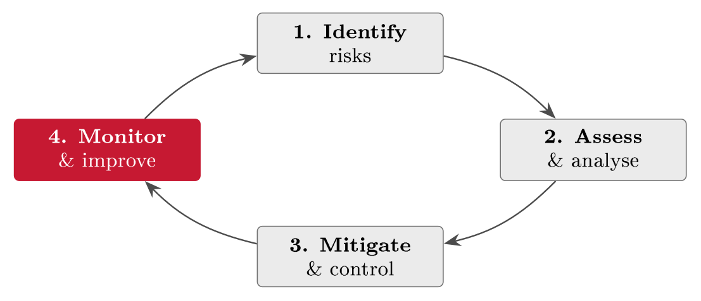
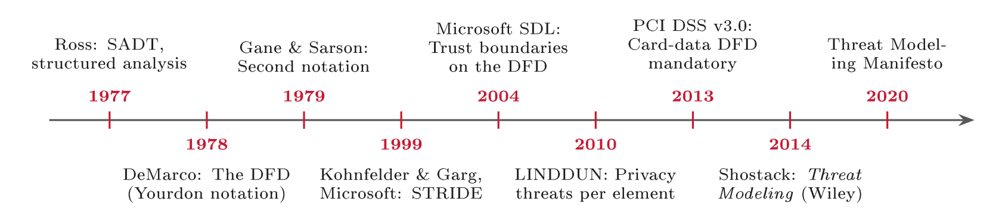
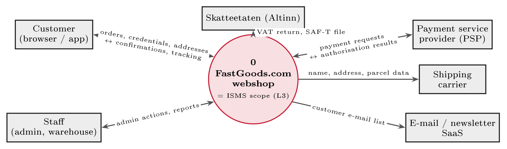
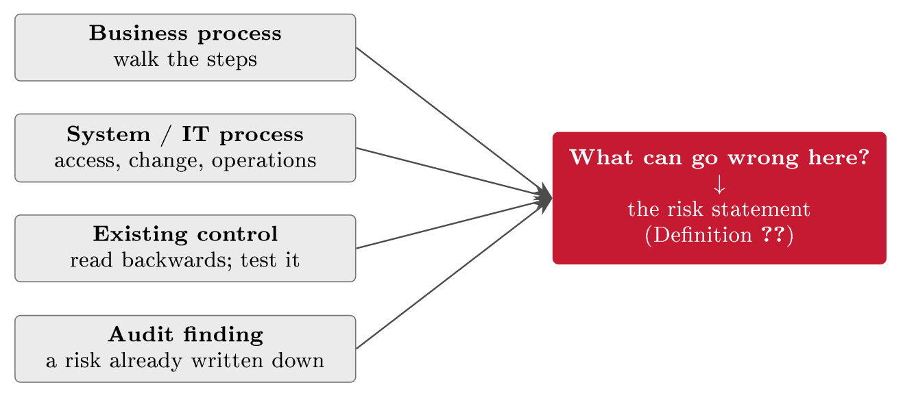
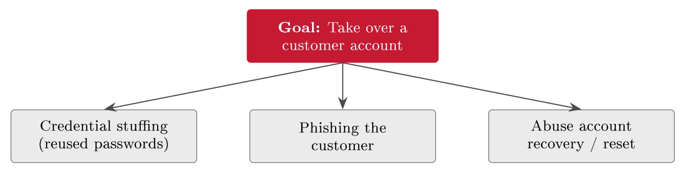
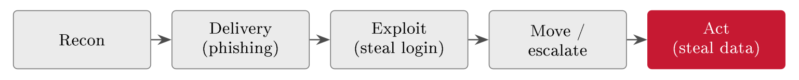
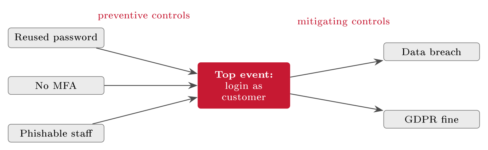
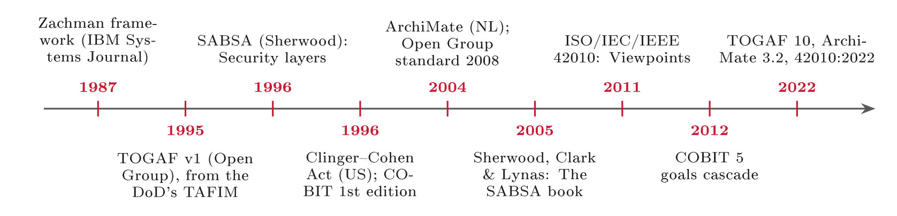

# Assessing risk: From assets to the register {#sec-08-assessing-risk}

Blocks I and II built the machinery --- the management system, the assets and
the legal duties, the control toolkit and the SoA. What that machinery runs on
is a disciplined assessment of risk, and Block III supplies it. This chapter
walks the assessment end to end at working depth, in the order a real one runs:
The defined process the standards prescribe, the scoping and asset work it
starts from, the drawing of the system as a data-flow diagram with its trust
boundaries --- the map on which threats are found and which five later chapters
reuse --- the craft of stating a risk precisely, with STRIDE run per element of
the diagram as the completeness check, the unfolding of each statement into a
concrete attack scenario --- the kill chain, attack trees, root causes and the
bow-tie --- and then estimates of likelihood and consequence that are grounded
in evidence rather than gut feeling, combined on the matrix, and recorded, with
their reasoning, in the risk register where everything lands. It closes with the
model behind all the pictures: Enterprise architecture, the layers from the
board's strategy to the individual computer, and the one vocabulary that lets an
auditor walk from a risk to a server and back. It is the longest chapter of the
script because it carries the fullest lecture: By the end you should be able to
run a defensible risk assessment on a small organisation --- and FastGoods gets
exactly that treatment along the way.

## The assessment as a defined process {#sec-08-the-assessment-as-a-defined-process}

A risk assessment is not brainstorming with a spreadsheet; it is a defined
sequence set out in international standards, and its output is the evidence base
for every decision that follows: A clear, ranked picture of what could go wrong
and how badly, the input to control selection (Lecture 10) and evaluation and
acceptance (Lecture 17), and a record you can defend to management and to an
auditor (Lecture 16). The underlying logic --- likelihood times consequence ---
predates computing, in insurance and safety engineering; what the standards
added is the discipline of doing it the same way every time.

::: {#def-riskassessment}
## Risk assessment

A risk assessment is the structured process of establishing the context,
identifying the risks (assets, threats, vulnerabilities and consequences),
analysing each risk's likelihood and impact, and evaluating the results against
agreed acceptance criteria. Its product is a prioritised risk register.
:::

Three standards frame the work, with a clean division of labour: ISO 31000 is
the generic enterprise risk-management framework; ISO/IEC 27005 applies it to
information security --- the risk method behind ISO 27001 (Chapter 3); and NIST
SP 800-30 is the US counterpart, describing the same sequence: Establish the
context, identify, analyse, evaluate. Edwards & Weaver frame the same work as a
four-phase lifecycle (@fig-ewcycle): Identify, assess and analyse,
mitigate and control, monitor and improve --- and the loop never ends (Edwards &
Weaver, Ch. 7, pp. 109 ff.). This chapter and the next are phases one and two;
phase three is Lecture 10; phase four runs through Block V.

{#fig-ewcycle}

ISO/IEC 27005 recognises two routes into identification, and most real
assessments blend them. The *asset-based* route starts from each asset and asks
what threatens it --- systematic and thorough, but potentially long. The
*scenario-based* (event-based) route starts from a risk scenario and asks which
assets it would hit --- faster, business-focused, and good for known threats.
Our walkthrough here is asset-based, because it teaches the full chain; in
practice you would open with the scenarios everyone already worries about and
then sweep the assets for what the scenarios missed.

One more piece of equipment before the work starts: Vocabulary, used exactly.
The terms of Chapter 1 return with one refinement --- the *threat source* (who
or what causes the harm) is separated from the threat itself --- and the working
sentence of the whole assessment is worth memorising: A risk needs a threat
*and* a vulnerability *and* an asset of value; drop any one and there is no
risk.

## Scope, criteria, and the assets {#sec-08-scope-criteria-and-the-assets}

Before identifying anything, fix two things: The boundary of the assessment and
the rulers you will measure with. The scope names which systems, processes and
data are in, what is explicitly out, and why --- tied to the business
understanding of Chapter 2, exactly as the ISMS scope of Chapter 3 was. The
criteria, which ISO 27005 insists are set in the context step, are the
likelihood scale, the impact scale, and the risk acceptance criteria (Lecture
17): Agreed up front and applied consistently. The order is the point --- set
the rulers before you measure, because deciding "what counts as high" after
seeing the results invites bias.

What agreed scales actually look like is worth showing, because "define your
scales" stays abstract until one is on the table (Tables [-@tbl-lscale]
and [-@tbl-cscale]). Five levels is the common choice --- enough
resolution to rank, few enough to apply consistently --- and each level carries
a definition in words, anchored where possible in frequencies and amounts, so
that two assessors reach the same level independently. FastGoods' versions are
deliberately sized to the company: Amounts that are rounding errors elsewhere
are existential here, which is exactly why scales are local, not borrowed.

::: {#tbl-lscale}
  **Likelihood level**   **Definition (FastGoods)**
  ---------------------- -----------------------------------
  Rare                   Less often than once in ten years
  Unlikely               Once in three to ten years
  Possible               Once in one to three years
  Likely                 One to several times a year
  Almost certain         Monthly or more often

  : A worked five-level likelihood scale, anchored in frequencies. "Likely" now
  means one thing to every assessor.
:::

::: {#tbl-cscale}
  **Consequence level**   **Definition (FastGoods)**
  ----------------------- ---------------------------------------------------------------
  Insignificant           Under NOK 10k; no customer notices
  Minor                   NOK 10--50k; brief inconvenience, no data exposed
  Significant             NOK 50--250k; hours of downtime or small exposure
  Major                   NOK 250k--1M; day-scale outage, or a breach with notification
  Disastrous              Over NOK 1M; survival-threatening, mass breach

  : A worked five-level consequence scale, anchored in amounts and effects sized
  to FastGoods. Scales are local: A bank's "minor" would be this company's
  "disastrous".
:::

Identification then starts from the assets, and two practical rules keep it
manageable. First, map asset *classes*, not every single item --- detail you can
maintain beats detail you cannot. Second, let the asset owners do the
identifying: The owner of Chapter 4 usually knows the asset and its real value
best; the security team facilitates. ISO 27005 distinguishes *primary* assets
--- the information and the business processes themselves --- from *supporting*
assets --- the hardware, software, networks, people and sites they depend on;
supporting assets belong in the assessment because the primary assets fail when
they do (Jøsang, §19.4, pp. 417 ff.).

Each asset is then profiled with a common set of attributes --- Jøsang's asset
template: An identifier, the owner, who runs it day to day, its location, its
dependencies, and --- the heart of it --- its *CIA value*: How bad the loss of
confidentiality, integrity or availability would be for this asset, on the
scales just agreed. Only the relevant attributes are filled per asset; the CIA
value is never skipped, because it is what the consequence ratings later stand
on.

::: {#exm-assetprofile}
## A FastGoods asset profile

Three FastGoods assets, profiled with the template (@tbl-assetprofile).
Already the priorities differ --- the customer database is above all about
confidentiality, the checkout about availability, the payment flow about
confidentiality and integrity --- and that difference shapes which risks each
asset attracts. Note also the dependency column doing quiet work: The database
depends on hosting and backups, so a supporting-asset failure (an untested
backup) is already visible as a route to a primary-asset loss.
:::

::: {#tbl-assetprofile}
  **Asset**            **Owner**   **CIA priority**   **Depends on**
  -------------------- ----------- ------------------ ----------------------
  Customer database    IT          C high, I high     Hosting, backups
  Webshop / checkout   Ops         A high             Network, payment API
  Payment data flow    Finance     C high, I high     Payment provider

  : FastGoods assets under Jøsang's template (§19.4). The CIA priorities differ
  per asset --- and that difference steers the whole assessment.
:::

## Mapping the system: The data-flow diagram {#sec-08-mapping-the-system-the-data-flow}

The asset profile is a list, and a list has no edges. It says what the customer
database is worth and who owns it, but not how a customer's password reaches it,
which other systems read it, or where the data leaves the company altogether.
Those edges are where risk concentrates, and the assessment needs a way of
seeing them before it starts naming threats. The instrument is old, simple and
borrowed: The data-flow diagram (DFD), drawn on one page, with the places where
trust changes marked on it. Four reasons make the drawing worth the hour it
takes. First, the ISMS scope of Clause 4.3 (Chapter 3) must state its interfaces
and dependencies, not only its inventory --- and a scope statement is far easier
to write from a picture that shows where the system ends. Second, the attack
surface becomes visible: An attacker enters where data crosses from a zone she
controls into one she does not, and on the diagram those places are arrows over
a dashed line. Third, every external party on the picture is a legal and a
commercial question at once --- a processor or independent controller under the
GDPR (Chapter 7) and a supplier to be tiered and contracted (Lecture 19).
Fourth, the auditors expect one: PCI DSS v4.0 requires an accurate, maintained
diagram of all account-data flows (Requirement 1.2.4), and the financial
auditor's standard ISA 315 asks how transactions flow through the information
system before any control is tested (Lecture 16 returns to that walkthrough).
Jøsang shows a web system through its interfaces --- client, front end, back
end, database --- as the places an attack can enter (Jøsang, §11.5, Fig. 11.5);
the DFD makes that picture systematic, with every interface a named flow.

### Where the diagram comes from {#where-the-diagram-comes-from .unnumbered}

The DFD was not invented for security. It belongs to the structured analysis
movement of the 1970s, when software projects had grown too large to specify in
prose and analysts needed a way to describe a system's function without writing
its code. Douglas Ross's SADT (1977) and, above all, Tom DeMarco's *Structured
Analysis and System Specification* (1978) gave the bubble-and-arrow notation
still called Yourdon/DeMarco; Chris Gane and Trish Sarson published a rival
notation a year later (1979) that differs only in shapes. Twenty years passed
before security adopted it. In 1999 two Microsoft engineers, Loren Kohnfelder
and Praerit Garg, wrote the internal memo that introduced STRIDE as a checklist
of what can go wrong with a component; when Microsoft made threat modelling a
mandatory step of its Security Development Lifecycle in 2004, Frank Swiderski
and Window Snyder's *Threat Modeling* fixed the method that is still taught:
Draw the DFD, mark the trust boundaries, run the checklist against each element.
LINDDUN (2010, KU Leuven) did the same for privacy threats, Adam Shostack's
textbook (2014) made the whole method a discipline, and the Threat Modeling
Manifesto (2020) distilled it to four questions --- what are we working on, what
can go wrong, what are we going to do about it, did we do a good job. In
parallel the diagram became a compliance artefact: PCI DSS v3.0 (2013) made a
card-data flow diagram mandatory, and v4.0 keeps it as Requirement 1.2.4.
@fig-dfdhistory puts the lineage on one line;
@sec-08-enterprise-architecture-management returns to the neighbouring
lineage of enterprise architecture.

{#fig-dfdhistory}

### Notation: Four symbols and a boundary {#notation-four-symbols-and-a-boundary .unnumbered}

::: {#def-dfd}
## Data-flow diagram

A data-flow diagram is a picture of a system built from four elements ---
external entities (people or systems the organisation does not control),
processes (anything that changes data), data stores (data at rest) and data
flows (data in motion, labelled by its content) --- and, in its security use, a
fifth: The trust boundary. It shows where data moves and rests, not in what
order work happens.
:::

::: {#def-trustboundary}
## Trust boundary

A trust boundary is a line on the diagram where the level of trust changes ---
between the internet and the company, between a web tier and a data tier,
between one organisation and another. Every data flow that crosses one is a
point where an attacker can enter, tamper or listen, and therefore a mandatory
stop for the threat checklist.
:::

@tbl-dfdnotation shows the symbols as this script draws them: Rectangles
for external entities, circles for processes (Gane and Sarson use rounded
rectangles), open double lines for stores, labelled arrows for flows, and a
dashed line for the boundary Microsoft added in 2004. Four rules keep the
drawing honest. A process has at least one flow in and one out --- a bubble with
nothing entering is not doing anything. A store is read or written only by a
process, never directly by an external entity; if a customer seems to write
straight into the database, a process has been forgotten, and the forgotten
process is usually where the missing control sits. A flow is labelled with its
data ("credentials", "card details"), not its technology ("HTTPS", "API"),
because the data is what has a CIA value. And the diagram shows where data
moves, not in what order --- sequence belongs to the process maps of Chapter 2.
Diagrams come in levels: The context diagram (Level 0) shows the whole system as
one process with its external entities; Level 1 splits it into its main
processes and stores; Level 2 expands one process only where risk concentrates.
The rule for stopping is practical: Go one level deeper until every trust
boundary and every data store is visible, which for a small organisation is
usually Level 1.

::: {#tbl-dfdnotation}
   **Symbol**  **Element**       **Meaning and rule**
  ------------ ----------------- -----------------------------------------------------------------------------------------------
               External entity   People or systems outside your control: The customer, the payment provider, the tax authority
               Process           Changes data; at least one flow in and one out; the whole system is process 0
               Data store        Data at rest --- database, file, backup; read or written only by a process
               Data flow         Data in motion, labelled by content, not technology
               Trust boundary    Where the level of trust changes; every crossing arrow is an entry point

  : The DFD notation used in this course: Yourdon/DeMarco shapes (1978) with the
  trust boundary added by Microsoft's SDL (2004).
:::

### FastGoods, drawn {#fastgoods-drawn .unnumbered}

The context diagram (@fig-fgcontext) is the scope statement of Chapter 3
drawn rather than written: The circle is FastGoods.com as one process --- and,
not by coincidence, the ISMS scope of Clause 4.3 --- and the six boxes around it
are the parties it exchanges data with. Two of them are people (customers;
staff, who are inside the company but outside the system), four are
organisations: The payment service provider (PSP), the shipping carrier, the
e-mail and newsletter service, and Skatteetaten through Altinn, which receives
the VAT return and, on request, the SAF-T accounting file that the bookkeeping
regulation requires every Norwegian business to be able to produce
(bokføringsforskriften § 7-8) --- an auditor's favourite request, and a data
flow most webshops forget they have. Four of the six flows carry personal data
out of the company. That single observation generates work in three later
chapters: Each recipient is a row in the Article 30 record, each processor needs
an Article 28 contract (Chapter 7), each organisation is a supplier to be tiered
and monitored (Lecture 19). A useful classroom question is which arrow the
diagram would gain if marketing added an analytics widget to the shop page ---
and to whom that arrow would point.

{#fig-fgcontext}

Level 1 (@fig-fglevel1) opens the circle. Three processes --- login and
account management, checkout, and the back office where staff pick orders and
edit customer records --- two data stores, D1 the customer database and D2 the
order database, and two trust boundaries: TB1 separates the internet from
FastGoods, TB2 separates the web tier in the demilitarised zone from the
internal data tier. Every arrow that crosses a dashed line is an entry point,
and the three running risks each sit on exactly one element of the picture: R1
on the credentials flow crossing TB1 into the login process (spoofing, no MFA),
R2 on the checkout process at the edge (denial of service), R3 on the data store
D1 (information disclosure).

{#fig-fglevel1}

::: {.callout-important}
## The running case: What the picture adds

Three things the asset list could not show. First, card details bypass FastGoods
altogether --- the customer types them into the provider's hosted payment page
--- which is why FastGoods qualifies for PCI DSS's lightest self-assessment
questionnaire (SAQ A) instead of a full audit; a design decision worth
thousands, visible only on the diagram. Second, D1 has two paths in: The
customer's login through process 1, and the staff's editing through process 3.
The register so far treated R3 as a matter of customer-facing access control;
the diagram says that admin access to the back office needs the same rigour as
the customer login, and Chapter 10 will place a control on that second path.
Third, the checkout depends on the payment provider: Part of its availability is
inherited from a company FastGoods does not run, so R2's rating and its
treatment both reach outside the company --- the supplier question Lecture 19
takes up. None of the three came from a catalogue; all three came from drawing.
:::

### Three notations, three questions {#three-notations-three-questions .unnumbered}

A data-flow diagram answers one question well --- where does data move and rest,
and which boundary does it cross --- and two other questions badly, because it
was not built for them. In what order does work happen, and who is responsible
for each step? That is the process model, and its standard notation is BPMN,
which Chapter 2 introduced for the order process. Which services exist, who
provides and consumes them, and on what contract? That is a service
architecture, and OMG's SoaML answers it. @tbl-notations places the
three by the question each answers, and @fig-bpmnsoaml draws the same
FastGoods order twice more. The point of drawing all three is not choice but
agreement: A BPMN message flow between two pools and a SoaML service contract
between two participants are the DFD's arrow over TB1, seen from the process
side and the contract side. In practice the DFD is the shortest route to the
risks; BPMN adds order and responsibility, which is what an audit narrative and
a segregation-of-duties check need (Lectures 11 and 16); SoaML adds the
contract, which is what Lecture 19 negotiates. Enterprise architects mostly use
a fourth language, ArchiMate, which
@sec-08-enterprise-architecture-management introduces.

::: {#tbl-notations}
  **Notation**   **The question it answers**                                                **Origin**                                                    **Used in the course for**
  -------------- -------------------------------------------------------------------------- ------------------------------------------------------------- ---------------------------------------------------------------------------------------------------------------------
  **DFD**        Where does data move and rest, and which boundary does it cross?           DeMarco 1978; Gane & Sarson 1979; security use since 1999     Threat modelling (this chapter, Chapter 13); the DPIA's description (Chapter 9); the audit walkthrough (Chapter 16)
  **BPMN**       In what order does work happen, and who does it?                           BPMI 2004, OMG 2006; BPMN 2.0 (2011) $=$ ISO/IEC 19510:2013   Process maps and the BIA (Chapters 2, 12); control points and segregation of duties (Chapters 10, 11)
  **SoaML**      Which services exist, who provides and consumes them, on which contract?   OMG; beta 2009, version 1.0 in 2012; a UML profile            The service and API landscape; supplier contracts (Chapter 19)

  : Three notations, three questions. Complementary, not rivals: The DFD first;
  BPMN for order and responsibility; SoaML for service and contract.
:::

{#fig-bpmnsoaml}

### Tools {#tools .unnumbered}

Any tool will do as long as the four symbols and the boundary stay recognisable,
and the ones in @tbl-dfdtools cost nothing. Two of them take the diagram
one step further and generate the threat checklist of the next section per
element. One governance point is worth stating before the tool question is
settled: The diagram is documented information in the sense of ISO/IEC 27001
Clause 7.5. Keep and date the source file --- the `.drawio` XML, the Threat
Dragon JSON --- not only the exported picture, because an assessor will ask when
it was last updated, and a photograph of a whiteboard cannot answer.

::: {#tbl-dfdtools}
  **Tool**                         **Draws**                                                                 **Cost, platform**                   **Note**
  -------------------------------- ------------------------------------------------------------------------- ------------------------------------ ----------------------------------------------------------------------------------
  draw.io (app.diagrams.net)       DFDs from basic shapes; BPMN 2.0 and UML libraries                        Free; browser or desktop             The default for the arbeidskrav; keep the `.drawio` source
  OWASP Threat Dragon 2.x          DFDs with trust boundaries; STRIDE, LINDDUN and CIA threats per element   Free, open source; web and desktop   The next section's method as a button; exports a report
  Microsoft Threat Modeling Tool   DFDs with trust boundaries; STRIDE list generated from a template         Free; Windows only                   The SDL lineage of 2004; Azure template included
  bpmn.io / Camunda Modeler        BPMN 2.0: Pools, lanes, message flows, gateways                           Free; browser or desktop             Standard BPMN XML (ISO/IEC 19510)
  Modelio; Archi                   SoaML (Modelio); ArchiMate (Archi)                                        Free, open source                    For the architecture views of @sec-08-enterprise-architecture-management

  : Free tools for the three notations. Diagrams as text --- PlantUML, Mermaid,
  and the TikZ this script uses --- are an alternative that fits version
  control.
:::

::: {.callout-tip}
## Finding the risk: The diagram as a source

Chapter 1's box named four places where risks are found, and the second --- a
system or IT process --- is the one students find hardest to walk without a map.
The data-flow diagram is that map, and it turns the system source into a
procedure: Stand on every arrow that crosses a trust boundary and every data
store, and ask the question --- what can go wrong here? --- once per element.
The answers are found, not produced: Each one points at a named flow or store,
which is exactly the traceability the assessors look for. The next section makes
the question systematic with a checklist that knows which answers are plausible
for which element.
:::

The diagram is drawn once and used five times over the course, which is the
strongest argument for drawing it well (@tbl-dfdreuse).

::: {#tbl-dfdreuse}
  **Chapter**   **What is overlaid on the diagram**                        **Why**
  ------------- ---------------------------------------------------------- ----------------------------------------------------------------------
  8 (here)      The three risks, then STRIDE per element                   Threat identification with a completeness check
  9             The personal-data flows and the GDPR role of every party   The DPIA's systematic description, Art. 35(7)(a); the Art. 30 record
  10            The selected controls, placed where they act               A control has a location, an owner and a test point
  12            The dependencies of the critical services                  Continuity planning: What the checkout needs to run
  16            One order followed through the system in six stops         The audit walkthrough (ISA 315); PCI DSS 1.2.4; ISAE 3402
  19            Every external entity as a supplier, tiered                The supplier register; DORA's register of information

  : One diagram, many uses. The same two figures return in five later chapters
  with a different overlay each time.
:::

## Formulating the risks {#sec-08-formulating-the-risks}

With the assets profiled, identify what threatens them --- and do not invent
threats from scratch. Threat modelling means working through plausible threat
*scenarios* per asset, and structured sources exist precisely so nothing obvious
is forgotten: The threat catalogues of ISO/IEC 27005's annex, NIST SP 800-30's
appendices, and Germany's BSI IT-Grundschutz; and checklist methods, of which
STRIDE is the classic. Written down at Microsoft in 1999 by Loren Kohnfelder and
Praerit Garg, STRIDE names six threat categories --- spoofing, tampering,
repudiation, information disclosure, denial of service, elevation of privilege
--- each mapping to a CIA property or to accountability, so walking an asset
through all six is a systematic way to ask "what could go wrong here?"
(@tbl-stride). Jøsang puts the purpose plainly: Threat modelling helps
owners see where the weaknesses lie, so they can be addressed (Jøsang, §19.4,
pp. 417 ff.).

Before any catalogue or checklist, pause on the question students find hardest
--- and the one no template answers: *Where do risks actually come from?*
Chapter 1's box gave the rule; here it becomes the working method
(@fig-risksources). A risk is whatever can go wrong, and it is found in
one of four concrete places: A business process, walked step by step with one
question per step; a system or IT process, asked the same question at the layer
of access, change and operations; an existing control, read backwards to the
risk it exists against and then tested --- effective, or ineffective and
therefore itself a risk; or an audit finding, which is a risk somebody has
already found and documented.

{#fig-risksources}

The drill that follows has three steps, and it works precisely because it never
starts from a blank page. *First*, pick a place to look --- one process step,
one asset, one control, one finding. *Second*, ask the question that belongs
there: What can go wrong here? --- or, for a control: What does this prevent,
and does it actually work? *Third*, write the answer straight into the pattern
of @def-riskstatement, filling every blank --- source, event, weakness,
asset, harm. If a blank cannot be filled, nothing has been found yet; go back to
step one and look somewhere more specific. The test cuts both ways, and it is
worth stating plainly because generated text fails it reliably: A risk that
cannot be traced back to a specific step, asset, control or finding has not been
*found* --- it has been *produced*, and it will read plausibly and assess as
nothing. Traceability to a source is what makes a risk real, ratable and ownable
--- and it is the first thing this course's assessors look for.

::: {#exm-thesisdrill}
## The thesis, run through the drill

The drill on a student's own portfolio, to show it owes nothing to companies.
*Step one*, pick a place: The process of writing a thesis --- write, save, hand
in. *Step two*, ask at "save": What can go wrong here? The laptop dies, or is
stolen, holding the only copy --- a structural and an adversarial threat source
meeting at one step. *Step three*, the pattern: Hardware failure or theft
destroys the only copy of the thesis, exploiting the absence of any backup,
costing months of work and a delayed graduation. Now the third source, for the
second risk: The cloud-sync icon in the corner is a control --- read backwards,
it exists against exactly this loss. Test it: When did it last actually sync? A
control never checked is Chapter 10's ineffective control in miniature, and "my
files were syncing, I thought" is the student edition of the unread mailbox.
Traceable source, full pattern, tested control --- the drill, complete, on an
asset every reader owns.
:::

::: {#tbl-stride}
  **STRIDE threat**        **Means**                       **FastGoods example**
  ------------------------ ------------------------------- ---------------------------------
  Spoofing                 Pretending to be someone else   Logging in as a customer (R1)
  Tampering                Altering data or code           Changing an order total
  Repudiation              Denying an action, no proof     Disputed order; no audit log
  Information disclosure   Data to the wrong people        The database leaks (R3)
  Denial of service        Making a service unavailable    Checkout flooded offline (R2)
  Elevation of privilege   Gaining rights wrongly          Customer account reaching admin

  : The STRIDE checklist (Kohnfelder and Garg, Microsoft, 1999). Six categories,
  each tied to a CIA property or accountability --- so no class of threat is
  forgotten.
:::

### STRIDE per element {#stride-per-element .unnumbered}

Walked per asset, STRIDE is a checklist; walked per element of the data-flow
diagram, it becomes a method, and Adam Shostack's *Threat Modeling* (2014)
supplies the refinement that makes it practical. Not every category applies to
every element: A data flow cannot elevate privilege and a data store cannot
spoof anyone, so asking all six questions of every element wastes time on
impossibilities and buries the plausible cells. Shostack's table (his Table 3.1)
narrows the checklist to what each element can suffer: An external entity can be
spoofed and can repudiate what it did; a process is exposed to all six; a data
flow to tampering, disclosure and denial; a data store to tampering, disclosure,
denial --- and to repudiation only where it holds logs or other evidence.
@tbl-strideelement applies the grid to the FastGoods Level 1 diagram
(@fig-fglevel1). Two consequences follow. A per-element pass over even a
small diagram yields dozens of cells; most are pruned as implausible or already
treated, and the survivors are written into the pattern of the next definition,
one statement per cell. And the pass is a completeness check on the gut-feel
list: Chapter 13 will use it as such.

::: {#tbl-strideelement}
  **Element**          **S**       **T**            **R**            **I**       **D**       **E**    **FastGoods element $\rightarrow$ candidate threat**
  ----------------- ----------- ----------- --------------------- ----------- ----------- ----------- --------------------------------------------------------------------------------------------
  External entity    $\bullet$                    $\bullet$                                           Payment provider: A forged "payment OK" callback (S); a customer denies an order later (R)
  Process            $\bullet$   $\bullet$        $\bullet$        $\bullet$   $\bullet$   $\bullet$  Checkout: Flooded offline (D $=$ R2); a price altered in transit (T)
  Data flow                      $\bullet$                         $\bullet$   $\bullet$              Credentials over TB1: Replayed from a leak (feeds R1); read in transit without TLS (I)
  Data store                     $\bullet$   $\bullet^{\dagger}$   $\bullet$   $\bullet$              Customer database D1: Bulk read (I $=$ R3); records edited with no audit log (R)

  : STRIDE per element (Shostack 2014, Table 3.1) applied to FastGoods.
  $^{\dagger}$Only for a store that holds logs or evidence. Two of the
  candidates --- the forged callback and the unlogged edit --- were missing from
  the gut-feel list of three.
:::

::: {#exm-strideelement}
## Two threats the list of three missed

FastGoods' register began with R1--R3, found from the order process and the
asset list. The per-element pass adds two candidates that neither source
produced. *Spoofing the external entity*: The checkout trusts a callback from
the payment provider saying "paid"; if that message is not verified --- a
signature, a server-to-server check --- an attacker can order goods with a
forged confirmation. Written in the pattern: A fraudster forges the provider's
payment confirmation, exploiting an unverified callback, so that FastGoods ships
unpaid goods --- direct financial loss. *Repudiation at the data store*: Staff
edit customer records in the back office; if D1 keeps no audit log, a disputed
change cannot be attributed to anyone --- and an insider's theft leaves no
trace. Written in the pattern: A malicious insider alters or copies customer
records, exploiting the absence of an audit log on D1, so that the change cannot
be attributed and the loss cannot be sized --- undetected fraud and an
unreportable breach. Both survive pruning, both get a row, and both point at a
control with a location: The callback check sits on the flow from the provider,
the log on the store.
:::

Threat *sources* deserve the same systematic breadth. NIST SP 800-30 groups them
into four kinds, and covering all four guards against the commonest blind spot:
*Adversarial* (criminals, hacktivists, malicious insiders, states), *accidental*
(human error, misconfiguration), *structural* (equipment and software failure,
aged systems) and *environmental* (fire, flood, power loss). Security is not
only about hackers --- a team that ignores the accidental and environmental
columns leaves real risks unseen. The vulnerabilities side you know from Chapter
4 --- technical, process and human --- with one addition for later: Technical
severity is often scored with CVSS on a 0--10 scale, which this chapter returns
to among the standard vulnerability references.

The identification step ends by *stating* each risk, and the statement is a
craft with a pattern:

::: {#def-riskstatement}
## Risk statement

A risk statement names, in one sentence, the threat source, the event, the
vulnerability exploited, the asset affected and the consequence: \[Threat
source\] $\rightarrow$ \[event\] exploiting \[vulnerability\] $\rightarrow$
\[asset\] $\rightarrow$ \[consequence\]. A statement in this form is assessable;
a fragment is not.
:::

The common mistakes are exactly the fragments: "Cyber attack" (too vague to
rate), "no MFA" (a missing control stated as a risk --- it names a weakness but
no event, asset or harm), and statements with no consequence (nothing to weigh).
The test of a good statement is that a colleague could rate it without asking
you what you meant.

::: {#exm-statements}
## Writing the FastGoods statements

The three running risks, each stated in full. **R1**: A criminal uses stolen,
reused passwords to access customer accounts --- the vulnerability being the
absence of MFA --- exposing personal data, with a breach and a GDPR fine as the
consequence. **R2**: An attacker floods the checkout with traffic --- no DDoS
protection in place --- making the shop unavailable, with lost sales as the
consequence. **R3**: An attacker reaches the customer database through weak
access control, with mass data theft as the consequence. Each names a source, a
weakness, the asset and the harm --- so each can now be rated. Compare the
before and after: "An attacker reuses a leaked password and takes over a
customer account, exposing personal data" is R1; "hackers" was a worry.
:::

## From statement to scenario {#sec-08-from-statement-to-scenario}

Behind every risk statement is a threat actor following a path: The actor
controls a scenario of steps, exploits vulnerabilities along the way, and ---
where those vulnerabilities exist --- turns the scenario into an incident with
an impact on the asset. Jøsang makes the conditionality the point: A threat
scenario becomes an incident *when vulnerabilities exist*, and different
weaknesses are exploited at different steps (Jøsang, §19.4, pp. 417 ff.). The
chain of Chapter 4 thus gains a stage --- the scenario itself --- and gains
analytical power with it, because a path can be examined step by step where a
one-liner cannot.

::: {#def-scenario}
## Threat scenario

A threat scenario is the concrete, ordered path by which a threat source reaches
an asset: The actor, the steps taken, the vulnerability exploited at each step,
and the resulting incident and impact. Unfolding a risk into its scenario is
what makes its likelihood and its defences analysable.
:::

Who the actor is shapes everything downstream, because capability and motivation
drive both the likelihood and the sophistication of the attack
(@tbl-actorladder). Chapter 4 introduced the cast; the analytic ladder
here adds capability --- and the practical consequence: A risk from a
nation-state APT is judged on entirely different assumptions than one from a
script kiddie, and FastGoods' realistic ladder tops out at the profit-driven
cybercriminal (Jøsang treats the threat actor as an explicit element of the
assessment; §16.1 and §10.8).

::: {#tbl-actorladder}
  **Actor**            **Capability**   **Motivation**        **Typical attack**
  -------------------- ---------------- --------------------- ----------------------
  Script kiddie        Low              Thrill, curiosity     Off-the-shelf tools
  Hacktivist           Medium           Ideology              Defacement, DDoS
  Cybercriminal        Medium--high     Money                 Ransomware, fraud
  Insider              Varies           Grievance, money      Data theft, misuse
  Nation-state (APT)   Very high        Espionage, sabotage   Stealthy, persistent

  : The capability ladder of threat actors. The same nominal risk is judged very
  differently depending on who is behind it --- and honesty about the realistic
  actor keeps the estimate sober.
:::

The actor arrives along a vector --- Chapter 4's term, now applied analytically.
Jøsang notes that an attack vector is broadly the same thing as a threat, and
that mapping the classic vectors is the natural first move of threat modelling
(Jøsang, Ch. 2, pp. 25 ff.): Phishing and social engineering (the most common),
malware and ransomware, direct attack on a vulnerable system --- and, further
out, the supply chain (Lecture 19), insiders (Lecture 13), DDoS, and newer
variants from deepfake calls to QR-code phishing. Rather than improvising, the
field offers established methods for finding threats systematically, each
answering a different question (@tbl-tmmethods): STRIDE asks *what
kinds* of threat exist (Chapter 8); attack trees --- Bruce Schneier's
formulation from 1999 --- break an attacker's goal into the steps and options
for reaching it; the Cyber Kill Chain shows *how* an intrusion unfolds stage by
stage; and MITRE ATT&CK catalogues real adversary tactics and techniques at
encyclopaedic scale. Broader methods such as PASTA and OCTAVE add attacker- and
asset-driven framings; the working analyst keeps two or three of these within
reach and picks by question. Much of this terrain --- vectors, chains, ATT&CK
--- is what *Ethical Hacking* practised from the attacker's chair; here the same
maps are read from the defender's.

::: {#tbl-tmmethods}
  **Method**         **What it gives you**
  ------------------ -----------------------------------------------------------
  STRIDE             Six threat categories as a completeness checklist (above)
  Attack trees       A goal broken into the steps and options to reach it
  Cyber Kill Chain   The stages of an intrusion, start to finish
  MITRE ATT&CK       A large catalogue of real adversary tactics & techniques

  : Threat-modelling methods and their questions. STRIDE asks what kinds; trees
  and the kill chain show how; ATT&CK shows what real adversaries actually do.
:::

One of the methods deserves a picture, because it thinks differently from the
chain: An attack tree starts from the attacker's goal and branches downward
through the alternative ways of reaching it (@fig-attacktree). Where the
kill chain follows one path in sequence, the tree shows the options in parallel
--- and defence planning reads it bottom-up: A control on a branch closes that
branch, and only closing every branch closes the goal. For R1 the tree makes an
uncomfortable point visible at a glance: MFA closes the credential-stuffing
branch and blunts phishing, but the account-recovery branch stays open until the
reset process is hardened too.

{#fig-attacktree}

The Cyber Kill Chain --- published by Lockheed Martin in 2011 --- frames an
intrusion as ordered stages, and its defensive lesson is the reason it became
standard: A control at *any* stage can break the whole chain, which is defence
in depth stated as a picture (@fig-killchain). Each stage relies on a
vulnerability; MFA at the exploit stage or monitoring at the movement stage
stops everything after it.

{#fig-killchain}

::: {#exm-r1scenario}
## R1 as a worked scenario

FastGoods' account-takeover risk, unfolded along the chain. *Recon:* The
attacker buys a list of leaked email--password pairs. *Delivery:* The list is
tried against the FastGoods login --- credential stuffing, automated and
indiscriminate. *Exploit:* A customer reused their password, and with no MFA the
login succeeds. *Act:* The attacker reads the customer's stored personal data
and order history. Written this way, the weak points are no longer abstract:
Reused passwords and the missing second factor sit at the exploit step, which is
exactly where a control belongs (Lecture 10) --- and exactly the insight
Schneier's attack trees and the kill chain were built to produce.
:::

The scenario's second service is honesty about likelihood. A short path with few
barriers is more likely to succeed; a long path needing many steps to align is
less likely; and every existing control is a barrier that lowers the odds.
Without the scenario, "likely" is a guess; with it, you can point to the
specific steps and barriers that justify the rating --- which is precisely the
analysis @sec-08-estimating-and-rating builds on. Seen from Chapter 1's
box, a scenario is nothing new: It is the first source's question --- what can
go wrong here? --- asked at every step of the path instead of once, with each
existing barrier tested for effectiveness on the way through. Students who
freeze at "formulate a risk" rarely freeze at "what happens next?"; the scenario
turns the first question into a chain of the second.

## Vulnerabilities and their causes {#sec-08-vulnerabilities-and-their-causes}

At each step of a scenario sits a weakness, and Jøsang gives the sum of them a
useful name: The *vulnerability surface* is the set of all attack vectors an
actor can use against you. Controls work by removing or replacing a
vulnerability so the actor cannot proceed --- in R1 the decisive weakness is the
missing second factor, so adding MFA breaks the chain even if passwords keep
leaking, which is why one well-placed control often beats many weak ones. The
scenario also disciplines the search: It points to the vulnerabilities actually
*on the attack path* --- configuration, patching, access, process, people ---
rather than every theoretical weakness in the building.

A good analysis then asks one more question: *Why* does the weakness exist? The
symptom is rarely the real problem --- "a server was unpatched" is a symptom;
"no patch process exists" is the cause --- and the classic tool is the 5 Whys,
asking "why?" repeatedly until a root cause appears; the technique comes from
Toyota's production system, and it transfers to security unchanged. The payoff
is leverage: Patch one server and the next is still exposed; fix the process and
they all are. Root-cause thinking is what makes the controls of Lecture 10 treat
classes of risk rather than instances.

For the technical weaknesses, the field keeps standard references, and the three
are worth keeping apart (maintained around the US National Vulnerability
Database and FIRST): **CVE** gives a unique identifier for a specific known flaw
in a product; **CWE** catalogues weakness *types*, such as weak authentication;
**CVSS** scores a flaw's severity on a 0--10 scale. CVE says which, CWE says
what kind, CVSS says how bad --- and a CVSS score feeds directly into a risk's
consequence and priority (Lecture 13).

One picture ties causes, event and consequences together: The bow-tie, borrowed
from safety engineering in the process industries (@fig-bowtie). Causes
fan in from the left, consequences fan out to the right, the *top event* sits at
the knot --- and controls appear as barriers on both sides: Preventive controls
left of the knot stop the event; mitigating controls right of it limit the
damage. One drawing carries a whole risk, and it will reappear when preparedness
(Lecture 12) works the right-hand side in earnest.

{#fig-bowtie}

## Estimating and rating {#sec-08-estimating-and-rating}

Rating a risk means judging its likelihood and its consequence on the agreed
scales --- qualitatively for now, in defined levels; Lecture 20 returns to put
numbers and money on the same risks, and to show the limits of doing so. The
scales must be written down, because a "likely" means nothing unless everyone
uses the same definition; this is where qualitative assessment earns or loses
its credibility. And neither judgement is gut feeling --- each has nameable
drivers. Likelihood is driven by the threat source's capability and motivation,
by how exposed the vulnerability is, and by the strength of existing controls.
Consequence is driven by the CIA impact on the asset (the template of Section
8.2 paying off), by the business harm --- money, legal, reputation --- and by
how many assets or customers are affected. Naming the drivers makes a rating
defensible: You can say *why* a risk is "likely" or "major", not just assert it.

Each judgement can now be sharpened in turn --- likelihood first, because it is
the one the scenario work above was built to discipline.

Likelihood asks a sharper question than people expect: Not "could this happen?"
--- almost anything could --- but "how often do we expect this scenario to
*succeed* over a stated period", usually a year. Framing it as an annual rate
does two jobs at once: It stops the common mistake of rating everything
"possible" merely because it is conceivable, and it is what later permits the
quantitative step --- the annualised loss expectancy of Lecture 20. For a DDoS
on FastGoods' checkout the honest answer might be "once or twice a year", which
is a rating one can argue with; "possible" is not.

A defensible estimate combines three inputs rather than picking a level from the
air: The *threat* --- the actor's capability and motivation, and how active this
threat is right now; the *exposure* --- how reachable the vulnerability is,
internet-facing or internal; and the *controls* --- how strong the existing
barriers are, and how many steps must all succeed. High capability, high
exposure and weak controls push the estimate up; naming the three lets you
defend the rating step by step, which is the difference between an assessment
and an opinion.

Ground the inputs in evidence where you can. Three sources recur: Your own
history --- incidents and near-misses in the logs; *cyber threat intelligence*
(CTI) --- structured knowledge of what attackers are doing now, to which Jøsang
devotes a chapter (§16.2, pp. 340 ff.), and which answers the "how active is
this threat" input directly; and sector reports and breach statistics --- the
Verizon DBIR is the standard example --- which supply base rates. For FastGoods,
failed-login spikes in the logs are stronger evidence for R1's likelihood than
any amount of gut feeling.

::: {#exm-r2likelihood}
## Justifying R2's rating

Walk the three inputs for the DDoS risk. Threat: DDoS-for-hire services make the
attack cheap and require no skill, and extortion campaigns against webshops are
a documented, active pattern --- capability and activity both present. Exposure:
The checkout is internet-facing by definition. Controls: The cloud provider's
basic filtering absorbs small floods; a determined attack still lands.
Conclusion: "Possible --- on the order of once a year" --- written into the
register with exactly this reasoning, so that next year's review can test the
reasoning, not just the label.
:::

The hardest estimates are for events that have never happened to you, and two
disciplines keep them honest. First, "never happened" is weak evidence on its
own --- use base rates and other organisations' experience, because a big, rare
risk can still demand action. Second, watch the biases that bend estimates:
Recency bias over-rates whatever happened last; optimism bias --- "it won't
happen to us" --- under-rates everything else. The student version is familiar:
"I have never overslept an exam" --- true for everyone, once. An estimate that
names its evidence is the antidote to both. One pointer beyond this course's
qualitative method, for orientation: The best-known fully quantitative
alternative is FAIR --- Factor Analysis of Information Risk --- which decomposes
risk into loss-event frequency and loss magnitude and estimates each as a
calibrated range rather than a single number. Lecture 20 borrows its spirit ---
frequencies, distributions, honesty about uncertainty --- without adopting the
full machinery; what is worth taking already is its framing discipline: Every
input is a range with a rationale, which is exactly the "why" column of this
chapter's register, generalised.

Consequence is judged across dimensions, not as one number: Financial (lost
sales, recovery cost), legal and regulatory (GDPR fines, Chapter 7),
reputational (lost customer trust) and --- in the critical sectors of Lecture 5
--- safety. The disciplined route starts from the CIA impact on the asset, using
Chapter 8's profiles: Loss of confidentiality means a breach, loss of integrity
means decisions on bad data, loss of availability means downtime; translate that
into business harm, and take the worst affected dimension as the consequence
level.

::: {#def-bia}
## Business impact analysis

A business impact analysis (BIA) estimates consequence systematically, above all
how harm grows over time: For each critical process, what an hour, a day, a week
of disruption costs. Coming from business-continuity practice (ISO 22301), it
yields time targets such as the recovery time objective (RTO) and the maximum
tolerable downtime (MTD), identifies the most time-critical processes, and feeds
both the consequence ratings here and the preparedness planning of Lecture 12.
:::

::: {#exm-downtime}
## The downtime clock on R2

For FastGoods the BIA's time dimension changes the picture. An hour of checkout
downtime is an hour of lost sales; a Saturday afternoon is the week's peak
revenue; a full day starts costing customer relationships, not only orders. Harm
that grows with time makes availability risks more serious than a static view
suggests --- which is why R2's consequence is rated "major" despite no data
being touched, and why its treatment (Lecture 10) will care as much about
recovery speed as about prevention.
:::

The two judgements combine on the risk matrix (@fig-riskmatrix):
Likelihood along one axis, consequence along the other, and the cell gives the
risk level (Jøsang, §19.5, pp. 421 ff.). Plotting FastGoods' three risks makes
the picture concrete --- R1 and R3 land high through different routes (R1 by
likelihood, R3 by consequence), and R2 sits high as well once the downtime cost
is honest. The matrix is the standard communication device of the whole field
precisely because a board can read it in ten seconds; its limits --- coarse
cells, tempting precision --- are part of Lecture 20's story.

{#fig-riskmatrix}

::: {#def-inherentresidual}
## Inherent and residual risk

The *inherent* risk is the risk with no controls in place --- the raw exposure.
The *residual* risk is what remains after the controls you actually have. Every
rating should say which of the two it is; decisions are taken on the residual
(Lectures 10 and 17).
:::

Rate inherent first to see the exposure, then residual to see where you stand
today --- the gap between the two is what your existing controls are buying you,
which is worth knowing before you buy more.

## Into the register {#sec-08-into-the-register}

::: {#def-register}
## Risk register

The risk register is the living document in which every identified, stated and
rated risk is recorded: One row per risk, carrying the statement, the level, the
owner, and (once decided) the treatment. It is the single source of truth for
evaluation, treatment and reporting --- and the first artefact an auditor asks
for.
:::

Everything in this chapter lands here (@tbl-fgregister). Note what the
register is *not*: A document written once. It is reviewed and updated --- new
risks in, ratings refreshed, treatments tracked --- because the assessment it
summarises is a cycle, not an event.

::: {#tbl-fgregister}
  **ID**   **Risk**                                **Level**                             **Owner**   **Treatment**
  -------- --------------------------------------- ------------------------------------- ----------- ---------------
  R1       Account takeover via reused passwords   [**High**]{style="color: riskCrit"}   IT lead     (decide: L10)
  R2       DDoS makes checkout unavailable         [**High**]{style="color: riskHigh"}   Ops         (decide: L10)
  R3       Customer database breach                [**High**]{style="color: riskCrit"}   IT lead     (decide: L10)

  : The FastGoods risk register, first pass. One row per risk --- statement,
  level, owner, treatment --- and deliberately still open in the last column:
  The decisions are Lecture 10's work.
:::

The analysis now flows back into the register --- and the register grows a
column for it (@tbl-fgregister2): Not just the rating but *why*. That
column is what separates a real assessment from a guess, and it is precisely
what an auditor will ask to see (Lecture 16).

::: {#tbl-fgregister2}
  **ID**   **Risk**           **Why this rating**                        **Likeli.**   **Cons.**
  -------- ------------------ ------------------------------------------ ------------- ------------
  R1       Account takeover   Active threat, no MFA, exposed login       Likely        Major
  R2       DDoS on checkout   Easy to launch; downtime cost grows fast   Possible      Major
  R3       Database breach    High value; layered controls reduce odds   Possible      Disastrous

  : The FastGoods register after analysis. The "why" column carries the
  scenario, evidence and BIA reasoning of this chapter --- the part an auditor
  reads first.
:::

::: {#exm-rerate}
## When better analysis moves a rating

Deeper analysis sometimes moves a risk --- and that is the process working, not
failing. A scenario may reveal more barriers than assumed, and likelihood goes
*down*; a BIA may reveal time-based losses, and consequence goes *up*. When
FastGoods discovers that its backups have never actually been restored, R3's
rating rightly rises --- the corrective barrier on the bow-tie's right side
turns out to be paper --- and the register records both the new level and the
reason. A first-pass "high" that becomes a well-justified "medium" is progress;
so is the reverse. Re-rating with reasons is what a living register means.
:::

::: {#exm-prioritise}
## Prioritising with the register

The register's first service is order. FastGoods cannot fix everything at once,
so the rows are sorted by level and the highest handled first --- and the
register makes the order defensible: When the owner asks why the database (R3)
is being treated before a cosmetic website issue, the answer is a documented
rating, not a preference. Each high risk now needs a treatment decision (Lecture
10), and after treatment each is re-assessed to capture the residual level ---
at which point the register becomes the treatment plan it was built to feed.
:::

What the process looks like in a room deserves a paragraph of realism, because
assessments are made by people, not templates. For a company of FastGoods' size
the first pass is typically a half-day workshop: The asset owners, whoever runs
IT, and a facilitator; the scope statement and the two scales visibly on the
wall; assets first, then per asset the threat checklist, then statements drafted
live and rated on the spot --- the facilitator's main job being to keep the
vocabulary exact and the ratings anchored to the scales rather than to the
loudest voice. The output is deliberately unpolished: A register in draft, a
list of open questions (who owns the payment flow? has the backup ever been
restored?), and named follow-ups. Polishing happens afterwards; the workshop's
value is that the people who know the assets rated the risks --- and heard each
other do it. The anti-pattern is equally recognisable: A consultant's
spreadsheet, produced off-site, rated by one person, presented finished. Faster,
tidier --- and owned by nobody, which is precisely the failure Clause 5's
leadership requirement exists to prevent.

## Enterprise architecture management {#sec-08-enterprise-architecture-management}

The diagrams of @sec-08-mapping-the-system-the-data-flow are not loose
sketches. Each is a view of one layered model of the organisation --- the
board's objectives at the top, the processes and roles beneath them, the
applications and services that run the processes, the technology and data they
run on, and the people and devices at the bottom. Enterprise architecture is the
discipline that keeps that model, and GRC runs through every layer of it: The
risk appetite is set at the top, the control is configured at the bottom, and
the auditor's whole job is to show that the two are connected. This section
gives the bachelor-level introduction --- where the discipline comes from, the
layers, the vocabulary that holds the views together, and what a company of
twenty-five does about it.

### Where enterprise architecture comes from {#where-enterprise-architecture-comes-from .unnumbered}

Two lineages meet here, and both were born of one question: Who has the whole
picture? The IT lineage begins with John Zachman's 1987 article in the *IBM
Systems Journal*, which classified the descriptions of an enterprise by
perspective (planner to worker) and by question (what, how, where, who, when,
why) --- a classification, that is, not a method, which is why it is often
called the first enterprise ontology. The US Department of Defense's TAFIM
became TOGAF version 1 in 1995 under The Open Group, adding a method --- the
Architecture Development Method, which walks from vision through business,
information-systems and technology architecture to migration and change --- that
has reached its tenth edition (2022). ArchiMate, developed at the Telematica
Instituut in the Netherlands (2002--04) and adopted by The Open Group in 2008,
added a language with a fixed metamodel for the layers; the current version is
3.2 (2022). ISO/IEC/IEEE 42010 (2011, revised 2022) standardised how an
architecture is described --- through the concerns of stakeholders and the
viewpoints that address them. The security and governance lineage runs beside
it. John Sherwood applied Zachman's rows to security in 1996, and the SABSA book
by Sherwood, Clark and Lynas (2005) made traceability its central idea: Every
security control must answer to a business requirement, layer by layer, and the
chain must be demonstrable in both directions. The same year as Sherwood's paper
the US Clinger--Cohen Act (1996) made an IT architecture mandatory for every
federal agency, and ISACA published the first COBIT, whose goals cascade ---
most explicit in COBIT 5 (2012) --- links enterprise goals to IT goals to
processes to controls. Edwards and Weaver present SABSA and TOGAF as the
reference models a security programme should sit within (Edwards & Weaver,
Ch. 25). @fig-eahistory sets the milestones on one line.

{#fig-eahistory}

### From strategy to the computer: The layers {#from-strategy-to-the-computer-the-layers .unnumbered}

::: {#def-ea}
## Enterprise architecture

Enterprise architecture is a description of an organisation as connected layers
--- strategy and governance, business processes and roles, applications and
services, technology and data, people and devices --- kept current so that a
change or a risk at one layer can be traced to its consequences at every other.
Each notation of this chapter draws one layer; enterprise architecture is the
model behind all of them.
:::

@fig-ealayers draws the five layers for FastGoods, with the notation
that describes each and the GRC instrument that reaches it. The board's
objective --- sell online, around the clock --- and its risk appetite (Lecture
17) sit at the top, described by the Business Model Canvas of Chapter 1. The
processes and roles beneath --- order to cash, customer service --- are BPMN's
layer and the BIA's (Chapters 2 and 12), governed by policies (Lecture 15) and
the three lines (Lecture 11). The applications and services --- webshop, payment
service, shipping API --- are what SoaML describes and what supplier contracts
govern (Lecture 19). The technology and data --- web tier, data tier, D1 and D2,
the cloud host --- are the DFD's layer, where the technological controls of
ISO/IEC 27002 and Article 32 of the GDPR act. And the people and devices at the
bottom --- the administrator, the customer, the laptop, the phone --- have no
diagram of their own; they are reached by the people controls, the awareness
programme (Lecture 14) and MFA (Lecture 18). On the left, Jøsang's governance
levels (§18.1) --- governance, management, operations --- bracket the same stack
from the board to the individual and the computer. The property that makes the
picture worth keeping is traceability, and it runs both ways: A risk stated at
the top must reach one server and one account, and a control configured on that
server must answer to a business reason. That two-way chain is SABSA's founding
requirement and, read from the bottom up, the auditor's walkthrough of Chapter
16.

{#fig-ealayers}

### One vocabulary: The ontology behind the pictures {#one-vocabulary-the-ontology-behind-the-pictures .unnumbered}

::: {#def-ontology}
## Ontology

An ontology, in the plain sense used here, is an agreed set of concepts and the
relations between them --- so that the same thing carries the same name in every
view and every document, and the views can be laid over each other without
drifting apart.
:::

The concepts come from three sources this course already uses. ISO/IEC 27000 is
literally the vocabulary standard of the 27000 family --- asset, control, risk,
threat, vulnerability, incident, each defined once. ArchiMate's metamodel is a
machine-readable ontology of the enterprise: Business actor, role, process and
object; application component, service and interface; node, device and artifact.
Zachman's grid and SABSA's layers add the perspectives. GRC needs the shared
vocabulary for three reasons that an auditor will test. Traceability: "Show me
risk R3, the control that treats it, and the server it is configured on" can
only be answered if R3, control 8.24 and the server are linked by identifiers
rather than by memory. Completeness: When the views are laid over each other,
the gaps show --- a data store on the diagram with no owner in the asset
register is a finding waiting to be written. And change: ISO/IEC 27001:2022
added Clause 6.3, planning of changes, and a change to the architecture --- a
new supplier, a moved database --- must reach the register and the SoA; it can
only do so if the changed element has the same name in all three. In practice
the ontology lives in a repository: An enterprise-architecture tool such as
Archi, or, in a company of twenty-five, a spreadsheet with stable identifiers,
where D1 is "D1" in the risk register, the SoA and the Article 30 record alike.

::: {#exm-sixnames}
## One thing, six names

The customer database as it appears in six views of this course
(@tbl-sixnames): The same thing, six names, and only the ontology and a
stable identifier keep them the same thing. Read the table downwards and you
have walked from the board's risk appetite to one server's configuration; read
it upwards and every control answers to a business reason --- which is the
auditor's walk of Chapter 16, and the reason a spreadsheet with identifiers
beats a folder of documents.
:::

::: {#tbl-sixnames}
  **View**                                                 **Name there**                                                   **What it adds**
  -------------------------------------------------------- ---------------------------------------------------------------- ---------------------------------------
  Asset register (Ch. 4, 8)                                Customer database --- owner IT, C high, I high                   Value and owner
  DFD (@sec-08-mapping-the-system-the-data-flow)   D1 Customer DB, data tier behind TB2                             Position; paths in
  Risk register (@sec-08-into-the-register)        R3 --- breach of the customer database, high                     Rating, treatment
  Art. 30 record; DPIA (Ch. 7, 9)                          Customer data: Names, addresses, order history                   Purpose, basis, retention, recipients
  SoA (Ch. 6, 10)                                          , 8.3, 8.15 --- applicable because of R3                         Controls, justification
  EA repository                                            Data object realised by artifact *customer-db* on node *db-01*   The technology it lives on

  : One thing, six names: The customer database across the course's views. A
  stable identifier --- "D1" or an asset number --- is what lets an auditor walk
  the column in either direction.
:::

### What EAM does, and what GRC gets from it {#what-eam-does-and-what-grc-gets-from-it .unnumbered}

Enterprise architecture *management* (EAM) is the discipline of keeping the
layered model current and making change go through it. It runs one repository of
the layers and their links; it sets principles and standards and keeps a board
that decides exceptions; it describes change as the movement from a current to a
target state along a roadmap --- TOGAF's method in eight phases, the last of
which, phase H, is architecture change management; and it serves each
stakeholder with the viewpoint that answers that stakeholder's concern, as
ISO/IEC/IEEE 42010 prescribes. For GRC the discipline delivers four things
without being asked. The asset inventory that ISO/IEC 27002 control 5.9
requires, and the scope with its interfaces that Clause 4.3 demands, are the
repository read in two ways. The impact analysis before a change that Clause 6.3
requires, and the dependencies that continuity planning needs (Chapter 12), are
the links in the repository followed outwards. The map that regulators now
expect --- DORA's Article 8 asks financial entities to identify, classify and
document their ICT-supported functions, assets and dependencies; NIS2's Article
21 expects the same understanding behind its baseline --- is the architecture
itself. And the evidence trail from strategy to server that an audit needs
(Chapter 16) is the traceability the model was built for. FastGoods has no
architecture department and never will. What it can do is recognise that the
DFD, the asset register and the supplier register, kept current by the IT lead
and reviewed at each change, *are* its architecture --- EAM in a light form,
which is TOGAF's phase H, SABSA's "manage and measure" and ISO 27001's Clauses
6.3 and 10 seen as one loop.

::: {.callout-note}
## Real-world case: Equifax, 2017

Between May and July 2017 attackers entered the US credit bureau Equifax through
a known vulnerability in the Apache Struts framework --- patched by its
developers in March, two months before the intrusion --- and took the personal
data of about 147 million people. The official post-mortems read as an
architecture failure more than a technical one. The US Government Accountability
Office (2018) found that a certificate on a traffic-inspection device had
expired some ten months earlier, so encrypted traffic leaving the network went
unread; the House Oversight Committee (2018) found that Equifax could not act on
the vendor's patch notice because it lacked a complete inventory of the systems
running Struts --- it did not know that the affected portal was one of them. No
register of assets, no map of what ran where, no owner to receive the notice:
The failure sat in the layer this section describes. The settlement with US
regulators (2019) reached up to USD 700 million. For FastGoods the lesson is
proportionate: The inventory need not be a tool, but it must exist, be current,
and name an owner for every element on the diagram.
:::

### Where the register lives: GRC platforms {#where-the-register-lives-grc-platforms .unnumbered}

A spreadsheet is enough for the arbeidskrav, and it is enough for FastGoods. In
larger organisations the register, the SoA, the control evidence and the tasks
live in a GRC platform, and the reason is the ontology: The platform enforces
one identifier per element, attaches owners and dates to every task, and keeps
evidence on each control --- the audit trail Chapter 16 will ask for.
@tbl-grcplatforms lists the kinds that a graduate meets. The point to
keep is that the platform stores the method; it does not replace it. A register
imported into a tool is no more found, stated or rated than it was on paper.

::: {#tbl-grcplatforms}
  **Platform**                          **What it holds**                                                                    **Note**
  ------------------------------------- ------------------------------------------------------------------------------------ -------------------------------------------
  Diri (Norway; NTNU Gjøvik spin-off)   ISO 27005 risk assessments and DPIAs; links processes, systems, vendors and assets   Norwegian SMEs and public sector
  ServiceNow IRM                        Risks, controls, policies, audits, issues --- linked to the CMDB                     The CMDB is the EA repository in practice
  Archer, MetricStream, OneTrust        Enterprise suites: Registers, workflows, board reporting; OneTrust privacy-first     Large organisations; configuration-heavy
  eramba, CISO Assistant                Open-source GRC: ISMS, register, SoA, audits                                         Free; enough for a shop of twenty-five
  Ardoq (Oslo), SAP LeanIX, Archi       Enterprise-architecture repositories: The layers and their dependencies              Ardoq is Norwegian; Archi is free

  : Where the register lives. The platform stores the method: One identifier per
  element, workflow with owners and dates, evidence on each control.
:::

##### Reading for this chapter.

Jøsang, Chapter 2 (attack vectors and malware, pp. 25 ff.), §11.5 (the web
system through its interfaces), §16.2 (cyber threat intelligence, pp. 340 ff.),
§18.1 (the governance levels) and §§19.4--19.5 (risk identification and
analysis, pp. 417 ff.); Edwards & Weaver, Chapter 7 (risk management and its
lifecycle, pp. 109 ff.), Chapter 10 (risk assessments, pp. 171 ff.) and Chapter
25 (security architecture: SABSA and TOGAF). Both books are available in the
library and on the Canvas course page. For the diagrams and the per-element
checklist, the primary source is Shostack, *Threat Modeling: Designing for
Security* (Wiley, 2014), Chapters 2--3.

## Summary {#sec-08-summary}

A risk assessment (@def-riskassessment) is a defined process, not a
brainstorm: ISO 31000 frames it, ISO/IEC 27005 applies it to information
security, NIST SP 800-30 mirrors it, and Edwards & Weaver run it as a four-phase
lifecycle that never ends. It starts by fixing the scope and the rulers ---
likelihood, impact and acceptance criteria agreed before anything is measured
--- then identifies assets by class, through their owners, primary and
supporting alike, each profiled with Jøsang's template down to its CIA value.
Before any threat is named, the system is drawn: A data-flow diagram
(@def-dfd) --- external entities, processes, stores and flows, with the
trust boundaries (@def-trustboundary) that mark where an attacker can
enter --- born in software engineering in 1978, adopted by security at Microsoft
in 1999--2004, and required by PCI DSS since 2013; for FastGoods a context
diagram and a Level 1 on which the three risks each sit on one element, and
which showed what no list could (card details bypass the shop, two paths into
D1, a checkout whose availability is inherited). BPMN and SoaML answer the
neighbouring questions of order and contract; free tools draw all three. Threats
are found systematically, not invented: Catalogues, the STRIDE checklist --- run
per element of the diagram after Shostack, so that only the plausible cells are
asked and two threats the gut-feel list missed appear --- NIST's four kinds of
threat source, and the four concrete places risks are found --- a process step,
a system, a control read backwards, a finding --- with each risk then stated in
the full pattern (@def-riskstatement): Source, event, vulnerability,
asset, consequence. Behind every statement stands a scenario
(@def-scenario): An actor with a capability and a motive on the ladder,
arriving along a vector, following steps that each exploit a weakness ---
unfolded with attack trees (Schneier, 1999), the Cyber Kill Chain (Lockheed
Martin, 2011) and MITRE ATT&CK, and drawn for R1 as four concrete steps whose
weak point sits exactly where a control belongs. The weaknesses have causes ---
the 5 Whys turn "an unpatched server" into "no patch process" --- standard
references (CVE, CWE, CVSS), and one unifying picture in the bow-tie, preventive
barriers left of the knot and mitigating barriers right of it. Likelihood is an
expected annual frequency built from threat, exposure and controls, grounded in
logs, CTI and base rates, with recency and optimism bias named as the enemies;
consequence spans financial, legal, reputational and safety harm, anchored in
the asset's CIA value and given its time dimension by the BIA (@def-bia)
--- which is what makes R2's downtime "major". The two judgements combine on the
matrix, distinguished as inherent or residual (@def-inherentresidual),
and land in the living register (@def-register) --- now with a "why"
column carrying the scenario, evidence and BIA reasoning, re-rated when better
analysis moves a level, sorted so the highest risks are treated first, and built
in a workshop by the people who own the assets. Behind all the pictures stands
one layered model: Enterprise architecture (@def-ea), from Zachman
(1987) and TOGAF (1995) to ArchiMate and the security overlay of SABSA, five
layers from the board's strategy to the individual computer, each drawn by one
of the chapter's notations and reached by one GRC instrument, held together by
an ontology (@def-ontology) --- one thing, one name in every view --- so
that a risk traces to a server and a control traces back to a business reason;
kept current by enterprise architecture management, which a company of
twenty-five practises as a maintained diagram and two registers, and stored,
where the organisation is large enough, in a GRC platform that keeps the method
but does not replace it.

The company's risks are assessed, analysed and justified. Next, the law turns
the lens around: The same craft --- identify, analyse, decide, document ---
pointed at the people in the data. Lecture 9 runs the assessments the GDPR and
the AI Act demand: The DPIA, the legitimate-interests balancing test, and the AI
Act's risk tiers.

## Self-check {#sec-08-self-check}

Try these before the next lecture.

::: {#exr-08-the-rulers-first}
## The rulers first

Explain why ISO 27005 requires the likelihood, impact and acceptance criteria to
be fixed *before* identification begins, and name the failure mode of doing it
afterwards.
:::

::: {#exr-08-primary-and-supporting}
## Primary and supporting

Classify these FastGoods assets as primary or supporting, with one sentence
each: The customer database; the cloud hosting; the order process; the one
developer who maintains the webshop.
:::

::: {#exr-08-stride-on-the-checkout}
## STRIDE on the checkout

Run the checkout through STRIDE: For each of the six categories, name one
plausible threat (or state, with a reason, that the category does not apply).
:::

::: {#exr-08-repair-the-statement}
## Repair the statement

"Risk: No backups." Diagnose what is wrong with this as a risk statement, and
rewrite it in the full pattern of @def-riskstatement for FastGoods.
:::

::: {#exr-08-find-don-t-invent}
## Find, don't invent

Using the three-step drill of this chapter: Derive one risk from a FastGoods
process step and one from an existing control (read backwards and tested), each
written in the full pattern of @def-riskstatement --- and state, for
each, the source it was traced to.
:::

::: {#exr-08-unfold-the-scenario}
## Unfold the scenario

Unfold FastGoods' risk R3 (database breach) into a four-step kill-chain scenario
in the style of @exm-r1scenario, naming the vulnerability at each step.
:::

::: {#exr-08-symptom-and-cause}
## Symptom and cause

An assessment finds "the leaver's account was still active". Run the 5 Whys to a
plausible root cause, and state which class of future risks fixing that cause
prevents.
:::

::: {#exr-08-defend-a-likelihood}
## Defend a likelihood

Using the three inputs of @sec-08-estimating-and-rating, justify a
likelihood rating for R1 --- and name one piece of evidence from FastGoods' own
systems and one external source that would ground it.
:::

::: {#exr-08-draw-it-then-walk-it}
## Draw it, then walk it

Marketing adds a web-analytics widget to the FastGoods shop page. Add it to the
context diagram (@fig-fgcontext) --- which new external entity, which
arrow, which direction, what data --- and then run STRIDE per element
(@tbl-strideelement) on the new flow only. Write the one surviving
candidate as a full risk statement, and name the two later chapters in which the
new arrow generates work.
:::

::: {#exr-08-one-thing-six-names}
## One thing, six names

Take the order database D2 and fill the six rows of @tbl-sixnames for it
--- asset register, DFD, risk register, Article 30 record, SoA, EA repository
--- inventing nothing that the chapter has not already said about it. Then
state, in one sentence, what an auditor loses if D2 is called "orders" in one
document and "the shop database" in another.
:::
