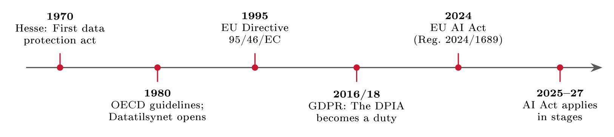
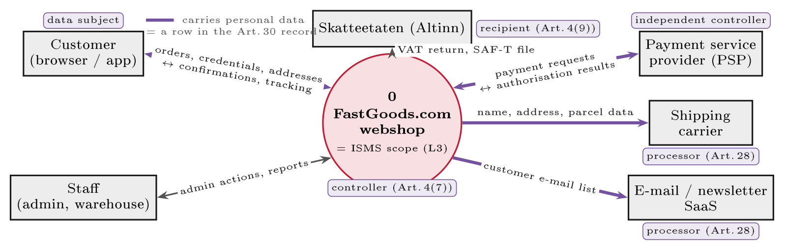
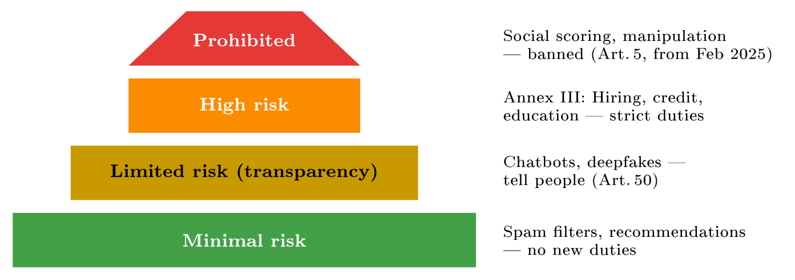

# Assessing risk to people: DPIA, LIA and the EU AI Act {#sec-09-assessing-risk-to-people}

Chapter 8 assessed risk to the organisation. This chapter runs the assessment
the law demands alongside it: The same craft - identify, analyse, decide,
document - pointed at the *people in the data*. It covers the three
instruments a company like FastGoods actually needs: The data protection impact
assessment of GDPR Article 35, run in full from the screening decision to the
four mandatory blocks; the legitimate-interests assessment behind Article
6(1)(f), which Chapter 7 promised and now delivers; and the EU AI Act's risk
tiers, which since 2024 extend the same before-you-start logic to AI systems -
with duties for companies that merely *use* AI, not only those that build it. By
the end, FastGoods holds three assessment artefacts, and the closing section
shows how their findings loop back into the one register Chapter 8 built.

## Two assessments, two protected parties {#sec-09-two-assessments-two-protected-parties}

Both assessments use the same craft, but they answer different questions - and
confusing them is a common and costly mistake. The security assessment of
Chapter 8 protects the *organisation*: The harms it weighs are lost revenue,
fines, downtime, and its output is the risk register. The regulatory assessment
of this chapter protects the *data subjects*: The harms it weighs are
discrimination, exposure and loss of rights, and its outputs are the DPIA, the
LIA and an AI-tier decision. The asymmetry is the point, and one example carries
it: Profiling its customer database for marketing might earn FastGoods money at
low company risk - while quietly harming the customers being profiled. A risk
can be low for the company and severe for the customer at the same time, and
that is exactly why the law demands the second assessment rather than trusting
the first to cover it.

The duty to assess risk to people did not appear from nowhere; it grew over five
decades, and each step moved the assessment earlier and widened the protected
party (@fig-privacytimeline). The world's first data protection act was
passed in the German state of Hesse in 1970, with Sweden's national *Datalagen*
following in 1973 and Norway's *personregisterloven* in 1978 - the law that
created Datatilsynet, operating from 1980. That same year the OECD published its
privacy guidelines, naming the principles Chapter 7 taught as Article 5; the
Council of Europe's Convention 108 (1981) made them treaty law; the EU's Data
Protection Directive 95/46/EC (1995) made them a common European floor; and the
GDPR - adopted 2016, in force 25 May 2018 - made risk-to-people assessment a
legal *duty*, with the DPIA as Article 35. The newest layer arrived in 2024: The
EU AI Act (Regulation (EU) 2024/1689) extends the idea to AI systems, applying
in stages from 2025 to 2027 - and the pattern across the whole arc is
consistent: Assess before you process, and the party you assess for is the
person, not the firm.

{#fig-privacytimeline}

## The DPIA in practice {#sec-09-the-dpia-in-practice}

Chapter 7 defined the instrument (@def-dpia) and drew its shape
(@fig-dpiaflow); this section runs it as a working method. Three ground
rules first. The DPIA is done *before* the processing begins - it is an
assessment, not a post-mortem. Its focus is the *rights and freedoms of natural
persons* - the impact scale of Chapter 8 swapped for harm to people:
Discrimination, identity theft, financial loss, reputational damage, loss of
control over one's data. And the responsibility sits where GDPR responsibility
always sits: The controller carries it, with the DPO advising where one exists
(Art. 35(2)) - the second-line pattern of the role chapters, visible early.

Not every processing needs a DPIA, and the decision of whether one is needed is
itself a small, recorded assessment: The *screening*. Article 35(3) names three
automatic triggers - systematic and extensive profiling with legal or
similarly significant effects; large-scale processing of special categories or
criminal-offence data; and systematic monitoring of publicly accessible areas at
scale - and the supervisory authorities publish national lists of further
always-DPIA operations under Article 35(4), Datatilsynet's among them. For
everything else, the European guidance (WP248, adopted by the EDPB) gives nine
criteria to screen against: Evaluation or scoring, including profiling;
automated decisions with legal or similar effect; systematic monitoring;
sensitive or highly personal data; processing at large scale; matching or
combining datasets; data on vulnerable subjects; innovative use of new
technology; and processing that prevents people from exercising a right or using
a service. The working rule of thumb: Two or more criteria met means do the DPIA
- and one criterion alone can suffice if it is strong. The screening verdict
is one reasoned line per processing activity, and the "no" decisions are
recorded too, because the screening table is itself accountability evidence in
the sense of Article 5(2): When Datatilsynet asks why no DPIA was done, the
answer is a dated decision, not a shrug.

::: {#exm-dpiascreen}
## The screening, worked

Three FastGoods processing activities, screened in one line each
(@tbl-dpiascreen). Order fulfilment processes ordinary contract data in
the way every customer expects - no trigger, recorded as such. Fraud screening
of orders meets one strong criterion - evaluation and scoring with real
effects on the customer - and the practical rule applies: When in doubt, do
the DPIA; the borderline case is exactly the one worth documenting. Profiling
the customer database for marketing meets two criteria comfortably -
systematic evaluation at scale, matching of datasets - and is a clear yes; it
is also the processing whose DPIA then runs the four blocks of
@fig-dpiaflow: The processing described on one page, its necessity and
proportionality tested (could the campaign work with less data?), the risks to
the *customers* rated for likelihood and severity, and the safeguards chosen -
which feed the same treatment plan as Chapter 8's risks, a convergence
@sec-09-one-assessment-landscape returns to.
:::

::: {#tbl-dpiascreen}
  **Processing**              **Screening reasoning**                             **DPIA?**
  --------------------------- --------------------------------------------------- ----------------------------------------------------
  Order fulfilment            Ordinary contract data, expected use                [**No - recorded**]{style="color: riskLow"}
  Fraud screening of orders   Evaluation/scoring with effects                     [**Borderline - do it**]{style="color: riskMod"}
  Profiling for marketing     Systematic evaluation at scale; matching datasets   [**Yes**]{style="color: riskCrit"}

  : The FastGoods screening table: One reasoned line per processing activity,
  the "no" recorded alongside the "yes". Short, dated, defensible - and itself
  accountability evidence under Article 5(2).
:::

One more piece of the machinery carries real weight: *Prior consultation*. If
the DPIA's fourth block - the safeguards - still leaves a high residual
risk, Article 36 requires consulting the supervisory authority *before* the
processing starts. The parallel to Chapter 8 is exact and worth savouring:
Residual risk above the acceptance line escalates to a higher authority for a
decision - only here the higher authority is Datatilsynet, and "proceed
anyway" is not among the controller's options. In practice the consultation duty
is rare, because safeguards usually bring the residual down; its real effect is
the discipline it casts backwards over block four.

##### The description as a diagram.

Element (a) of Article 35(7) - the systematic description of the processing
- is easiest to produce as a picture, and the picture already exists: The
context diagram of Chapter 8 with the personal-data flows marked and the GDPR
role of every party written on it (@fig-fgcontextprivacy). One diagram
answers what is processed, where it goes and who receives it. Four purple flows
carry personal data out of FastGoods: To two processors (the carrier and the
newsletter tool, Article 28), to one independent controller (the payment
provider) and to one recipient (Skatteetaten). Each is a row in the Article 30
record and a paragraph in the DPIA's description - reused, not redrawn, from
the security assessment of the previous chapter.

{#fig-fgcontextprivacy}

## The legitimate-interests assessment {#sec-09-the-legitimate-interests-assessment}

Chapter 7 left a promise open. Among the six lawful bases, FastGoods' fraud
checks were to rest on *legitimate interests* - "after a documented balancing
of the company's interest against the customer's rights". The documented
balancing has a name and a fixed shape, and this section runs it. Article
6(1)(f) permits processing necessary for the controller's legitimate interests
- *unless* the interests or fundamental rights of the data subject override
them. It is the flexible basis, and precisely therefore the tested one:
Flexibility without a test would swallow the other five bases whole, so the test
is where the protection lives.

::: {#def-lia}
## Legitimate-interests assessment

A legitimate-interests assessment (LIA) is the documented three-part test behind
Article 6(1)(f), run before the processing and in order: *Purpose* - is the
interest real and lawful? *Necessity* - is this processing actually needed for
it, or would less data do? *Balancing* - do the data subject's interests,
rights and reasonable expectations override the controller's interest? Failing
any step means finding another basis or not processing; passing all three, with
any safeguards that carried the balance, is what the controller shows
Datatilsynet when asked "on what basis?".
:::

The structure comes from the European guidance tradition - the EDPB's and the
ICO's tests are the same three questions - and the balancing step is where the
craft sits: It weighs what the person would *reasonably expect* (recital 47's
own word), how intrusive the processing is, and what safeguards soften it.
Safeguards are not decoration; they can carry the balance - and their absence
can tip it.

::: {#exm-fralia}
## The fraud-screening LIA

FastGoods' automated fraud checks, run through the three parts
(@tbl-fglia). Purpose passes cleanly: Preventing payment fraud is a
real, lawful interest - recital 47 names fraud prevention explicitly.
Necessity passes because the check is data-minimal: Order, payment and device
data only, no browsing history, nothing kept longer than the dispute window.
Balancing passes *with a safeguard doing real work*: Customers reasonably expect
fraud checks when they pay online, and flagged orders go to human review rather
than silent automated rejection. Remove that safeguard and the balance tilts -
automated rejection with significant effect pulls the processing toward Article
22's regime on automated decisions and strengthens the DPIA triggers of the
previous section. One safeguard, three regimes quieted: That is what a
well-built LIA looks like.
:::

::: {#tbl-fglia}
  **Step**    **Reasoning**                                                                                     **Outcome**
  ----------- ------------------------------------------------------------------------------------------------- ----------------------------------------------------
  Purpose     Fraud prevention is a real, lawful interest (recital 47 names it)                                 [**Pass**]{style="color: riskLow"}
  Necessity   Only order, payment and device data; no browsing history                                          [**Pass**]{style="color: riskLow"}
  Balancing   Fraud checks are reasonably expected; flagged orders get human review, no silent auto-rejection   [**Pass, with safeguard**]{style="color: riskLow"}

  : The FastGoods fraud-screening LIA: Purpose, necessity, balancing - in
  order, documented, with the safeguard named that carries the balance. The
  promise of Chapter 7, kept.
:::

::: {.callout-note}
## Real-world case: Grindr (2021): When the flexible basis cannot stretch

In December 2021 Datatilsynet fined the dating app Grindr NOK 65 million - at
the time its largest GDPR fine - for sharing users' personal data, including
the fact of using the app at all, with advertising partners without a valid
legal basis. The case is a compact lesson in this chapter's two instruments.
Grindr's consent mechanism failed exactly the tests Chapter 7 listed: Bundled
into accepting the privacy policy, not specific, not freely given. And the
fallback this section teaches could not save it: For data this sensitive, shared
this widely, for purposes this far from what users reasonably expect, no
balancing test lands on "pass" - legitimate interest is flexible, not
infinite. The practical moral for any webshop is direct: Choose the basis
honestly before processing, document the test, and remember that ad-tech sharing
is where both consent and balancing fail most often.
:::

## The EU AI Act's risk tiers {#sec-09-the-eu-ai-act-s-risk}

The newest layer of the law reached this course's desk in 2024, and its short
history is worth having because the mechanism is young. The OECD published AI
principles in 2019 - the 1980 pattern repeating, principles first; the
European Commission proposed the AI Act in April 2021; the political agreement
came in December 2023; and Regulation (EU) 2024/1689 entered into force on 1
August 2024, applying in stages: The prohibitions and the AI-literacy duty from
2 February 2025, the rules for general-purpose AI models from 2 August 2025, and
most remaining obligations - including those for Annex III high-risk systems
- from 2 August 2026, with product-embedded systems following in 2027. The
staged dates make this chapter unusually current: The high-risk regime begins
applying the very month this script edition appears.

::: {#def-aitier}
## The AI Act's risk tiers

The AI Act regulates by *risk tier*, not by technology: Every AI system falls
into one of four tiers, and the tier decides the duties. *Prohibited* practices
(Art. 5) are banned outright; *high-risk* systems (Annex III and regulated
products) carry strict duties for providers and deployers; *limited-risk*
systems carry transparency duties (Art. 50); *minimal-risk* systems carry no new
duties. The screening question for any AI use is therefore the same shape as the
DPIA's: Which tier is this - and what does that tier demand of us?
:::

{#fig-aitiers}

The tier boundaries are concrete. Prohibited, since February 2025: Practices the
Union has ruled out entirely - social scoring by authorities, manipulative
techniques exploiting vulnerabilities, and untargeted scraping of facial images
to build recognition databases, the practice for which Clearview AI had already
collected GDPR fines of around twenty million euros apiece from several European
authorities before the ban existed. High-risk, per Annex III: Systems used in
employment, credit, education, essential services, law enforcement - domains
where a wrong output changes a life. Limited-risk: Systems people interact with
or whose output could deceive - chatbots and deepfakes - where the duty is
honesty: Tell people they are dealing with AI, and label generated content
(Art. 50). Minimal: The long tail - spam filters, recommendation engines -
where ordinary law, including the GDPR, continues to apply and the AI Act adds
nothing.

The Act's second design decision reaches FastGoods more directly than the tiers
themselves: Duties fall not only on *providers* who build AI but on *deployers*
who use it - and a webshop will rarely build, often deploy. Article 26 gives
deployers of high-risk systems concrete duties: Use the system according to its
instructions; assign human oversight to people with the training and authority
to intervene; ensure the input data is relevant; monitor operation and keep the
logs. Article 4 adds a duty already in force - AI literacy: Staff who operate
AI systems must understand them well enough to use them responsibly, which for a
small firm means training, not a research department. Article 27 requires
certain deployers - public bodies above all - to run a *fundamental-rights
impact assessment* (FRIA) before deploying a high-risk system; where personal
data is involved it may build on the DPIA, which is the two regimes admitting
they are siblings. And for organisations that want a management-system answer,
ISO/IEC 42001 (2023) defines an AI management system - an AIMS - on the same
Annex SL skeleton as Chapter 3's ISMS: Same clause structure, same PDCA logic, a
new object. "We just bought it" is not a defence under any of this; the tier
follows the use, and the duties follow the tier.

::: {#exm-aitiers}
## Three AI uses, three tiers

The screening discipline, applied to FastGoods' actual and plausible AI
(@tbl-aitiers3). Product recommendations: Minimal tier - no new
duties, though the GDPR's rules on profiling still apply to the personal data
underneath. The customer-service chatbot: Limited tier - one duty, and a cheap
one: Tell customers it is AI (Art. 50). And the row most students underestimate:
An off-the-shelf CV-screening tool for hiring is a *high-risk* system under
Annex III (employment) - a 25-person webshop deploying it takes on the Article
26 duties in full: Oversight by a trained person, monitoring, logs, and a
provider whose own compliance FastGoods must be able to point to. The tier
follows the use, not the company size - which is exactly the proportionality
logic of the whole course, this time cutting the other way.
:::

::: {#tbl-aitiers3}
  **AI use**                 **Tier**                                          **Duties for FastGoods**
  -------------------------- ------------------------------------------------- -------------------------------------------------------------------
  Product recommendations    [**Minimal**]{style="color: riskLow"}             None new - ordinary GDPR still applies
  Customer-service chatbot   [**Limited**]{style="color: riskMod"}             Tell customers it is AI (Art. 50)
  CV screening for hiring    [**High (Annex III)**]{style="color: riskHigh"}   Art. 26: Oversight, monitoring, logs - and a compliant provider

  : Three FastGoods AI uses, tiered. The surprise sits in the third row:
  Deploying an off-the-shelf hiring tool makes a small webshop the deployer of a
  high-risk system - the tier follows the use case, not the company size.
:::

## One assessment landscape {#sec-09-one-assessment-landscape}

By the end of this week FastGoods holds three assessment artefacts, and setting
them side by side shows a landscape rather than a pile
(@tbl-assesslandscape). They answer different legal questions for
different protected parties - the company, the data subjects, the affected
persons - and they trigger differently: The register always, the DPIA on a
screened high risk to people, the AI check on any AI use. But their *measures*
converge: The DPIA's safeguards (Art. 35(7)(d)), the LIA's balancing safeguards,
the AI Act's oversight duties and the register's treatments all land in one
treatment plan - and controls are chosen once, in Lecture 10, serving all
three. One craft, three protected parties, one plan.

::: {#tbl-assesslandscape}
                **Risk register**          **DPIA / LIA**                   **AI-tier check**
  ------------- -------------------------- -------------------------------- --------------------
  Protects      The company                The data subjects                Affected persons
  Required by   Good practice; ISO 27001   GDPR Art. 35 / 6(1)(f)           AI Act (2024/1689)
  Trigger       Always                     Screening: High risk to people   Any AI use
  Output        Rated risks, owners        Four blocks, measures            Tier, duties

  : Three assessments, side by side: Different protected parties and triggers,
  one shared craft - and measures that converge on the single treatment plan
  of Lecture 10.
:::

The landscape has one more connection, and it is the one that makes the two
lenses a single system: The regulatory assessments do not replace register rows
- they *create* them, because a failed duty is itself a company risk. "DPIA
for the customer profiling not done" is a compliance risk with a fine and a
stop-order behind it: A register row, rated and owned. "Chatbot not disclosed as
AI" is an Article 50 gap - small, real, and cheap to fix, which makes leaving
it open indefensible. "CV-screening tool deployed without Article 26 oversight"
is a high register entry from the day the Annex III duties apply. A risk *to
people* that the law makes you manage becomes, unmanaged, a risk *to the
company* - the register protects the company, the DPIA protects the people,
and each keeps the other honest.

::: {.callout-tip}
## Finding the risk: In the regulatory assessments

The three artefacts of this chapter are the fourth source of Chapter 1's box in
a new costume: Assessments someone was obliged to write are risks already
half-found. Read the screening table backwards - every "yes" without a
completed DPIA is a compliance risk with a date on it. Read a finished DPIA's
block (c) forwards - every high risk to individuals is also, via fines and
trust, a consequence line for the company's own register. And read the AI-tier
table for missing rows - the AI use nobody screened is the modern version of
the asset nobody inventoried. Regulatory paperwork, read this way, is a
risk-identification tool the law was kind enough to make mandatory.
:::

::: {#exm-sikt}
## The student's screening

The transfer to the nearest desk is direct, because students run this assessment
earlier than they expect. A bachelor thesis with a survey or interviews
processes personal data, and Norwegian institutions route exactly the screening
question of this chapter through Sikt, the national service for research data:
Describe the processing, the categories of data, the basis, the safeguards - a
DPIA-light, run before data collection starts, with special-category data
(health, political views) raising the bar precisely as Article 35(3) does. A
student who has screened FastGoods' marketing profiling has already practised
the form; the thesis notification is the same instrument with their own name in
the controller's seat - and "I collected first and asked afterwards" fails
there for the same reason it fails here.
:::

##### Reading for this chapter.

Jøsang, Chapter 10 (information privacy, pp. 215 ff., especially §§10.5--10.6 on
the GDPR, pp. 224--229); Edwards & Weaver, Chapter 18 (privacy laws and their
intersection with cybersecurity, pp. 315 ff.), whose closing example privacy
impact assessment (p. 330) is a useful template. Legal texts, shorter and more
readable than their reputation: GDPR Articles 35--36 with the WP248 screening
guidelines; Regulation (EU) 2024/1689, Articles 4--5, 26--27 and 50; and ISO/IEC
42001:2023 for the AIMS. Both books are available in the library and on the
Canvas course page.

## Summary {#sec-09-summary}

The law turns Chapter 8's lens around: The same craft - identify, analyse,
decide, document - pointed at the people in the data, because a risk can be
low for the company and severe for the customer at once. The duty grew over five
decades - Hesse 1970, the OECD principles and Datatilsynet 1980, the 1995
Directive, the GDPR's Article 35 - and gained an AI layer in 2024. The DPIA
runs from a recorded screening (Art. 35(3)'s automatic triggers, WP248's nine
criteria, two-or-more as the rule of thumb, the "no" documented too) through the
four blocks of Chapter 7's flow - describe, justify, assess for the *people*,
treat - with Article 36's prior consultation waiting where residual risk stays
high. The LIA (@def-lia) is the documented three-part test - purpose,
necessity, balancing - behind the flexible lawful basis, where safeguards can
carry the balance and their absence tips it; FastGoods' fraud screening passes
with human review, and Grindr shows what happens when neither consent nor
balancing can bear the weight. The AI Act (@def-aitier) sorts AI by risk
tier - prohibited, high, limited, minimal - applying in stages through
2026--27; the tier follows the use, not the company size, and deployers carry
their own duties: Article 26 oversight, monitoring and logs, Article 50
transparency, Article 4 literacy, the FRIA for some, and ISO/IEC 42001's AIMS as
the management-system answer on the ISMS's own skeleton. The three artefacts
form one landscape: Different protected parties, converging measures - and
findings that loop back, because an unmanaged duty to people is a company risk
in the register.

Both assessments are done - the company's risks and the people's. What remains
is to do something about them: Lecture 10 selects the controls, from a
recognised catalogue and tailored to fit, serving the register and the DPIA at
once.

## Self-check {#sec-09-self-check}

Try these before the next lecture.

::: {#exr-09-two-lenses-one-processing}
## Two lenses, one processing

FastGoods considers dynamic pricing based on customer profiles. In two sentences
each, assess it through the company lens of Chapter 8 and the people lens of
this chapter - and state which lens raises the alarm.
:::

::: {#exr-09-run-the-screening}
## Run the screening

Screen these three processing activities in one reasoned line each, concluding
DPIA yes, no, or borderline: A customer-satisfaction survey after purchase;
camera surveillance of the warehouse including the staff areas; a loyalty
programme that combines purchase history with location data from the app.
:::

::: {#exr-09-balance-it}
## Balance it

FastGoods wants to email past customers about similar products, resting on
legitimate interest. Run the three-part LIA in three sentences - and name one
safeguard that would strengthen the balancing step.
:::

::: {#exr-09-tier-and-duties}
## Tier and duties

FastGoods' support team wants an AI tool that summarises each customer's history
and *suggests* whether a refund claim looks fraudulent, with staff deciding.
Assign the tier, justify it in one sentence, and name the duties that follow -
including the one that applies regardless of tier.
:::

::: {#exr-09-close-the-loop}
## Close the loop

Take the finding "the marketing-profiling DPIA has not been done" and write it
as a full risk statement in the pattern of @def-riskstatement, ready for
the register.
:::

::: {#exr-09-dpia-interactive}
## The DPIA's four blocks, interactive

Order the blocks of a data protection impact assessment (Art. 35(7)).

```{=html}
<div class="grc-ex" data-type="order">
<script type="application/json">
{
 "steps": [
  "Systematic description of the processing",
  "Necessity and proportionality",
  "Risks to the rights and freedoms of data subjects",
  "Measures to address the risks"
 ]
}
</script>
</div>
```
:::

::: {#exr-09-aitiers-interactive}
## The AI Act's tiers, interactive

Drag each system onto its risk tier.

```{=html}
<div class="grc-ex" data-type="sort">
<script type="application/json">
{
 "buckets": [
  {
   "id": "proh",
   "label": "Prohibited"
  },
  {
   "id": "high",
   "label": "High-risk"
  },
  {
   "id": "lim",
   "label": "Limited / transparency"
  },
  {
   "id": "min",
   "label": "Minimal"
  }
 ],
 "chips": [
  {
   "t": "Social scoring of citizens",
   "b": "proh"
  },
  {
   "t": "CV screening for hiring",
   "b": "high"
  },
  {
   "t": "A customer chatbot that must disclose it is AI",
   "b": "lim"
  },
  {
   "t": "The spam filter on the mail server",
   "b": "min"
  }
 ]
}
</script>
</div>
```
:::

::: {#exr-09-lia-interactive}
## The three-part LIA, interactive

Order the legitimate-interests assessment.

```{=html}
<div class="grc-ex" data-type="order">
<script type="application/json">
{
 "steps": [
  "Name the legitimate interest",
  "Necessity - no less intrusive way to achieve it",
  "Balancing against the data subjects' interests and rights"
 ]
}
</script>
</div>
```
:::

::: {#exr-09-triggers-interactive}
## When a DPIA is required, interactive

Select the situations that trigger a DPIA.

```{=html}
<div class="grc-ex" data-type="pick">
<script type="application/json">
{
 "options": [
  {
   "t": "Systematic and extensive profiling with legal effects",
   "ok": true
  },
  {
   "t": "Large-scale processing of special categories",
   "ok": true
  },
  {
   "t": "Systematic monitoring of publicly accessible areas",
   "ok": true
  },
  {
   "t": "A ten-address internal phone list",
   "ok": false
  },
  {
   "t": "Any use of e-mail whatsoever",
   "ok": false
  }
 ]
}
</script>
</div>
```
:::

::: {#exr-09-parties-interactive}
## Two protected parties, interactive

Whose risk is it - the organisation's or the people's?

```{=html}
<div class="grc-ex" data-type="sort">
<script type="application/json">
{
 "buckets": [
  {
   "id": "org",
   "label": "Risk to the organisation"
  },
  {
   "id": "people",
   "label": "Risk to the people"
  }
 ],
 "chips": [
  {
   "t": "Ransomware halts the warehouse for a week",
   "b": "org"
  },
  {
   "t": "Fraud screening wrongly blocks a legitimate customer",
   "b": "people"
  },
  {
   "t": "A fine for a missed reporting deadline",
   "b": "org"
  },
  {
   "t": "Profiling reveals a customer's home address",
   "b": "people"
  }
 ]
}
</script>
</div>
```
:::
