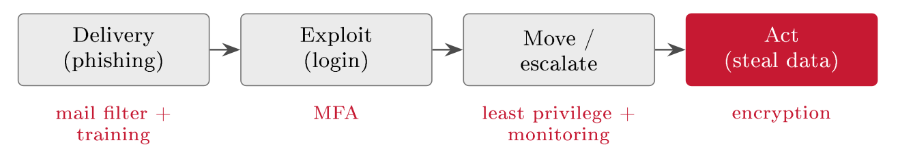
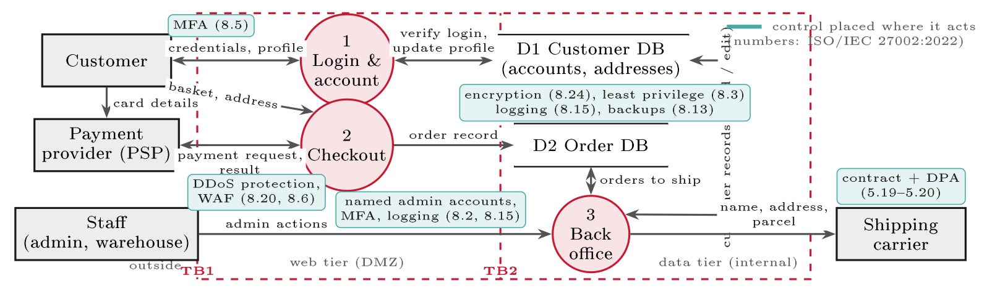
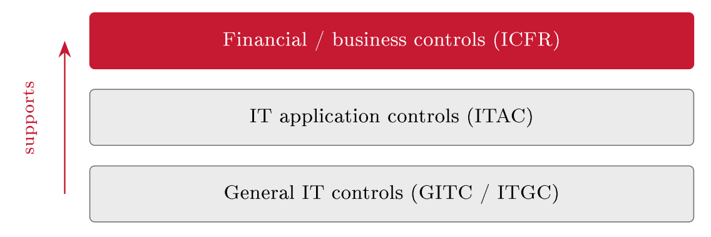

# Selecting and tailoring controls {#sec-10-selecting-and-tailoring-controls}

The register now holds rated, justified risks; this chapter decides what to do
about them. It works through the treatment options and settles on the usual one
- reduce - then selects controls from the catalogues of Chapter 6 rather
than inventing them, layers them along the attack chain of Chapter 8, and
tailors each to FastGoods' size and risk. Two practitioner's perspectives run
through it: The audit view, in which the IT controls chosen here carry the
financial statements as well as the security; and the economic view, in which
every control is a spend to be weighed against the risk it removes. The chapter
ends where treatment must always end - with residual risk consciously
accepted, and every decision recorded in the register and the SoA.

## A rated risk needs a decision {#sec-10-a-rated-risk-needs-a-decision}

::: {#def-treatment}
## Risk treatment

Risk treatment is the documented decision taken for each risk above the
acceptance line, from four options: *Reduce* it by adding controls; *accept* it,
if it sits below the line; *transfer* the loss, by insurance or contract; or
*avoid* it, by stopping the risky activity. Treatment is complete only when the
remaining - residual - risk is acceptable and formally accepted by an owner
with the authority to do so (Lecture 17).
:::

The four options were foreshadowed in Chapter 1; the discipline here is that
each is a deliberate, recorded choice with a natural habitat. Reduce is the
usual answer, and the subject of this chapter. Accept fits small, rare risks -
consciously, in writing, never by silence. Transfer fits risks that are hard to
reduce; the Hydro case of Chapter 1 showed a transfer (cyber-insurance) arranged
years before it paid out. Avoid fits activities whose risk outweighs their
benefit - FastGoods declining to store card numbers itself, for instance,
avoids a whole risk class by leaving the data with the payment provider. The
options also map onto the nearest risk portfolio students manage: Reduce is
studying; accept is skipping the one-per-cent bonus quiz, consciously; avoid is
dropping the elective that does not fit - and the exam itself teaches the
menu's limit, because it can be neither transferred nor avoided if the degree is
the objective, which leaves reduce as the whole game. Some business risks are
exactly like that.

What a control actually does is best said in Jøsang's terms: It reduces a risk
by lowering its *likelihood*, its *impact*, or both (Jøsang, Ch. 19,
pp. 405 ff.). MFA lowers likelihood - a stolen password no longer works;
backups lower impact - data loss becomes recoverable. On the matrix of Chapter
8 the picture is literal: A control moves a risk left, down, or both, toward the
acceptable cells.

And before adding anything, take stock: You treat the *residual* risk of
@def-inherentresidual, not the inherent one. Jøsang's first question is
whether existing controls already prevent the incident; only the remaining
exposure needs new treatment. FastGoods' checkout already sits behind the cloud
provider's basic DDoS filtering, so the R2 question is what exposure remains -
selecting controls is not starting from zero but closing the gap between the
residual risk and what you can accept.

## Choosing controls, and layering them {#sec-10-choosing-controls-and-layering-them}

The controls come from the catalogues of Chapter 6 - ISO/IEC 27002's 93
controls in four themes behind Annex A, NIST SP 800-53 for depth, the CIS
Controls for prioritised pragmatism, COBIT for the governance layer - and the
reasons are the same as there: Completeness, and a shared language with
auditors. One refinement from the catalogue bears on selection: The functional
classification. Chapter 1 gave the working three - preventive, detective,
corrective - and ISO 27002:2022 tags every control with exactly this
attribute; the fuller professional set adds *deterrent* (discourage the
attempt), *compensating* (a stand-in where the ideal control is not feasible)
and *recovery* (restore after harm). The compensating idea earns its keep in
audits: Where a small shop cannot segregate duties across enough people, a
compensating review control can stand in - documented as such.

Layering is what turns single controls into a defence. Defence in depth means a
control at *each* stage of the attack chain, so the attacker must defeat every
layer while the defender needs only one to hold - the student edition being
the second alarm clock before an 08:00 exam: Independent layers, one failure
survivable (@fig-didchain) - the kill chain of Chapter 8, now with the
barriers drawn in.

{#fig-didchain}

::: {#exm-layering}
## Layering R1 by function

Few risks are closed by one control, so R1 gets three, one per function: MFA to
*prevent* most attempts (a stolen password becomes half a key); login-anomaly
alerts to *detect* what gets through (a login from a new country at 03:00 is
worth a question); and a practised recovery routine - forced password reset,
session invalidation, customer notification - to *correct* when one does.
Layers by chain stage and layers by function are the same idea seen from two
sides, and the combination is what makes the residual risk in
@sec-10-tailoring-cost-and-residual-risk genuinely low rather than
hopefully low.
:::

##### Controls placed on the diagram.

Tailoring ends with a location. A control acts at one place in the system, and
Chapter 8's Level 1 diagram shows where (@fig-fglevelcontrols): R1 is
treated on the credentials flow crossing TB1 (MFA, 8.5); R2 at the checkout's
edge (DDoS protection and a web application firewall, 8.20, 8.6); R3 at the
store and on both paths into it (encryption 8.24, least privilege 8.3, logging
8.15, backups 8.13 - and named admin accounts with MFA and logging, 8.2 and
8.15, on the staff path into the back office that the diagram revealed). The
carrier gets a contract and a data-processing agreement, not a firewall
(5.19--5.20). A control drawn on the picture has an owner and a test point: The
SoA row and the audit evidence of Chapter 16 follow from its location.

{#fig-fglevelcontrols}

## The audit view: GITC and application controls {#sec-10-the-audit-view-gitc-and-application}

Here the course's audit thread surfaces properly, because the IT controls
selected in this chapter carry more than security: They carry the financial
statements. The numbers in an annual report come out of IT systems, so the
controls over financial reporting (ICFR) rest on IT application controls, which
rest in turn on the general IT controls - a three-layer stack in which each
layer relies on the one below (@fig-icfrstack).

{#fig-icfrstack}

::: {#def-gitc}
## General IT controls and application controls

*General IT controls* (GITC, also ITGC) operate across all systems: Access
management, change management, and IT operations - the foundation layer. *IT
application controls* (ITAC) operate inside one system: Input validation,
automated calculations, three-way matching, and segregation of duties -
creator and approver never the same person. GITC must be sound before any
application control can be relied on.
:::

The dependency runs one way, and it explains the auditor's sequence: If the
general layer is weak - if anyone can change the code or reach the data
directly - then no automated check inside the application proves anything, so
an IT auditor tests GITC *first* (Lecture 16, where ISAE 3402 and the German IDW
PS 951 formalise exactly this). For control selection the lesson is practical
and cheering: The access and change-management controls FastGoods chooses for
security are the same GITC an auditor will one day test for the accounts - one
investment, audited twice, valuable twice.

## Tailoring, cost, and residual risk {#sec-10-tailoring-cost-and-residual-risk}

A catalogue control is a starting point, written to suit everyone and therefore
fitting no one exactly. Tailoring adapts it to your risk, systems and people -
Edwards & Weaver insist that selection must be rooted in understanding the
organisation, which is Chapter 2 paying its dividend (Edwards & Weaver, Ch. 26,
pp. 463 ff.). "Use MFA" is the catalogue entry; "MFA on all customer and
administrator logins, via the identity provider" is the tailored control.
Strength is set by proportionality, and both failure directions are real: Too
weak leaves an unacceptable residual; too heavy costs more than the risk
warrants and - worse - slows people until they route around it (Lecture 14),
and a control people bypass protects no one.

Tailoring includes economics, because every control is a spend of money, time
and user friction, weighed against the reduction in likelihood ×        impact
it buys. The yardstick - made quantitative in Lecture 20's annualised loss
expectancy - is whether the control costs less than the expected loss it
prevents, and the portfolio rule follows: Spend where the risk reduction per
krone is greatest. For FastGoods, five thousand euros of MFA removing most of a
two-hundred-thousand-euro-a-year exposure is an easy yes; a half-million-euro
control aimed at the same risk is not; and spending more to defend the
newsletter than its data is worth fails the test outright. Laid out as a table,
the economics stop being hand-waving (@tbl-costbenefit): Three candidate
controls against the same risk, each with its cost, its effect and a verdict -
and the discipline is that every yes and every no cites the same yardstick.

::: {#tbl-costbenefit}
  **Candidate (for R1)**          **Cost / yr**              **Effect**                  **Verdict**
  ------------------------------- -------------------------- --------------------------- ----------------------------------------------------
  MFA via identity provider       $\sim$EUR 5k               Likelihood high →     low   Yes - large reduction per euro
  24/7 external SOC               $\sim$EUR 120k             Faster detection only       No - disproportionate; tailored alerting instead
  Hardware tokens for customers   $\sim$EUR 60k + friction   Marginal over app MFA       No - residual already low, friction real

  : Control economics on one risk. Same yardstick for every row: Risk reduction
  bought per euro spent - and "no" is as documented a decision as "yes".
:::

::: {#exm-residualr1}
## R1, before and after

The whole logic on one risk (@tbl-residualr1). Inherent, R1 is high -
likely, and severe if accounts fall. The control applied is tailored A.8.5 MFA
on all logins. Residual, the risk is low - a stolen password alone no longer
opens the door - and the decision is to accept that residual and keep
monitoring. Note what the control did *not* do: Make the risk zero. Phones are
lost, prompts are fatigued, resets are socially engineered; what remains is
real, smaller, and now somebody's signed decision rather than an accident.
:::

::: {#tbl-residualr1}
  **Step**          **For risk R1 (account takeover)**
  ----------------- --------------------------------------------------------
  Inherent risk     High - likely, and severe if accounts are taken over
  Control applied   A.8.5 multi-factor authentication on all logins
  Residual risk     Low - a stolen password alone no longer gets in
  Decision          Accept the residual; keep monitoring (owner signs)

  : Residual risk, worked. The control moved R1 from high to low; what remains
  is consciously accepted - an unaccepted residual risk is just an
  undocumented one.
:::

One distinction completes the effectiveness test that Chapter 1's box has
carried through the course, and it is the distinction auditors live by:

::: {#def-effectiveness}
## Control effectiveness

A control is *designed effectively* when, operated as intended, it would
actually reduce the risk it addresses. It is *operating effectively* when it has
actually run, as designed, throughout the period - and can show evidence of
it. A control that fails either test is ineffective, and an ineffective control
does not reduce the risk: The risk stands, now joined by a false sense of
safety.
:::

::: {.callout-tip}
## Finding the risk: The ineffective control

The third source's test, run to the end. FastGoods' monitoring alerts are well
designed - and land in a mailbox nobody reads. Design effective, operating
ineffective: The detection risk they address is exactly as large as before the
control existed, and the register's "residual: Low" has quietly become fiction.
Mitigation only counts when the control is effective; everything else is
decoration with a maintenance cost. This is why Block V tests controls instead
of admiring them - and why the verification column of @tbl-implplan
exists.
:::

The residual step generalises: Apply the control, re-rate likelihood and impact,
and compare with the acceptance line. Below the line, the residual is accepted
and documented - in ISO 27001 the risk owner signs it off, because an
unaccepted residual risk is really an undocumented one. Above the line, add
another control or escalate the decision. And the hardest cases get their own
honesty: Rare-but-severe risks are often too costly to reduce to near-zero, so
the answer combines options - reduce the likelihood where cheap (encryption,
access control for R3), *transfer* part of the loss (cyber-insurance, exactly
Hydro's move), and invest in the *corrective* right-hand side of the bow-tie
through the preparedness of Lecture 12. The board may consciously accept what
remains - but it must be a decision, minuted, not a hope.

## Recording the treatment {#sec-10-recording-the-treatment}

Every decision now flows into the two documents this course has already built.
The register gains its final columns (@tbl-fgregister3): Decision,
control, residual - the full story per risk, which *is* the treatment plan.
And each selected catalogue control lands as a row in the Statement of
Applicability of Chapter 6 (@tbl-fgsoa there): Selection and SoA are two
views of one activity - the register carries the reasoning, the SoA the
control-by-control record - and an auditor will read them side by side
expecting them to agree.

::: {#tbl-fgregister3}
  **ID**   **Risk**           **Decision**   **Controls**                      **Residual**
  -------- ------------------ -------------- --------------------------------- --------------
  R1       Account takeover   Reduce         MFA + login alerts                Low
  R2       DDoS on checkout   Reduce         DDoS protection + failover plan   Low
  R3       Database breach    Reduce         Access control + encryption       Low

  : The FastGoods register, treated. Risk, decision, controls, residual - with
  owners from Chapter 8 - is the treatment plan an auditor reads against the
  SoA.
:::

One last discipline separates a plan from wishful thinking: Track each control
to done. A decision without an implementation date, a responsible name and a
completion check is a decision that quietly evaporates - which is why the
register's rows stay open until the control is verified operating, and why
Chapter 3's PDCA picks the verified controls up in its Check phase. Treatment
ends in evidence, not intention. Tracking has a shape of its own
(@tbl-implplan): One row per selected control, with an owner, a due date
and - the column that separates a plan from a hope - the verification: What
evidence, checked by whom, will show the control actually operating.

::: {#tbl-implplan}
  **Control**                    **Owner**   **Due**   **Verification**
  ------------------------------ ----------- --------- --------------------------------------------------------
  MFA on all logins (A.8.5)      IT lead     30 Sep    Config export; test login without second factor fails
  Upstream DDoS protection       Ops         31 Oct    Provider report; simulated load absorbed
  Database encryption (A.8.24)   IT lead     30 Sep    Settings evidence; restore test of an encrypted backup
  Awareness training (A.6.3)     Owner       15 Nov    Attendance log; phishing-test baseline

  : The implementation plan behind the register: Owner, date, and a verification
  per control. Without the last column, treatment is a hope.
:::

With that, three of Block III's four steps stand: Risks assessed and analysed
(Lecture 8), assessed again for the people in the data (Lecture 9), and treated.
What remains is the governance question behind every row of the register and the
plan: Who owns each risk, who oversees the owners, and who checks independently
- Lecture 11, which closes the block.

##### Reading for this chapter.

Jøsang, Chapter 19 (risk management, especially the treatment of controls,
pp. 405 ff.); Edwards & Weaver, Chapter 26 (risk mitigation and control
selection, pp. 463 ff.); ISO/IEC 27002:2022 as the working catalogue. Both books
are available in the library and on the Canvas course page.

## Summary {#sec-10-summary}

A rated risk needs one of four decisions (@def-treatment) - reduce,
accept, transfer, avoid - each deliberate and recorded, with reduce as the
usual choice and this chapter's subject. A control lowers likelihood, impact or
both, moving the risk across the matrix toward acceptable; treatment starts from
the controls already in place, because what is treated is the residual, not the
inherent. Controls are selected from the catalogues of Chapter 6, not invented,
classified by function - preventive, detective, corrective, plus deterrent,
compensating and recovery - and layered as defence in depth along the attack
chain, one barrier per stage, three functions per risk. The audit view adds
weight: The financial statements rest on application controls, which rest on the
general IT controls (@def-gitc), so the auditor tests GITC first and the
same access and change controls serve security and the accounts at once.
Tailoring makes each control proportionate - strong enough for the risk, light
enough not to be bypassed - and economics disciplines the spend: Risk
reduction per krone, with Lecture 20's numbers behind it. What remains after
controls is residual risk, re-rated, consciously accepted and signed -
combined for the rare-but-severe cases with transfer and the corrective side of
the bow-tie - and everything is recorded twice, in the register that carries
the reasoning and the SoA that carries the record, then tracked until each
control verifiably operates.

A treatment plan without owners is a wish list. Lecture 11 closes the block by
assigning the ownership: The three lines of defence, the board's accountability,
and a named owner for every risk and control this chapter has produced.

## Self-check {#sec-10-self-check}

Try these before the next lecture.

::: {#exr-10-four-options-four-habitats}
## Four options, four habitats

For each treatment option - reduce, accept, transfer, avoid - give one
FastGoods situation where it is the right choice, in one sentence each.
:::

::: {#exr-10-likelihood-or-impact}
## Likelihood or impact

Classify each control by what it mainly lowers for its risk - likelihood or
impact - with one sentence of reasoning: MFA (R1); encrypted backups (R3); a
DDoS-scrubbing service (R2); a practised breach-response plan (R3).
:::

::: {#exr-10-the-auditor-s-sequence}
## The auditor's sequence

Explain, using @def-gitc, why an IT auditor tests general IT controls
before application controls - and give one concrete GITC weakness that would
undermine an otherwise perfect application control.
:::

::: {#exr-10-tailor-it-down}
## Tailor it down

Take ISO 27002's logging-and-monitoring control and tailor it twice: Once for a
bank, once for FastGoods - and name the purpose test both versions must still
pass.
:::

::: {#exr-10-close-the-loop}
## Close the loop

FastGoods implements MFA on customer logins but forgets the three administrator
accounts. Trace how this gap is caught and closed using the machinery of this
course - name the artefacts and the PDCA phases involved.
:::

::: {#exr-10-treatment-interactive}
## Four treatment options, interactive

Match each decision to the treatment option it is.

```{=html}
<div class="grc-ex" data-type="sort">
<script type="application/json">
{
 "buckets": [
  {
   "id": "reduce",
   "label": "Reduce"
  },
  {
   "id": "transfer",
   "label": "Transfer"
  },
  {
   "id": "avoid",
   "label": "Avoid"
  },
  {
   "id": "accept",
   "label": "Accept"
  }
 ],
 "chips": [
  {
   "t": "Implement MFA on the login",
   "b": "reduce"
  },
  {
   "t": "Buy cyber-insurance",
   "b": "transfer"
  },
  {
   "t": "Drop the feature that stores card numbers",
   "b": "avoid"
  },
  {
   "t": "Sign off the residual risk at the right level",
   "b": "accept"
  }
 ]
}
</script>
</div>
```
:::

::: {#exr-10-gitc-interactive}
## GITC or application control? Interactive

Sort the controls the auditor will meet.

```{=html}
<div class="grc-ex" data-type="sort">
<script type="application/json">
{
 "buckets": [
  {
   "id": "gitc",
   "label": "IT general control (GITC)",
   "desc": "the environment around the apps"
  },
  {
   "id": "itac",
   "label": "Application control (ITAC)",
   "desc": "inside one application"
  }
 ],
 "chips": [
  {
   "t": "Change management on the production systems",
   "b": "gitc"
  },
  {
   "t": "Access provisioning and leaver deactivation",
   "b": "gitc"
  },
  {
   "t": "Backups and restore tests",
   "b": "gitc"
  },
  {
   "t": "Input validation on the checkout form",
   "b": "itac"
  },
  {
   "t": "The three-way match before an invoice is paid",
   "b": "itac"
  }
 ]
}
</script>
</div>
```
:::

::: {#exr-10-effect-interactive}
## Design or operating effectiveness? Interactive

Sort the statements about a control.

```{=html}
<div class="grc-ex" data-type="sort">
<script type="application/json">
{
 "buckets": [
  {
   "id": "des",
   "label": "Design effectiveness",
   "desc": "would it work, as specified"
  },
  {
   "id": "op",
   "label": "Operating effectiveness",
   "desc": "did it actually run, with evidence"
  }
 ],
 "chips": [
  {
   "t": "The access-review procedure is soundly specified",
   "b": "des"
  },
  {
   "t": "All twelve monthly reviews were completed and signed",
   "b": "op"
  },
  {
   "t": "The backup schedule would meet the RPO on paper",
   "b": "des"
  },
  {
   "t": "The restore drill succeeded, on the clock, in May",
   "b": "op"
  }
 ]
}
</script>
</div>
```
:::

::: {#exr-10-layers-interactive}
## Defence in depth, interactive

Place each control on its layer.

```{=html}
<div class="grc-ex" data-type="sort">
<script type="application/json">
{
 "buckets": [
  {
   "id": "net",
   "label": "Network"
  },
  {
   "id": "ident",
   "label": "Identity"
  },
  {
   "id": "data",
   "label": "Data"
  },
  {
   "id": "people",
   "label": "People"
  }
 ],
 "chips": [
  {
   "t": "Segmentation between web tier and data tier",
   "b": "net"
  },
  {
   "t": "MFA on all admin access",
   "b": "ident"
  },
  {
   "t": "Encryption of the stored records",
   "b": "data"
  },
  {
   "t": "Awareness training",
   "b": "people"
  }
 ]
}
</script>
</div>
```
:::

::: {#exr-10-accept-interactive}
## A governed acceptance, interactive

Select what turns accepting a residual risk into a governed decision.

```{=html}
<div class="grc-ex" data-type="pick">
<script type="application/json">
{
 "options": [
  {
   "t": "It is recorded in the register",
   "ok": true
  },
  {
   "t": "The authority level matches the potential impact",
   "ok": true
  },
  {
   "t": "It carries a review date",
   "ok": true
  },
  {
   "t": "The admin decides quietly and tells nobody",
   "ok": false
  },
  {
   "t": "It is permanent, never to be revisited",
   "ok": false
  }
 ]
}
</script>
</div>
```
:::
