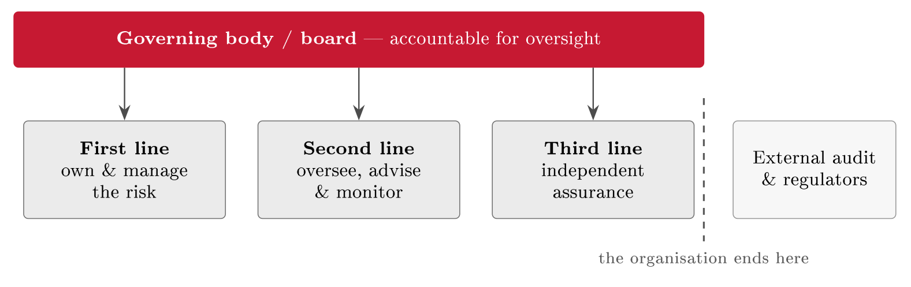

# Roles and the three lines of defence {#sec-11-roles-and-three-lines-of-defence}

Block III has assessed and analysed (Lecture 8), weighed for the people in the
data (Lecture 9) and treated (Lecture 10); this closing chapter decides who owns
all of it. Every risk in the register and every control in the treatment plan
needs a named owner, and behind that simple demand sits a whole discipline: The
separation of owning a risk, overseeing it, and checking it independently.
Security fails as often from unclear responsibility as from weak technology, and
after an incident the failure has a recognisable sound - "I thought you were
handling that." By the end of this chapter the block is complete: One company,
taken from a business understanding to a treated risk position with a name
against every row.

## Who owns security {#sec-11-who-owns-security}

Start with the misunderstanding this chapter exists to correct: That security
belongs to the IT department. It is an easy mistake, because so many controls
are technical - MFA, encryption, monitoring all live in systems that IT builds
and runs. But the *risks* do not live in the systems; they live in the business
- in processes, people and decisions. The account-takeover risk R1 is not a
property of the login code; it is a property of running a webshop that holds
customer accounts, and the person who decided to run that shop is the person
whose business is harmed when the accounts are taken. The people who run a
process are best placed to manage its risk, because they understand it, they
change it, and they feel its consequences. IT provides tools and expertise; it
cannot own every business risk. Where "IT will handle security" becomes the
culture, the rest of the organisation treats security as someone else's problem
- and the risks that only the business can see go unmanaged precisely because
the people who understand them feel no responsibility for them.

Good governance therefore separates three different jobs, and keeps them
separate so that each is done well and honestly. Someone must *own* the risk:
Manage it day to day, operate the controls, live with the consequences - the
people doing the work. Someone must *oversee*: Set policy and standards, advise
the owners, monitor that risk is actually being managed - the risk, compliance
and security functions. And someone must *check*: Give independent assurance
that the first two are doing their jobs - internal audit. The three jobs must
not collapse into one person or team, for a reason this course has met before in
miniature: Nobody can objectively check their own work. Chapter 10 called it
segregation of duties when it applied to a single control; here the same
principle is applied to whole functions.

The cost of leaving the jobs unassigned is paid after the incident. When
responsibility is vague, risks fall between roles - each person reasonably
assuming another has it - and the post-incident review finds a weakness
everyone could see and no one was tasked to fix. Suppose FastGoods' database is
breached through an unpatched component (R3): If no one owned patching that
database, the review will show months of visible exposure with no owner, and a
room full of people each of whom was right that it was not their job. Unowned
risks are the ones that turn into incidents. Assigning a name to every risk and
control is not bureaucracy; it is what makes sure something actually happens -
and it is also what makes audit (Lecture 16) and risk evaluation (Lecture 17)
possible at all, because both need someone to ask.

One distinction keeps this chapter's scope clean. The roles that run security
every day - the standing structure of owners, overseers and checkers - are
not the same as the roles that respond to an incident. Crisis roles - the
incident lead, the responders, the communications duty - are activated when
something happens, and Chapter 12 assigns them. The two overlap in practice (the
standing security lead often leads incidents too), but the responsibilities are
distinct: This chapter is about the standing structure; the next is about the
team for the bad day.

::: {.callout-tip}
## Finding the risk: In the organisation chart

The role map is itself a control, and Chapter 1's rule - read an existing
control backwards and test it - applies to it directly. Read the register and
ask: Which risks have no named owner? Read the control list and ask: Whose name
is against each control, and does that person still work here? Read the org
chart and ask: Where does one person hold two of the three jobs - doing the
work and checking it? Every hit is a risk found, not produced: *An unowned risk
is unmanaged by definition, and a checker who checks their own work is a control
that cannot fail visibly.* Governance gaps go in the register like any other
finding.
:::

## The three lines of defence {#sec-11-the-three-lines-of-defence}

The standard way to organise the three jobs has a name and a history. Its roots
are in the financial sector's reckoning with the 2008 crisis: Risk functions had
existed in banks for years, but the crisis showed how unclear it was who
actually owned risk, who merely advised on it, and who could be believed about
it. European guidance from FERMA and ECIIA (2010) sketched a layered answer, and
in 2013 the Institute of Internal Auditors - the profession's global body,
founded in 1941 - published the position paper that fixed the vocabulary: *The
Three Lines of Defense in Effective Risk Management and Control*. The model
spread far beyond banking because the problem it solves is universal. In July
2020 the IIA revised it, renaming it simply the *Three Lines Model*: The
military metaphor of "defence" was softened, collaboration between the lines was
stressed over rigid walls, and the governing body's accountability was drawn
explicitly at the top. Both versions describe the same structure, and this
course uses the established name and the 2020 content.

::: {#def-threelines}
## The three lines model

The three lines model assigns the three jobs of risk governance to three
distinct groups under one accountable governing body. The *first line* owns and
manages the risks: Operational management and staff, who run the processes and
operate the controls. The *second line* oversees and supports: Risk management,
compliance and the security function, which set policy, advise, challenge and
monitor - without taking over the ownership. The *third line* gives
independent assurance: Internal audit, reporting to the governing body rather
than to the management it audits. The board sits above all three; external audit
and regulators sit outside the organisation altogether.
:::

{#fig-threelines}

*The first line* is the people who run the business and thereby create its
risks: Operational management and staff, doing the work. The roles this course
has already named live here - the asset owner of Chapter 4, the risk owner of
Chapter 8's register, the control owner of Chapter 10's implementation plan, the
process owner behind Chapter 2's BPMN models. For FastGoods the first line is
the web and operations team: They run the shop, so they own the risk of it going
down, and they operate the controls that keep it up. Risk ownership lives here
and nowhere else - a point the second line's description depends on.

*The second line* sets the rules, advises the first line, and monitors that risk
is in fact being managed. It is risk management, compliance and the security
function: It writes the policy and standards (Lecture 15), challenges the first
line's assessments, tracks the register and the treatment plan, and reports the
picture upward. It is typically led by the security lead - in larger
organisations the Chief Information Security Officer (CISO) - and the Data
Protection Officer of Chapter 7 sits here too, for the privacy slice of the same
oversight. What the second line must never do is own the risk: It makes sure the
first line owns it well. In a bank the second line is whole departments; in a
25-person webshop it can be one part-time security and compliance lead who
writes the policy and checks that the first line follows it. The size scales;
the job does not change.

*The third line* checks, independently, that the first two are doing their jobs:
Internal audit. Its defining feature is not what it examines but where it
reports - to the board, usually through an audit committee (a sub-committee of
the board that also oversees the external auditor), and deliberately *past*
management, so that it can report honestly even on management itself.
Independence is the source of its value: An audit function that reports to the
people it audits cannot be candid, and its assurance is worth what it cost. This
is the internal-audit function Lecture 16 examines from the practitioner's side;
here it appears from the governance side, as the organisation's built-in answer
to the question "can we believe our own reporting?" It rests on the same
independence principle that makes an external ISO/IEC 27001 or financial audit
credible - and external audit and regulators then repeat the pattern from
outside the organisation altogether, as @fig-threelines draws.

::: {#tbl-linescompare}
  **Line**   **Job**                    **Who**                      **Reports to**
  ---------- -------------------------- ---------------------------- ----------------
  First      Own & manage the risk      Business and operations      Management
  Second     Oversee, advise, monitor   Risk, compliance, security   Management
  Third      Independent assurance      Internal audit               The board

  : The three lines compared: Same goal - managed risk - but three different
  responsibilities and, decisively, three different reporting lines. The third
  line reports past management so that it can report honestly on management.
:::

The reporting column of @tbl-linescompare carries the model's point.
First and second line both answer to management, because managing risk is
management's job; only the third line answers past it. Keep this model apart
from a neighbouring one: Jøsang structures security work by decision *altitude*
- governance at the top setting direction, management in the middle planning
and organising, administration and operations at the bottom running the controls
(Jøsang, §18.1, pp. 377--383). Altitude and assurance are different axes: A CISO
sits high in Jøsang's levels and in the *second* line of the IIA's model, while
the operations engineer sits low in the levels and in the *first* line. Both
pictures are true at once; confusing them is a common exam error and, worse, a
common organisational one.

## Making the model work {#sec-11-making-the-model-work}

The model is simple to draw and hard to live, and the recurring failures are
worth knowing in advance. The first is the drift of the second line into
first-line work: The security function, tired of waiting, quietly starts
operating controls itself - and thereby owns risk by accident, with no one
left to oversee it. The second is a third line that is not truly independent,
because it reports to the wrong person: An internal audit function answering to
the CISO can never audit the CISO. The third is the small-firm problem, where
one person wears all three hats - and we return to it at the end of the
chapter, because FastGoods lives it.

Done badly even with the roles nominally assigned, the model produces three
characteristic faults. *Gaps*: A risk no line owns, each assuming another has
it. *Overlaps*: Two lines doing the same work - the second line re-performing
first-line checks, or assurance duplicating oversight - which wastes effort
and blurs accountability. *Silos*: Lines that never talk, so the first line
experiences the second as bureaucracy and the third as ambush. What good looks
like is the opposite in each case: Every risk with exactly one clear owner;
lines that coordinate rather than compete; and assurance that informs the other
two lines rather than only policing them. The 2020 revision of the model was
written largely against the silo failure: Separate reporting lines, yes -
separate purposes, no. All three lines exist to help the organisation reach its
objectives; they differ in role, not in loyalty.

## The board and the tone from the top {#sec-11-the-board-and-the-tone-from}

Above all three lines sits the board, and the model's top bar is not decoration.
Responsibility can be delegated down the lines; accountability stays at the top.
A board can hire a security team, buy assurance, and delegate every task in this
course - but it cannot delegate being answerable for the outcome. The idea is
old corporate governance - it is what the Cadbury report of 1992, from Chapter
1's timeline, put at the centre of the board's duties - and it has lately
acquired legal teeth in security specifically. ISO/IEC 27001 makes leadership a
numbered requirement: Clause 5, from Chapter 3, demands demonstrable
top-management commitment, an approved policy, and assigned roles and
authorities - minutes and signatures, not enthusiasm. NIS2's Article 20, from
Chapter 5, goes further: The management body must approve and oversee the risk
measures, must itself take security training, and can be held personally liable,
with regulators in serious cases able to suspend managers. For FastGoods the
consequence is plain: The owner can delegate the work of preventing an R3
breach, and cannot delegate the consequences of one.

What, concretely, must a board do? Not operate - boards are not expected to be
technical; they are expected to govern. Three duties carry the weight: Set the
risk appetite and direction (the acceptance criteria that Lecture 17 turns into
a working tool); fund security adequately, because an unfunded policy is a wish;
and hold management to account for the picture the register and the reports
show. A useful test of a functioning board is the questions it asks: *What are
our top risks? Are our controls working? Could we handle a breach?* Simple
questions - and answerable honestly only because the third line exists to keep
the answers honest. The board governs by asking the right questions and
insisting on believable answers; the model beneath it is what makes believable
answers possible.

Management's second lever costs nothing and outweighs most of the control
catalogue: The tone from the top. The phrase comes from the auditing and
anti-fraud world - the Treadway Commission's 1987 report on fraudulent
financial reporting and the COSO internal-control framework of 1992 made the
"control environment," set by leadership behaviour, the foundation layer on
which every other control stands - and the mechanism is behavioural, not
documentary. People copy what leaders actually do about security, not what the
policy says. If leaders bypass MFA because it is inconvenient, everyone learns
the controls are optional; if leaders fund security, follow the rules visibly
and ask about risk in every project review, security becomes part of how work is
done. Chapter 14 takes up culture and behaviour in full; the point to fix here
is where culture comes from. It follows leadership behaviour, not posters -
which makes the tone from the top the cheapest control FastGoods will ever
deploy, and the hardest to fake.

## Roles in practice {#sec-11-roles-in-practice}

Models are clean; reality has small teams and people wearing several hats. The
test of this chapter is whether the model survives contact with a 25-person
webshop - and it does, with one honest adaptation.

::: {#exm-fglines}
## FastGoods, mapped to the three lines

The first line is the web and operations team: They own the shop, its uptime and
its data, and they operate the controls of Chapter 10. The second line is a
part-time security and compliance lead - one person, perhaps half a role -
who owns the policy, tracks the register, and checks that the first line does
what the policy says. The third line is where the adaptation comes: A 25-person
firm does not staff an internal-audit department, so it *buys* the third line
- an external reviewer once a year, engaged by and reporting to the owner, not
to the people reviewed (@tbl-fglines). The structure holds at every
size; only the staffing changes. What a small firm must not do is skip the third
line because it is small: An annual outside look, even a modest one, is what
keeps the first two lines honest.
:::

::: {#tbl-fglines}
  **Line**   **At FastGoods**                     **Owns**
  ---------- ------------------------------------ ---------------------------------
  First      Web & operations team                The shop, its uptime, its data
  Second     Part-time security/compliance lead   Policy, oversight, the register
  Third      An external reviewer, once a year    Independent assurance

  : The three lines scaled down to a 25-person webshop. Small firms buy the
  third line as an external review rather than staffing internal audit; the
  separation survives the size.
:::

Within the lines, one pair of words does daily work and is used loosely
everywhere except in governance, where the difference is precise. *Responsible*
means doing the work, and several people can share it. *Accountable* means
answering for the outcome, and it is exactly one person - always. The
discipline that makes the difference operational is the RACI scheme -
responsible, accountable, consulted, informed - a responsibility-assignment
matrix with roots in the responsibility charting of mid-twentieth-century
American management practice, long since standard in project management, and
used by Jøsang himself to assign incident roles (Jøsang, §14.4, Table 14.1,
p. 306, where Chapter 12 will meet it again). For each task, a RACI row names
who does it (R, one or many), who answers for it (A, exactly one), who is asked
for input (C), and who is told the outcome (I). The single-accountable rule is
the scheme's whole discipline: The moment two people are accountable, in
practice no one is.

::: {#exm-raci}
## A worked RACI: Approving the MFA policy

Take one FastGoods task - *approve a new MFA policy* - and fill the row
(@tbl-raci). The security lead drafts it (responsible); the owner,
wearing the accountable hat, answers for it - one name, so that "the policy
was never approved" can never be everyone's fault and no one's; the IT lead and
the person handling legal questions are consulted; all staff are informed once
it is in force. Filling in a RACI like this is the concrete act that turns
"someone should handle it" into a task with a name - and it takes five
minutes.
:::

::: {#tbl-raci}
  **Role**      **For "approve a new MFA policy"**
  ------------- ------------------------------------------------
  Responsible   Security/compliance lead - drafts the policy
  Accountable   The owner - one person answers for it
  Consulted     IT lead; legal advice - asked for input
  Informed      All staff - told once it is approved

  : One task, four letters: A filled RACI row for FastGoods. However many are
  responsible, exactly one person is accountable.
:::

Of all the standing roles, one makes the machinery of Block III actually turn:
The risk owner.

::: {#def-riskowner}
## Risk owner

The risk owner is the named person accountable for a specific risk: For keeping
its assessment current, for deciding its treatment (Chapter 10), and for
formally accepting the residual that remains (Lecture 17). Every risk in the
register carries exactly one.
:::

The definition sounds administrative and is anything but. A register full of
risks with no owners is a list, not a management tool: No owner means no
decision, and the risk just sits there, re-read at every review and managed at
none. Making one person the owner of R1 is precisely what turned "someone should
enable MFA" - a sentence FastGoods could have repeated for years - into a
task that got done, verified, and signed in Chapter 10's implementation plan.
The owner is what turns a noted risk into a managed one; everything else in this
chapter exists to put the right people around that owner.

::: {#exm-groupraci}
## The group assignment, governed

The nearest organisation to hand runs on the same physics. A four-person course
assignment fails most often not from weak content but from unassigned roles:
Everyone responsible for everything, no one accountable for anything, and at
23:55 the discovery that everyone thought someone else had uploaded the file.
Run the chapter on it: First line, whoever writes each section; second line, one
person who tracks the plan and nags; third line, the group member who did *not*
write a section reading it cold before submission; and a RACI with exactly one
name accountable for pressing submit. Five minutes of governance against the
most common way good groups lose marks - and the same five minutes, scaled up,
is this whole chapter.
:::

With ownership assigned, Block III is genuinely complete: Risks found at their
sources, stated in full and unfolded into scenarios, causes and estimates
(Lecture 8), weighed a second time for the people in the data (Lecture 9),
treated with selected and tailored controls whose residuals are accepted in
writing (Lecture 10), and now each risk, control and decision with a named owner
inside a structure that can oversee and check itself (this chapter). Every
artefact hands to the next - register to treatment plan to SoA to the role map
- and what none of them can do is prevent everything. Some accepted risk will
one day materialise; being ready for that day is Block IV's subject, and it
begins with Lecture 12's preparedness plan.

##### Reading for this chapter.

Jøsang, Chapter 18 (governance and information security management, pp. 377 ff.,
especially §18.1 on the management levels, pp. 377--383); Edwards & Weaver,
Chapter 5 (cybersecurity for business executives, pp. 69 ff.), Chapter 6 (the
board of directors, pp. 87 ff.) and Chapter 19 (auditing, pp. 333 ff.). The
IIA's *Three Lines Model* (2020) position paper is short, free, and worth the
twenty minutes. Both books are available in the library and on the Canvas course
page.

## Summary {#sec-11-summary}

Security is not the IT department's job: Risk lives in the business, and the
people who run a process are best placed to own its risk. Good governance
separates three jobs - own, oversee, check - because nobody can objectively
check their own work, and the standard structure for the separation is the three
lines model (@def-threelines): First line owns and manages, second line
oversees and advises without taking ownership, third line gives independent
assurance and reports past management to the board - external audit and
regulators repeating the pattern from outside. The model fails in known ways -
second-line drift, captive audit, gaps, overlaps and silos - and the 2020
revision stresses collaboration over walls. Above the lines, accountability
stays at the top and cannot be delegated: Clause 5 makes it a certifiable
requirement, NIS2 Article 20 makes it personal, and the board's own controls are
its questions, its funding, and the tone its behaviour sets - the control
environment that COSO put under everything else. In practice the model scales
down to a webshop that buys its third line externally; RACI puts exactly one
accountable name on every task; and the risk owner (@def-riskowner) is
the role that turns a noted risk into a managed one.

Block III stands complete, and owned. What no owner can do is reduce risk to
zero - Lecture 12, and Block IV, are about being ready when the residual
lands.

## Self-check {#sec-11-self-check}

Try these before the next lecture.

::: {#exr-11-three-lines-on-one-risk}
## Three lines on one risk

For FastGoods' risk R2 (DDoS on the checkout), name who sits in each of the
three lines and what each line's job is for exactly this risk.
:::

::: {#exr-11-the-reporting-line}
## The reporting line

Explain in two or three sentences why internal audit reports to the board rather
than to management - and what its assurance would be worth if it reported to
the CISO.
:::

::: {#exr-11-fill-a-raci}
## Fill a RACI

Write the RACI row for the task "run the annual restore test of the
customer-database backup" at FastGoods: One R, exactly one A, sensible C and I.
:::

::: {#exr-11-two-words-one-rule}
## Two words, one rule

Define responsible and accountable in one sentence each, and explain in one more
why the accountable role must be exactly one person.
:::

::: {#exr-11-the-one-person-problem}
## The one-person problem

FastGoods' security lead drafts the policy, operates the monitoring, and
proposes to review both once a year. Name the problem in the model's vocabulary
and suggest the smallest realistic fix.
:::

::: {#exr-11-lines-interactive}
## The three lines, interactive

Place each function on its line of defence.

```{=html}
<div class="grc-ex" data-type="sort">
<script type="application/json">
{
 "buckets": [
  {
   "id": "l1",
   "label": "First line",
   "desc": "owns and manages the risk"
  },
  {
   "id": "l2",
   "label": "Second line",
   "desc": "sets frameworks, monitors"
  },
  {
   "id": "l3",
   "label": "Third line",
   "desc": "independent assurance"
  }
 ],
 "chips": [
  {
   "t": "The ops team hardening the servers",
   "b": "l1"
  },
  {
   "t": "The developer fixing an injection flaw",
   "b": "l1"
  },
  {
   "t": "The CISO's policy and risk monitoring",
   "b": "l2"
  },
  {
   "t": "The compliance function tracking NIS2 duties",
   "b": "l2"
  },
  {
   "t": "Internal audit reviewing the ISMS",
   "b": "l3"
  }
 ],
 "explain": "The first line owns and manages risk, the second sets frameworks and monitors, the third assures independently.",
 "ref": "sec-11-the-three-lines-of-defence",
 "reflabel": "The three lines of defence"
}
</script>
</div>
```
:::

::: {#exr-11-board-interactive}
## What belongs to the board? Interactive

Select the duties that sit with the board and top management.

```{=html}
<div class="grc-ex" data-type="pick">
<script type="application/json">
{
 "options": [
  {
   "t": "Set the risk appetite",
   "ok": true
  },
  {
   "t": "Own the tone from the top",
   "ok": true
  },
  {
   "t": "Approve the security policy",
   "ok": true
  },
  {
   "t": "Be accountable for cyber risk (NIS2 Art. 20)",
   "ok": true
  },
  {
   "t": "Configure the firewall rules",
   "ok": false
  },
  {
   "t": "Review individual log entries",
   "ok": false
  }
 ],
 "explain": "The board sets appetite and tone and carries accountability - it governs security, it does not operate it.",
 "ref": "sec-11-the-board-and-the-tone-from",
 "reflabel": "The board and the tone from the top"
}
</script>
</div>
```
:::

::: {#exr-11-duties-interactive}
## Who does what, interactive

Match each duty to the role that carries it.

```{=html}
<div class="grc-ex" data-type="sort">
<script type="application/json">
{
 "buckets": [
  {
   "id": "owner",
   "label": "System owner"
  },
  {
   "id": "ciso",
   "label": "CISO"
  },
  {
   "id": "audit",
   "label": "Internal audit"
  },
  {
   "id": "board",
   "label": "The board"
  }
 ],
 "chips": [
  {
   "t": "Runs and secures the service day to day",
   "b": "owner"
  },
  {
   "t": "Writes the framework and monitors the risk",
   "b": "ciso"
  },
  {
   "t": "Gives independent assurance",
   "b": "audit"
  },
  {
   "t": "Sets the appetite and carries accountability",
   "b": "board"
  }
 ],
 "explain": "Ownership is the point: Every risk and every control has a named role, from the system owner to the board.",
 "ref": "sec-11-roles-in-practice",
 "reflabel": "Roles in practice"
}
</script>
</div>
```
:::

::: {#exr-11-raci-interactive}
## RACI, interactive

Match each description to its RACI letter.

```{=html}
<div class="grc-ex" data-type="sort">
<script type="application/json">
{
 "buckets": [
  {
   "id": "r",
   "label": "Responsible"
  },
  {
   "id": "a",
   "label": "Accountable"
  },
  {
   "id": "c",
   "label": "Consulted"
  },
  {
   "id": "i",
   "label": "Informed"
  }
 ],
 "chips": [
  {
   "t": "Does the work of the rollout",
   "b": "r"
  },
  {
   "t": "Answers for the outcome - one name only",
   "b": "a"
  },
  {
   "t": "Is asked for expertise before decisions",
   "b": "c"
  },
  {
   "t": "Is kept up to date on progress",
   "b": "i"
  }
 ],
 "explain": "RACI keeps decisions clean: Many can be responsible, consulted or informed - exactly one name is accountable.",
 "ref": "sec-11-roles-in-practice",
 "reflabel": "Roles in practice"
}
</script>
</div>
```
:::

::: {#exr-11-model-interactive}
## Making the model work, interactive

Select what keeps the three-lines model honest.

```{=html}
<div class="grc-ex" data-type="pick">
<script type="application/json">
{
 "options": [
  {
   "t": "The first line owns its risks",
   "ok": true
  },
  {
   "t": "The second line challenges without running operations",
   "ok": true
  },
  {
   "t": "Audit stays independent of what it audits",
   "ok": true
  },
  {
   "t": "Audit implements the fixes itself",
   "ok": false
  },
  {
   "t": "The second line administers the servers",
   "ok": false
  }
 ],
 "explain": "The model works only while the lines stay distinct: Audit independent, second line advising rather than operating.",
 "ref": "sec-11-making-the-model-work",
 "reflabel": "Making the model work"
}
</script>
</div>
```
:::
