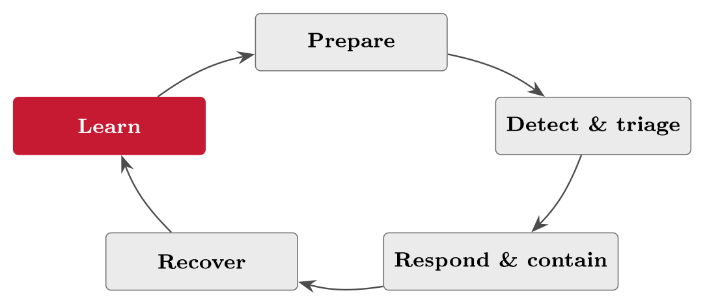

# The preparedness plan {#sec-12-preparedness-plan}

Block III made FastGoods understand and reduce its risk; Block IV begins by
accepting what Block III could not change: No set of controls reduces risk to
zero, and some incidents will get through. Prevention lowers *how often*;
preparedness lowers *how bad* --- and an organisation needs both. This chapter
builds the second half: Which services must come back first and how fast, what
happens in each phase of handling an incident, who acts and who is told, which
legal clocks start ticking at detection, and why a plan that has never been
exercised is a document rather than a capability. The best-run companies are not
the ones that never have incidents; they are the ones that handle them well ---
and handling them well is decided long before the incident, calmly, on paper.

## Why preparedness {#sec-12-why-preparedness}

Chapter 10 ended on residual risk: Re-rated, consciously accepted, signed ---
and still real. Accepted risk is risk that can land, and one day some of it
will. The difference between a scare and a disaster is then not the control set,
which by assumption has already done what it can, but the readiness of the
organisation on the day. Chapter 1's opening case made the point before the
course had words for it: Norsk Hydro in 2019 was a well-run company hit by
ransomware anyway, and what limited the damage was not perfect prevention but a
rehearsed response --- plants that knew how to fall back to manual operation,
leadership that knew what it would say and to whom, backups that could actually
be restored. Readiness is itself a control --- a corrective one, in Chapter 10's
vocabulary --- and this chapter is where FastGoods builds it for the day R1, R2
or R3 stops being a register row.

The discipline has two lineages, and both are worth knowing because both still
shape the standards. Incident *response* grew out of the network age's first
shock: The Morris worm of November 1988, from Chapter 1's timeline, led within
weeks to the founding of the CERT Coordination Center at Carnegie Mellon --- the
first computer emergency response team --- and the CSIRT model then spread
worldwide, national teams included. NIST distilled the practice into Special
Publication 800-61, the *Computer Security Incident Handling Guide*, first
published in 2004 and revised since, whose phase model this chapter uses.
Business *continuity* is older still: It descends from the disaster recovery
planning of the 1970s mainframe era --- fire, flood and the off-site tape ---
matured into a management discipline, was standardised in Britain as BS 25999
(2006), and became the international standard ISO 22301 for business continuity
management systems in 2012 (revised 2019), with ISO/IEC 27031 (2011) covering
the ICT readiness underneath it. Norway adds a third source that Jøsang builds
on directly: The civil-preparedness principles of Norwegian public security
doctrine --- *ansvar* (responsibility), *likhet* (similarity), *nærhet*
(proximity), joined after the 22 July 2011 attacks by *samvirke*
(collaboration). Defined for national civil security, they transfer to cyber
almost unchanged (Jøsang, §14.2, pp. 303--304): Whoever is responsible in normal
conditions is responsible in the crisis; the crisis organisation should resemble
the everyday one; incidents are handled at the lowest capable level; and the
external partners are agreed before they are needed. One cyber-specific caveat
completes the transfer: A flood is obvious and an intrusion is stealthy, so
cyber preparedness must include a detection capability --- you cannot respond to
what you have not noticed.

::: {#def-contingency}
## Contingency planning

Contingency planning is the umbrella discipline of being ready for incidents,
and it covers three related plans that answer three different questions.
*Incident response* handles the event itself: Detect, contain, recover, learn.
*Business continuity* keeps the critical services running while the event is
handled --- the domain of ISO 22301. *Disaster recovery* restores the IT that
the services run on --- the domain of ISO/IEC 27031. One incident can activate
all three, but they must not be conflated: Incident response fights the fire,
continuity keeps the shop trading through the smoke, disaster recovery rebuilds
the building.
:::

What, then, does a preparedness plan contain? In one sentence: The answers,
written in advance, to the questions there will be no time to think about during
the incident. Which services must come back first, and how fast. Who does what,
and who decides. How the organisation detects, contains, recovers and
communicates --- and to which authorities it must report, by when. The point of
planning is to make the hard decisions calmly now, so that during the incident
the team executes instead of improvising. The rest of this chapter fills in
those answers for FastGoods, in that order.

## Critical services and recovery targets {#sec-12-critical-services-and-recovery-targets}

In a crisis you cannot protect everything equally, so the first decision is made
before any incident: What must come back first. A *critical service* is one
whose loss quickly harms the business or its customers, and the tool that
identifies them is one this course already owns --- the business impact analysis
of @def-bia, first met as Chapter 2's downtime table
(@tbl-downtime) and formalised in Chapter 8. ISO 22301 puts the BIA at
the heart of continuity planning for exactly this reason: It tells you not only
what hurts but how fast the hurt arrives, and recovery effort follows that
ranking. For FastGoods the BIA's verdict is familiar: The checkout and the
payment path are critical --- lost sales mount by the hour --- and the customer
database is close behind; the marketing blog is not, and pretending otherwise
would spend crisis capacity where it changes nothing.

Per critical service, continuity planning then fixes numbers --- and the numbers
have standard names.

::: {#def-rtorpo}
## RTO, RPO and MTD

Three temporal objectives quantify a service's recovery. The *recovery point
objective* (RPO) is the acceptable age of the last backup --- the window of data
the organisation can afford to lose; backup frequency must be dimensioned to
satisfy it. The *recovery time objective* (RTO) is the time within which the
service is expected to be restored --- the downtime the organisation plans for.
The *maximum tolerable downtime* (MTD) is the ceiling above both: The point past
which the damage becomes unacceptable. The RTO must sit safely inside the MTD,
and every tightening costs money: A shorter RPO means more frequent backups; a
shorter RTO means more expensive recovery capability (Jøsang, §14.3, Fig. 14.2,
pp. 304--305).
:::

{#fig-rtorpo}

::: {#exm-rtorpo}
## Setting the targets at FastGoods

Different services tolerate very different downtime and data loss, and the
targets should show it (@tbl-rtorpo). The checkout gets the aggressive
pair --- one hour of downtime, five minutes of data --- because Chapter 2's
downtime table showed the losses mounting fast and because a lost order is lost
twice, in revenue and in the customer's trust. The customer database weighs as
much but bites less instantly: Four hours and one hour are defensible. Internal
reporting can wait two days and lose one. The table is not a wish list; it is a
purchase order in disguise, because the targets drive what FastGoods spends on
backup frequency, standby capacity and recovery tooling --- a five-minute RPO on
the checkout means continuous replication, not a nightly tape. Setting a tight
target without funding it is the continuity version of an unowned risk.
:::

::: {#tbl-rtorpo}
  **Service**           **RTO**   **RPO**   **Why**
  --------------------- --------- --------- -------------------------------
  Checkout / web shop   1 hour    5 min     Lost sales mount fast (Ch. 2)
  Customer database     4 hours   1 hour    Serious, but less instant
  Internal reporting    2 days    1 day     Can wait

  : FastGoods' recovery targets per service: The checkout needs near-instant
  recovery and near-continuous backup; internal reporting does not. The targets
  follow the BIA and drive the recovery spend.
:::

##### Dependencies from the diagram.

What a critical service needs in order to run is read off Chapter 8's Level 1
diagram (@fig-fglevel1) rather than remembered: The checkout needs the
payment provider on the far side of TB1, the order database behind TB2 and the
cloud host under all of it, so part of its availability is inherited from
companies FastGoods does not run. The continuity plan lists those dependencies
per service, and Chapter 19 makes each of them a supplier with a recovery
obligation in the contract.

## The response plan and its phases {#sec-12-the-response-plan-and-its-phases}

When the incident comes, a good plan moves the team through clear phases instead
of panic --- and the phases are remarkably stable across the sources. Jøsang
structures incident management as preparation, triage, response and
post-incident (Jøsang, §14.5, pp. 307--313); NIST SP 800-61 names preparation;
detection and analysis; containment, eradication and recovery; and post-incident
activity; Edwards & Weaver's incident chapter walks the same arc (E&W, Ch. 30,
pp. 521 ff.). This script draws them as one cycle (@fig-incidentcycle),
because the last phase feeds the first: Lessons learnt update the plan, the
controls and the register, and the loop has the same continual-improvement shape
as the risk lifecycle of @fig-risklifecycle --- no coincidence, since an
incident is a risk that materialised.

{#fig-incidentcycle}

*Detect and triage* decide most of the damage before anyone has responded at
all. Detection is the monitoring and alerting of Chapter 10 doing its job ---
noticing that something is wrong --- and triage is the first judgement on the
alert: Is it real, and how serious? The reason speed weighs so much was drawn in
Chapter 8's kill chain (@fig-killchain): An attack caught at the
delivery step is a scare; the same attack caught at the exfiltration step is a
breach. Every stage the attacker completes before detection multiplies the
response work, which is why Jøsang's preparation phase puts structured detection
methods, and an alert channel that reaches the triage role without delay, among
the plan's first requirements --- and why FastGoods' rerouted alerts from
Chapter 10's effectiveness work were not cosmetic.

*Respond and contain* then stop the spread: Isolate the affected systems,
disable the compromised accounts, block the traffic --- whatever cuts the
attacker's next step --- while preserving evidence. The preservation point is
easy to lose in the adrenaline and expensive to have lost afterwards: Logs,
images and timelines are what digital forensics needs to establish what
happened, what was taken, and whether the attacker is really gone (Jøsang,
§14.6, pp. 314--315) --- and what lawyers, insurers and authorities will ask
for. Containment that destroys the evidence buys an hour and costs the
investigation.

*Recover and learn* close the loop. Recovery restores the critical services
within their RTOs, from the backups the RPO dimensioned --- and confirms the
threat is actually removed first, because restoring a still-compromised system
restores the incident. Learning is the post-incident phase (Jøsang, §14.5.4,
p. 313): A root-cause review in Chapter 8's manner --- the 5 Whys, not the
nearest scapegoat --- with the lessons written into updated controls, an updated
plan and an updated register. An incident not learnt from is wasted; an incident
learnt from is data. Jøsang notes the further prize: Statistics from real
incidents are exactly the evidence base that makes Chapter 8's likelihood
estimates less like guessing --- your own incident history is the base rate
closest to home.

::: {#exm-ddostimeline}
## The DDoS timeline: R2 on the clock

The plan in action, with real timings, for the running risk R2
(@tbl-ddostimeline). At T+0 the monitoring alerts: Checkout response
times spike. At T+10 minutes the on-call responder has triaged --- a DDoS, not a
fault --- escalated per the plan's thresholds, and enacted the DDoS playbook. At
T+30 minutes the upstream traffic scrubbing from Chapter 10's treatment is
active and the checkout recovers: Half an hour of degradation, comfortably
inside the one-hour RTO of @tbl-rtorpo. At T+1 day the review asks the
two questions that turn the incident into improvement: Was the RTO met, and what
in the plan slowed us down? Compare this timeline with Chapter 5's version of
the same event (@exm-ddosclock): There the clocks were legal, here they
are operational --- and the plan must beat the damage curve of
@exm-downtime, or it is a well-documented way of losing money slightly
more calmly.
:::

::: {#tbl-ddostimeline}
  **Time**     **The DDoS incident (R2), as the plan runs**
  ------------ -----------------------------------------------------------------------
  T + 0        Monitoring alerts: Checkout response times spike
  T + 10 min   Triage confirms a DDoS; escalation per threshold; playbook enacted
  T + 30 min   Traffic scrubbing active; checkout recovers --- inside the 1-hour RTO
  T + 1 day    Review: RTO met? What slowed us? Plan and register updated

  : A worked incident timeline for R2: Detect, respond, recover, learn --- with
  timings. A plan is worth something only when this timeline plays out faster
  than the damage accumulates.
:::

Phases need people, and the capability can be built or bought. In-house, the
standard division is between a *SOC* --- the security operations centre, which
monitors the infrastructure and notifies --- and a *CSIRT*, which handles the
incidents that the SOC and everyone else report; in practice the two blur, and a
SOC often drives response too (Jøsang, §14.5, p. 314). Building a 24/7 team is
costly, so a growing market sells the capability as a service: Managed security
services (MSS), managed detection and response (MDR), extended detection and
response (XDR), and forensics specialists on retainer for the day they are
needed. For a 25-person shop the make-or-buy answer is usually buy --- FastGoods
takes MDR rather than staffing a night shift --- which turns readiness into a
supplier relationship, with everything Lecture 19 will say about contracts,
follow-up, and depending on someone else's competence at your worst moment.

## Roles and communication {#sec-12-roles-and-communication}

In a crisis, knowing who acts and who is told is worth as much as the technical
response --- and Jøsang makes clear assignment of responsibility a
contingency-planning principle in its own right: Knowing who does what when
disaster hits (Jøsang, §§14.2, 14.4). The crisis roles are the counterpart of
Chapter 11's standing structure, activated when the plan is invoked, and they
are assigned *in advance*, by name, with deputies and contact points ---
Jøsang's practical demand that the plan and the contacts also exist on paper is
not nostalgia but the lesson of incidents where the contact list lived inside
the system that was down. Four roles cover a small organisation
(@tbl-irroles); the RACI scheme of Chapter 11 fits them precisely, and
Jøsang's own worked example uses it for exactly this purpose (§14.4, Table 14.1,
p. 306): One row per crisis activity, exactly one accountable name.

::: {#tbl-irroles}
  **Role**               **Responsibility during the incident**
  ---------------------- ---------------------------------------------------------
  Incident lead          Runs the response, makes the calls, invokes the plan
  Technical responders   Contain, investigate, recover; preserve evidence
  Communications         Internal updates; customers and partners; the regulator
  Management / legal     Major decisions, reporting duties, liability questions

  : Crisis roles, assigned by name and with contact points before any incident.
  They complement --- and often overlap with --- the standing roles of Chapter
  11; the responsibilities stay distinct.
:::

Two mechanisms make the roles work under pressure. The first is *escalation*:
Defined thresholds for when an incident goes up --- to the incident lead, to
management, to the board --- agreed before anyone is tired or frightened. This
is the proximity principle in operation: Small incidents are handled low, by the
people closest to them, and the criteria for invoking the full plan and waking
management are written down, so the organisation avoids both failure modes at
once --- panic, where everything escalates and crisis capacity burns out on
noise, and silence, where nothing escalates until it is far too late. The second
is *communication*, planned on two channels: Inward, so staff and management
hear the truth from the plan rather than the rumour mill; and outward, to
customers, partners and authorities. Chapter 1's Hydro lesson sets the outward
standard --- open, early, factual --- and it is much easier to be Hydro if the
draft statements, the spokesperson and the approval path were agreed on a calm
Tuesday.

Outward communication is not only reputation management; some of it is law, and
the clocks are shorter than most first-timers expect. A personal-data breach ---
an R3 event --- must be notified to Datatilsynet within 72 hours of awareness
under GDPR Article 33, with the staged content Chapter 7 walked through
(@exm-breachclock); a significant incident under the Digital Security
Act and NIS2 starts the 24-hour early-warning ladder of Chapter 5
(@fig-clock, @exm-ddosclock); and one incident can run both
clocks at once. The clocks start at detection, not when convenient --- which is
precisely why the reporting duty belongs in the preparedness plan: *Who*
reports, to *whom*, by *when*, with the forms and addresses ready. An
organisation that first looks up its supervisory authority during the incident
has already spent hours it did not have, and turned a compliance duty into a
compliance finding.

## Test and improve {#sec-12-test-and-improve}

A preparedness plan that has never been exercised is a document, not a
capability --- and the space between the two is where plans fail. Paper plans
look complete and break on contact: The contact list has two leavers on it, the
responder lacks access to the console the playbook assumes, step four says
"restore from backup" and nobody has ever restored from backup. The only way to
find these failures before the incident does is to exercise the plan, which is
why Jøsang treats testing as part of readiness itself (Jøsang, §14.7,
pp. 316--319 --- where pentesting, red-teaming and, for the financial sector,
the TIBER framework apply the same logic to the technical defences). Exercising
also does something no document can: It trains the actual people who will run
the actual response, so that the first execution of the plan is not on the night
it counts. Chapter 10's vocabulary applies exactly --- an untested plan may be
well designed, but design effectiveness without operating effectiveness is
@def-effectiveness's hollow control, and an auditor will ask for the
dated evidence of the last exercise (Lecture 16).

::: {#tbl-testmethods}
  **Method**           **What it involves**
  -------------------- --------------------------------------------------------------------------------------
  Tabletop exercise    Talk a scenario through around a table; cheap, and finds the gaps in roles and steps
  Simulation / drill   Do one part for real --- restore the backup, fail over the checkout
  Full exercise        Rehearse a whole incident end to end, communications included

  : Three ways to test the plan, in rising cost and realism. Start with the
  tabletop; graduate to the drill that proves the RTO and RPO are more than
  table entries.
:::

Start with the tabletop --- an afternoon, the crisis roles around one table, one
scenario read out step by step --- because it is cheap and it finds the
expensive gaps first: The unclear hand-off, the missing threshold, the two
people who each thought the other would call the regulator. Graduate to drills,
and put the restore drill first in the queue: Restoring the customer database
into a test environment, on the clock, is the only way to know that the backups
behind @tbl-rtorpo's RPO actually work --- and Chapter 10's records
already carry the reason, because R3's backup-and-restore mitigation and the
implementation plan's verification column (@tbl-implplan) were promises
that only a dated, successful restore can keep. A full exercise, once the parts
work, rehearses the whole --- and yields exactly the evidence an auditor, an
insurer, or an Article 21 supervisory conversation will ask to see.

The plan the exercises test must then stay alive, because a correct plan ages
into a wrong one without any incident at all: People change roles, systems are
replaced, suppliers come and go. Two habits keep it current --- update the plan
after every incident *and* every exercise, while the lessons are fresh; and
refresh the contacts and system references on a calendar, not on memory. The
document itself stays short enough to use under pressure and covers, at minimum:
The critical services with their RTO and RPO; the crisis roles with names,
deputies and contact points; the escalation thresholds and the per-phase steps;
the reporting duties with authority, deadline and form; and playbooks for the
incidents the register says are most likely --- for FastGoods, ransomware, an R3
breach, and the R2 DDoS. And it is stored where it can be reached when the
systems are down --- printed copies included, per Jøsang's dry and correct
observation that contingency plans must be available on physical documents: A
plan locked inside the encrypted laptop you cannot boot is no plan at all.

::: {.callout-tip}
## Finding the risk: In the preparedness plan

Chapter 1's rule --- read an existing control backwards --- applies to the plan
itself, row by row. A contact who left in March, a backup never restored, a
playbook naming a system replaced last year, an exercise column that is empty:
Each stale row is a risk found, not produced --- *the incident arrives, the
plan's step fails, and the downtime runs towards the MTD instead of the RTO*.
The untested restore has sat in FastGoods' register since Chapter 10 for exactly
this reason. A preparedness plan is a control; an unmaintained one is Chapter
10's ineffective control wearing its most expensive costume.
:::

::: {#exm-examplan}
## The exam-day contingency

The nearest continuity problem in the room: The home exam, and the laptop that
dies at 09:40. Run the chapter on it. Critical service: Writing and submitting
the exam. MTD: The deadline --- fixed, unmovable. RTO: Thirty minutes, say,
before the loss stops being recoverable. RPO: However much written work you can
afford to lose --- which is set by your backup habit, because autosave to a
synced drive is a five-minute RPO and "I save when I remember" is not. The plan,
written the calm week before: A second device that can log into the exam system,
files synced continuously, and the invigilator's or exam-support number on
paper. The drill: Open the exam system from the second device once, before the
day. Ten minutes of preparedness against the semester's worst hour --- and
precisely the reasoning FastGoods just applied to its checkout.
:::

##### Reading for this chapter.

Jøsang, Chapter 14 (cybersecurity readiness, pp. 301--320): §14.2 for the
principles, §14.3 for RTO, RPO and MTD (Fig. 14.2, pp. 304--305), §§14.4--14.5
for the plan and the incident phases, and §§14.6--14.7 for forensics and
testing. Edwards & Weaver, Chapter 30 (incident response and recovery,
pp. 521 ff.), whose worked example response plan repays a close read. Both books
are available in the library and on the Canvas course page.

## Summary {#sec-12-summary}

Residual risk is never zero, so prevention needs a partner: Preparedness, which
lowers how bad instead of how often --- itself a corrective control, and the
reason Hydro's 2019 handling is still taught. Contingency planning
(@def-contingency) covers incident response, business continuity and
disaster recovery --- three plans, three questions --- with lineages running
from the Morris worm and CERT/CC through NIST SP 800-61, from 1970s disaster
recovery through BS 25999 to ISO 22301 and ISO/IEC 27031, and through Norway's
civil-preparedness principles --- ansvar, likhet, nærhet, samvirke --- which
Jøsang carries into cyber with one addition: A detection capability, because
intrusions hide. Continuity starts by choosing what comes back first --- the
BIA's critical services --- and fixing RTO, RPO and MTD per service
(@def-rtorpo), targets that price directly into backup and recovery
spend. The response itself runs in phases --- prepare, detect and triage,
respond and contain, recover, learn --- a loop in which detection speed decides
most of the damage, evidence is preserved for forensics, recovery happens inside
the RTO, and the post-incident review feeds controls, plan and register; the
capability is staffed as SOC and CSIRT or bought as MSS, MDR or XDR. Crisis
roles are named in advance with contacts on paper, escalation thresholds prevent
both panic and silence, communication is planned inward and outward, and the
legal clocks --- GDPR's 72 hours, NIS2's 24-hour early warning --- start at
detection and belong in the plan. And none of it is real until exercised:
Tabletop, drill, full exercise --- the restore drill first --- with the plan
kept alive, and kept reachable when the systems are not.

This chapter leaned repeatedly on pieces built earlier --- assets, threats,
controls, and now readiness. Lecture 13 steps back and joins those pieces into
one model of a risk: Value, threat, vulnerability and control, interlocked ---
and the gaps the model reveals.

## Self-check {#sec-12-self-check}

Try these before the next lecture.

::: {#exr-12-targets-for-a-new-service}
## Targets for a new service

Set an RTO and an RPO for FastGoods' customer-service mailbox, with one sentence
of justification for each --- and name the MTD consideration that caps your RTO.
:::

::: {#exr-12-five-phases-five-sentences}
## Five phases, five sentences

Walk risk R3 (a customer-database breach) through the five phases of
@fig-incidentcycle: One sentence per phase, naming a concrete action in
each.
:::

::: {#exr-12-the-nightly-backup-that-proves-nothing}
## The nightly backup that proves nothing

FastGoods' backups run every night and have never failed to run. Explain, using
Chapter 10's design-versus-operating vocabulary, why the restore drill is still
necessary --- and what single piece of evidence it produces that the nightly job
cannot.
:::

::: {#exr-12-two-clocks-one-breach}
## Two clocks, one breach

For an R3 breach discovered on a Friday afternoon, name the two reporting
regimes that may apply, their first deadlines, and the role in
@tbl-irroles that owns each notification.
:::

::: {#exr-12-design-a-tabletop}
## Design a tabletop

Plan FastGoods' first tabletop exercise: The scenario in one sentence, the
participants by role, and the three questions the facilitator should ask that
are most likely to expose gaps.
:::
