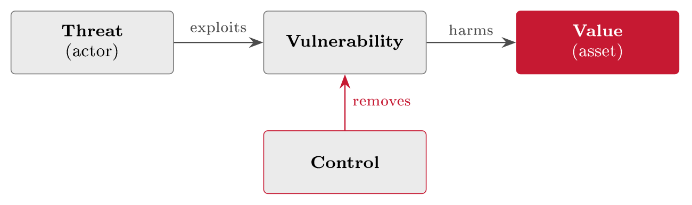
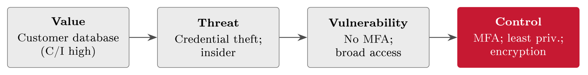

# Value, threat, vulnerability and control {#sec-13-value-threat-vulnerability-control}

This is the synthesis chapter. The pieces were built separately - assets and
their value in Chapters 4 and 8, threats, vulnerabilities and their estimates in
the same Chapter 8, controls in Chapter 10, and last chapter the preparedness
for when they fail - and each piece only protects you when it is joined to the
others. Today they are connected into one model: Value, threat, vulnerability
and control, interlocking in a single view of a risk. The model does two jobs.
It gives you one consistent way to reason about any risk - the frame behind
every risk statement Block III produced - and it shows, at a glance, exactly
where you are still exposed: The gaps, which feed the audit and evaluation work
of Block V. Jøsang says it plainly at the very start of his book: The central
concepts of cyber risk are threats, vulnerabilities, assets, risks and controls
- *and their connection* (Jøsang, Ch. 1, pp. 1--14). The connection is this
chapter.

## One model {#sec-13-one-model}

The picture this chapter is built around has a pedigree worth knowing, because
it explains why the same diagram appears, in dialects, across the whole field.
Its lineage runs through security evaluation: The US "Orange Book" (TCSEC, 1985)
and the European ITSEC (1991) both needed a shared vocabulary for what was being
evaluated, and their 1996 unification - the Common Criteria, since 1999 the
international standard ISO/IEC 15408 - fixed it in a "security concepts and
relationships" diagram: Owners value assets; threat agents give rise to threats;
threats exploit vulnerabilities; vulnerabilities expose assets; countermeasures
reduce the exposure. Jøsang opens his book with the same elements and the same
connective logic (§§1.4--1.8, pp. 5--14), and this course has been using the
vocabulary since @def-vocab without yet drawing the joined-up picture.
Four questions, one per element, and answered together they describe a risk in
full (@tbl-vtvcfour).

::: {#tbl-vtvcfour}
  **Element**     **The question**            **FastGoods**
  --------------- --------------------------- -----------------------------
  Value           What is worth protecting?   The customer database
  Threat          What could harm it?         A criminal after the data
  Vulnerability   What weakness lets it in?   Weak access control
  Control         What closes the weakness?   Access control + encryption

  : The four elements as four questions. Answer all four for an asset and you
  have described - and started to treat - the risk to it.
:::

::: {#def-vtvc}
## The value--threat--vulnerability--control model

A risk lives on a path: A *threat* exploits a *vulnerability* to harm something
of *value*, and a *control* removes or reduces the vulnerability, breaking the
path. The risk is the whole path, not any one element: Without value it is
unrankable, without a threat it is a mere weakness, without a vulnerability
there is no way in, and without knowing the controls it is rated inherently when
the decision needs the residual.
:::

{#fig-vtvc}

One reframing inside the model carries most of its practical force, and Jøsang
states it as a matter of definition: *A vulnerability can be read as the absence
of a control.* If the control were in place, the vulnerability would be gone -
for R1, "no MFA" is precisely the missing control that defines the weakness. The
reframe is more than wordplay, because it settles where the effort goes. Of the
three risk drivers on the path, only one is practically reducible: You cannot do
much about value, because you need your assets - FastGoods cannot lower R3 by
deleting its customers; and you cannot control the threat, because attackers do
not take instructions. The vulnerability is the element in your hands, and
reducing risk therefore means adding controls where vulnerabilities stand open
- which is why Chapter 10, control selection, is where the action of Block III
concentrated, and why a long, frightening threat list turns into a manageable
to-do list the moment each entry is rewritten as the control it is missing.

## The four elements, each in turn {#sec-13-the-four-elements-each-in-turn}

*Value* anchors everything, and it was priced long ago: An asset's worth is its
confidentiality, integrity and availability importance - Chapter 4's
classification, where FastGoods' scheme (@tbl-fgclass) rated the
customer database confidential and critical precisely because a loss hits all
three CIA properties at once, in money, law and trust. Value sets the
consequence side of every risk and the proportionality of every response:
High-value assets justify more, and stronger, controls; no value, no risk worth
treating. Starting from value is also what keeps the analysis honest - it is
Chapter 8's asset-first discipline restated: You spend effort where loss would
hurt.

*Threat* is the who and the how, and the craft is matching the actor to the
asset rather than reciting the whole taxonomy. Chapter 8's actor ladder
(@tbl-actorladder) supplies the candidates; the model asks which of them
would realistically come for *this* asset (@tbl-vtvcactors). For a
webshop's customer database the realistic threats are cybercriminals - data to
sell, accounts to defraud - and the insider with access and a grievance; a
hacktivist DDoS against the shopfront is plausible; a nation-state campaign
against a 25-person retailer is not, and writing it into the assessment anyway
is how registers lose credibility. Tailoring the threat picture to who would
actually target you is the difference between threat modelling and threat
theatre.

::: {#tbl-vtvcactors}
  **Actor**       **After**             **Realistic for FastGoods?**
  --------------- --------------------- ------------------------------------
  Cybercriminal   Money; data to sell   Yes - customer data, fraud
  Insider         Grievance, gain       Yes - staff hold access
  Hacktivist      A point to make       Possible - DDoS on the shopfront
  Nation-state    Espionage, sabotage   Unlikely for a webshop

  : Chapter 8's actors, matched to the asset: The model's threat element is not
  the full taxonomy but the actors who would plausibly come for this value.
:::

*Vulnerability* is the weakness that lets a step of the attack succeed, and
Jøsang groups the weaknesses into three kinds worth keeping visibly apart:
*Technical* - flaws in systems, networks, software and hardware; *process* -
procedures weak or missing, like the leaver routine whose absence powered
Chapter 8's root-cause example; and *human* - awareness, attitude and
behaviour, the kind Chapter 14 is devoted to. The standard references of Chapter
8 slot into this element and nowhere else: CWE names the abstract weakness type,
CVE the concrete instance in a real product - a distinction the Common
Criteria drew first - and CVSS scores an instance's technical severity on its
0--10 scale, conventionally read in bands: None (0), low (0.1--3.9), medium
(4.0--6.9), high (7.0--8.9), critical (9.0--10.0). Hold on to what the score is
and is not: It grades one element of @fig-vtvc - the vulnerability, in
the abstract. Value, threat exposure and existing controls are yours to supply,
which is why a CVSS number is an input to a risk judgement and never the
judgement itself - @sec-13-finding-the-gaps shows the order of work
flipping for exactly this reason. Reducing risk, in this element's terms, is
reducing the *vulnerability surface*: Fewer weaknesses standing open, of all
three kinds.

*Control* is the answer to the vulnerability, and naming the pair together is a
discipline in itself: Because each control sits on a specific link of the path,
stating it precisely also states which weakness it closes - MFA closes "no
second factor," not vaguely "account security." Selection is risk-based, in
Jøsang's sense (Ch. 19, pp. 405 ff.): Enough control to bring the risk to the
acceptable level, cost-effectively - not every control in the catalogue. And
controls come in the three functions of Chapter 10 - preventive, detective,
corrective - usually several together along the path, which is defence in
depth (@fig-didchain) read as geometry: Preventive controls sit on the
"removes" arrow, detective controls watch the "exploits" arrow, and corrective
controls - Chapter 12's whole subject - limit the harm at the "value" end
when the first two fail.

## Applying the model {#sec-13-applying-the-model}

Using the model is a build, one element at a time, and the order is the
value-first order this course has drilled since Chapter 8. Run it on FastGoods'
highest-value asset.

::: {#exm-vtvcbuild}
## Building the model for the customer database

*Step 1 - start from value.* The customer database: Confidentiality high,
integrity high, availability medium (@tbl-fgclass); a breach costs
money, law (GDPR, Chapter 7) and trust at once. Starting here keeps the effort
proportionate. *Step 2 - add the threats.* Who would come for it? The
credential-stealing criminal and the malicious insider
(@tbl-vtvcactors); each gets a realistic scenario in Chapter 8's sense,
not a movie plot. *Step 3 - name the vulnerabilities.* For each threat, the
weakness that would let it succeed: No MFA on the logins that reach the database
- the decisive one, and the exact gap behind R1; access rights broader than
roles need; no encryption at rest; no monitoring of bulk reads. Each is, in
Jøsang's reframe, a missing control - so listing the vulnerabilities has
already listed the controls not yet in place. *Step 4 - close each with a
control.* Enforce MFA; cut access to least privilege with a periodic review;
encrypt at rest; alert on anomalous reads. Preventive plus detective, defence in
depth - and the path of @fig-vtvc is broken at every named weakness.
The result reads as one traceable line (@fig-vtvcchain): *Customer data
- credential theft - no MFA - enforce MFA* is a defensible sentence, and
it is @def-riskstatement's risk statement written as geometry.
:::

{#fig-vtvcchain}

The same four-stage read applies to every risk on the register, which is what
makes the model a working tool rather than a lecture figure: The columns are
always the same, so any risk can be scanned the same way
(@tbl-vtvc3risks) - the asset, who attacks it, the gap they use, the
control that closes it. And for one asset in depth, the model collapses into a
four-row table that is the whole risk and its treatment on one page
(@tbl-vtvcdb) - reusable for any asset, which is exactly how the
seminar exercise asks you to use it on your own case company.

::: {#tbl-vtvc3risks}
  **Risk**   **Value**           **Threat**            **Vulnerability**           **Control**
  ---------- ------------------- --------------------- --------------------------- -----------------------------
  R1         Customer accounts   Credential theft      No MFA                      Enforce MFA
  R2         Checkout service    DDoS attacker         No traffic filtering        Anti-DDoS, rate limits
  R3         Customer database   Data thief; insider   Unencrypted, broad access   Encryption, least privilege

  : One model, three risks: The running register read as
  value--threat--vulnerability--control lines. The uniform columns are the point
  - any risk scans the same way.
:::

::: {#tbl-vtvcdb}
  **Element**     **For the customer database**               **Note**
  --------------- ------------------------------------------- ----------------------------------
  Value           Personal data; C high, I high               A breach costs money, law, trust
  Threat          Cybercriminal; malicious insider            The realistic actors
  Vulnerability   Weak access; no encryption; no monitoring   Three open weaknesses
  Control         Least privilege; encryption; alerts         One control per weakness

  : The full model for one asset, top to bottom: The whole risk and its
  treatment in four rows - reusable for any asset on the inventory.
:::

##### The completeness check.

Step 2 has a systematic form, because the threats of the four-step build can be
checked against the per-element grid of Chapter 8 (@tbl-strideelement):
The customer database is a data store, so it admits tampering, disclosure and
denial, and repudiation where it holds logs; the login flow admits tampering,
disclosure and denial; the checkout process admits all six. A model that names
only credential theft for the database has left tampering and repudiation
unasked - which is exactly the kind of gap @sec-13-finding-the-gaps
exists to find.

## Finding the gaps {#sec-13-finding-the-gaps}

Here is the model's real power, and the reason it closes the risk block: It
turns the unanswerable question *are we secure?* into a concrete one - *which
vulnerabilities currently have no control?* Wherever a threat can exploit a
vulnerability and nothing stands on the "removes" arrow, there is a *gap*: An
open path, an untreated risk, and statistically the place where the next
incident happens. One refinement from Chapter 10 sharpens the definition: A
control that is present but ineffective is also a gap - design without
operating effectiveness (@def-effectiveness), the alerts routed to an
unread mailbox - and Lecture 16's auditors test for precisely this difference.

::: {#def-gap}
## Gap analysis

A gap analysis compares the controls an organisation *should* have with the
controls it *does* have, and records each difference as a gap with a status, an
owner and an action. The "should" column can be read from the model - one
control per open vulnerability - or from a committed target state: A law's
baseline, a standard's controls, the organisation's own SoA. Run against the
model it finds untreated risk; run against a target state it measures the
distance to compliance - the same comparison, and the exercise Chapter 5
promised the moment FastGoods checked its legal scope (@exm-scopecheck).
:::

::: {#exm-ctrlgap}
## FastGoods' control gap table

@tbl-ctrlgap shows the practitioner's control gap assessment as it stood
when Block III opened - vulnerability by vulnerability, the control needed
against the control in place. The open rows are the work list, and reading them
against the register shows the block doing its job: Rows one and four are R1 and
R2 before Lecture 10 treated them - re-run the table after the implementation
plan (@tbl-implplan) verified MFA and the DDoS protection, and both
close. Row three stays honestly partial: Access rights were cut, the periodic
review is young. The dating is the lesson - a gap table is a photograph, not a
portrait, and it is re-taken on a rhythm.
:::

::: {#tbl-ctrlgap}
  **Vulnerability**       **Control needed**         **In place?**   **Gap**
  ----------------------- -------------------------- --------------- ----------------------------------------
  Reused passwords        MFA                        No              [**Open**]{style="color: riskCrit"}
  No encryption at rest   Encrypt the database       No              [**Open**]{style="color: riskCrit"}
  Broad access rights     Least privilege + review   Partly          [**Partial**]{style="color: riskHigh"}
  No DDoS defence         Traffic filtering          No              [**Open**]{style="color: riskCrit"}

  : The control gap assessment, dated at the start of Block III: Needed against
  in place, per vulnerability. Open rows are untreated risks; Lecture 10's
  verified treatments close rows one and four on the next run.
:::

::: {.callout-tip}
## Finding the risk: In the gap table

A gap table is the fourth source of Chapter 1's box in concentrated form: Risks
already found, half-written. Read any open row forward and the risk statement
completes itself - "no encryption at rest" becomes *a data thief who reaches
the database reads it in the clear, exploiting the missing encryption, exposing
every customer record*. Every gap is a risk statement waiting for its verbs;
closing the gap is the treatment, and until it closes, the row belongs in the
register too, not only in the plan.
:::

Not every gap is equally urgent, so the open rows are prioritised by the risk
behind them - the value at stake and the likelihood of exploitation, which is
Chapter 8's rating logic pointed at gaps, feeding straight into Chapter 10's
treatment plan. A gap on a high-value asset with an easy, internet-facing attack
path beats a gap on a low-value, hard-to-reach system - and this is where the
CVSS score met under the vulnerability element finds its proper place in the
order of work.

::: {#exm-cvssflip}
## Two scores, one order flipped

FastGoods' scanner reports two findings the same morning: A 9.8 (critical) in a
component on an isolated internal test machine, and a 7.5 (high) in a library on
the internet-facing checkout. By score alone, the 9.8 goes first. On the model,
the order flips: The test box carries little value, no exposure to the realistic
threat, and sits behind internal controls - three of the four elements near
zero; the checkout carries the revenue, faces the internet, and stands between
the customer and the payment flow. The 7.5 is patched first, the 9.8 scheduled
- and the reasoning is written down, because "we deviated from the score
order" is defensible exactly when the model's other elements are cited. Severity
ranks flaws; risk ranks work.
:::

Two further refinements keep the tool honest over time. First, in place is
rarely all-or-nothing, so mature practice grades the current state on a
capability ladder - from ad hoc, through repeatable and defined, to managed
and optimising - a way of thinking that originated in 1980s software
engineering at Carnegie Mellon, that COBIT (Chapter 6) carries into IT
governance, and that Jøsang applies to security management as maturity levels
(§18.6, pp. 400 ff.); "partial, at level two of five" is a more honest current
state than yes-or-no, and @tbl-ctrlgap's third row is exactly such a
case. Second, a gap-free photograph does not stay gap-free, which is why the
risk lifecycle of @fig-risklifecycle loops: New threats and techniques
emerge - Chapter 8's threat intelligence exists to notice them; new systems
and suppliers add new vulnerabilities, the theme Lecture 19 takes up; newly
discovered weaknesses open old software overnight, as Log4Shell did across the
world in December 2021; and controls decay - switched off during an incident
and never re-enabled, outgrown by the business, unmaintained since their owner
left. The model is re-run as the picture changes; it is a rhythm, never a
result.

## Pulling it together {#sec-13-pulling-it-together}

Step back, and the model is not new content at all: It is the frame that holds
the whole risk block together, each element built in a chapter you have already
worked through (@tbl-blockmap). That makes this chapter the natural
revision map for the block - for the arbeidskrav and later the exam, a risk
you can walk around @fig-vtvc is a risk you understand - and it makes
the model's outputs land in documents you already keep. Each open gap becomes,
or updates, a risk in the register (@def-register); each chosen control
is recorded and justified in the SoA (@def-soa); the model is the
thinking, the register and the SoA are the record, and the two views must stay
in step, because Lecture 16's auditors will trace one against the other. Looking
further ahead, the model is also the doorway to quantification: FAIR, which
Lecture 20 introduces, is this same logic with numbers on the arrows - threat
event frequency against vulnerability against loss magnitude - so the
reasoning you learned here qualitatively is the reasoning you will later price.

::: {#tbl-blockmap}
  **Element**     **Where the block built it**
  --------------- -------------------------------------------------------------------
  Value           Chapter 4's assets and classification; Chapter 8's asset profiles
  Threat          Chapter 8's actors, vectors and scenarios
  Vulnerability   Chapter 8's weaknesses, root causes and references (CWE/CVE/CVSS)
  Control         Chapter 10's selection, tailoring and defence in depth

  : The block in one model: Each element of @fig-vtvc points back to the
  chapter that built it. The model adds no new parts - only the connection.
:::

::: {#exm-syllabusgap}
## The syllabus gap

The tool transfers, one more time, to the nearest portfolio in the room. Needed:
The syllabus - the chapters read, the self-checks done. In place: Honestly,
the chapters actually read so far. The open rows: A list, by chapter, which is
less frightening than the vague dread it replaces - gaps itemised are gaps
closable. Owner and action: You, and a reading plan; the break-even slide has
been arguing for it since Lecture 1. The capability ladder applies here too:
"Read once" is level two; "can run the self-check cold" is the level the exam
tests. A gap analysis of your own preparation, run in October rather than the
night before, is this chapter's method earning its keep twice.
:::

One honest limit closes the chapter, and it explains the shape of this block.
The model tells you what to control; it does not make you ready for the incident
that gets through anyway. No set of controls reduces risk to zero - Chapter 10
wrote the residual into the register in so many words - and for what remains
you need exactly what Chapter 12 built: The plan, the roles, the rehearsed
response. That is why preparedness opened Block IV before the synthesis: Knowing
and reducing your risks is necessary, and it is not sufficient. Many of the gaps
the model surfaces, meanwhile, are not technical at all - the human column of
the vulnerability element - and how staff actually behave around security, and
how behaviour is changed, is where the block goes next: Lecture 14, awareness
and behaviour, with Jøsang's security-culture chapter (Ch. 13, pp. 283 ff.) as
its text.

##### Reading for this chapter.

Jøsang, §§1.4--1.8 (the elements and their connection: Threats, vulnerabilities,
controls and cyber risk, pp. 5--14) together with Chapter 19 (cyber risk
management, pp. 405 ff.) and, for the threat side, Chapter 16 (cyber operations,
pp. 337 ff.); Edwards & Weaver, Chapter 10 (risk assessments, pp. 171 ff.) and
Chapter 26 (risk mitigation, pp. 463 ff.). Both books are available in the
library and on the Canvas course page.

## Summary {#sec-13-summary}

Four elements, one path (@def-vtvc): A threat exploits a vulnerability
to harm a valued asset, a control removes the vulnerability - the Common
Criteria's old diagram, Jøsang's opening concepts, and the frame behind every
risk statement Block III produced. The load-bearing reframe: A vulnerability is
a missing control, and of value, threat and vulnerability only the vulnerability
is practically reducible - which is why control selection is where the effort
concentrates. Each element in turn: Value from Chapter 4's CIA classification
sets consequence and proportionality; the threat element matches Chapter 9's
actors to the asset - criminals and insiders for a webshop, not nation-states;
vulnerabilities come technical, process and human, referenced as CWE (type), CVE
(instance) and CVSS (severity in bands); the control answers a named weakness,
chosen risk-based, layered by function along the path. Applied, the model is a
four-step build - value, threats, vulnerabilities, controls - whose product
is a traceable line per risk and a four-row table per asset. Its diagnostic
power is the gap: An open path, including present-but-ineffective controls; the
gap analysis (@def-gap) tables needed against in place - against the
model for untreated risk, against a committed target for the compliance distance
Chapter 5 promised - with open rows prioritised by the risk behind them (the
7.5 on the checkout beats the 9.8 on the test box), graded on a maturity ladder
where yes-or-no would lie, and re-taken on a rhythm because threats, systems and
controls all move. Pulled together: Nothing here is new content - each element
points back to its chapter, gaps feed the register, controls the SoA, FAIR will
later price the same logic - and the model's honest limit, residual risk, is
exactly what Chapter 12's preparedness answers.

Many of the remaining gaps are human. Lecture 14 turns from the model to the
people.

## Self-check {#sec-13-self-check}

Try these before the next lecture.

::: {#exr-13-map-a-second-risk}
## Map a second risk

Walk FastGoods' risk R2 (DDoS on the checkout) through the four elements of
@def-vtvc, and say for each of its controls which arrow of
@fig-vtvc it works on.
:::

::: {#exr-13-the-reframe-applied}
## The reframe, applied

"A vulnerability is a missing control." Apply the sentence to R1 in three
sentences: Name the vulnerability, the control whose absence it is, and what the
reframe changes about how the to-do list is written.
:::

::: {#exr-13-score-versus-risk}
## Score versus risk

Explain, in three sentences, why a CVSS 9.8 can rank below a 7.5 in a patch
queue - naming the three model elements the score does not see.
:::

::: {#exr-13-complete-the-gap-row}
## Complete the gap row

Take the gap "no joiner/leaver routine" (Chapter 8's root cause). Write it as a
full gap-table row - vulnerability, control needed, in place?, gap - and
then, using the box above, as the risk statement it half-contains.
:::

::: {#exr-13-re-run-the-photograph}
## Re-run the photograph

Name three plausible changes at FastGoods over one year - one threat, one
system or supplier, one control - that would each reopen a closed row of
@tbl-ctrlgap or add a new one, and say which element of the model each
change moves.
:::

::: {#exr-13-vtvc-interactive}
## The four elements, interactive

Sort the pieces of one FastGoods scenario into the model's four elements.

```{=html}
<div class="grc-ex" data-type="sort">
<script type="application/json">
{
 "buckets": [
  {
   "id": "value",
   "label": "Value"
  },
  {
   "id": "threat",
   "label": "Threat"
  },
  {
   "id": "vuln",
   "label": "Vulnerability"
  },
  {
   "id": "control",
   "label": "Control"
  }
 ],
 "chips": [
  {
   "t": "The customer database and the trust it carries",
   "b": "value"
  },
  {
   "t": "A ransomware crew scanning for targets",
   "b": "threat"
  },
  {
   "t": "An unpatched web server",
   "b": "vuln"
  },
  {
   "t": "Patching on a defined cadence",
   "b": "control"
  },
  {
   "t": "Admin accounts without MFA",
   "b": "vuln"
  },
  {
   "t": "MFA on all admin access",
   "b": "control"
  }
 ],
 "explain": "The model's path runs threat, vulnerability, value: A control placed on the path breaks it.",
 "ref": "sec-13-the-four-elements-each-in-turn",
 "reflabel": "The four elements"
}
</script>
</div>
```
:::

::: {#exr-13-build-interactive}
## The four-step build, interactive

Order the steps of applying the model to a system.

```{=html}
<div class="grc-ex" data-type="order">
<script type="application/json">
{
 "steps": [
  "Name what has value",
  "Identify the threats to it",
  "Find the vulnerabilities the threats can use",
  "Place controls and check the gaps"
 ],
 "explain": "Value first, then threats, then vulnerabilities, then controls - the order keeps the analysis anchored in what matters.",
 "ref": "sec-13-applying-the-model",
 "reflabel": "Applying the model"
}
</script>
</div>
```
:::

::: {#exr-13-reframe-interactive}
## Vulnerability as missing control, interactive

Match each vulnerability to the control whose absence it is.

```{=html}
<div class="grc-ex" data-type="sort">
<script type="application/json">
{
 "buckets": [
  {
   "id": "auth",
   "label": "Secure authentication"
  },
  {
   "id": "patch",
   "label": "Patch management"
  },
  {
   "id": "log",
   "label": "Logging and monitoring"
  },
  {
   "id": "backup",
   "label": "Backup and restore"
  }
 ],
 "chips": [
  {
   "t": "No MFA on the admin accounts",
   "b": "auth"
  },
  {
   "t": "An unpatched web server",
   "b": "patch"
  },
  {
   "t": "No audit trail on back-office edits",
   "b": "log"
  },
  {
   "t": "Backups that were never tested",
   "b": "backup"
  }
 ],
 "explain": "Most vulnerabilities are simply controls that are missing - the reframe turns every gap into a candidate control.",
 "ref": "sec-13-finding-the-gaps",
 "reflabel": "Finding the gaps"
}
</script>
</div>
```
:::

::: {#exr-13-ladder-interactive}
## The capability ladder, interactive

Order the maturity levels, lowest first.

```{=html}
<div class="grc-ex" data-type="order">
<script type="application/json">
{
 "steps": [
  "Ad hoc",
  "Repeatable",
  "Defined",
  "Managed",
  "Optimising"
 ],
 "explain": "The capability ladder grades how reliably a practice runs - from heroics (ad hoc) to measured improvement (optimising).",
 "ref": "sec-13-pulling-it-together",
 "reflabel": "Pulling it together"
}
</script>
</div>
```
:::

::: {#exr-13-cvss-interactive}
## CVSS severity bands, interactive

Place each base score on its severity band.

```{=html}
<div class="grc-ex" data-type="sort">
<script type="application/json">
{
 "buckets": [
  {
   "id": "low",
   "label": "Low"
  },
  {
   "id": "med",
   "label": "Medium"
  },
  {
   "id": "high",
   "label": "High"
  },
  {
   "id": "crit",
   "label": "Critical"
  }
 ],
 "chips": [
  {
   "t": "2.1",
   "b": "low"
  },
  {
   "t": "5.3",
   "b": "med"
  },
  {
   "t": "7.5",
   "b": "high"
  },
  {
   "t": "9.8",
   "b": "crit"
  }
 ],
 "explain": "CVSS bands: Low to 3.9, medium to 6.9, high to 8.9, critical from 9.0 - but context can flip the patch order.",
 "ref": "sec-13-applying-the-model",
 "reflabel": "Applying the model"
}
</script>
</div>
```
:::
