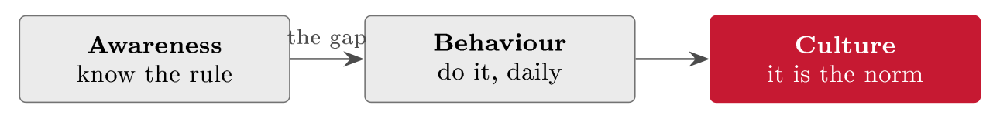

# Awareness, behaviour and security culture {#sec-14-awareness-behaviour-security-culture}

Chapter 13 closed on the observation that many of the remaining gaps are human,
and the numbers back it: Industry data has put a human action - a click, a
reused password, a misconfiguration - behind well over half of breaches for
years; recent editions of the Verizon DBIR place the human element in roughly
two-thirds. Attackers go where it is easiest, and that is often the person, not
the firewall: One convincing email can bypass controls that cost more than the
attacker's whole operation. This chapter treats the human side with the same
discipline the course applies everywhere else. It maps the attacks that target
people - social engineering, phishing in its variants, the insider - then
confronts the uncomfortable finding that awareness alone changes little, builds
the awareness programme as a proper control with owners, content and metrics,
borrows from behavioural science the tools that actually move behaviour, and
ends where the subject ends: Security culture, the layer that decides what
people do when no rule applies and no one is watching.

## The human factor {#sec-14-the-human-factor}

Social engineering is manipulation with a technical payoff: The attacker
persuades a person to act against their own or their organisation's interest -
click, pay, reveal, admit - because persuading is cheaper and more reliable
than exploiting code. The craft is old; the name and the notoriety came with the
hacker Kevin Mitnick in the 1990s, whose break-ins ran on telephones and trust
more than on software, and whose *The Art of Deception* (2002) taught defenders
how the con works. The psychology beneath it was mapped even earlier: Robert
Cialdini's *Influence* (1984) named the handful of triggers that move people -
authority, urgency and scarcity, social proof, reciprocity and liking,
commitment - and social-engineering lures are those triggers weaponised, one
or two per email (@tbl-triggers). Jøsang puts it plainly: Social
engineering exploits the mental weaknesses we humans have (Jøsang, §13.4,
pp. 283 ff.).

::: {#def-socialengineering}
## Social engineering

Social engineering is the manipulation of people into performing actions or
divulging information that compromises security, by exploiting predictable
psychological triggers - authority, urgency, social proof, reciprocity -
rather than technical weaknesses. Its techno-social form arrives by message or
call; its physical form arrives at the door.
:::

::: {#tbl-triggers}
  **Trigger**            **How it is used against us**
  ---------------------- --------------------------------------------------
  Authority              "This is the CEO - pay this invoice now"
  Urgency / scarcity     "Your account closes in one hour"
  Social proof           "Everyone in your team has already signed in"
  Reciprocity / liking   A friendly favour first, then the request
  Commitment             "You agreed to the audit - here is the portal"

  : Cialdini's triggers (1984), as attackers use them. A lure rarely needs more
  than one or two - authority plus urgency carries most CEO-fraud mail on its
  own.
:::

The costliest single variant deserves its name: *Business email compromise*
(BEC), the fake-CEO or fake-supplier payment email, which the FBI's IC3
statistics have ranked among the most expensive crime types for years -
billions in reported losses annually, dwarfing ransomware's reported figures.
The mechanics are exactly @tbl-triggers: Authority (the boss, the
supplier), urgency (the deadline), and a payment channel. And phishing - the
mass deceptive message - is the delivery vehicle for most of it, in a family
of variants worth keeping apart (@tbl-phishing; Jøsang, §§13.5--13.6):
The mass email, the targeted *spear* version and its senior-executive cousin
*whaling*, the voice and SMS forms (vishing, smishing), the QR-code form
(quishing), and the physical family - tailgating through a held door,
pretexting with a borrowed identity, baiting with a dropped USB stick. One
operational rule outranks all the taxonomy, and Jøsang states it as doctrine: If
you realise you have been phished, report it *at once* - speed is what limits
the damage, and the response machinery of Chapter 12 can only start when someone
says something.

::: {#tbl-phishing}
  **Form**                   **What it is**
  -------------------------- ---------------------------------------------------
  Phishing                   Mass deceptive email
  Spear phishing / whaling   Targeted at one person / at a senior leader
  Vishing / smishing         By phone call / by text message
  Quishing                   A malicious QR code
  Physical                   Tailgating, pretexting, baiting (the dropped USB)

  : Phishing and its relatives (Jøsang, §§13.5--13.6). The lure changes channel;
  the triggers underneath stay the same.
:::

::: {#exm-fgphish}
## A phishing attack on FastGoods, anatomised

What the attack actually looks like on the case. *The lure*: An email to the
finance clerk - "Invoice overdue - account suspended today." *The trigger*:
Authority plus urgency, a "supplier" demanding action now. *The ask*: Click the
link and "log in" on a page that imitates FastGoods' own. *The red flags*: A
sender domain one letter off, pressure where a real supplier would ring, a link
that does not lead to FastGoods. Two defences meet here, and both are needed:
The technical one - MFA, control A.8.5 - blunts what the stolen password is
worth; the human one is the clerk who pauses, checks the domain, and reports.
The rest of this chapter is about producing that clerk.
:::

::: {.callout-note}
## Real-world case: Twitter (2020): The phone call that beat a tech giant

In July 2020, attackers took over the Twitter accounts of Barack Obama, Elon
Musk, Bill Gates and dozens of other verified names and tweeted a bitcoin scam
from them. The way in was not an exploit but a telephone: A seventeen-year-old
and accomplices *vished* Twitter employees - spear phishing by phone -
posing as internal IT, harvested credentials to internal administration tools,
and used legitimate staff access to reset the accounts. Every element of this
chapter is in the case: The triggers (authority, helpfulness), the targeting of
people rather than systems, legitimate insider tooling as the prize, and the
lesson that a company with world-class engineering can still be opened with a
convincing voice. The fixes that followed were equally human: Tighter access to
internal tools, and training aimed at exactly this call.
:::

Not every threat rings from outside. The *insider* - a person with legitimate
access who misuses it - is a category of its own, and Jøsang gives the reason
it is feared out of proportion to its frequency: The insider knows the
organisation, knows its security, and is well placed to avoid detection (Jøsang,
§13.3, pp. 283 ff.). Two kinds must be kept apart, because they need different
treatment. The *malicious* insider abuses access on purpose - fraud, data
theft, sabotage - and is met with access discipline (least privilege, Chapter
10), monitoring and the joiner--mover--leaver routine whose absence Chapter 8
traced as a root cause. The *negligent* insider means no harm and causes most of
the incidents: Clicks, misconfigures, loses the laptop. Awareness work is mostly
aimed at the second kind - and it only works inside the right climate, which
is the last piece of this section. A *no-blame* (just) culture is borrowed from
aviation and healthcare safety, where decades of experience - NASA's Aviation
Safety Reporting System has run non-punitive since 1976 - showed that
punishing error drives it underground. Blame means incidents go unreported until
they are disasters (Chapter 12 lives on early reports); support means the
trained, alert person becomes the best detection layer the company has, spotting
the email the filter missed. "See something, say something" only works if saying
something is safe - and humans are the weakest link only when treated as the
problem rather than the solution.

## From awareness to behaviour {#sec-14-from-awareness-to-behaviour}

Here sits the finding that reshaped the field: *Knowing is not the same as
doing*. People can recite the password rule and still reuse the password; the
gap between awareness and behaviour is where most programmes quietly fail
(@fig-abcchain). The founding texts of usable security said this in 1999
and were ignored for a decade: Adams and Sasse's "Users Are Not the Enemy"
showed that people bypass security which fights the way they work -
rationally, not lazily - and Whitten and Tygar's "Why Johnny Can't Encrypt"
showed that even motivated users fail against unusable tools. The barriers have
names. *Friction*: The secure way is slower or more awkward, so the busy person
takes the easy way. *Security fatigue*: Too many rules, warnings and prompts, so
people tune the whole channel out - documented as a measurable state by NIST
researchers in 2016. *Optimism bias*: "It won't happen to me" - the same bias
Chapter 8 named as an enemy of honest likelihood estimates, now sabotaging
behaviour instead. The diagnosis carries the cure: Most insecure behaviour is a
rational response to bad design, so the first fix is usually to remove the
friction, not to add another rule.

{#fig-abcchain}

Why one-off training fails follows from memory research that predates computing
by a century: Ebbinghaus mapped the forgetting curve in 1885, and knowledge
delivered once decays within weeks without reinforcement. An annual slide deck
therefore produces a moment of awareness that fades long before the next one -
and a passed quiz proves recall, not changed behaviour. The goal is a *habit*:
The secure action happening automatically, on a busy and distracted day, without
conscious effort. Behavioural science gives the habit a formula - the Fogg
model puts it as behaviour requiring motivation, ability and a prompt together;
the COM-B model (Michie, 2011) says the same in the language of capability,
opportunity and motivation - and both point the programme designer at the same
three levers: Make the action easy, put the prompt where the behaviour should
happen, and let the result feel like a win. Measure what people *do*, not what
they can recite; little and often beats long and rare.

## The programme as a control {#sec-14-the-programme-as-a-control}

An awareness programme is not goodwill; it is a control, named in the catalogue
the course has used since Chapter 6: ISO/IEC 27002's people controls include
A.6.3, *information security awareness, education and training* - which is why
FastGoods' own SoA already carries the row. NIST's dedicated guide has framed
the discipline since 2003 (SP 800-50), reissued in 2024 as a broader
cybersecurity and privacy *learning* programme - the retitling itself a small
history of the field's shift from telling to changing. Treated as a control, the
programme gets what every control of Chapter 10 gets: An owner, a purpose tied
to risks (R1's phishing route above all), and evidence - because an auditor
will ask who runs it, what it covers, and for proof that people completed it
(Chapter 16).

Content follows the threat picture, tailored twice. A *core* for everyone covers
what everyone faces: Phishing and how to report it, passwords and MFA (Lecture
18), handling personal data (Chapter 7). A *role-specific* layer covers what
each role faces: Payment fraud and BEC for finance, secure coding for
developers, privileged-access discipline for administrators - the same
tailoring logic as Chapter 10's controls, and for the same reason: Generic
training for all is easy to make and easy to ignore. Two moments in the
employment lifecycle carry outsized weight. *Joiners*: Onboarding sets
expectations from day one, when habits are still forming. *Leavers*: Access must
go promptly - the orphaned account is the classic control gap, the root cause
Chapter 8 unearthed with the 5 Whys, and a favourite route for outsiders and
insiders alike; *movers* need access reviewed, not just added. And the programme
practises rather than only tells: Phishing simulations let people experience the
lure safely, exercises (Chapter 12) rehearse the response, and a simulation
click is a teaching moment, never a punishment - used punitively, simulations
destroy exactly the reporting culture the last section built.

Whether it works is measured in behaviour, not attendance
(@tbl-awmetrics) - and one reading rule turns the table from reporting
into insight: A *rising reporting rate* tells you more than a falling click
rate, because it shows people actively defending rather than merely avoiding.
These numbers do double duty as the audit evidence of Chapter 16, and they are
used to improve the programme, never to rank or shame the people in it.

::: {#tbl-awmetrics}
  **Metric**            **What it tells you**
  --------------------- -----------------------------------------------
  Phishing click rate   How susceptible people still are
  Reporting rate        How many actively report a suspicious email
  Time to report        How fast the response of Chapter 12 can start

  : Measuring behaviour, not attendance. The reporting rate is the stronger
  signal - and all three double as audit evidence.
:::

::: {#exm-fgprogramme}
## The FastGoods programme, on one page

Sized to 25 people, owned by the operations lead, reviewed yearly. *Everyone,
quarterly*: A ten-minute phishing refresher and one simulation, with the
one-click Report button as the trained action. *Finance, twice a year*: BEC and
payment-fraud drills - the call-back rule for any changed account number. *The
two admins*: Privileged-access rules and the leaver checklist. *On joining*:
Security onboarding in week one. *Measured*: Click rate, reporting rate, time to
report, plotted quarterly. *Evidence*: Completion records and the metric trend,
filed where the auditor will ask for them. One page - and every line traceable
to a risk, which is what makes it a control rather than a calendar.
:::

## Messages that stick, and nudges that work {#sec-14-messages-that-stick-and-nudges-that}

Whether a message changes behaviour depends on how it is framed, not only on
what it says, and the working rules are short. Be *specific and actionable*:
Tell people exactly what to do, not what to fear - "if an email asks you to
log in, open the site yourself instead of clicking" gives a hand something to
do; "be vigilant about cyber threats" does not. Be *concrete and local*: Our
risks, our systems, our Report button - not abstract threat statistics. Be
*short*: One clear action beats ten vague warnings. And know what backfires:
Fear and shame. "Don't be the idiot who gets us hacked" produces anxiety,
freezing and hidden mistakes; fear without a doable action produces avoidance,
not caution. The strong version of the same message - "Spot a dodgy email? Hit
Report - thank you" - names a clear action, keeps reporting safe, and thanks
the reporter, which is the no-blame culture in eleven words.

The most reliable lever moves the environment rather than the person. *Nudging*
- choice architecture, from Thaler and Sunstein's *Nudge* (2008) - shapes
the situation so the secure choice is the default and the easy one: A one-click
Report button beats "forward the email to the security team"; MFA switched on by
default beats MFA offered; a password manager pre-installed makes the strong
password *easier* than the weak one (Lecture 18). Good design changes behaviour
without anyone having to remember a rule - it does quietly what training
struggles to do loudly, and it is why the awareness programme and Chapter 10's
control selection are one conversation, not two.

::: {#exm-studentnudge}
## The student's nudge

Chapter 8's thesis drill found the risk - the only copy, the untested sync -
and this chapter supplies the honest fix. The awareness version is a resolution:
"I will remember to back up." The behaviour version removes the remembering:
Automatic sync switched on and verified once, so the secure action happens with
no action at all - plus one prompt in the calendar, monthly, "open yesterday's
version to check it restores." A self-nudge: The trigger scheduled, the action
made trivial, the result checked. The same move FastGoods makes with the Report
button, run on an asset every reader owns.
:::

::: {.callout-tip}
## Finding the risk: In the workarounds

Chapter 1's third source - the existing control, read backwards - has a
human edition: Watch what people actually do. Every widespread workaround is a
double finding: A control that does not fit how work happens (and is therefore
not operating, Chapter 10), and the risk the control was supposed to treat, now
open again. The spreadsheet of passwords beside the "mandatory" vault, the door
propped for the delivery, the personal email used because the file was too big
- each is a risk statement waiting to be written, traceable to a specific
control and step. Ask people what gets in their way and they will hand you the
vulnerability list no scanner sees - but only in a culture where saying so is
safe.
:::

## Security culture {#sec-14-security-culture}

Beyond any single behaviour lies culture, and it needs a careful definition
because the word is used loosely.

::: {#def-culture}
## Security culture

Security culture is the set of shared attitudes, assumptions and habits that
make secure behaviour the normal behaviour - "how we do things here" when no
one is watching and no rule applies. Awareness builds knowledge, behaviour
builds habits; culture is the state in which the habits are the norm, carried by
the group rather than by any rule.
:::

Jøsang treats building security culture as a core governance task (Ch. 13), and
organisational theory explains why it is slow work: Edgar Schein's classic model
(1985) puts culture in layers - visible artefacts on top, espoused values
beneath, and at the bottom the unspoken assumptions that actually drive
behaviour - and posters change only the top layer. Culture is read from
behaviour, not from the policy on the wall, and the field marks are reliable
(@tbl-culturesigns): In a healthy culture people report mistakes openly,
security is discussed as normally as quality, and leaders visibly follow the
same rules; the warning signs are workarounds as the norm, hidden mistakes, and
"security slows us down" as the house refrain - with widespread workarounds
the clearest single tell, because they indict the culture and the controls at
once.

::: {#tbl-culturesigns}
  **Healthy signs**                **Warning signs**
  -------------------------------- --------------------------
  Mistakes are reported openly     Mistakes are hidden
  Security is discussed normally   "Security slows us down"
  Leaders follow the same rules    Workarounds are the norm

  : Reading a security culture from behaviour. The clearest single warning sign
  is the widespread workaround - it condemns the culture and the control that
  does not fit the work.
:::

Two mechanisms move culture, and both run through Chapter 11's governance. *Tone
from the top*: Leaders set culture by what they do, not what they sign - the
manager who uses MFA, queues for the badge reader and admits their own near-miss
shifts more than any memo, and if leaders cut corners, everyone will; Jøsang
places the human side, insider threat included, squarely in management's
responsibility (§13.3), and Edwards & Weaver frame the same point as leadership
(Ch. 3). *Consistency over time*: Culture shifts over years of aligned words and
actions, not in one campaign - it cannot be bought or rushed, only built. And
the reason culture earns its place as this chapter's destination is the reason
rules alone never suffice: No policy can anticipate every situation, so the gaps
are covered by instinct - the clerk who pauses at the odd payment request no
written rule foresaw. Rules set the floor; culture sets the behaviour where the
rules are silent. Which is precisely the hand-over to the next chapter: Culture
covers the gaps - the rules themselves, and how to write them so they work,
are Lecture 15.

##### Reading for this chapter.

Jøsang, Chapter 13 (security culture, the insider threat, social engineering,
pp. 283 ff., especially §13.3 on insiders and §§13.4--13.6 on social engineering
and phishing); Edwards & Weaver, Chapter 3 (cybersecurity leadership,
pp. 33 ff.). Standards side: ISO/IEC 27002:2022, control A.6.3 (awareness,
education and training), and NIST SP 800-50r1 (2024) for programme design. Both
books are available in the library and on the Canvas course page.

## Summary {#sec-14-summary}

Most breaches begin with a human action, which makes people central to risk
rather than a footnote. Social engineering (@def-socialengineering)
weaponises Cialdini's triggers - authority, urgency, social proof, reciprocity
- with BEC as the costliest variant and phishing's family (spear, whaling,
vishing, smishing, quishing, and the physical forms) as the delivery channels;
the Twitter case of 2020 shows a phone call opening a tech giant. The insider
divides into malicious (met with access discipline and monitoring) and negligent
(the larger group, and awareness's real audience), and the climate that makes
any of it manageable is the no-blame culture aviation proved decades ago: Blame
hides incidents, support turns people into the best detection layer. Awareness
alone does not change behaviour - the knowing--doing gap, with friction,
security fatigue and optimism bias in the way and the forgetting curve erasing
annual training - so the goal is the habit: Easy action, present prompt, felt
reward. The programme that builds it is a control (ISO 27002 A.6.3): Owned,
risk-traceable, tailored core-plus-role, anchored at joining and leaving,
practised through no-blame simulations, and measured in behaviour - click
rate, reporting rate, time to report, with the reporting rate as the stronger
signal. Messages work when specific, local and short; fear and shame backfire;
and the strongest lever is the nudge - defaults and design that make the
secure action the easy one. Above it all sits culture (@def-culture):
Read from behaviour, moved from the top, built over years - and decisive
exactly where rules are silent.

The rules themselves are next: What to write down, in which document, at which
level of the hierarchy - and DORA, the regulation that turns documentation and
testing into binding law for a whole sector. That is Lecture 15, which completes
Block IV.

## Self-check {#sec-14-self-check}

Try these before the next lecture.

::: {#exr-14-name-the-triggers}
## Name the triggers

"Final notice: Your Kristiania account will be deactivated in 2 hours. IT has
already migrated your classmates. Log in here to keep access." Identify every
psychological trigger in this lure, and name the two red flags a trained reader
checks first.
:::

::: {#exr-14-tailor-the-training}
## Tailor the training

Design the role-specific module for FastGoods' finance clerk in four bullet
points: The two threats it covers, the one behaviour it trains, and the one
metric that would show it works.
:::

::: {#exr-14-read-the-metrics}
## Read the metrics

FastGoods' simulation results: Click rate down from 18% to 12%, reporting rate
down from 25% to 15%. Interpret the pair - is the programme working? - and
state what you would change.
:::

::: {#exr-14-repair-the-message-add-the-nudge}
## Repair the message, add the nudge

Rewrite "Employees who fall for phishing will be reported to their manager" into
a message that works, and name one nudge that would make the desired behaviour
easier than the current one.
:::

::: {#exr-14-diagnose-the-culture}
## Diagnose the culture

Three observations at a company: The password vault exists but a shared
spreadsheet holds the "real" passwords; a junior developer's misconfiguration
was fixed quietly and never mentioned again; the CEO's laptop is exempt from MFA
"for convenience". Diagnose the culture in two sentences and name the first
intervention you would make.
:::

::: {#exr-14-cialdini-interactive}
## Influence triggers, interactive

Match each phishing lure to the trigger it pulls.

```{=html}
<div class="grc-ex" data-type="sort">
<script type="application/json">
{
 "buckets": [
  {
   "id": "auth",
   "label": "Authority"
  },
  {
   "id": "urg",
   "label": "Urgency / scarcity"
  },
  {
   "id": "social",
   "label": "Social proof"
  },
  {
   "id": "recip",
   "label": "Reciprocity"
  }
 ],
 "chips": [
  {
   "t": "\"The CEO needs this transfer now\"",
   "b": "auth"
  },
  {
   "t": "\"Your account closes in 2 hours\"",
   "b": "urg"
  },
  {
   "t": "\"Most of your colleagues have already confirmed\"",
   "b": "social"
  },
  {
   "t": "\"Here is a free gift card - just log in\"",
   "b": "recip"
  }
 ],
 "explain": "Social engineering pulls documented levers - authority, urgency, social proof, reciprocity - and recognising the pull is the defence.",
 "ref": "sec-14-the-human-factor",
 "reflabel": "The human factor"
}
</script>
</div>
```
:::

::: {#exr-14-insider-interactive}
## Malicious or negligent? Interactive

Sort the insider incidents.

```{=html}
<div class="grc-ex" data-type="sort">
<script type="application/json">
{
 "buckets": [
  {
   "id": "mal",
   "label": "Malicious insider"
  },
  {
   "id": "neg",
   "label": "Negligent insider"
  }
 ],
 "chips": [
  {
   "t": "An admin exfiltrates the customer list before quitting",
   "b": "mal"
  },
  {
   "t": "A developer pastes secrets into a public repo by mistake",
   "b": "neg"
  },
  {
   "t": "Staff share one login to save time",
   "b": "neg"
  },
  {
   "t": "An employee sells access to a ransomware crew",
   "b": "mal"
  }
 ],
 "explain": "Intent separates the two: The malicious insider abuses access on purpose; the negligent one takes shortcuts or slips.",
 "ref": "sec-14-the-human-factor",
 "reflabel": "The human factor"
}
</script>
</div>
```
:::

::: {#exr-14-sticks-interactive}
## What makes it stick? Interactive

Select what the chapter says actually changes behaviour.

```{=html}
<div class="grc-ex" data-type="pick">
<script type="application/json">
{
 "options": [
  {
   "t": "Short, spaced, repeated messages",
   "ok": true
  },
  {
   "t": "Relevance to the person's actual job",
   "ok": true
  },
  {
   "t": "Simulations with immediate feedback",
   "ok": true
  },
  {
   "t": "A no-blame culture for reporting",
   "ok": true
  },
  {
   "t": "One annual 60-page policy PDF",
   "ok": false
  },
  {
   "t": "Punishing everyone who clicks",
   "ok": false
  }
 ],
 "explain": "Behaviour changes through short, relevant, repeated practice with feedback in a no-blame culture - not through annual PDFs.",
 "ref": "sec-14-messages-that-stick-and-nudges-that",
 "reflabel": "Messages that stick"
}
</script>
</div>
```
:::

::: {#exr-14-schein-interactive}
## Schein's layers, interactive

Place each observation on its layer of culture.

```{=html}
<div class="grc-ex" data-type="sort">
<script type="application/json">
{
 "buckets": [
  {
   "id": "art",
   "label": "Artefacts",
   "desc": "what you can see"
  },
  {
   "id": "val",
   "label": "Espoused values",
   "desc": "what is said"
  },
  {
   "id": "ass",
   "label": "Underlying assumptions",
   "desc": "what actually drives behaviour"
  }
 ],
 "chips": [
  {
   "t": "Posters and the clean-desk rule",
   "b": "art"
  },
  {
   "t": "\"The policy says security comes first\"",
   "b": "val"
  },
  {
   "t": "\"Of course we never share logins\"",
   "b": "ass"
  }
 ],
 "explain": "Posters change the top layer only; culture is read from what people actually assume and do.",
 "ref": "sec-14-security-culture",
 "reflabel": "Security culture"
}
</script>
</div>
```
:::

::: {#exr-14-respond-interactive}
## Meeting the phish, interactive

Order the behaviour the programme trains.

```{=html}
<div class="grc-ex" data-type="order">
<script type="application/json">
{
 "steps": [
  "Spot the signs - pressure, oddity, mismatch",
  "Do not click; verify through a known channel",
  "Report it, even after a mistake",
  "No blame - the lesson is shared"
 ],
 "explain": "The trained sequence ends in reporting without blame - because the report you punish is the report you never get again.",
 "ref": "sec-14-from-awareness-to-behaviour",
 "reflabel": "From awareness to behaviour"
}
</script>
</div>
```
:::
