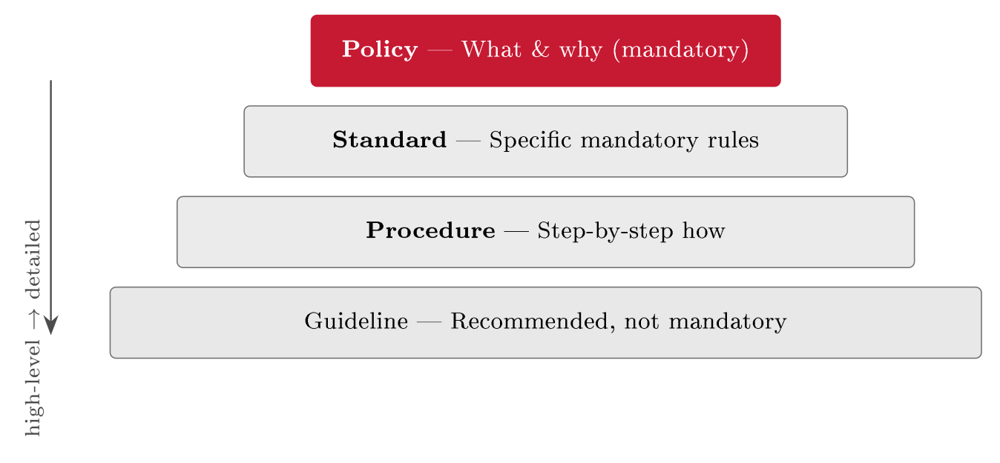

# Policy, documentation and DORA {#sec-15-policy-documentation-and-dora}

Chapter 14 ended on the division of labour between culture and rules: Culture
covers the situations no rule anticipated; the rules set the floor. This chapter
is about the rules --- how security is written down so that it scales, survives
people leaving, and can be proved. It builds the document hierarchy the course
has been promising since Chapter 3 --- policy, standard, procedure, guideline,
each level more concrete than the one above --- shows why a document is a
control *and* evidence rather than paperwork, and gives the discipline of
keeping a document set current, findable and no larger than needed. The chapter,
and Block IV, then close with DORA: The EU regulation that takes everything this
course has taught --- risk management, incident response, testing, third-party
oversight, and above all documentation --- and makes it binding law for a whole
sector.

## Why write it down {#sec-15-why-write-it-down}

Undocumented security depends on specific people remembering specific things,
and that breaks in three predictable ways: New staff cannot follow rules nobody
wrote down; when a key person leaves, their knowledge leaves with them; and
different people do the same task differently, which is another word for
inconsistently. "We just know how we do it" works for three people and fails for
thirty --- documentation is what turns personal knowledge into shared,
repeatable practice. The payoff is symmetrical: With good documents there is one
agreed way of doing things, continuity across staff changes, and a baseline to
measure and audit against; without them, security is ad hoc, knowledge is
mortal, and there is nothing to audit --- a real problem, because to an auditor
an undocumented control barely exists. The audit phrase is blunt but real: *If
it isn't written down, it didn't happen* --- the auditor tests evidence, so a
control performed but never recorded is, to the audit, the same as one never
performed (Chapter 16 runs this in full). The standard says the same in calmer
language: ISO/IEC 27001's Clause 7.5 requires *documented information* --- the
2013 revision's deliberately neutral term for what older editions split into
documents and records --- and an ISO audit starts by asking for it.

::: {#exm-keyloss}
## The knowledge that walked out

FastGoods' webshop keys --- the API credentials to the payment provider --- are
rotated quarterly, by the one developer who set the routine up. Nothing is
written down; it never needed to be, he was always there. Then he leaves. The
next rotation is missed, the one after that is improvised from a half-remembered
wiki page, and six months later a key that should have died is still valid --- a
Chapter 8 vulnerability created by nothing more than an empty page. The fix
costs an afternoon: A one-page procedure --- what, when, how, who --- stored
where the team looks. Documentation is the control that makes a control survive
its author.
:::

Nobody can write everything at once, so the order follows risk and obligation
--- the same proportionality as Chapter 10's controls. First the top-level
information security policy: The short document that sets direction and carries
the mandate. Then the high-risk areas: Access control, incident response, data
handling --- the procedures behind R1, R2 and R3, and typically an acceptable
use policy that puts Chapter 14's expected behaviour in writing. Then whatever a
law or standard explicitly requires you to have (Chapters 5 and 7 both name
documents by article). Do not try to document everything before you document
anything.

## The document hierarchy {#sec-15-the-document-hierarchy}

Security documentation is layered, and Edwards & Weaver's four levels are the
field's shared map (Ch. 12, pp. 209 ff.) --- each level translating the one
above into something more concrete (@fig-dochierarchy).

::: {#def-dochierarchy}
## The document hierarchy

Security documentation runs in four levels. The *policy* states what and why ---
high-level direction and intent, approved at the top, stable. The *standard*
states exactly what --- specific, mandatory, measurable requirements that meet
the policy's goals. The *procedure* states how --- the step-by-step instructions
for performing a task in compliance with the standards. The *guideline* advises
--- recommended practice where judgement, not a strict rule, is what the
situation needs. Policy, standard and procedure bind; guidelines do not.
:::

{#fig-dochierarchy}

The levels differ in more than detail --- they differ in audience, change rate
and test (@tbl-doclevels). The policy is short, board-approved (Chapter
11's tone from the top, in writing) and rarely changes; it says "we protect
access to customer data" and stops. The standard makes it measurable --- MFA on
all logins, passwords at least twelve characters --- and its test is that
compliance can be checked mechanically. The procedure changes as often as the
systems it describes, and its test is that a competent newcomer can follow it
under pressure. The guideline --- tips for choosing a strong passphrase, hints
for spotting phishing --- fills the space Chapter 14 ended on, where good
judgement is the point and a hard rule would either be ignored or gamed.
Mislabelling the levels is a common cause of unmanageable documentation: A
"policy" full of IP addresses will be perpetually out of date, and a
two-hundred-page document called a procedure will simply not be read.

::: {#tbl-doclevels}
  **Level**   **Answers**     **Mandatory?**   **Example**
  ----------- --------------- ---------------- ----------------------------
  Policy      Why, and what   Yes              "We protect customer data"
  Standard    Exactly what    Yes              MFA on all logins
  Procedure   How, in steps   Yes              The onboarding checklist
  Guideline   How, advised    No               Passphrase tips

  : The four levels compared. Short and stable at the top, detailed and
  frequently changing at the bottom --- knowing which is which keeps the set
  manageable.
:::

::: {#exm-fghierarchy}
## One topic, four levels

FastGoods' access control, written through the whole hierarchy
(@tbl-fghierarchy). The policy is one board-approved sentence; the
standard turns it into two testable rules; the procedure is the onboarding
checklist an admin actually follows on a Tuesday; the guideline helps staff pick
passphrases they can live with. Read the table downwards and the same intent
gains detail at every step --- direction, rule, how, advice --- and read it
upwards and every step of the checklist can say which rule and which intent it
serves. That two-way traceability is the hierarchy working.
:::

::: {#tbl-fghierarchy}
  **Level**   **For FastGoods' access control**
  ----------- ----------------------------------------------------------
  Policy      "We protect access to customer data" (board-approved)
  Standard    All logins require MFA; passwords at least 12 characters
  Procedure   Step by step: How to onboard a user and grant access
  Guideline   Tips for choosing a strong passphrase

  : The FastGoods access-control set: The same intent at four levels of detail,
  traceable both ways.
:::

## Documentation as control, and as evidence {#sec-15-documentation-as-control-and-as-evidence}

A document earns its keep twice, and the first way is easy to miss: It *is* a
control. Chapter 10 sorted controls into technical and organisational; the
written procedure is the organisational kind in its purest form --- it reduces
risk directly, by making the right action the standard action. A clear
joiner--mover--leaver procedure is itself what stops orphaned admin accounts,
the R1/R3 route Chapters 8 and 14 kept meeting: The paper does the risk
reduction, because "check before granting, revoke on leaving" stops being an
improvisation and becomes the default. ISO 27002 says so in control numbers ---
A.5.1 requires the policies themselves, A.5.37 the documented operating
procedures --- so the SoA of Chapter 6 already points at this chapter.

The second way is the one auditors live on: The document is *evidence*, and
evidence comes in layers. The policy and procedure show what *should* happen ---
the basis for testing a control's design; the records --- logs, tickets,
sign-offs --- show that it *did* happen, the basis for testing operating
effectiveness (both tests are Chapter 16's subject, and the same split underpins
the ISAE 3402 reports of Lecture 16). Design lives in the document; operation
lives in the records; an audit checks both. Responsibility for the writing maps
cleanly onto Chapter 11's three lines: Management owns the policy and the board
approves it; the second line --- security, compliance --- sets the standards;
and the procedures are written by the first line, the people who actually do the
task, because a procedure written far from the work describes a process nobody
runs. Direction at the top, detail near the work.

::: {#exm-evidencechain}
## One control's evidence chain

Take leaver de-provisioning and walk the layers. *Policy*: "Access is removed
when employment ends." *Standard*: All accounts disabled within 24 hours of the
leaving date. *Procedure*: The leaver checklist --- HR notifies IT on the
leaving date, IT disables the accounts, ticks the list, files the ticket.
*Records*: The ticket, timestamped, for every leaver. When the auditor arrives
(Chapter 16), the questions follow the same ladder: Show me the rule (design)
--- then show me last quarter's leavers and their tickets (operation). FastGoods
can answer in four documents --- and note the contrast with Chapter 8's root
cause, where the whole chain was missing: The 5 Whys found the absent process;
this chapter is what building it looks like.
:::

## Keeping documentation useful {#sec-15-keeping-documentation-useful}

Over-documentation is its own failure mode, and an honest chapter says so:
Nobody reads a two-hundred-page policy, so nobody follows it, and documents that
are too many or too long are simply ignored --- attention is a budget like any
other. Worse than none is the *outdated* document, because it misleads with
authority: The procedure describing the old system sends the newcomer
confidently in the wrong direction. The rule is Chapter 10's proportionality
applied to paper: The least documentation that does the job --- a short policy
people read beats a long one they do not.

What keeps a set healthy is unglamorous discipline, and the standard mandates
it: Document control (ISO 27001, Clause 7.5.3) --- every document carries a
version, an owner and a review date; reviews run on a schedule and after
significant change; retired documents actually leave. Usability is the other
half: One known place to find the current version, plain language, and layouts
that work under pressure --- a procedure no one can find during an incident is
no procedure at all, as Chapter 12's clock made vivid. And the failure has clear
symptoms, worth memorising because every audit season rediscovers them: Nobody
can say where the current version is; documents contradict each other, or
contradict reality; and people keep private "real" procedures on the side. When
official documents and actual practice diverge, the documents have failed ---
and the divergence is exactly the gap an audit will find (Chapter 16).

::: {.callout-tip}
## Finding the risk: In the document set

The fourth source of Chapter 1's box --- findings already written down --- has a
self-service edition: Read your own document set as an auditor would, backwards.
Every review date more than a year old is a candidate finding; every
contradiction between two documents is a decision nobody made; every shadow
procedure is a control that does not fit the work (Chapter 14's workaround, in
writing); and every document describing a system you no longer run is
misdirection with a version number. The diff between the official set and
observed practice is a risk list that costs nothing to produce --- and it is
precisely the list the external auditor will produce for a fee.
:::

::: {#exm-studentdocs}
## The student's document control

Every group project reinvents this problem: The shared folder holding
*final.docx*, *final_v2.docx* and *final_v2_REAL.docx*, and a submission built
from the wrong one. The fix is Clause 7.5 at student scale: One named current
version, one owner who merges, a visible date --- and the old versions in an
archive folder, not beside the live one. The thesis that Chapter 8 kept backing
up gains its last safeguard here: Knowing *which* copy is the thesis. Document
control is not bureaucracy; it is the difference between having documents and
having a pile.
:::

## DORA: Resilience as law {#sec-15-dora-resilience-as-law}

Block IV closes with a regulation, because one now exists that takes this
block's material --- preparedness, people, documentation --- and the rest of the
course besides, and makes it statute. The Digital Operational Resilience Act
(DORA) grew from a post-2008 lesson: Supervisors had learned to stress-test
banks' capital, then watched technology become the system's soft spot ---
outages, cyber incidents, and a deepening dependence on a handful of cloud and
software providers, any of whose failure would be systemic. Regulators (the
Basel Committee and the Bank of England prominent among them) spent the late
2010s writing operational-resilience principles; the EU proposed DORA in its
digital-finance package in September 2020; Regulation (EU) 2022/2554 was adopted
in December 2022 and has applied since **17 January 2025**. Norway follows
through the EEA: The Norwegian DORA Act, passed in 2025, carries the regime into
Norwegian law under Finanstilsynet's supervision.

::: {#def-dora}
## DORA

The Digital Operational Resilience Act (Regulation (EU) 2022/2554) is a directly
binding EU regulation, applying since 17 January 2025, that sets uniform
requirements for how financial entities --- banks, insurers, investment firms
and more --- manage ICT risk, and brings their *critical ICT third-party
providers* under financial supervision. Its requirements run in five pillars:
ICT risk management, incident classification and reporting, resilience testing,
third-party risk, and information sharing.
:::

The five pillars read like this course's table of contents made mandatory
(@tbl-dorapillars). ICT risk management (Arts. 5--16) demands a
governed, documented risk framework with the management body explicitly
accountable --- Chapter 11's board responsibility, in statute. Incident
management (Arts. 17--23) requires classifying incidents and reporting major
ones to the authority on fixed clocks --- Chapter 12's discipline, with DORA's
own timelines beside NIS2's and the GDPR's. Resilience testing (Arts. 24--27)
requires a testing programme, and for significant entities *threat-led
penetration testing* (TLPT) on the TIBER-EU model the central banks piloted from
2018 --- Lecture 16's territory. Third-party risk (Arts. 28--44) requires
managing ICT providers through contract and oversight, keeping a *register of
information* --- a documented inventory of every ICT contractual arrangement ---
and, the genuine novelty, places *critical* providers such as the big cloud
platforms under direct oversight by the European supervisory authorities: The
cloud, supervised like a bank's counterparty (Lecture 19). Information sharing
(Art. 45) encourages exchanging cyber threat intelligence --- Chapter 8's CTI,
institutionalised.

::: {#tbl-dorapillars}
  **Pillar (articles)**             **What it requires --- and where taught**
  --------------------------------- --------------------------------------------------------------------------------------
  1\. ICT risk management (5--16)   A governed, documented framework; board accountable (Ch. 8--13, 11)
  2\. Incident reporting (17--23)   Classify incidents; report major ones on the clock (Ch. 12)
  3\. Resilience testing (24--27)   A testing programme; TLPT for significant entities (Lecture 16)
  4\. Third-party risk (28--44)     Contracts, the register of information, oversight of critical providers (Lecture 19)
  5\. Information sharing (45)      Cyber-threat-intelligence exchange (Ch. 8)

  : DORA's five pillars, mapped to the course. Nothing in the regulation is new
  material --- what is new is that, for finance, all of it is mandatory,
  documented and tested.
:::

Why DORA sits in *this* chapter is its texture: It is, to an unusual degree, a
documentation-and-proof law. The risk framework must be documented; the testing
must be evidenced; the register of information must exist and be producible; the
board's accountability must be demonstrable. DORA turns "write it down and test
it" from good practice into legal duty --- Clause 7.5's logic with a regulator's
signature. Its relation to NIS2 keeps the map of Chapter 5 tidy: NIS2 is the
broad cross-sector baseline; DORA is the *lex specialis* for finance, taking
precedence there with far more specific ICT rules --- the finance-sharpened
sibling Chapter 5 promised. And its reach exceeds its scope on paper, which is
the last FastGoods lesson of the block.

::: {.callout-note}
## Real-world case: CrowdStrike (2024): The outage DORA was written for

On 19 July 2024, a defective content update from the security vendor CrowdStrike
crashed some 8.5 million Windows machines worldwide within hours: Flights
grounded, hospitals postponing treatment, broadcasters dark, payment systems
down --- with damage estimates in the billions, from one supplier's one file. No
attacker was involved; concentration was the vulnerability. The incident landed
six months before DORA's application date and read like the regulation's own
motivation section: A single critical ICT provider as a systemic single point of
failure, resilience dependent on parties outside the regulated firm, and
recovery a matter of documented, rehearsed procedure --- the firms that
recovered fastest were those with tested runbooks for exactly this shape of
morning. Financial supervisors cited the case freely in the run-up to January
2025; it remains the shortest available answer to "why does a resilience law
regulate the providers too?"
:::

::: {#exm-fgdora}
## DORA reaches FastGoods anyway

FastGoods is a webshop, not a bank --- DORA does not apply to it. It applies to
FastGoods' *payment provider*, and that is how the regulation arrives through
the side door: The provider, mapping its own ICT dependencies for the register
of information, sends FastGoods a revised contract --- incident-notification
duties within fixed hours, cooperation in the provider's resilience testing,
audit and information rights. FastGoods' preparedness plan (Chapter 12) gains a
new external clock, and its own documentation is suddenly evidence in someone
else's compliance. The pattern generalises, and it is the direction of travel
worth stating plainly: Resilience regulation propagates down supply chains,
sector by sector --- document it, test it, and be ready to prove it, whether or
not the law names you yet.
:::

##### Reading for this chapter.

Edwards & Weaver, Chapter 12 (policies, standards and procedures, pp. 209 ff.)
and Chapter 19 (the auditor's view of documentation and evidence, pp. 333 ff.);
Jøsang, Chapter 18 (governance and documentation, pp. 377 ff.). Standards and
law: ISO/IEC 27001, Clause 7.5 (documented information); ISO/IEC 27002:2022,
A.5.1 and A.5.37; and DORA, Regulation (EU) 2022/2554 --- Articles 5, 17--19,
24--28 and 45 cover the five pillars, and the recitals are a readable statement
of why. Both books are available in the library and on the Canvas course page.

## Summary {#sec-15-summary}

Security that lives in heads does not scale, survive turnover, or audit ---
documentation turns personal knowledge into shared, repeatable, provable
practice, and ISO 27001's Clause 7.5 makes the documented information mandatory.
The set runs in four levels (@def-dochierarchy): The short,
board-approved policy (what and why), the measurable standard (exactly what),
the step-by-step procedure (how), and the advisory guideline where judgement
beats rules --- one intent, traceable both ways, as FastGoods' access-control
set shows. A document is a control in its own right --- the written procedure is
Chapter 10's organisational control at its purest, A.5.1 and A.5.37 by number
--- and it is evidence in layers: Design in the documents, operation in the
records, both tested by Chapter 16's audit, written by the line that does the
work and owned by the line that governs. Keeping the set useful is
proportionality applied to paper: The least documentation that does the job,
under document control --- version, owner, review date --- findable in one place
and usable under pressure, with contradictions, stale dates and shadow
procedures as the failure's symptoms. And DORA (@def-dora) closes the
block by making the point in statute: Since 17 January 2025, financial entities
must run a documented ICT risk framework, classify and report incidents, test
resilience --- TLPT included --- govern their providers through contracts and a
register of information, with critical providers under direct European oversight
and boards personally accountable; NIS2's finance-sharpened sibling, and after
CrowdStrike's 8.5 million blue screens, one whose rationale needs no footnote.
Nothing in it is new material --- what is new is the word *must*.

Block IV is complete: The plan for the bad day, the model that finds the gaps,
the people, and the paper. What remains is to check it all --- independently, on
evidence. Block V opens with the audit: Lecture 16.

## Self-check {#sec-15-self-check}

Try these before the next lecture.

::: {#exr-15-sort-the-statements}
## Sort the statements

Classify each as policy, standard, procedure or guideline, with one justifying
phrase: (a) "Backups of the customer database run nightly and are retained 30
days." (b) "FastGoods protects the availability of its services." (c) "Prefer
passphrases of four unrelated words." (d) "To restore an order record: Open the
backup console, select the snapshot, ..."
:::

::: {#exr-15-write-the-four-levels}
## Write the four levels

Write FastGoods' backup documentation through all four levels --- one line each
--- in the style of @tbl-fghierarchy.
:::

::: {#exr-15-design-and-operation}
## Design and operation

For the standard "all logins require MFA", name the document an auditor tests
the *design* against and two records that prove *operation* --- and state what
it means if the first exists and the second do not.
:::

::: {#exr-15-read-the-symptoms}
## Read the symptoms

An assessor finds: The incident-response plan is dated 2022 and names a hosting
provider FastGoods left last year; the admins follow a personal checklist
"because the official one is wrong". Write the finding in one sentence, and the
risk it creates in the pattern of @def-riskstatement.
:::

::: {#exr-15-dora-applied-small}
## DORA, applied small

A small Norwegian payment institution asks what DORA changes for it. Answer in
five bullets --- one per pillar --- naming one concrete artefact per pillar it
must be able to produce, and add the one-line answer to "does this affect our
merchant customers like FastGoods?"
:::
