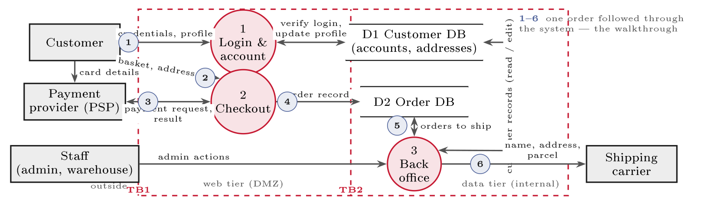

# Internal and external audits {#sec-16-internal-and-external-audits}

Block IV built and documented; Block V checks. The reason it opens with the
audit is a limit every builder shares: You cannot fully judge your own work. The
people who designed a control are the least able to see its blind spots, so
someone independent must look --- the same independence that made the third line
of Chapter 11 and that has underpinned financial audit since company law first
demanded it. This chapter treats the audit as the working discipline it is: What
an audit is and is not, the standard and scope it checks against, internal
versus external audit and the assurance reports that travel between companies,
the evidence craft at the centre --- tests of design and effectiveness,
sampling, the audit trail --- and the findings, responses and remediation that
make an audit worth having. It is also the chapter where this course's audit
thread, running since the ICFR stack of Chapter 10 and the evidence layers of
Chapter 15, arrives at its home.

## Why audit, and what an audit is {#sec-16-why-audit-and-what-an-audit}

The idea is older than computing by a century. Mandatory independent audit of
company accounts dates to nineteenth-century British company law, born of the
observation that owners cannot simply trust managers' own reports; the twentieth
century professionalised it, and computing pulled it into our field in stages
--- *EDP auditing* emerged in the 1960s as accounts moved onto mainframes, its
professional body founded in 1969 became today's ISACA, and the Sarbanes--Oxley
Act (2002, Chapter 10's story) made testing IT controls a routine part of every
listed company's year. Cybersecurity audit is that lineage applied to security
--- and Edwards & Weaver describe the modern auditor's job accordingly:
Assessing the robustness of controls and evaluating risk management, far beyond
ticking compliance boxes (Ch. 19, pp. 333 ff.).

::: {#def-audit}
## Audit

An audit is an independent, evidence-based examination of whether controls
exist, operate, and meet a defined standard. *Independent*: Carried out by
someone not responsible for the controls examined. *Evidence-based*: Conclusions
rest on proof gathered and tested, not on assurances. *Against a standard*: ISO
27001, the organisation's own policies, or a regulation --- without an agreed
yardstick the result is only opinion.
:::

Cybersecurity audit sits in a family (@tbl-audittypes), and the oldest
relative explains much of the craft: The annual *financial* audit checks that
the financial statements are true and fair, and because unreliable IT makes
financial reporting unreliable, the IT general controls of Chapter 10 are tested
inside it --- which is how a security lecturer comes to cite audit methodology
at all. What an audit is *not* deserves equal clarity, because expecting too
much of it is its own risk: It is not a guarantee of security but a snapshot at
one point in time; not a search for someone to blame but a tool for improvement;
not a one-off but the *Check* of Chapter 3's plan--do--check--act, which ISO
27001 makes a standing duty (internal audits and management review, Clause 9).
Passing means the standard was met *on that day* --- compliance is not the same
as security, and an audit that changes nothing was a waste: Its product is not
the certificate but the corrective actions that feed the next cycle.

::: {#tbl-audittypes}
  **Audit type**       **What it checks**
  -------------------- -------------------------------------------------------------------------------------
  Financial            The annual statements are true and fair --- yearly, for shareholders and regulators
  Cybersecurity / IT   Security controls exist and work --- this chapter
  Compliance           Legal duties are met (NIS2, GDPR, DORA)
  Operational          A process is efficient and effective

  : Types of audit. The financial audit is the classic annual external audit; IT
  controls feed into it because weak IT makes the numbers unreliable --- the
  ICFR link of Chapter 10.
:::

## What auditors check {#sec-16-what-auditors-check}

Everything starts from the yardstick, because "are we secure?" is unanswerable
until a standard turns it into specific, checkable requirements: ISO 27001 (is
the ISMS run as the standard requires, Chapter 3), the organisation's own
policies (do you do what you said you would, Chapter 15), or the regulations
(are the duties of Chapters 5 and 7 met). Around the yardstick, two documents
frame the engagement before it starts. The *scope* states which systems,
controls and sites are examined --- agreed in advance, in writing, and drawn to
cover the real risk areas without gaps, since Edwards & Weaver's warning is
exactly that a badly drawn scope overlooks a threat avenue. The *audit charter*
defines the audit function's purpose, scope and responsibilities and protects
its independence --- the third line's constitution, in Chapter 11's terms.

Inside the scope, auditors examine the whole control environment --- technical
(firewalls, encryption, MFA, logging), administrative (policies, procedures,
training, roles) and physical (locked facilities, server access) --- judging for
each control both adequacy and effectiveness. And the areas they walk are so
standard that Chapter 10's audit view already listed them: The general IT
controls --- access management with its joiners and leavers, change management,
IT operations, backup and recovery, system development, physical and
environmental --- which are also the typical control areas of an ISAE 3402
report. For every control the whole audit compresses into three plain questions,
asked in order: *Is there a control? Does it actually work? Can you prove it?*
Saying yes is not enough at any step --- the auditor wants to see the control,
see it working, and see the evidence --- and the third question is where the
craft of this chapter lives.

## How an audit runs {#sec-16-how-an-audit-runs}

An audit is not an inspection that happens to you; it is a managed engagement
with four phases, and knowing the shape of it removes most of the anxiety around
being audited (@tbl-auditphases). The phases have a standard as well:
ISO 19011, the international guideline for auditing management systems, sets out
the audit programme, the principles auditors work to --- integrity, fair
presentation, professional care, confidentiality, independence, and the
evidence-based approach --- and the conduct of an engagement from initiation to
follow-up; ISO/IEC 27007 adds the ISMS-specific guidance, and ISO/IEC 27008
covers the technical assessment of individual controls. An organisation with an
internal audit function runs against those documents the way it runs its ISMS
against ISO 27001.

::: {#tbl-auditphases}
  **Phase**   **What happens**                                                                                       **What the audited side does**
  ----------- ------------------------------------------------------------------------------------------------------ --------------------------------------------------------------
  Planning    Scope, criteria and timing agreed; risk-based selection of what to test; the audit programme written   Names a contact, confirms scope, gathers the document set
  Fieldwork   Opening meeting; evidence gathered and tested; questions raised as they arise                          Answers, produces evidence, corrects misunderstandings early
  Reporting   Findings drafted with severity; closing meeting; management response collected                         Responds in writing, agrees actions and dates
  Follow-up   Remediation tracked; fixes verified, often at the next audit                                           Delivers the fixes and the evidence that they hold

  : The four phases of an audit (after ISO 19011). Most of the work an audited
  team feels happens in fieldwork; most of the value is decided in planning and
  follow-up.
:::

Planning deserves more attention than it usually gets, because a badly planned
audit tests the wrong things carefully. It is *risk-based*: The auditor looks at
where failure would hurt most --- the same reasoning as Chapter 8's assessment,
applied to the audit itself --- and spends the days there. It sets *criteria*
(the yardstick), *scope* (systems, sites, period), and a *sample period*: An
ISAE 3402 Type II report might cover 1 January to 31 December, and evidence
outside that window proves nothing about it. And it produces the audit
programme: One row per control, naming the requirement, the test, the evidence
to request and the person to ask. @exm-auditprogramme shows a row of
FastGoods'.

::: {#exm-auditprogramme}
## One row of an audit programme

*Control*: MFA on all accounts reaching customer data (A.8.5). *Criterion*: The
authentication standard, plus ISO 27001 A.8.5. *Design test*: Inspect the
identity-provider configuration and the written standard. *Effectiveness test*:
Select 25 logins across the period from the authentication log; confirm a second
factor for each; separately list all accounts exempted and obtain the approval
for each exemption. *Evidence to request*: Configuration export, log extract,
exemption register. *Owner to ask*: IT lead. *Timing*: Week 2 of fieldwork.
Written this way, the test is repeatable by someone else --- which is the point
of a programme rather than a conversation.
:::

Fieldwork opens and closes with a meeting, and both are working instruments
rather than ceremony. The *opening meeting* confirms scope, criteria, timetable
and contacts, and settles how findings will be raised --- as they arise, not as
a surprise in the report. The *closing meeting* presents the draft findings so
that factual errors can be corrected before anything is written down: An auditor
who has misread a configuration would rather learn it here than in the
management response. Between the two, the practical advice for the audited side
is short. Answer the question asked, produce evidence rather than assurance, and
say "I do not know, I will find out" where that is the honest answer --- an
auditor discounts confident guessing the moment it is caught once, and every
later answer with it.

Testing itself has changed, and the change is worth naming because it is where
the profession is moving. Classical audit samples because reading everything was
impossible; *computer-assisted audit techniques* --- data extraction and
analysis over the full population --- make "everything" feasible for anything
that leaves a machine record. Instead of twenty-five logins, the auditor pulls
the year's authentication events and asks which accounts ever authenticated
without a second factor; instead of a sample of leavers, the whole HR leaver
list is reconciled against account-disable timestamps. The Big Four run this at
scale in their own platforms, and the effect on findings is qualitative rather
than quantitative: A sample tells you a control probably worked; a
full-population test tells you exactly which three exceptions exist, when, and
to whom. Sampling remains for what leaves no machine record --- was the visitor
log actually completed, did the review meeting happen --- and judgement remains
throughout, because the analysis is only as good as the question asked of the
data.

One last piece of the machinery is the auditor. Independence is structural (the
third line reports past the management it audits), but it is also personal:
Professional bodies impose ethics and competence requirements --- ISACA's CISA
and the IIA's standards for internal audit, the accountancy institutes for
financial audit --- and long-standing relationships are managed by rotating the
audit partner, a rule tightened across Europe after the failures the Wirecard
case belongs to. For a company the size of FastGoods, none of this means hiring
an audit department; it means being clear who checks what, that the checker did
not build it, and that the checking is written down.

##### The walkthrough.

Before testing any control, the auditor walks one transaction through the system
to understand the process and the controls on its path --- ISA 315 calls it
understanding the flow of transactions, and in practice it is a "test of one"
with the process owner at the screen. Chapter 8's Level 1 diagram is the map and
one order is the transaction (@fig-fglevelaudit). Six stops: (1) Login
--- is MFA enforced on the credentials crossing TB1? (2) The basket and address
into the checkout --- TLS, input validation? (3) The payment request and result
--- is the result verified, and do card details really bypass FastGoods (PCI DSS
SAQ A)? (4) The order record into D2 --- complete, logged, backed up? (5) The
back office reads the order --- who may, and is it logged? (6) Name and address
to the carrier --- contract, data-processing agreement, minimum data? Each stop
yields one control to test and one piece of evidence to request. PCI DSS
Requirement 1.2.4 demands that the diagram exists and is current; the ISAE 3402
report from the cloud host or the payment provider describes the controls on
their side of TB1. Same picture, third use.

{#fig-fglevelaudit}

## Internal and external {#sec-16-internal-and-external}

Two kinds of audit serve two purposes, and mature organisations run both
(@tbl-intext). *Internal audit* is the organisation examining itself ---
by its own staff, but independent of the team being checked and reporting to the
top: Chapter 11's third line, at work. Its goal is improvement on your own terms
--- catching the untested backup before an incident or a customer's auditor does
--- and ISO 27001 requires it as a regular activity. *External audit* is an
outside body: The Big Four --- Deloitte, PwC, EY, KPMG --- dominating large
financial and IT audits worldwide, specialist firms beside them, and accredited
certification bodies for ISO 27001 (Chapter 3's certification chain). Its value
is precisely that it is *not* you: Independent assurance that customers and
regulators will trust, carrying the certificate or the opinion. A third strand
audits on behalf of the state: In Norway, *Riksrevisjonen* --- the Office of the
Auditor General --- audits public bodies for the Storting across financial,
compliance and performance dimensions, while sector regulators (Datatilsynet,
NSM, Finanstilsynet) inspect against their own regimes; Edwards & Weaver devote
three chapters to managing exactly such regulatory visits, penalties and
findings (Ch. 22--24).

::: {#tbl-intext}
              **Internal audit**           **External audit**
  ----------- ---------------------------- ----------------------------
  Who         Own (independent) staff      An outside body
  For         Improvement, early warning   Assurance, certification
  Audience    Management and the board     Customers, regulators
  Frequency   Often, ongoing               Periodic, typically yearly

  : Internal to improve, external to prove --- most organisations need both.
:::

One external form is so important to a company like FastGoods that it gets its
own machinery. When operations run on a service provider --- the cloud host, the
payment processor --- your auditor cannot audit their data centre; instead, the
provider commissions one audit and hands the report to all its customers. The
international standard for this is **ISAE 3402** (IAASB, 2011, successor to the
American SAS 70): An assurance report on controls at a service organisation, in
two types. *Type I* covers design --- the controls are suitably designed, at a
single point in time: A snapshot. *Type II* covers design *and* operating
effectiveness --- tested across a period, typically six to twelve months: A
film. Germany's national equivalent is IDW PS 951, and the American SOC 1 family
runs in parallel; a practitioner reads all three the same way. The distinction
inside them is the heart of the next section --- and the reason Chapter 19's
supplier work will keep asking providers for "the Type II".

## Evidence and testing {#sec-16-evidence-and-testing}

Auditors do not take your word for it; they gather proof, and the methods form a
ladder of increasing strength: *Interview* --- ask staff how the control works;
*inspect* --- read the policy, the configuration, the logs; *observe* --- watch
the control being used; *re-perform* --- test it yourself, trying to log in
without MFA. Each rung outweighs the ones below, because an auditor trusts what
they can re-perform far more than what they are told. On every control, the
testing itself splits in two --- the split Chapter 15 promised and ISAE 3402's
types encode:

::: {#def-todtoe}
## Test of design and test of effectiveness

The *test of design* (ToD) asks whether the control, as designed, addresses the
risk --- judged at a point in time: Is MFA configured to require a second
factor? The *test of operating effectiveness* (ToE) asks whether the control
actually operated, consistently, over the period --- tested across many
instances: Did every login through the year really require it? A control can be
well designed and still fail in operation, so both tests are run; ISAE 3402 Type
I stops at design, Type II adds effectiveness.
:::

::: {#exm-mfatest}
## Testing FastGoods' MFA, both ways

One control, two tests. *Design*: The auditor inspects the identity-provider
configuration --- MFA is required on all logins; design adequate.
*Effectiveness*: A sample of twenty-five logins across the year is traced
through the authentication logs --- and three administrator accounts turn out to
log in without MFA, through a legacy path the rollout missed. *Finding*: A gap
between the designed control and its operation --- graded major, because it
leaves R1 open exactly where the privileges are highest. *Remediation*: Enforce
MFA on the legacy path, retest. The blueprint was right and reality had a hole
--- which is why the ToE exists, and why "we have MFA" convinces no auditor by
itself.
:::

Testing everything is impossible, so auditors *sample* --- and the logic
surprises newcomers twice. First, sample sizes come from standard
attribute-sampling guides and barely grow with the population: A handful of
items for tiny populations, around twenty-five for a year of a routine control,
thirty to forty for populations in the thousands --- thirty items can stand for
ten thousand. Second, the sample must be representative, drawn by the auditor,
not hand-picked by the audited --- so there is no preparing only the cases you
expect to be checked; a fair sample lands anywhere, and if the sample fails, the
whole population is in doubt. What the sample lands *on* decides everything,
which is why evidence quality is its own discipline: Strong evidence is
documented, dated, generated by the system itself, current and complete; weak
evidence is "we always do that", last year's screenshot, the hand-edited
spreadsheet. System-generated logs beat a person's word every time --- Chapter
15's documentation-as-evidence, now priced. And for each control the auditor
traces one clear *audit trail*: Requirement ("MFA on logins") →
control (MFA enabled) →             evidence (configuration and logs)
→             test (try without). A control with no trail is just a claim.

::: {.callout-note}
## Real-world case: Wirecard (2020): What audits cannot promise

Germany's fintech star collapsed in June 2020 when EUR 1.9 billion of claimed
cash turned out not to exist. The accounts had carried an unqualified audit
opinion from EY for a decade; a special investigation commissioned earlier from
KPMG had, notably, declined to confirm the disputed figures --- independence and
professional scepticism doing in one report what routine had not done in ten.
The scandal reshaped German audit law and supervision (the FISG reform of 2021)
and left the profession two durable lessons this chapter teaches in miniature:
An audit opinion is assurance, never a guarantee --- fraud that fabricates the
evidence attacks the audit's own raw material --- and the strength of an audit
stands and falls with the strength and independence of its evidence work:
Confirm with third parties, re-perform, and treat what cannot be verified as
unverified. "It was audited" is the beginning of trust, not the end of
questions.
:::

## Findings, and fixing {#sec-16-findings-and-fixing}

An audit ends in findings, and a finding is a factual thing: A gap between what
should be true and what the evidence shows --- stated with the evidence that
supports it, tied to the risk it exposes ("no MFA on admin accounts" is a
finding precisely because it leaves R1 open), and accompanied by the auditor's
recommendation, because Edwards & Weaver are firm that the job ends in
improvement, not description. Findings carry *severity*, and the label drives
the deadline (@tbl-findsev) --- the same scale Chapter 3's certification
audits used, now with its operational meaning: A critical finding can halt
processing today; an observation is logged for a future cycle. Severity is the
course's risk-based thinking turned on the audit's own output: Biggest gaps
first.

::: {#tbl-findsev}
  **Severity**                                **Meaning**                    **FastGoods example**                       **Response**
  ------------------------------------------- ------------------------------ ------------------------------------------- -------------------------
  [**Critical**]{style="color: riskCrit"}     An open, exploitable hole      Passwords stored in plaintext (R3)          Fix now; halt if needed
  [**Major**]{style="color: riskHigh"}        A serious gap, real risk now   No MFA on the admin login (R1)              Fix urgently
  [**Minor**]{style="color: riskMod"}         A smaller weakness             Policy still allows 8-character passwords   Fix on a plan
  [**Observation**]{style="color: riskLow"}   Improvement, not a breach      Audit logs could capture more               Consider

  : Finding severities. The label sets the clock --- and the scale is the one
  FastGoods already met in certification audits.
:::

The process is two-sided by design. Before the report is final, the audited
party gives a written *management response* to each finding --- agree, disagree
with reasons, or add context, plus the planned fix and a date --- recorded
alongside the finding in the final report. The response is not decoration: It is
fairness (both sides on record), a filter for auditor misunderstandings, and
above all a commitment device --- the owner who wrote "fixed by 30 November" has
signed up to be measured. Each finding then feeds a *remediation plan* whose
columns the course has seen before, because they are the register's discipline
pointed at the audit's output: Finding and severity, the specific action, the
owner, the deadline, the status --- open, in progress, closed. Closing the loop
is what separates a managed organisation from an audited one: Fixes are
verified, often re-tested at the next audit, and the finding an auditor grades
hardest is the *repeat* finding --- the gap reported last year and open still,
because it says, in one line, that the organisation reads its audits and does
nothing.

::: {.callout-tip}
## Finding the risk: In the findings register

Chapter 1's fourth source --- risks somebody already wrote down --- was always
the audit finding, and this chapter closes that loop. Read the findings register
as a risk register wearing audit clothes: Every open finding is a formulated,
evidenced, severity-rated risk with a named owner --- ready to merge into
Chapter 8's register with almost no translation. Then read it *again* for the
meta-risks: Findings past their remediation date are Chapter 17's acceptance
decisions being taken by drift; repeat findings are a control environment that
does not learn; and a register with only observations and no majors, year after
year, is occasionally excellence --- and more often a scope drawn to avoid the
places the majors live.
:::

::: {#exm-studentaudit}
## The student as auditor

The three questions transfer directly to the case file this course grades.
Before submitting, audit your own work as an assessor will: *Is there a
control?* --- the register row claims MFA; does the case file contain the
decision? *Does it work?* --- the preparedness plan claims a tested backup; does
any documented restore exist, even as a described exercise? *Can you prove it?*
--- the SoA row says "implemented"; where is the evidence column pointing? A
claim with no trail loses marks for the same reason it fails an audit: It cannot
be distinguished from wishful writing. Ten minutes as your own third line,
before someone else is.
:::

##### Reading for this chapter.

Edwards & Weaver, Chapter 19 (auditing cybersecurity: The charter, the control
environment, testing, findings, pp. 333 ff.) and Chapters 22--24 (regulatory
visits, penalties and the remediation of regulatory findings, pp. 395 ff.);
Jøsang, §14.7--§14.8 (security testing and the security audit, pp. 316--320) and
Chapter 18 (the management system the audit checks, pp. 377 ff.). Standards
side: ISAE 3402 (and IDW PS 951 as the German sibling) for service-organisation
assurance. Both books are available in the library and on the Canvas course
page.

## Summary {#sec-16-summary}

An audit (@def-audit) is an independent, evidence-based check against a
standard --- a discipline inherited from financial audit, computerised since the
1960s, and made routine by SOX; it is a snapshot and an improvement tool, never
a guarantee, and it is the Check of the PDCA loop the ISMS runs on. Auditors
work from a yardstick within an agreed scope under a charter that protects
independence, across the technical, administrative and physical control
environment and the general-IT-control areas of Chapter 10, asking three
questions of every control: Is it there, does it work, can you prove it.
Internal audit improves --- the third line, required by ISO 27001; external
audit proves --- the Big Four, certification bodies, and the state's own
auditors and regulators; and between companies travel ISAE 3402 reports, Type I
for design and Type II for operating effectiveness, the split
@def-todtoe generalises into the ToD and ToE run on every control.
Evidence climbs a ladder --- interview, inspect, observe, re-perform --- lands
on representative samples whose size barely grows with the population, and is
only as strong as it is documented, dated and system-generated; Wirecard stands
as the monument to what happens when evidence is taken on trust. Findings are
factual gaps with severity, met by a management response, driven to closure
through a remediation plan with owner and deadline --- and judged, over the
years, by the absence of repeats.

Every audit conclusion is a comparison against a line somebody drew: Which risks
are acceptable, and who may say so. Drawing that line deliberately ---
evaluation, appetite, acceptance and the report that carries the decision upward
--- is Lecture 17.

## Self-check {#sec-16-self-check}

Try these before the next lecture.

::: {#exr-16-independence-tested}
## Independence, tested

FastGoods' developer, who built the deployment pipeline, offers to audit change
management "since he knows it best". Explain, in three sentences, why knowing it
best is the disqualification --- and who should audit it instead in a 25-person
company.
:::

::: {#exr-16-type-the-report}
## Type the report

FastGoods' cloud provider offers an ISAE 3402 Type I dated last March. State
what assurance this gives, what it does not, and what FastGoods should ask for
--- with the film-versus-snapshot distinction in your answer.
:::

::: {#exr-16-design-or-effectiveness}
## Design or effectiveness

For the backup control "nightly backups, restore-tested quarterly", write one
ToD test and one ToE test an auditor would run --- and name the evidence each
test rests on.
:::

::: {#exr-16-grade-the-findings}
## Grade the findings

Grade these three findings on @tbl-findsev's scale, with one justifying
sentence each: (a) The leaver checklist exists but four of last quarter's six
leavers still have active accounts. (b) The password policy document has no
review date. (c) Database backups have never been restore-tested.
:::

::: {#exr-16-close-the-loop}
## Close the loop

Write the remediation-plan row for finding (a) above --- action, owner,
deadline, status --- and state what it becomes if it is still open at next
year's audit, and why auditors treat that so severely.
:::
