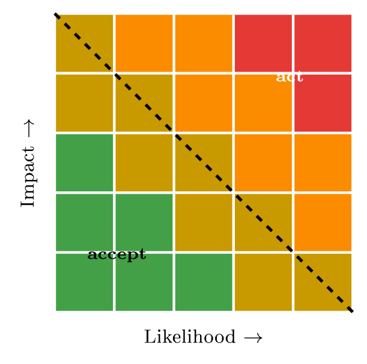

# The risk evaluation process {#sec-17-risk-evaluation-process}

Chapter 8 analysed the risks; Chapter 10 chose treatments; Chapter 16 checked
the controls. This chapter supplies the judgement that sits between analysis and
action and that every audit ultimately tests: *Evaluation* - deciding whether
an analysed risk is acceptable, against a line the organisation drew on purpose.
It walks the evaluation step of the standards, the risk appetite that positions
the acceptance line, the discipline of accepting a risk as a governed decision
rather than a shrug, the one-page report that carries the decision to the people
who own the money and the signature, and the KPIs and KRIs that keep the
decision honest afterwards. Along the way it completes promises the course has
been carrying since Chapter 8 left "acceptance criteria" deliberately open -
and it takes one FastGoods risk end to end, from the matrix to a signed, dated,
measured acceptance.

## Evaluation, and the acceptance threshold {#sec-17-evaluation-and-the-acceptance-threshold}

The standards give evaluation a precise seat: In ISO 31000's sequence it follows
analysis (how big is each risk?) and precedes treatment (what do we do?), and
its job is to compare each analysed risk against the organisation's criteria and
sort the lot - accept, treat, or escalate. Jøsang states it compactly:
Evaluation prioritises risks for treatment, primarily by ranking calculated risk
levels against a threshold and the other agreed criteria (§19.6, pp. 427 ff.).
Two disciplines make the step honest. First, evaluation judges the *residual*
risk - what remains after the controls you actually have
(@def-inherentresidual) - because controls reduce risk but never to
zero, and the question is whether the *leftover* is small enough to live with;
the inherent figure is a useful baseline, not the object of the decision.
Second, the threshold is drawn *before* the risks are compared to it - Chapter
8's rulers-first rule, returning at the decision stage: A line drawn after
seeing the risks is a line drawn to flatter them.

The threshold itself is best seen, and Jøsang draws it as a diagonal across the
risk matrix (@fig-threshold): Below the line, risks the organisation can
live with and may formally accept; above it, risks that demand treatment. The
picture does real work - it makes "acceptable" visible, turns arguments about
single risks into arguments about the line, and shows at a glance why R1 sat in
treatment's queue while a minor cosmetic risk never did. Where the line sits is
not a technical fact but a governance choice - which is the next section.

{#fig-threshold}

## Risk appetite {#sec-17-risk-appetite}

::: {#def-appetite}
## Risk appetite

Risk appetite is the amount and kind of risk an organisation is willing to
accept in pursuit of its objectives. It is a business choice, owned at the top,
and it is what positions the acceptance threshold: Set deliberately, it gives
every risk decision the same line; left unstated, the line gets drawn ad hoc,
differently by whoever decides that day.
:::

The term carries its history with it: It entered the mainstream through
enterprise risk management - COSO's ERM framework (2004, revised 2017) made
"risk appetite" a board-level word, and ISO 31000 (2009, revised 2018) built the
same idea into the generic risk-management vocabulary this course has used
throughout. What makes an appetite *usable* is concreteness. "We take security
seriously" and "we are risk-averse" guide nothing; "no high risks to customer
data are accepted" and "checkout outages over one hour are unacceptable" turn
"how safe?" into a line people can apply on a Tuesday. The board owns the
statement (Chapter 11); the security function applies it. And appetite is
contextual twice over. Between organisations: A hospital or a bank has a low
appetite for data-loss risk, an early start-up may run hotter to move fast, and
the same one-hour checkout outage FastGoods tolerates would breach a payment
provider's obligations in minutes - Chapter 2's lesson, that security serves
*this* business, arriving at the decision stage. And within one organisation, by
asset: FastGoods' appetite is near zero for the customer database (R3) and
considerably higher for the marketing pages - one company, two lines, both
deliberate.

## Treating, and accepting as a governed decision {#sec-17-treating-and-accepting-as-a-governed}

For any risk above the line, the options are the four the course fixed in
Chapter 10 (@def-treatment): Reduce with controls, transfer the loss,
avoid the activity, or - below the line - accept. What this chapter adds is
the governance of the fourth option, because "accept" is the option most often
abused. Accepting is not ignoring: It is a deliberate, recorded decision that
the risk is small enough to live with, made by someone with the authority to own
the consequences, and revisited as the risk or the business changes. ISO 27001
makes the point structural - the risk owner approves the treatment plan and
accepts the residual risk - and the audit of Chapter 16 looks for exactly this
record. The record itself is one row, but every field earns its place
(@tbl-acceptrow): The risk and its residual level, the decision, *who*
accepted and *when*, and - the field that separates a decision from a shrug
- the *review trigger*: The condition or date on which the acceptance is
re-examined. Owner, date, trigger: Without those three, an "acceptance" is just
a risk nobody is watching.

::: {#tbl-acceptrow}
  -------------------- -----------------------------------------------------------
  **Risk**             R1 residual - account takeover, after the MFA rollout
  **Residual level**   Low (likelihood unlikely, impact moderate)
  **Decision**         Accept the residual risk
  **Accepted by**      IT lead (risk owner), 15 Oct 2026
  **Review trigger**   Revisit if login-fraud reports double, or after 12 months
  -------------------- -----------------------------------------------------------

  : The FastGoods acceptance record: One row, every field filled. This row is
  what the auditor asks to see - and the review trigger is what
  @sec-17-kpis-and-kris-measuring-the-decision will wire to a metric.
:::

Authority scales with the risk, and stating the ladder prevents the classic
failure of big risks being quietly accepted low down: Small, local risks - a
team lead; significant risks - management; major risks - the board. The
principle is Chapter 11's accountability made operational: The signature must
belong to someone who can own the consequences, so a junior engineer cannot sign
off the company's largest exposure, however convenient that would be for
everyone above.

::: {#exm-r1endtoend}
## R1, end to end

One risk through the whole machine. *Evaluate*: R1's residual level - account
takeover with password-only login - stands high, above FastGoods' line ("no
high risks to customer data"). *Treat*: Reduce - enable MFA on all accounts,
the control Chapter 10 selected and Chapter 16 tested. *Re-evaluate*: The
residual drops to low - below the line. *Accept*: The small remainder is
accepted by the IT lead, dated, with the review trigger of
@tbl-acceptrow. Above the line, reduce; below the line, accept and
document - evaluation and treatment in one row, and the row the rest of this
chapter reports and measures.
:::

::: {.callout-note}
## Real-world case: Equifax (2017): The risk nobody was watching

The breach that exposed data on some 147 million people began with a known
vulnerability - Apache Struts, patch available in March 2017, exploited at
Equifax from May. The post-mortems, congressional report included, read like
this chapter's negative image: The patch duty existed on paper but the
notification went to an outdated mailing list; a scan that should have caught
the gap missed it; no named owner closed the loop; and so a risk far above any
sane appetite sat, in effect, *accepted by nobody* for months - unrecorded,
unowned, unwatched. The fine print of the settlement ran to hundreds of millions
of dollars; the lesson runs to one line: A risk above the line that no one
formally accepted or treated has still been accepted - by default, at the
organisation's expense, without a signature to ask about afterwards.
:::

## Appetite, tolerance and capacity {#sec-17-appetite-tolerance-and-capacity}

Practitioners use three words where beginners use one, and the distinction
decides who may say yes to what (@tbl-appetite3). *Appetite* is how much
risk the organisation *wants* to take in pursuit of its objectives -
@def-appetite, the deliberate line. *Tolerance* is how far a particular
risk may deviate from that line before somebody must act: The appetite says "no
high risks to customer data", the tolerance says "and if a high risk appears, it
is escalated within five working days". *Capacity* is the maximum the
organisation could absorb before it is in real trouble - what the balance
sheet, the insurance and the customer base can survive - and it is a fact
about the business, not a preference. The sequence is what stops the vocabulary
being pedantry: Capacity bounds appetite (you cannot want more risk than you
could survive), appetite sets the threshold, and tolerance triggers the
escalation.

::: {#tbl-appetite3}
  **Term**    **Question it answers**                     **FastGoods**
  ----------- ------------------------------------------- -------------------------------------------------------------------------------------
  Appetite    How much risk do we want to take?           No high risks to customer data; medium accepted on the marketing site
  Tolerance   How far may one risk drift before we act?   Checkout downtime beyond one hour per quarter is escalated to the managing director
  Capacity    How much could we survive at all?           A breach costing more than three months' margin would threaten the company

  : Three words, three jobs. Capacity is a fact about the business; appetite is
  a choice inside it; tolerance is the trigger that makes the choice
  operational.
:::

The vocabulary has a history worth one sentence, because it explains why it is
written down at all: After the 2008 financial crisis, supervisors found that
firms had taken risks nobody had ever agreed to, and the response - the Senior
Supervisors Group's findings, then the Financial Stability Board's 2013
principles for an effective risk appetite framework - made a written,
board-approved risk appetite statement an expectation in finance, from where it
spread outward into ISO 31000's 2018 revision and into ordinary corporate
practice. What began as bank supervision is why a Norwegian webshop's board is
now asked, reasonably, to say in writing how much risk it wants.

## Evaluating the portfolio {#sec-17-evaluating-the-portfolio}

Evaluation is easy to picture one risk at a time and is never done that way in
practice: The register arrives with thirty or three hundred rows, and the work
is to sort them. Three disciplines make the sorting honest. First, *rank* on the
same scale - residual level, then within a level by the size of the exposure
- so that the ordering is the analysis's, not the loudest owner's. Second,
look for *aggregation*: Several medium risks sharing one cause are not several
mediums but one larger risk wearing three rows, and the classic case is the
shared dependency - if the cloud host, the mail service and the analytics tool
are all one platform (Chapter 19), the register's three moderate availability
risks are a single high one. Third, distinguish the *top of the list* from the
*whole of the list*: The board sees the top ten and the movement since last
time; management works the rest.

::: {#exm-top5}
## FastGoods' evaluated top five

The register after treatment, ordered for the quarterly review. *1. R3,
customer-database breach* - residual high, above the line: Encryption
approved, in progress; escalated because it exceeds appetite until it lands. *2.
R2, checkout DDoS* - residual medium, at the tolerance edge: Protection
bought, watching outage minutes per quarter. *3. Supplier concentration* -
residual medium, rising: Three critical services on one platform, exit test
outstanding. *4. R1, account takeover* - residual low: Accepted, with the KRI
on the dashboard. *5. Leaver de-provisioning* - residual low but a repeat
audit finding: Accepted only until the HR-to-IT trigger is live. Five rows, and
every one carries a decision and a reason - which is what makes the list a
management document rather than an inventory.
:::

Evaluation also has a rhythm, and stating it prevents the common failure of a
register assessed once and admired thereafter. The routine review is periodic
- quarterly for a small organisation, tied to the management review the ISMS
already requires (Chapter 3) - and it asks three questions of every row: Has
the level changed, is the decision still right, and is the owner still here.
Beyond the calendar, evaluation is *triggered*: A significant incident, a new
system or supplier, a change in the law, or a KRI crossing its threshold all
reopen the affected rows immediately. And the output of a review is not a
feeling but a set of decisions with dates - accepted, escalated, treatment
approved - recorded where the auditor of Chapter 16 will look for them.

## Bias at the evaluation table {#sec-17-bias-at-the-evaluation-table}

The judgements this chapter governs are made by people in a room, and the
predictable ways rooms go wrong are documented well enough to be designed
against. *Anchoring*: The first number spoken pulls every later estimate towards
it, so ratings are better collected independently before they are discussed.
*Optimism and its opposite*: The team that built the system rates its risks low,
the team that was burned last year rates everything high - Chapter 8's
warning, now at the decision stage. *Groupthink and seniority*: When the most
senior voice speaks first, the room converges on it, so the chair speaks last.
*Availability*: The risk that resembles last week's news feels likelier than the
one that does not, whatever the base rates say. And *motivated reasoning*: The
owner who would have to fund the treatment is not a neutral judge of whether the
risk is high.

The counters are procedural rather than heroic, and all of them are cheap. Rate
independently, then discuss the disagreements - the divergent rows are where
the real information is. Write the reasoning beside the rating, because a stated
reason can be argued with and a number cannot. Have someone whose job is to
disagree: The second line (Chapter 11) is exactly that, and an assessment nobody
challenged is an assessment nobody tested. Keep the scales in front of the room
(Chapter 8's defined bands) so that "likely" does not drift with the mood. And
calibrate against the record: If everything rated "rare" last year happened
twice, the scale - or the room - needs correcting, which is the sort of
check the KRIs of @sec-17-kpis-and-kris-measuring-the-decision quietly
make possible.

## Reporting the decision {#sec-17-reporting-the-decision}

Most decisions worth making need money and a signature, and both usually live
above the person who found the risk - so the decision travels by report, and
the report is a craft with a fixed shape. A risk report is not a status update;
it runs in five parts that end in a decision: *The risk* (what could happen, in
business terms), *how big* (likelihood and impact - a level or a figure), *the
options* (two or three realistic choices, each with rough cost and effect -
the four treatments, priced), *the recommendation* (the option you advise, and
why), and *the decision needed* (exactly what to approve: Action, cost,
deadline, owner). The executive version fits on one page
(@tbl-onepager), with the full analysis in an appendix - because the
reader is buying a decision, not a tour of the analysis.

::: {#tbl-onepager}
  --------------------------- ---------------------------------------------------------
  **Title / date / author**   What this is, when, who wrote it
  **Summary**                 The risk, its level, your recommendation - two lines
  **The risk**                What could happen, in business terms
  **Size**                    Likelihood and impact - a level, or a figure
  **Options**                 2--3 realistic choices, each with rough cost and effect
  **Recommendation**          The option you advise, and why
  **Decision needed**         What to approve: Action, cost, deadline, owner
  --------------------------- ---------------------------------------------------------

  : The one-page executive risk report - a reusable skeleton for any single
  risk that needs a decision. One page; the technical detail goes in an
  appendix.
:::

::: {#exm-onepager}
## FastGoods, on one page

The skeleton, filled for R1 before the MFA decision was won. *Summary*:
Account-takeover risk is high; MFA reduces it cheaply - approve EUR 5,000.
*The risk*: Attackers log in as customers with stolen, reused passwords and
reach personal data - a breach with notification duties and lost trust.
*Size*: Likely ×        major (the register's reasoning attached). *Options*:
(1) Accept - no cost, breach exposure remains; (2) MFA on all accounts -
EUR 5k and some login friction, risk drops to low; (3) MFA plus
breached-password screening - EUR 9k, marginal further gain. *Recommendation*:
Option 2 - the second factor removes the decisive weakness; option 3's extra
spend buys little until MFA has landed. *Decision needed*: Approve EUR 5k; owner
IT lead; live within six weeks. Options first, then one clear ask - a reader
can disagree, but never wonder what is being asked.
:::

One norm governs the writing, and it is the same one the audit lives by: *Honest
framing, not spin*. Rhetoric's legitimate job is to make a true picture clear
and compelling enough to get the attention it deserves; its abuse runs in both
directions - exaggerating to win budget, downplaying to look good - and both
backfire on a schedule: Overstate, and credibility dies when the disaster fails
to arrive; understate, and it dies harder when it does. Honesty is the only
setting that survives repeated play, and it has a structural ally: The report
that names its options and their real costs is difficult to spin, because the
reader can see what was *not* recommended and why.

## KPIs and KRIs: Measuring the decision {#sec-17-kpis-and-kris-measuring-the-decision}

A decision holds only as long as someone measures it, and the measurement
vocabulary comes from Edwards & Weaver's metrics chapter (Ch. 9, pp. 151 ff.),
which this course now puts to work.

::: {#def-kpikri}
## KPI and KRI

A *key performance indicator* (KPI) looks backwards at how a control performed:
Are our controls working - "95 % of systems patched on time". A *key risk
indicator* (KRI) looks forward at the exposure still carried: How exposed are we
- "12 systems currently unpatched". KPIs judge performance; KRIs warn early.
They answer different questions, and a managed risk carries both.
:::

Used together, the pair closes this chapter's loop, because the acceptance
record's review trigger is only words until a metric watches it. FastGoods wires
three indicators to the R1 decision: The share of accounts with MFA enabled (a
KPI - did the rollout land, and does it stay landed); login-fraud reports per
month (a KRI - the review trigger of @tbl-acceptrow, on a dashboard
instead of in a drawer); and the number of customer accounts appearing in known
breach lists (a KRI - exposure building before it becomes incidents). Edwards
& Weaver's insistence on using the two kinds *together* is the point: KPIs show
the past worked, KRIs warn what is coming, and a dashboard with only KPIs is a
rear-view mirror. Measured this way, "we accepted it" becomes a decision that is
actually watched - and when the KRI fires, the acceptance returns to the table
with data instead of anecdote.

::: {.callout-tip}
## Finding the risk: In the acceptance register

The acceptance records are Chapter 1's fourth source in its most literal form:
Decisions about risk, already written down - so read the register backwards,
on a rhythm. Every acceptance past its review date is a decision quietly
expiring in a drawer; every acceptance whose signer has left the company is an
orphaned risk wearing a signature; every acceptance signed below the authority
its level demands is Chapter 11's accountability leaking; and any risk above the
line with *no* record at all is Equifax's pattern - accepted by nobody, at
everybody's expense. Ten minutes with the register and three questions -
current? owned? authorised? - yields findings an external auditor would bill
days for.
:::

::: {#exm-studentappetite}
## The student's appetite

The vocabulary scales down without changing shape. A usable personal appetite
statement: "Losing the thesis file is unacceptable; losing one day's edits is
tolerable; losing a draft slide deck is acceptable." Three lines, and every
backup decision follows from them - the thesis gets automatic sync plus the
monthly restore check (Chapter 14's nudge), the day's edits ride on autosave,
the slides get nothing special. Add one KRI - "days since the last successful
restore check" - and the student runs, in miniature, exactly the machine this
chapter built: A line drawn on purpose, a decision recorded in effect, and a
number watching it.
:::

##### Reading for this chapter.

Jøsang, §19.6 (risk evaluation and reporting: The threshold, and treatment as
reduction and acceptance, pp. 427 ff.); Edwards & Weaver, Chapter 9
(cybersecurity metrics - KPIs and KRIs, pp. 151 ff.), Chapter 7 (the
risk-management frame, pp. 109 ff.), and Chapters 5--6 for the executive and
board audience the one-pager is written for (pp. 69 ff., 87 ff.). Standards
side: ISO 31000 and ISO/IEC 27005 place evaluation between analysis and
treatment and define the acceptance criteria this chapter applies. Both books
are available in the library and on the Canvas course page.

## Summary {#sec-17-summary}

Evaluation is the standards' hinge between analysis and treatment: Each risk's
*residual* level is compared against an acceptance threshold drawn before the
comparison - Jøsang's diagonal across the matrix - and sorted into accept or
act. Where the line sits is risk appetite (@def-appetite): A board-owned
business choice with COSO and ISO 31000 lineage, usable only when concrete, and
contextual both between organisations and between assets inside one. Above the
line, the four treatments of Chapter 10 apply; the governed art is below it -
acceptance as a real decision: Recorded in one full row with owner, date and
review trigger (@tbl-acceptrow), signed at an authority matching the
risk's size, and never left to Equifax's default of acceptance by nobody. The
decision travels on a one-page report - risk, size, options, recommendation,
ask - framed honestly because spin in either direction backfires; and it stays
honest afterwards through metrics (@def-kpikri): KPIs proving the
controls performed, KRIs watching the exposure and the review trigger, the pair
turning an acceptance from a filed paper into a watched position. R1 ran the
whole machine end to end: Evaluated high, reduced by MFA, re-evaluated low,
accepted with a signature and a dashboard.

Next, the course takes the risk this chapter kept deciding about - weak
authentication - and governs it completely: The attack paths behind account
takeover, the strange history of the password rules, what NIST SP 800-63B
actually says, MFA and passkeys, and the policy that closes R1. Lecture 18.

## Self-check {#sec-17-self-check}

Try these before the next lecture.

::: {#exr-17-place-the-line}
## Place the line

FastGoods' board states: "No high risks to customer data; checkout downtime
beyond one hour per quarter is unacceptable; marketing-site risks up to medium
may be accepted by the operations lead." Translate the statement onto
@fig-threshold: Which of R1--R3 may be accepted as they stand, and who
could sign?
:::

::: {#exr-17-repair-the-acceptance}
## Repair the acceptance

An assessor finds this register note: "R2 - accepted." List every field
missing before this counts as a governed acceptance, and write the repaired row
in the style of @tbl-acceptrow.
:::

::: {#exr-17-choose-and-justify}
## Choose and justify

FastGoods can buy DDoS protection for EUR 8k/year, cyber-insurance covering
outage losses for EUR 6k/year, or do nothing. Frame the three as treatments of
R2, recommend one in two sentences, and name the residual risk your
recommendation leaves.
:::

::: {#exr-17-write-the-ask}
## Write the ask

Compress @exm-onepager's logic for R3: Write only the *Summary* and
*Decision needed* rows of the one-pager for encrypting the customer database
(EUR 7k, four weeks, IT lead).
:::

::: {#exr-17-pick-the-pair}
## Pick the pair

For the accepted residual of R3 after encryption, propose one KPI and two KRIs
- one of which must be usable as the acceptance's review trigger - and state
for each what a bad reading would make FastGoods do.
:::

::: {#exr-17-atc-interactive}
## Appetite, tolerance, capacity - interactive

Match each definition to its term.

```{=html}
<div class="grc-ex" data-type="sort">
<script type="application/json">
{
 "buckets": [
  {
   "id": "app",
   "label": "Risk appetite"
  },
  {
   "id": "tol",
   "label": "Risk tolerance"
  },
  {
   "id": "cap",
   "label": "Risk capacity"
  }
 ],
 "chips": [
  {
   "t": "The risk the organisation wants to take for its objectives",
   "b": "app"
  },
  {
   "t": "The deviation from appetite it will put up with",
   "b": "tol"
  },
  {
   "t": "The maximum loss it could survive at all",
   "b": "cap"
  }
 ],
 "explain": "Appetite is wanted risk, tolerance the accepted deviation, capacity the survivable maximum - in that order of size.",
 "ref": "sec-17-appetite-tolerance-and-capacity",
 "reflabel": "Appetite, tolerance and capacity"
}
</script>
</div>
```
:::

::: {#exr-17-decision-interactive}
## From rating to decision, interactive

Order the evaluation of one risk.

```{=html}
<div class="grc-ex" data-type="order">
<script type="application/json">
{
 "steps": [
  "Residual risk rated",
  "Compared against the acceptance threshold",
  "Treat further or accept",
  "Acceptance recorded with the right authority",
  "Review date set"
 ],
 "explain": "Evaluation compares residual risk with the threshold and turns the comparison into a recorded, authorised decision.",
 "ref": "sec-17-evaluation-and-the-acceptance-threshold",
 "reflabel": "Evaluation, and the acceptance threshold"
}
</script>
</div>
```
:::

::: {#exr-17-kpikri-interactive}
## KPI or KRI? Interactive

Sort the indicators.

```{=html}
<div class="grc-ex" data-type="sort">
<script type="application/json">
{
 "buckets": [
  {
   "id": "kpi",
   "label": "KPI",
   "desc": "how well a control performs"
  },
  {
   "id": "kri",
   "label": "KRI",
   "desc": "early warning that risk is rising"
  }
 ],
 "chips": [
  {
   "t": "Percentage of servers patched within 14 days",
   "b": "kpi"
  },
  {
   "t": "MFA coverage of admin accounts",
   "b": "kpi"
  },
  {
   "t": "Trend in phishing reports per month",
   "b": "kri"
  },
  {
   "t": "Growing backlog of unresolved vulnerabilities",
   "b": "kri"
  }
 ],
 "explain": "KPIs look backward at control performance; KRIs look forward at rising risk.",
 "ref": "sec-17-kpis-and-kris-measuring-the-decision",
 "reflabel": "KPIs and KRIs"
}
</script>
</div>
```
:::

::: {#exr-17-bias-interactive}
## Bias at the table, interactive

Match each symptom to the bias.

```{=html}
<div class="grc-ex" data-type="sort">
<script type="application/json">
{
 "buckets": [
  {
   "id": "anchor",
   "label": "Anchoring"
  },
  {
   "id": "optim",
   "label": "Optimism"
  },
  {
   "id": "group",
   "label": "Groupthink / seniority"
  },
  {
   "id": "avail",
   "label": "Availability"
  },
  {
   "id": "motiv",
   "label": "Motivated reasoning"
  }
 ],
 "chips": [
  {
   "t": "The first number spoken pulls every later estimate",
   "b": "anchor"
  },
  {
   "t": "The team that built the system rates its risks low",
   "b": "optim"
  },
  {
   "t": "The room converges on the most senior voice",
   "b": "group"
  },
  {
   "t": "Last week's news feels likelier than the base rates",
   "b": "avail"
  },
  {
   "t": "The owner who must fund the treatment rates it low",
   "b": "motiv"
  }
 ],
 "explain": "The counters are procedural and cheap: Rate independently, let the chair speak last, ask for the base rates.",
 "ref": "sec-17-bias-at-the-evaluation-table",
 "reflabel": "Bias at the evaluation table"
}
</script>
</div>
```
:::

::: {#exr-17-report-interactive}
## Honest reporting, interactive

Select what the one-page executive report should do.

```{=html}
<div class="grc-ex" data-type="pick">
<script type="application/json">
{
 "options": [
  {
   "t": "One page, with the full analysis in an appendix",
   "ok": true
  },
  {
   "t": "Show residual risk against the appetite",
   "ok": true
  },
  {
   "t": "Record the dissenting view",
   "ok": true
  },
  {
   "t": "Smooth over the disagreements",
   "ok": false
  },
  {
   "t": "Report inherent risk only, it looks more urgent",
   "ok": false
  }
 ],
 "explain": "One honest page: Residual against appetite, the dissent recorded, the detail in the appendix.",
 "ref": "sec-17-reporting-the-decision",
 "reflabel": "Reporting the decision"
}
</script>
</div>
```
:::
