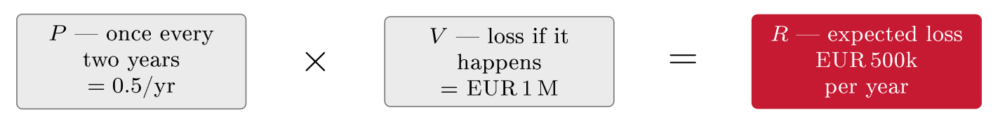

# Qualitative and quantitative risk analysis {#sec-20-qualitative-quantitative-risk-analysis}

Block VI opens with the question every executive eventually asks of a risk
register: Can we put numbers on this? The course has rated risks on levels since
Chapter 8; this chapter examines that choice properly --- what the levels can
and cannot do, what a money figure buys and what it costs, and how to pick
between them. There are exactly two ways to say how big a risk is: In words ---
qualitative levels, judged and matrixed --- or in numbers --- probabilities and
money, calculated and summable. Neither is right; they suit different decisions,
and the skill the chapter builds is choosing deliberately. On the way it
supplies the machinery the quantitative side runs on --- the expected annual
loss, Jøsang's level-to-number tables, and FAIR --- and the honesty the
machinery demands, because a confident figure resting on guesses is the most
dangerous artefact this course produces.

## Two ways to measure {#sec-20-two-ways-to-measure}

Both approaches answer the same question with the same two factors from Chapter
8 --- likelihood and impact --- expressed differently. Qualitatively, likelihood
runs rare to certain and impact minor to disastrous, combining into a level:
"This risk is *high*." Quantitatively, likelihood becomes a frequency per year
and impact a money value, combining into an expected loss: "This risk is
*EUR 20k per year*." The trade-offs sit in one table worth keeping in view for
the whole chapter (@tbl-qualquant) --- and its last row already names
the two failure modes the middle of the chapter treats: Subjectivity on one
side, false precision on the other.

::: {#tbl-qualquant}
             **Qualitative**                  **Quantitative**
  ---------- -------------------------------- -------------------------------
  Output     A level (low / medium / high)    A number (money, probability)
  Based on   Judgement and experience         Data and calculation
  Speed      Fast                             Slower, needs inputs
  Best for   Most situations, communication   Budgeting, big decisions
  Weakness   Subjective                       False precision

  : The two approaches to sizing a risk. Same goal, same two underlying factors
  --- different expression, different failure modes.
:::

## The qualitative way {#sec-20-the-qualitative-way}

Qualitative analysis assigns each risk an *ordinal* level for likelihood and for
impact and reads off an overall level --- the method the course has practised
since Chapter 8, now named precisely. Ordinal means ordered but not arithmetic:
Level 3 is more than level 2, but not "three times" level 1, and the levels
cannot be meaningfully added or multiplied across risks. Jøsang sets out exactly
such scales (§19.5, Table 19.1), and the craft is in the band definitions: Each
level carries a written meaning --- "likely: Expected this year"; "major:
Serious, lasting harm" --- so that two raters give the same rating, the
calibration lesson Chapter 8's rulers-first rule and Chapter 17's threshold both
depend on (@tbl-ratingscale). Placed on the matrix of
@fig-riskmatrix, FastGoods' account takeover --- likely and major ---
lands in a red cell: High. The method's strengths are real: Fast, no
data-gathering, easy to communicate, and workable where no numbers exist ---
which is why it is the default and the workhorse, including for this course's
own assignments. Its limits are equally real: It is subjective --- the rating
depends on the rater; levels cannot be summed or compared in money; and "high"
hides *how* high --- good enough for screening many risks, thin for deciding the
few biggest, which is where the numbers come in.

::: {#tbl-ratingscale}
  **Level**   **Likelihood --- meaning**          **Impact --- meaning**
  ----------- ----------------------------------- ---------------------------------------
  5           Certain --- expected within weeks   Disastrous --- threatens the business
  4           Likely --- expected this year       Major --- serious, lasting harm
  3           Possible --- could happen           Significant --- noticeable harm
  2           Unlikely --- rare                   Minor --- limited harm
  1           Rare --- almost never               Insignificant --- negligible

  : A qualitative rating scale with defined bands (after Jøsang, §19.5, Table
  19.1). Define the bands once and everyone rates the same way --- "likely" must
  mean one thing to all readers.
:::

## The quantitative way {#sec-20-the-quantitative-way}

Quantitative analysis expresses risk as an expected loss per year, in money, and
its lineage is older than most of this course: The idea of an annualised loss
figure for computer risk was formalised in the US federal guidance of the late
1970s (FIPS 65, 1979, building on Robert Courtney's work at IBM), fell out of
fashion when its demands for data outran what anyone had, and returned in
disciplined modern form --- most prominently as FAIR --- once breach data and
structured estimation caught up.

::: {#def-ale}
## Expected annual loss

The expected annual loss expresses a risk as $R = P \times V$: The likelihood
$P$ as a frequency per year (0.5 means once every two years) times the impact
$V$ as the loss in money if it happens. The classical vocabulary names the same
product the annualised loss expectancy (ALE): The single loss expectancy (SLE,
the cost of one occurrence) times the annualised rate of occurrence (ARO).
Unlike levels, these figures can be compared, summed across a register, and
weighed directly against the cost of a control.
:::

Jøsang's worked instance (§19.5.3) shows the mechanics: An incident expected
once every two years ($P=0.5$/yr) with an impact of EUR 1 M gives an expected
loss of EUR 500k per year (@fig-alechain) --- a figure a board can weigh
against a control's price without translation. Two practical bridges make the
method usable. First, the *level-to-number* tables: Fix a frequency and a value
for the top level and fill the rest on a logarithmic scale --- level 5 at 50 per
year and EUR 10 M, each step down dividing by ten (@tbl-lvl2num) ---
which turns any qualitative register into rough numbers in an afternoon; this is
Jøsang's own construction (§19.5, Tables 19.2--19.4). Second, the structured
method for when the stakes justify real effort:

::: {#def-fair}
## FAIR

FAIR --- Factor Analysis of Information Risk --- is the best-known structured
quantitative method (originated by Jack Jones, standardised by the Open Group,
and Edwards & Weaver's reference model in Ch. 10): It decomposes risk into
measurable factors --- how often loss events occur, and how much they cost when
they do --- estimates each factor as a calibrated range, and combines them into
a loss distribution rather than a single point. Its discipline is exactly the
chapter's theme: Numbers built from defensible parts, stated with their
uncertainty.
:::

{#fig-alechain}

::: {#tbl-lvl2num}
  **Level**   **Frequency (top level = 50/yr)**   **Impact (top = EUR 10 M)**
  ----------- ----------------------------------- -----------------------------
  5           50 per year (within a week)         EUR 10 M
  4           5 per year (within months)          EUR 1 M
  3           0.5 (every 2 years)                 EUR 100k
  2           0.05 (every 20 years)               EUR 10k
  1           0.005 (every 200 years)             EUR 1k

  : From levels to numbers on a logarithmic scale (after Jøsang, §19.5, Tables
  19.2--19.4): Fix the top level, divide by ten per step --- the conversion that
  makes a qualitative register roughly summable.
:::

::: {#exm-fgquant}
## FastGoods, in numbers

The account-takeover risk, quantified. Likelihood: A takeover campaign succeeds
about once every two years against password-only logins --- $P = 0.5$/yr.
Impact: Cleanup, notification duties, and lost customer trust --- $V \approx$
EUR 400k. Risk: $R = 0.5 \times 400\text{k} =$ **EUR 200k per year**. Against
it, MFA at EUR 5k --- and the decision Chapter 17's one-pager asked for becomes
arithmetic: Five thousand to retire two hundred thousand a year. This is what
quantification is *for* --- making the cost--benefit explicit --- and it is also
where its danger lives, because both inputs were estimates, which is the next
section.
:::

## The limits of numbers {#sec-20-the-limits-of-numbers}

The formula inherits every weakness of its inputs: $R = P \times V$ is only as
reliable as $P$ and $V$, and both are usually estimates rather than measured
facts --- Jøsang's own warning is that the inputs carry considerable
uncertainty, so the result does too. The trap this sets has a name the course
met in Chapter 17 and now follows to its source: *False precision*. "EUR 200,000
per year" sounds measured; it came from $0.5 \times$ EUR 400k, both round
guesses, and the confident digits imply a certainty the data does not hold. The
honest version states a range --- "roughly EUR 150k--300k per year" --- and says
out loud that the inputs are estimates; a range with stated assumptions is more
credible, not less, in front of exactly the audiences Chapter 17 wrote for.
Behind it sits the oldest rule in modelling --- garbage in, garbage out: The
model trusts its inputs completely, the arithmetic is always correct, and the
output looks equally authoritative whether the inputs were data or invention;
Edwards & Weaver make the same point about metrics generally --- a metric is
only as good as its data (Ch. 9). So before trusting a number, ask where $P$ and
$V$ came from: No source you can defend, no number you can defend. The deepest
point is the quiet one: *Numbers do not remove judgement* --- they relocate it
into the choice of inputs. Someone still judges how likely and how costly; the
formula organises those judgements and makes them explicit and arguable ---
which is its real value --- but a quantitative "EUR 200k" and a qualitative
"high" can rest on the very same guess. Numbers are a tool for thinking clearly,
not a substitute for thinking.

::: {.callout-note}
## Real-world case: Challenger (1986): Two numbers, three orders of magnitude apart

When the space shuttle Challenger broke apart, the presidential commission ---
with the physicist Richard Feynman famously dissenting into the appendix ---
surfaced a detail that belongs in every risk course: Asked for the probability
of losing a shuttle, NASA management's figure was about 1 in 100,000 flights;
working engineers' estimates clustered near 1 in 100. Same vehicle, same data
available, a thousandfold gap --- because the numbers encoded positions, not
measurements: One figure said what the programme needed to be true, the other
what the O-ring evidence suggested. Feynman's closing line has outlived the
report: Reality must take precedence over public relations, for nature cannot be
fooled. For this chapter the case is the permanent caution --- a probability is
a judgement wearing digits, its authority borrowed from arithmetic; ask whose
judgement, and from what evidence, before letting the decimals persuade you.
:::

## Where the numbers come from {#sec-20-where-the-numbers-come-from}

The honest objection to quantitative work is that $P$ and $V$ are invented, and
the honest answer is that they need not be: Both can be sourced, and stating the
source is what separates an estimate from a guess. Four places supply most of
them.

*Your own records*, first and best, because they describe your organisation
rather than an average one: The ticket system counts last year's outages and
their length, the helpdesk counts phishing reports, the access review counts
orphaned accounts, and the finance system knows what an hour of downtime costs
in orders --- the riskfinder box of Chapter 8 pointed at exactly this data.
*Published incident statistics* give frequencies you cannot see from inside: The
Verizon DBIR for attack patterns, national reporting from NSM and ENISA for the
Norwegian and European picture, and sector CERTs for what is actually being
exploited now. *Loss studies* give magnitudes --- IBM's annual *Cost of a Data
Breach* report is the most cited, with per-record and per-incident figures
broken down by sector, country and cause. And *insurance and market prices* give
a number somebody is actually willing to stand behind: A cyber-insurance quote
is an expert's expected loss with a margin on top, and a provider's SLA credits
price its own downtime.

Two cautions travel with the sources. Published averages describe a population,
not you --- a global average breach cost is a starting point to be scaled to a
25-person webshop with 40,000 customer records, not a figure to paste into a
board paper. And every source has a bias built into how it was collected: Breach
studies see reported breaches, insurance data sees insured losses, and vendor
reports see what the vendor's product detects. Name the source, note the
adjustment, and the number becomes arguable --- which is the most a risk figure
can honestly be.

::: {#exm-r2numbers}
## Pricing R2 from the records

FastGoods' checkout revenue averages EUR 3,000 an hour in trading hours. The
hosting provider's status history shows two availability incidents last year,
one of 40 minutes and one of 3 hours; neither was an attack, but both are the
same loss shape. Public reporting suggests a small webshop faces a disruptive
DDoS attempt roughly every two to three years. *Frequency*: Call it 0.4 per
year, from the sector figure, adjusted upward slightly because the checkout is
exposed and unprotected. *Magnitude*: A four-hour outage in trading hours is
EUR 12,000 of lost orders plus perhaps EUR 3,000 of recovery and support, and
some fraction of the customers who bounce do not come back. *Expected annual
loss*: $0.4 \times$ EUR 15,000 =   EUR 6,000 per year --- with the sources
named, so that the managing director can dispute the frequency, the hourly
revenue or the bounce assumption separately instead of dismissing the whole
figure.
:::

## Deciding with the number: ROSI {#sec-20-deciding-with-the-number-rosi}

A risk figure earns its keep when it is set against the cost of doing something,
and the practitioner's form of that comparison has a name: The *return on
security investment*, the risk reduction bought per krone spent. Its arithmetic
is the ALE of @sec-20-the-quantitative-way, before and after: Take the
expected annual loss without the control, subtract the expected annual loss with
it, and compare the difference with the control's annual cost.

::: {#def-rosi}
## Return on security investment

The return on security investment (ROSI) compares the expected annual loss a
control removes with what the control costs each year:
$$\text{ROSI} \;=\; \frac{(\text{ALE}_{\text{before}} - \text{ALE}_{\text{after}}) - \text{cost}}{\text{cost}}$$
A positive ROSI says the control is expected to pay for itself; a negative one
says the money buys less risk reduction than it costs. The figure inherits every
uncertainty in $P$ and $V$, so it argues a case rather than settling it.
:::

::: {#exm-rosi}
## MFA and DDoS protection, priced

*R1, account takeover.* Before: $0.5 \times$ EUR 400k =   EUR 200k a year. After
MFA, the analysis of Chapter 18 puts the residual frequency at roughly a tenth:
About EUR 20k a year. The control costs EUR 5k. Risk removed EUR 180k against
EUR 5k spent --- a ROSI of 35, which is why nobody argues about MFA. *R2,
checkout DDoS.* Before: EUR 6,000 a year (@exm-r2numbers). Protection at
EUR 8,000 a year would remove most but not all of it --- call it EUR 5,000
removed for EUR 8,000 spent, a negative ROSI. The number does not end the
argument, and should not: The appetite statement of Chapter 17 is written in
downtime rather than in kroner, a long outage in the Christmas week would not be
an average outage, and the customers lost are not in the model. But it changes
the conversation from "is security important" to "we are paying EUR 3,000 a year
for protection against a tail we have decided we do not want" --- a decision a
managing director can actually take.
:::

## What the critics say {#sec-20-what-the-critics-say}

Both methods have a serious literature against them, and a professional should
know it, because the criticism is where the methods' real limits sit.

Against the matrix, the sharpest paper is Tony Cox's "What's Wrong with Risk
Matrices?" (2008), and its findings are uncomfortable in three specific ways.
*Range compression*: A single cell can hold risks that differ by orders of
magnitude --- "possible ×        major" covers a EUR 50k annual expectation and
a EUR 5M one --- so the matrix hides exactly the differences a budget decision
needs. *Rank reversal*: Because the cells are coarse, a matrix can rate risk A
above risk B when the underlying expected losses run the other way. And *ordinal
arithmetic*: The levels are ranks, not quantities, so multiplying them
("likelihood 4 ×        impact 5 =   20") performs arithmetic the numbers do not
support --- the error that @sec-20-the-qualitative-way warned against,
now with a citation. Douglas Hubbard's *The Failure of Risk Management* (2009)
presses the same point at the level of method: Popular scoring schemes are
widely used and rarely tested, and their practitioners are rarely measured
against outcomes.

Against the numbers, the criticism is the one this chapter has already made ---
inputs are estimates, and a figure can be precisely wrong --- but the
constructive half of the same literature is what a practitioner should take
away. Hubbard's answer is *calibration*: Estimators can be trained, measurably,
to give ranges that contain the true value about as often as they claim, and a
calibrated 90 % interval is a defensible input where a point estimate is not.
FAIR (@def-fair) builds on exactly that, asking for ranges per factor
rather than single numbers. And where ranges are the input, the output is a
range too: A Monte Carlo simulation draws thousands of samples from the input
distributions and reports the resulting loss distribution --- "the annual loss
is below EUR 50k in nine years out of ten, and above EUR 400k in one year in
fifty" --- which is both more honest and more useful to a board than a single
expected value, because the tail is usually what the decision is about.

Where does that leave the two methods? Neither is discredited; both are bounded.
The matrix is a communication device and a screening tool, and it should not be
asked to carry a spending decision on its own. The number is a decision aid
whose authority comes entirely from its inputs, and it should always travel with
its sources and its range. The practitioner's competence lies in knowing which
tool the question deserves --- and in being unembarrassed about saying "roughly
EUR 150k to 300k a year, and here is where those figures came from".

## Choosing an approach {#sec-20-choosing-an-approach}

Neither method wins outright; the skill is matching the method to the decision.
*Qualitative* is the default: Screening many risks quickly to find the serious
few, working where no reliable data exists, and speaking to audiences who need a
clear, simple message --- most everyday risk decisions, and most real risk work.
*Quantitative* is the specialist tool: Justifying a budget ("EUR 5k avoids
EUR 200k a year"), comparing options whose difference is money, and deepening
the few highest-stakes risks --- when the stakes justify the effort and data
actually supports $P$ and $V$. Between them sits the practical compromise most
organisations live in: *Semi-quantitative* analysis --- keep the 1--5 levels,
attach a rough frequency and money band to each, exactly what
@tbl-lvl2num does --- faster than full quantification, still allowing
rough cost comparison, and honest about being approximate. The working rule
compresses to three verbs: *Screen* everything qualitatively; *deepen* the
serious few with numbers where data and stakes justify it; and *be honest* ---
ranges and stated assumptions, whichever method. For FastGoods that means
qualitative ratings across the register and a quantitative case only where a
real spending decision turns on it --- pricing the DDoS protection against R2,
say --- and the same division of labour applies to this course's own assessed
work, which asks for exactly the qualitative discipline: Rate, place, and
justify every rating.

::: {.callout-tip}
## Finding the risk: In the numbers you already have

Before estimating $P$ from thin air, raid the data the organisation already
produces. The helpdesk system counts phishing reports and password resets; the
fraud queue counts attempted takeovers; the uptime monitor has every outage
minute of R2's history; the accounts ledger prices last year's incidents to the
krone --- each a frequency or an impact wearing operational clothes. Two
external sources price your risk for you: The cyber-insurance quote is a
market's quantitative opinion of your exposure, premiums and exclusions
included, and the assurance reports of Chapter 19 carry your suppliers' incident
history. An estimate that starts from your own last twenty-four months beats a
guess dressed as an industry benchmark --- and where the internal numbers are
missing entirely, that absence is itself a finding: A risk being run without its
instruments.
:::

::: {#exm-studentquant}
## The thesis, priced

The running personal case, quantified in one honest line. Likelihood of losing
the only copy in a degree's final year --- theft, spill, disk failure; call it
once in five student-years, $P = 0.2$/yr. Impact --- three months of work redone
at even a modest hourly value, plus the deadline: $V \ge$ EUR 3,000. Expected
loss: EUR 600 a year, against a backup cost of roughly EUR 0--60 a year. State
it as the range it is --- "a few hundred to a thousand a year against nearly
nothing" --- and the decision makes itself, which is the method working: Not
precision, but a comparison honest enough to act on. Chapter 8 found this risk,
Chapter 14 made the fix automatic; this chapter shows why it was never a close
call.
:::

##### Reading for this chapter.

Jøsang, §19.5 (qualitative and quantitative risk analysis: The ordinal scales,
$R = P \times V$, and the level-to-number tables, pp. 424--426, within Chapter
19, pp. 405 ff.); Edwards & Weaver, Chapter 10 (risk assessments and FAIR,
pp. 171 ff.), with Chapter 7 for the surrounding risk process (pp. 109 ff.) and
Chapter 9's data-quality warning (pp. 151 ff.). Both books are available in the
library and on the Canvas course page.

## Summary {#sec-20-summary}

Every assessment must say how big a risk is, and there are two ways: Qualitative
levels --- fast, judgement-based, communicable, the workhorse --- and
quantitative money --- summable, budgetable, the specialist tool
(@tbl-qualquant); both express Chapter 8's likelihood and impact. The
qualitative craft is ordinal discipline: Defined bands
(@tbl-ratingscale) so two raters agree, the matrix for the picture, and
honesty that levels cannot be added and "high" hides how high. The quantitative
craft is @def-ale's expected annual loss --- $R = P \times V$, the ALE
lineage from FIPS 65 to FAIR (@def-fair) --- with Jøsang's logarithmic
level-to-number tables as the conversion and FastGoods' EUR 5k-against- EUR 200k
as the demonstration of what the figure is for. Its limits are the chapter's
centre: Inputs are estimates, so false precision threatens --- state ranges,
name assumptions, remember garbage in, garbage out --- and numbers relocate
judgement rather than remove it, as Challenger's thousandfold gap between
management's and the engineers' probabilities keeps teaching. The inputs need
not be invented, though: Own records, published incident statistics, loss
studies such as IBM's annual breach-cost report, and insurance or SLA prices
each supply a defensible figure, provided the source is named and scaled to the
organisation --- and once a figure exists, the return on security investment
(@def-rosi) sets the risk removed against what removing it costs, which
is how MFA wins its argument in one line and why DDoS protection has to be
argued on grounds other than arithmetic. Both methods carry a literature against
them worth knowing: Cox (2008) on range compression, rank reversal and the
arithmetic of ordinal scales, and Hubbard (2009) on scoring schemes that are
rarely tested --- with calibrated ranges and simulated loss distributions as the
constructive answer. The choice is a matching problem: Screen qualitatively,
deepen the few big calls quantitatively when data allows, use the
semi-quantitative middle for the rest --- and be honest in every column.

One technology has arrived fast enough to deserve its own risk chapter before
the course closes: Artificial intelligence --- as a tool on both sides of the
contest, as a new attack surface, and as the subject of the first binding AI
law. Lecture 21.

## Self-check {#sec-20-self-check}

Try these before the next lecture.

::: {#exr-20-words-or-numbers}
## Words or numbers

For each decision, say which method fits and why, in one sentence: (a) Triaging
forty newly identified risks after the workshop of Chapter 8. (b) Convincing the
board to spend EUR 60k on DDoS protection. (c) Reporting the overall risk
picture to a new managing director in her first week.
:::

::: {#exr-20-run-the-formula}
## Run the formula

FastGoods estimates a checkout outage (R2) at roughly once a year, costing about
EUR 30k in lost sales and recovery each time; DDoS protection costs EUR 8k a
year and would cut the frequency to once in five years. Compute the risk before
and after, the yearly benefit, and state the decision --- then rewrite your
answer with honest ranges.
:::

::: {#exr-20-spot-the-false-precision}
## Spot the false precision

A consultant's report states: "Your annualised cyber risk is EUR 347,218." Write
the three questions you would ask before trusting it, and the one-sentence
honest reformulation you would expect instead.
:::

::: {#exr-20-build-the-scale}
## Build the scale

Using @tbl-lvl2num's logic with a top impact level of EUR 1 M (FastGoods
scale), write the five impact bands --- and place R3's estimated breach cost of
EUR 400k on both the money scale and the 1--5 level it corresponds to.
:::

::: {#exr-20-semi-quantitative-register}
## Semi-quantitative register

Take the three running risks with their Chapter 8 levels and attach each a
frequency band and a money band from your Exercise-4 scale. State one conclusion
the semi-quantitative view supports that the pure levels could not.
:::
