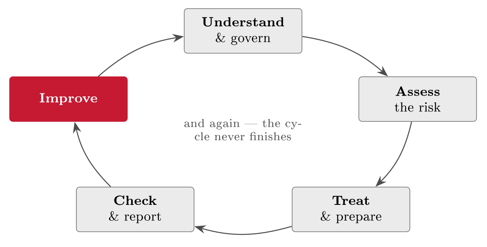

# GRC end to end: The whole course, and the exam {#sec-22-grc-end-to-end}

The taught material is complete; this closing chapter puts it back together. The
course ran as six blocks, but they were never six subjects --- they are one
repeating cycle, and the chapter shows it three ways: The blocks as a single
argument, FastGoods carried through the whole of it, and one real company
surviving the cycle's ultimate stress test. It then turns craft into judgement
--- what good GRC work looks like across the artefacts you have built, the few
traps that account for most real-world failure --- and ends where the semester
does: The exam, with a five-step skeleton that turns any scenario into a
complete, defensible analysis, and the handful of ideas worth keeping after the
marks are in.

## The whole picture {#sec-22-the-whole-picture}

Each block answered one question, and the order was never arbitrary: You cannot
assess risk before understanding the business, and you cannot audit controls you
never chose (@tbl-sixblocks). The integrated idea has its own history,
which Chapter 1 opened and which reads differently now that the course is behind
you: Governance, risk management and compliance existed for decades as separate
functions; the corporate scandals of 2001--2002 --- Enron, WorldCom --- and the
Sarbanes--Oxley Act (2002) forced integrated control and reporting; and the
analyst Michael Rasmussen (2002) and the industry body OCEG (GRC Capability
Model, 2007) established "GRC" as the name for running the three as one
discipline --- because silos leave gaps and duplicate work, which is exactly
what the course has practised avoiding. Seen whole, the three words finally
interlock: Governance sets direction and accountability (the ISMS, policy,
roles); risk management decides what to do about threats (the register, the
controls); compliance keeps the whole within the law (NIS2, the GDPR, DORA) ---
do only one and you have a gap. And the deepest structure is the loop
(@fig-grccycle): Understand and govern, assess, treat and prepare, check
and report, improve --- and round again. It is Chapter 3's PDCA, drawn at the
scale of the whole course, and it is why security is never finished: The cycle
simply turns as the business and the threats change. If one thread ran through
everything, it is this: Nearly every decision came back to *risk* --- risk
decided scope, controls, priorities and spending --- and *proportionality*
followed: Effort matched to the size of the risk. That pair is why a small shop
and a large bank can both do GRC well: Not by doing the same things, but by
sizing the same judgement to their own situation.

::: {#tbl-sixblocks}
  **Block**                                 **The question it answered**
  ----------------------------------------- -----------------------------------------------------------------------
  I Foundations & Context                   What is GRC, whose business is this, and what system governs it?
  II Assets, Law & Frameworks               What do we protect, what does the law demand, and from which toolkit?
  III Risk Assessment, Controls & Roles     How do we assess risk, choose controls, and who owns what?
  IV Preparedness, People & Documentation   How do we prepare --- the plan, the people, the paper?
  V Audit, Evaluation & Third-Party Risk    How do we check, decide, and govern what lies outside our walls?
  VI Advanced Topics & Wrap-up              What about the numbers, AI --- and the whole picture?

  : Six blocks, one argument. Each depends on the ones before it --- which is
  why the order was the syllabus's first design decision.
:::

{#fig-grccycle}

## FastGoods, end to end {#sec-22-fastgoods-end-to-end}

Theory is easiest to trust watching it work, and the case that threaded every
lecture now pays off in one table (@tbl-fgcycle): The whole course,
applied to one small company --- read top to bottom it is FastGoods' security
programme; read across, it is GRC1100. The three running risks were tracked from
first sight to standing oversight, and the single-risk view is already on paper:
R1 travelled the road completely --- identified in Chapter 8's register, treated
with A.8.5 in Chapter 10, decided, reported and accepted in Chapter 17,
policy-governed and closed in Chapter 18's @tbl-r1close, its KRIs still
on the dashboard. What the case is meant to leave behind is one impression: No
single control, document or audit secured the company --- the cycle did, its
stages individually modest and strong only joined up. And it answers the
practitioner's honest first question --- where do I even start? --- the way
FastGoods did: Small, with one risk, letting the cycle carry it; a 25-person
shop ran all of this proportionately, and did not need to be an enterprise to do
it.

::: {#tbl-fgcycle}
  **Stage**        **What FastGoods did**                                                     **Chapters**
  ---------------- -------------------------------------------------------------------------- ----------------
  Understand       Mapped the business, the assets, the customer data, the data flows         2, 4, 8
  Govern           Built the ISMS, the policies, the SoA                                      3, 5--7
  Assess           Rated R1--R3 in the register; DPIA on the customer database                8--9, 13
  Treat            MFA (R1), DDoS protection (R2), encryption (R3)                            10
  Prepare          Roles, the incident plan and RTO, awareness, documentation                 11--12, 14--15
  Check & decide   Internal audit; evaluation, acceptance and the board report; R1 governed   16--18
  Look outward     Supplier register; R2 priced; the AI policy                                19--21

  : The course on one table: FastGoods through the whole cycle. Down the rows, a
  security programme; across them, GRC1100.
:::

::: {.callout-note}
## Real-world case: Maersk (2017): The whole cycle, stress-tested

When NotPetya detonated in June 2017 --- Chapter 19's poisoned Ukrainian
software update --- the shipping giant Maersk lost essentially its whole IT
estate in hours: Some 45,000 PCs and 4,000 servers wiped, terminals worldwide
reverting to paper, roughly USD 300 million in damage. The recovery is the part
this course cares about. Every domain controller had been encrypted
simultaneously --- except one, in Ghana, offline during the attack thanks to a
local power cut: From that single surviving copy, and ten frantic days of
rebuilding, the company came back. Read the case against @tbl-fgcycle
and every stage answers: A supply-chain delivery no perimeter control caught
(Chapter 19); recovery living or dying on backup and continuity discipline
(Chapter 12) --- and luck, which is not a control; the incident run as crisis
management with honest communication, widely credited since; and the aftermath
reinvested in segmentation, resilience and governance rather than blame (Chapter
14). Maersk survived because enough of the cycle held, and its near-miss --- one
country's power grid away from losing the identity system outright --- is the
sharpest argument this course can offer that the boring stages are the
load-bearing ones.
:::

## What good looks like {#sec-22-what-good-looks-like}

Quality is easier to aim for once you can recognise it, and across the artefacts
this course produced the marks are few and consistent. A good *risk register*
holds specific risks, not vague worries --- rated, owned, current; a good
*control choice* was made for a named risk, proportionate, and recorded --- and
both pass the same one-line test, Chapter 1's rule in exam form: *Why is this
here?* Every good entry answers in one sentence pointing at a real risk. A good
*risk report* is shaped by its audience, not the analyst's convenience: It leads
with the decision the reader must make, uses plain language and honest framing
with uncertainty stated, and fits on a page with the detail beneath --- the
board does not want your matrix; it wants to know what to decide and why
(Chapter 17). And beneath the visible artefacts sit the two quiet foundations of
Block IV: Documentation people actually use rather than shelf-ware, and a
culture where reporting a mistake is safe and leaders visibly follow their own
rules --- each covering the other's weakness, because a perfect policy nobody
reads protects no one, and a strong culture survives the gaps no document
anticipated.

## The common pitfalls {#sec-22-the-common-pitfalls}

Most real-world failure is familiar, and naming the patterns is half the defence
(@tbl-traps). Each trap can pass a superficial inspection while
protecting almost nothing, and each is seductive for the same reason: Visible
activity without real judgement. One of them deserves its own paragraph because
organisations fall into it most confidently: *Compliance is not security*. You
can be fully compliant and still be breached --- the rules are a floor set for
everyone, while your risks are specific to you; a certificate proves you met a
standard on a given day, not that you are safe today (Chapter 16's snapshot,
Chapter 3's badge-hunting). The resolution is directional: Aim for security, and
let compliance follow as its evidence --- never the goal that replaces it. And
the traps share one root and therefore one cure, which is the thread of the
course: For anything you do, ask which real risk it reduces; if the honest
answer is none, it is theatre or box-ticking --- keep the effort proportionate,
keep the artefacts alive, and tie everything back to a named risk.

::: {#tbl-traps}
  **Trap**              **What it looks like**
  --------------------- -------------------------------------------------
  Tick-box compliance   Meeting the letter of a rule, missing its point
  Security theatre      Visible controls that reduce no real risk
  Over-control          So many controls the business grinds to a halt
  Shelf-ware            Policies and registers nobody reads or updates

  : The recurring traps. Each produces visible activity without judgement ---
  and each is cured by the same question: Which real risk does this reduce?
:::

::: {.callout-tip}
## Finding the risk: The riskfinder, retired

This box has run since Chapter 1, and its closing entry is the inventory. Six
standing sources, now all yours: The incidents --- your own and the news ---
read for what they exploited; the structured workshop that walks assets and asks
what can go wrong; the existing controls read backwards, each one naming the
risk it was bought for; the findings and registers already written down ---
audit findings, acceptance records, supplier rows, document sets; the
workarounds and the identity data, where behaviour confesses what policy
conceals; and the numbers the organisation already produces, pricing frequency
and impact for free. None requires a tool, a budget, or permission --- only the
habit of reading the organisation as a risk register that has not been
transcribed yet. That habit, more than any artefact, is what this course hopes
you take with you.
:::

## The exam, and a method that travels {#sec-22-the-exam-and-a-method-that}

The assessment rewards reasoning like a practitioner, not reciting like a
glossary: From a scenario, identify, assess, treat and justify --- showing *why
this risk, why this control*, with the vocabulary used correctly in service of
the argument. A strong answer reads like a short, honest piece of analysis tied
to the scenario in front of you. And any scenario yields to the same five-step
skeleton (@tbl-examskeleton): Asset, assessment, control, residual,
assurance --- in that order, every time.

::: {#tbl-examskeleton}
  **Step**   **Do**                            **Example phrase**
  ---------- --------------------------------- ---------------------------------------------------
  1          Identify the asset and the risk   "Customer data is at risk of ..."
  2          Assess likelihood and impact      "High impact, medium likelihood, because ..."
  3          Choose and justify a control      "Apply MFA (A.8.5), because ..."
  4          Name the residual risk            "Residual risk is low, and formally accepted ..."
  5          Say how it is assured             "Internal audit tests it yearly ..."

  : The five-step skeleton for any risk analysis. Fill these five lines for any
  scenario and you can answer almost anything this course could ask.
:::

::: {#exm-dental}
## The skeleton on a fresh case

A small dental clinic emails patient X-rays as plain attachments. *Asset and
risk*: Patient health data --- special-category personal data (Chapter 7) --- at
risk of exposure or mis-delivery in email. *Assessment*: High impact (sensitive
data, GDPR duties, patient trust), medium likelihood (mis-addressing and
interception are routine failure modes). *Control*: A secure patient portal
replacing attachments --- proportionate, and it removes the channel rather than
patching it. *Residual*: Low once the portal is mandatory --- and formally
accepted, with an owner and a date (Chapter 17). *Assurance*: Spot-check sent
items; an internal review confirms the portal is actually used (Chapter 16's
ToE, in miniature). A different organisation from FastGoods in every respect ---
and the same five steps produce a complete answer, which is the point: The
method travels.
:::

For the presentation, the same skeleton spoken: Open with the situation and the
key risk --- no throat-clearing --- walk risk, control, residual, assurance; be
honest about limits; end with a clear recommendation. Imagine briefing a busy
manager with five minutes: Lead with the point, justify it, stop. Under time
pressure, a few habits separate clear from muddled --- *do*: Answer the question
asked, justify every choice with a risk, stay specific to the scenario; *avoid*:
Listing every term you know, vague best-practice claims, and --- the most
commonly forgotten line --- the residual risk. Generic answers that ignore the
scenario are where most marks die; reasoning tied to the case in front of you is
where they are earned.

##### Reading for this chapter.

Revision, not new material: Re-read Edwards & Weaver, Chapter 1 (governance,
risk management and compliance, pp. 1 ff.) and Jøsang, Chapter 1 (basic
concepts, pp. 1 ff.) --- the bookends read differently with the course behind
you --- and then your own artefacts: The case file's register, SoA, plan and
policies are the best exam preparation this course can offer. Both books are
available in the library and on the Canvas course page.

## Summary --- and after the course {#sec-22-summary-and-after-the-course}

GRC is one cycle, not six topics: Understand and govern, assess, treat and
prepare, check and report, improve --- Chapter 3's PDCA at course scale, born as
an integrated idea from the post-Enron reform years and practised here on one
small shop. FastGoods showed the cycle working --- three risks tracked from
first sight to watched acceptance, R1 the full path --- and Maersk showed it
stress-tested, surviving NotPetya by the stages that held. Good work answers
*why is this here?* in one sentence per artefact; the traps --- tick-boxes,
theatre, over-control, shelf-ware, and compliance mistaken for security --- all
come from losing that question, and are cured by returning to the named risk
with proportionate effort. The exam asks for exactly that judgement, and the
five-step skeleton --- asset, assessment, control, residual, assurance --- turns
any scenario into a defensible answer.

What should outlast the module is a small set of reflexes: Always ask what the
risk is; match effort to it; tie every control to a reason; run the cycle and
keep the artefacts alive; aim for security and let compliance be its evidence.
Where to go from here is a genuine fork with a common root --- deeper into the
standards (ISO 27001 implementer and auditor paths), into a specialism (risk,
privacy, audit, cloud, AI governance), or simply into practice: Take one real
system you care about and run it through the cycle, because everything here was
built to be applied. Whether you go on to security, audit, law or management,
the lens travels: Find the real risk, treat it sensibly, and be able to show
that you did. That is the whole of GRC1100 in one sentence --- and with it, the
course, and this script, are complete. Thank you, and good luck with the exam.

## Self-check {#sec-22-self-check}

A final set, in the exam's own style.

::: {#exr-22-the-skeleton-cold}
## The skeleton, cold

A local gym stores members' health questionnaires in a shared spreadsheet every
trainer can edit from personal laptops. Produce the five-step analysis of
@tbl-examskeleton, one line per step.
:::

::: {#exr-22-name-the-trap}
## Name the trap

Diagnose each with one trap from @tbl-traps and one sentence of cure:
(a) A 90-page security policy, unopened since 2023, beside real practice nobody
wrote down. (b) A lobby camera pointed at the door while the server room stays
unlocked. (c) A company proudly "ISO-certified" whose leavers keep access for
months.
:::

::: {#exr-22-compliance-versus-security}
## Compliance versus security

FastGoods' managing director says: "We passed the audit --- we are secure."
Correct the statement in four sentences, using the snapshot idea, the
floor-versus-risk idea, and the direction in which the two should relate.
:::

::: {#exr-22-the-cycle-located}
## The cycle, located

Place each event on @fig-grccycle's cycle and name the chapter machinery
it invokes: (a) The KRI "fraud reports per month" doubles. (b) A new EU
regulation names FastGoods' sector. (c) The internal audit finds the restore
test skipped twice.
:::

::: {#exr-22-one-sentence}
## One sentence

Write the one-sentence answer to "what did this course teach you?" ---
containing a risk, a decision, and evidence --- and then the one-sentence
version for FastGoods specifically.
:::
